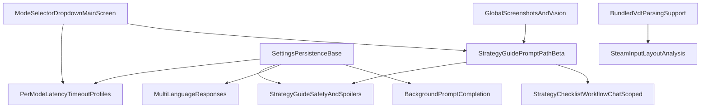

# Future Features -- Clean Roadmap

Ranked by effort and risk using the GTA star system:
- `★` easiest
- `★★★★★` very high complexity
- `★★★★★★` extreme scope

> **DO NOT IMPLEMENT YET** -- This file is planning/reference only.

## Implemented Baseline
- Suggested AI Prompts
- Diagnostic and latency warnings
- Deck/PC connection settings
- Configurable latency and timeout controls
- Persist last question and answer
- Unified Search + Ask input
- Iconography Pass (Tabs + Plugin + Ask Button)

---

## Candidate Features (Easiest → Hardest)

### ★★★ Mode Selector Dropdown (Main Screen)
- **Goal:** Add model mode selector (`Fast`, `Strategy Guide`, `Mega/Ultra/Deep`) on main screen.
- **Primary work:** UI selector + backend mode-to-model mapping + installed-model fallback.
- **Behavior note:** `Strategy Guide` replaces the previous `Thinking` lane (rename/repurpose, not an added mode lane).
- **Files:** `src/index.tsx`, `main.py`.
- **Depends on:** none.
- **Not in scope:** automatic model pulls from plugin UI.

### ★★★ Per-Mode Latency/Timeout Profiles
- **Goal:** Separate warning and timeout values per selected mode.
- **Primary work:** mode-keyed settings schema and runtime value resolution.
- **Files:** `main.py`, `src/index.tsx`.
- **Depends on:** **Mode Selector Dropdown (Main Screen)**.
- **Not in scope:** per-game/per-model fine-grained profile matrix.

### ★★★ Multi-Language Responses
- **Goal:** Respond in user/Steam language with optional override.
- **Primary work:** language detection, prompt localization instruction, optional override persistence.
- **Files:** `main.py`, `src/index.tsx`.
- **Depends on:** settings persistence already present.
- **Not in scope:** full UI localization of plugin labels.

### ★★★ Background Prompt Completion
- **Goal:** Complete in-flight prompts while QAM is closed and restore results on reopen.
- **Primary work:** backend pending-result state + frontend polling/restore flow.
- **Files:** `main.py`, `src/index.tsx`.
- **Depends on:** settings/pending state plumbing.
- **Not in scope:** queueing multiple concurrent background requests.

### ★★★ Debugging and Proton Log Analysis
- **Goal:** Attach relevant Proton/game logs to troubleshooting prompts.
- **Primary work:** log discovery, truncation/filtering, and context injection.
- **Files:** `main.py`, `src/index.tsx`.
- **Depends on:** active-game context.
- **Not in scope:** enabling Proton logging automatically.
- **Risk note:** value may be limited unless users already run with `PROTON_LOG=1`.

### ★★★★ Strategy Guide Prompt Path (Beta)
- **Goal:** Define a strategy-focused response path for `How do I beat this level` and related prompts.
- **Primary work:** strategy intent routing, coaching-first response format, and prompt scaffolding for tactical help.
- **Expected UX:** tapping strategy preset switches to `Strategy Guide` mode and uses placeholder text like `Describe the level or problem`.
- **Includes:** Steam Input-aware recommendations when control friction is relevant (gyro/trackpad/layout tuning).
- **Policy:** optional `Cheat / Fast Pass` section appears only when user explicitly asks for speedrun/shortcut guidance.
- **Files:** `src/index.tsx`, `main.py`, `PROMPT_TESTING.md`.
- **Depends on:** **Mode Selector Dropdown (Main Screen)**.
- **Not in scope:** guaranteed game-perfect walkthroughs for every title.

### ★★★★ Strategy Guide Safety and Spoilers
- **Goal:** Keep strategy help useful without unwanted story or puzzle spoilers.
- **Primary work:** spoiler-safe response policy and explicit-consent flow for unrestricted spoiler answers.
- **Required behavior:**
  - default response states best-effort spoiler avoidance
  - unrestricted spoilers require explicit user permission
  - spoiler details are emitted/rendered in tap-to-reveal blocks by default
- **Settings note:** allow an optional setting to disable spoiler masking after consent (show spoilers directly).
- **Files:** `src/index.tsx`, `main.py`, `PROMPT_TESTING.md`.
- **Depends on:** **Strategy Guide Prompt Path (Beta)**.
- **Not in scope:** hard guarantees that all model outputs are spoiler-free in every edge case.

### ★★★★ Linux Ollama Compatibility
- **Goal:** Support Linux-hosted Ollama setups as first-class path.
- **Primary work:** endpoint assumptions, connection diagnostics, and docs/test matrix.
- **Files:** `main.py`, `src/index.tsx`, troubleshooting docs.
- **Depends on:** none.
- **Not in scope:** container orchestration or distro-specific installers.

### ★★★★ Idle Safety Preset Automation
- **Goal:** Optionally apply a low-power preset (e.g., 3W) after configurable inactivity.
- **Primary work:** inactivity detection, guardrails, explicit opt-in and cooldown rules.
- **Files:** `main.py`, `src/index.tsx`.
- **Depends on:** robust user opt-in safeguards.
- **Not in scope:** hidden background automation without explicit user consent.

### ★★★★ Steam Input Layout Analysis
- **Goal:** Parse controller VDF configs and feed actionable control context to AI.
- **Primary work:** config discovery, VDF parsing, normalization to human-readable actions.
- **Files:** `main.py`, `src/index.tsx`.
- **Depends on:** bundled VDF parser support.
- **Not in scope:** editing/writing controller configs.

### ★★★★ Advanced Thermal and Fan Curve Tuning
- **Goal:** Add manual fan profile control with thermal failsafes.
- **Primary work:** hwmon discovery, fan control lifecycle, safety limits, restore-on-unload.
- **Files:** `main.py`, `src/index.tsx`.
- **Depends on:** strict safety validation.
- **Not in scope:** custom graph editor for fan curves.

### ★★★★★ Global Screenshots and Vision
- **Goal:** Capture gamescope screenshots and send multimodal prompts.
- **Primary work:** capture pipeline, image resize/encoding, multimodal model routing, and strategy-context attachment (`appId`, game state hints).
- **Strategy extension:** support strategy guidance from screenshot + game context and allow inline visual aids (for example map/dungeon references) in responses when available.
- **Files:** `main.py`, `src/index.tsx`, install/troubleshooting docs.
- **Depends on:** vision-capable models installed on host PC.
- **Not in scope:** continuous video streaming.

### ★★★★★ Strategy Checklist Workflow (Chat-Scoped)
- **Goal:** Let Strategy Guide responses provide actionable checklists users can complete during the current chat.
- **Primary work:** checklist generation format, interactive check/uncheck behavior, and follow-up synchronization logic.
- **Required behavior:**
  - checklist items are interactive and scoped to the current chat only
  - follow-up questions can update progress even when user reports progress in text without manually ticking boxes
- **Files:** `src/index.tsx`, `main.py`, `PROMPT_TESTING.md`.
- **Depends on:** **Strategy Guide Prompt Path (Beta)**.
- **Not in scope:** long-term checklist persistence across restarts/sessions.

### ★★★★★ Global BonsAI Quick-Launch via Steam Input Macro (Documentation Spike)
Goal: Provide users with a near-instant way to summon BonsAI from anywhere—whether in-game or on the SteamOS Home Screen—using native system tools, completely bypassing the need for brittle UI hacks.
Primary work: Document and test the optimal Guide Button Chord macro sequence required to open the QAM, navigate to the Decky tab, and launch BonsAI automatically.
Files: README.md, docs/setup.md.
Depends on: Native Steam Input functionality (Guide Button Chord Layout) and the user's specific QAM tab order.
Worth-it assessment: Extremely high. It requires zero code maintenance, carries no performance overhead, is completely immune to Steam client updates, and safely leverages official Valve tools.
Go/No-Go gate: GO. Requires no code implementation or internal module patching.
Not in scope: Programmatic background input sniffing (evdev), WebSockets, or React DOM manipulation

### ★★★★★ Voice Command Input
- **Goal:** Record voice on Deck and transcribe to prompt text using local Whisper service.
- **Primary work:** PipeWire recording flow, upload/transcription RPC, UI recording states.
- **Files:** `main.py`, `src/index.tsx`, install/troubleshooting docs.
- **Depends on:** user-hosted Whisper endpoint.
- **Not in scope:** wake-word or always-on listening.

### ★★★★★ VAC Opponent Check (Phased)
- **Goal:** Flag likely opponents with known VAC ban history during an active session, with clear confidence messaging.
- **Phase 1 (manual-assisted):** Parse user-provided SteamIDs (or SteamIDs pasted from console/chat/log text) and query Steam ban data.
- **Phase 2 (automated):** Attempt live opponent extraction from game/lobby/session metadata when identity signals are reliably available.
- **Primary work:** SteamID normalization, PlayerBans lookup flow, cache/rate-limit handling, confidence scoring, and warning UI states.
- **Files:** `main.py`, `src/index.tsx`.
- **Depends on:** Steam Web API key availability and a reliable source of opponent identities for the current match.
- **Impediments/Risks:** private or unavailable profiles, games that do not expose opponent SteamIDs, API quota constraints, anti-cheat/privacy boundaries, and false-confidence UX if data is incomplete.
- **Not in scope:** automated reporting, punitive automation, or bypassing Steam/game protections to collect hidden player data.

### ★★★★★★ Deep Mod and Port Configuration Manager
- **Goal:** Detect mod frameworks/files and provide mod-aware AI guidance.
- **Primary work:** per-game path discovery, mod signal detection, context injection UX.
- **Files:** `main.py`, `src/index.tsx`.
- **Depends on:** reliable game install and compatdata scanning.
- **Not in scope:** downloading/installing mods automatically.

---

## Cross-Feature Dependency Summary

- **Mode Selector Dropdown (Main Screen)** (`Strategy Guide` replaces `Thinking`) → required by **Per-Mode Latency/Timeout Profiles** and **Strategy Guide Prompt Path (Beta)**.
- **Strategy Guide Prompt Path (Beta)** → required by **Strategy Guide Safety and Spoilers** and **Strategy Checklist Workflow (Chat-Scoped)**.
- **Global Screenshots and Vision** → enables richer strategy responses with screenshot-aware context and inline visual aids.
- **Bundled VDF parsing support** → needed for **Steam Input Layout Analysis** (and optional deeper language/config parsing extensions).
- **Stable settings persistence** → reused by mode profiles, language override, and background completion metadata.

---

## Implementation Notes

### Iconography Pass — Plugin List Icon Lesson
Decky sizes icons via CSS `font-size`. Font Awesome works because it renders `<svg width="1em">` which inherits that font-size. An `` with fixed pixel dimensions is completely ignored — no amount of pixel tweaking fixes it. The fix was inlining the SVG path data into a `<svg width="1em" height="1em" fill="currentColor">` component (`BonsaiSvgIcon`), matching the exact pattern Font Awesome uses. The ``-based `BonsaiLogoIcon` is still used for tab headers where we control the layout directly. The source SVG also needs `viewBox` for proper scaling.
