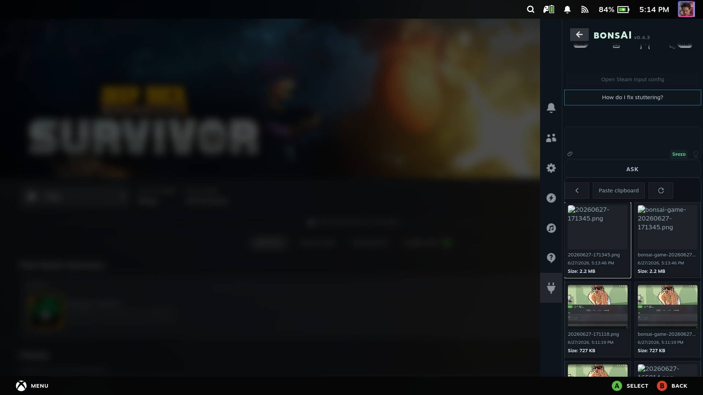

# bonsAI

**AI help on your Steam Deck, running on hardware you own.**

bonsAI is a [Decky Loader](https://github.com/SteamDeckHomebrew/decky-loader) plugin that puts an AI
assistant in the Quick Access Menu — the panel that opens with the `...` button. It talks to
[Ollama](https://ollama.com), which you run either on the Deck itself or on a PC on your home
network. Your questions and the answers stay on your own machines. No paid cloud service is needed.

AI models make things up. Treat every answer as a suggestion, not a fact.

## Before you start: what this is and is not

**This is beta software.** Answers can be wrong or incomplete, and a Steam, Decky or plugin update
can break things. Check anything that matters yourself.

**Read the Permissions tab before you switch anything on.** Everything that reaches outside the
chat — your screenshots, your files, your microphone, your power settings — is off until you turn
it on there.

**Spoiler hiding and Steam ban lookups do their best and will sometimes be wrong.** Do not rely on
either one.

**Running the AI on the Deck itself will slow your games down.** It is sharing the same chip.

**Power tips are suggestions.** The plugin can suggest a power limit, and can apply one if you allow
it under Permissions, but that is an advanced feature that may change. Graphics clock speeds in
replies are advice only — nothing is written to your hardware. Check QAM → Performance before you
change anything.

**About the kids' lock.** When Steam reports that parental controls are on, bonsAI switches its
higher-impact permissions off. Be clear about what that does not do: **it does not filter what the
AI says.** It is a guard rail, not a security boundary. It knows only what Steam tells it, and if
that signal fails, your permissions stay exactly as you set them. It is not a playtime limiter, a
content filter or a game blocker, it has no PIN of its own, and it covers bonsAI only.

## Quick start

1. Install **[Decky Loader](https://github.com/SteamDeckHomebrew/decky-loader)** on your Steam Deck.
2. Install bonsAI from the
   **[latest release](https://github.com/qd313/bonsAI/releases)**: open **Decky** from the Quick
   Access Menu → Settings → Developer → install plugin from URL, and paste
   [the release zip link](https://github.com/qd313/bonsAI/releases/latest/download/bonsAI.zip).
3. Get Ollama and a model running, whichever way suits you:
   - **On the Deck:** open **bonsAI → Ollama**, switch on **Ollama on this Deck**, then
     **Install Tier 1 essentials** (`qwen2.5vl:3b` — handles chat and screenshots). Optionally add
     Tier 2 (`gemma4:e2b-it-qat`).
   - **On a PC on your network:** install [Ollama](https://ollama.com/download), then run
     `ollama pull qwen2.5vl:3b`.
4. In **bonsAI → Ollama**, set **Where AI runs** to `http://127.0.0.1:11434` for the Deck, or
   `http://<your-PC-IP>:11434` for a PC. Then open **Main** and ask something.

Stuck on the words? There is a [short glossary](#glossary) below. For network, screenshot and
permission problems, see [troubleshooting](docs/troubleshooting.md).

**If you uninstall:** removing bonsAI from Decky leaves your settings and permissions on the device.
To start completely fresh, run **Settings → Advanced → Clear all data** *before* uninstalling.
[More on the difference](docs/troubleshooting.md#1b-uninstall-vs-clear-all-data-settings).

## Glossary

| Word | What it means |
|---|---|
| **Ollama** | A free app that runs AI models on your own machine, on port `11434` |
| **Model** | The thing that actually writes the answers. You download one with `ollama pull <name>` |
| **Decky Loader** | The framework that puts plugins like bonsAI into Steam's menu |
| **QAM** | Quick Access Menu — the panel the `...` button opens. Decky lives here |
| **LAN** | Your home network. You need one if Ollama runs on a separate PC |
| **Base URL** | The address bonsAI uses to reach Ollama, usually `http://127.0.0.1:11434` or `http://<PC-IP>:11434` |

## What you can do with it

### Ask about the game you are playing

Ask from the **Main** tab. Pick how it answers with the mode chip: **Speed** for a short answer,
**Strategy** for game help, **Expert** for detail.

- **Strategy mode** answers "how do I get past this" questions while holding spoilers back, offers
  follow-up choices, and keeps a per-game checklist that remembers where you got to.
- **Preset chips** above the Ask bar suggest common questions — battery, performance, controls,
  things that have gone wrong. Tapping one fills in the question for you.
- **It knows what you are playing.** The game's name is included with your question while a game is
  running.
- **Screenshots.** Attach one with the paperclip. Needs a model that can see images, and the
  **Read game & screenshot context** permission.
  [Setup](docs/troubleshooting.md#25-screenshot-vision-setup-v1).
- **Talk instead of typing.** Voice input runs on the Deck itself. Switch on the microphone
  permission, then install a voice model under **Settings → Voice input**.
- **Give it a personality.** Optional character voices change the tone of the replies, with an
  intensity dial in Settings.
- **Your conversation is kept.** Past questions collapse into rows you can reopen. You can retry a
  question, and rate an answer for your own reference. An answer keeps generating in the background
  if you close the menu.

### Find a setting without hunting for it

Type in the Ask bar to search Steam's and Decky's own settings, and jump straight to the screen you
want. This needs no AI model at all.

### Power and performance

The AI can suggest a power limit. If you allow it under **Permissions → Adjust power limits**, it
can apply one — this is an advanced, beta feature. Graphics clock lines in replies are advice only.
Always check QAM → Performance yourself.

### Set up and manage models (the Ollama tab)

- **Where AI runs** — the Deck, or a PC on your network.
- **An install helper** for putting Ollama and a starter model on the Deck.
- **Find PCs on your network** automatically, save them by name, test the connection, and tune how
  long to wait before warning you about a slow reply.
- **The models hub** — browse, download and delete models, choose how permissive the model policy
  is, and see which model answered.

Some networks need extra setup before the automatic search finds anything —
[details](docs/troubleshooting.md#find-ollama-on-lan-mdns--optional).

### What it is allowed to do

Everything below is off until you allow it under **Permissions**: reading game and screenshot
context, saving chats to the Desktop, applying power limits, voice input, and Steam ban lookups.

- **Show details** on any reply shows what was sent and which model answered.
- **Typed commands** work without any AI model: turning input cleaning off and on again, setting up
  the controller shortcut, and the ban lookup.
- **Saving to Desktop** writes questions and answers to `~/Desktop/bonsAI_logs/` when you allow it.

**Tabs:** Main, Ollama, Settings, Permissions, About — plus an optional Developer tab you can switch
on in Settings.

### Rough edges

A few controls are advanced, lightly used, and may be simplified or removed: the search alias packs
in Settings, the reply-checking rules on the Ollama tab, and some of the finer permission toggles.
They are listed here so their disappearing later is not a surprise.

## What is coming

Personal notes, easier reading from couch distance, a shortcut tile in the menu, and a knowledge
base that runs on a PC. See the [roadmap](docs/roadmap.md#features). What has already shipped is in
[the completed archive](docs/archive/roadmap-completed.md).

## What you need

- A Steam device running **Decky Loader**.
- **Ollama**, reachable from the Deck — on the Deck, or on a PC on your network. bonsAI can install
  and update it and its models for you.
- At least one **text** model. A model that can see images is optional, and only needed for
  screenshot questions.

## Where to run Ollama

| Where | When it suits |
|---|---|
| **On the Steam Deck** | Works anywhere, no PC needed. Use `http://127.0.0.1:11434`. It shares the Deck's chip with your game, so both get slower |
| **On a PC on your network** | Much faster, especially with a graphics card. Point bonsAI at `http://<PC-IP>:11434`. The PC has to accept connections from the network — set `OLLAMA_HOST=0.0.0.0` and open port 11434. [Details](docs/troubleshooting.md#2-network--communication-the-bridge) |

bonsAI does not run on the Steam Frame headset. To use it alongside one, run bonsAI on a Steam Deck
on the same network and point it at the PC that streams your Frame games.

## Model policy

The **Ollama tab → AI models → Policy** setting decides how far bonsAI will fall back when the model
you asked for is not there.

| Tier | What it allows |
|---|---|
| **Tier 1** | Free and open models only. The default, and the recommended one |
| **Tier 2** | Adds open-weight models such as the Gemma family |
| **Tier 3** | Unlocks everything else on Ollama, after you explicitly unlock it |

Each reply can say which model wrote it. Licensing detail is in
[troubleshooting](docs/troubleshooting.md).

## A couple of things worth knowing

**Input cleaning** is on by default and tidies your question before it reaches the model. You can
turn it off with an exact typed command, but it is not recommended.
[Why](docs/troubleshooting.md).

**Open bonsAI faster** with a controller shortcut —
[how to set it up](docs/troubleshooting.md#5-bonsai-shortcut-setup).

**The Developer tab**, switched on in Settings, adds detailed logging, an experiment that shows the
answer as it is written, and a jump to the running game's controller settings.

## Building it yourself

Start with the [development guide](docs/development.md) — setup, the build and deploy scripts, and
how the plugin is put together. If you are working on the code with an AI tool, read
[AGENTS.md](AGENTS.md) first.

| Document | Who it is for | What it covers |
|---|---|---|
| [troubleshooting.md](docs/troubleshooting.md) | Anyone stuck | Network, screenshots, permissions, the menu, deploy problems |
| [development.md](docs/development.md) | Contributors | Setup, build and deploy, how it is put together |
| [AGENTS.md](AGENTS.md) | Contributors and AI tools | How to work in this repo without breaking things |
| [lessons-learned.md](docs/lessons-learned.md) | Contributors and AI tools | Traps this project has already fallen into |
| [testing.md](docs/testing.md) | Testers | What is tested automatically, and what needs a real Deck |
| [roadmap.md](docs/roadmap.md) | Anyone curious | Bugs, planned features, what is waiting to be checked |
| [CHANGELOG.md](CHANGELOG.md) | Anyone | What changed in each release |

## Buy me a beer

Supporting my Steam sale habit — scan or tap:

