# bonsAI

**A helper for your Steam Deck that answers questions about your games, using an AI that runs on
your own Deck or your own PC.**

bonsAI lives in the Deck's **Quick Access Menu** — the panel the **`...`** button opens. Press it
mid-game, ask how to beat a boss or why the game stutters, and keep playing.

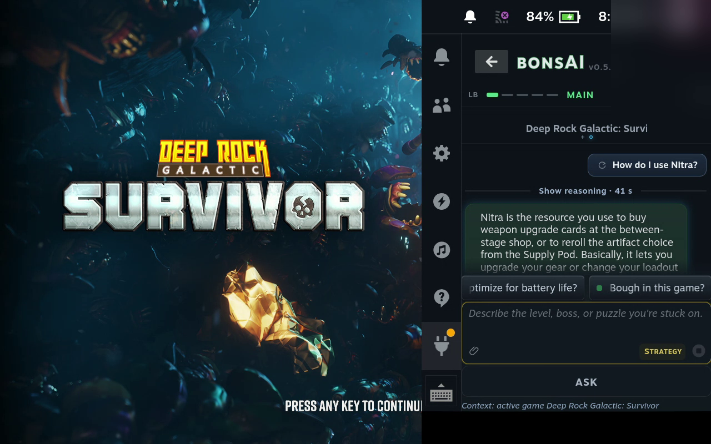

<!-- toc: written by scripts/docs_toc.py; do not hand-edit -->
**Contents**

- [Free, open and yours](#free-open-and-yours)
- [What it does](#what-it-does)
  - [Ask about the game you're playing](#ask-about-the-game-youre-playing)
  - [Notes from the game's wiki](#notes-from-the-games-wiki)
  - [Spoilers stay hidden until you ask](#spoilers-stay-hidden-until-you-ask)
  - ["Where are you at?"](#where-are-you-at)
  - [Ask about a screenshot](#ask-about-a-screenshot)
  - [Find a Steam setting by typing](#find-a-steam-setting-by-typing)
  - [Close the menu, keep playing](#close-the-menu-keep-playing)
  - [Saved chats](#saved-chats)
  - [Talk instead of typing](#talk-instead-of-typing)
  - [See how it answered](#see-how-it-answered)
- [Before you start](#before-you-start)
- [What you need](#what-you-need)
- [Install](#install)
- [Getting help](#getting-help)
- [Help build it](#help-build-it)
- [Licence](#licence)
- [Buy me a beer](#buy-me-a-beer)
<!-- /toc -->

## Free, open and yours

bonsAI is free and open source. You start it up yourself on your hardware, no data centers and no paid API. 

- **Your questions stay on your hardware** — on your Deck, on your own PC, or wherever you point it.
- **No account, no cloud service, nothing collected.**
- **Every line of code is here to read.**

<!-- This list matches the 0.6.0 security review (docs/audit/security-review-0.6.0.md, 2026-09-28).
     Anything new that reaches the internet must be added here. -->
**What does reach the internet**, so you can check the claim instead of trusting it:

- **Installing Ollama** (the program that runs the AI) — from ollama.com and GitHub.
- **Downloading AI models** — from Ollama's own model library.
- ~~**The recommended-models list** — refreshes itself from GitHub at most once a week.~~
- **The knowledge library** — from Hugging Face, or GitHub if Hugging Face is down.
- **Voice input** — the speech engine from GitHub, the tools to build it from Ubuntu's servers, and
  the speech model from Hugging Face.
- ~~**The Steam ban lookup** — Valve's servers, and only if you give it your own Steam key.~~

Nothing downloads until you switch on **Internet downloads** on the Permissions tab, and bonsAI
tells you where each download comes from before it starts. Links inside answers open only when you
tap them.

## What it does

### Ask about the game you're playing

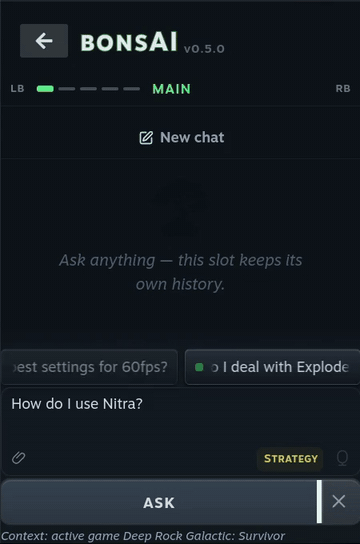

*Filmed on a Steam Deck with the AI running on the Deck itself, during a game. ~~The thinking part is sped up; it took about a minute.~~*

bonsAI knows which game is running, ask "how do I beat this boss?". Pick different modes: **Speed** for a quick reply, **Strategy** for stategy-guide like game coaching, **Expert** for
max effort and detail. ~~Suggestion chips above the question box give you a question to start with.~~

### Notes from the game's wiki

An optional **knowledge library** of notes from community wikis — 38 games so far. You download it
once, then it works offline. When an answer uses a note, it says where the note came from.

### Spoilers stay hidden until you ask

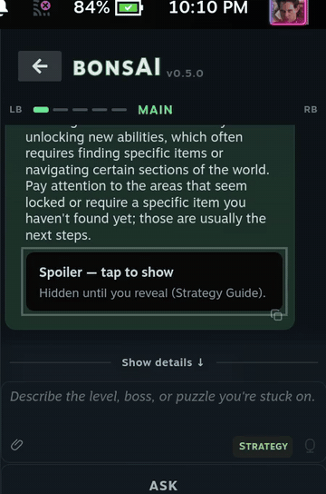

In Strategy mode, anything that is detected as a spoiler is covered. Tap to uncover if you want
to know. This works on a best-effort basis and can miss things.

### "Where are you at?"

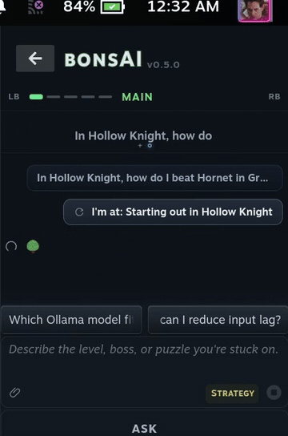

Strategy can ask where you are in the game, then gives you a checklist of steps you can tick off.
It remembers your progress for each game. (Stored locally?)

### Ask about a screenshot

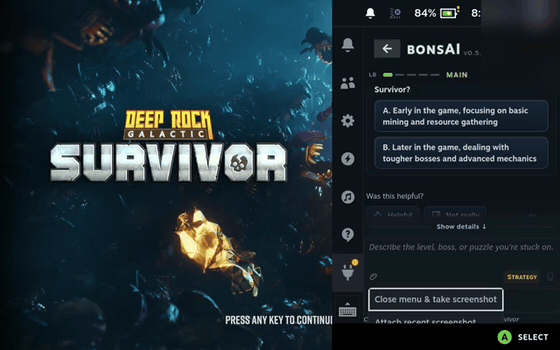

Take a screenshot and ask about what's on screen — a puzzle, a menu, an error message.

### Find a Steam setting by typing

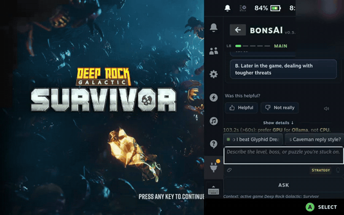

Type a few words, like "brightness", and jump straight to that Steam setting. This works without
any AI model at all.

### Close the menu, keep playing

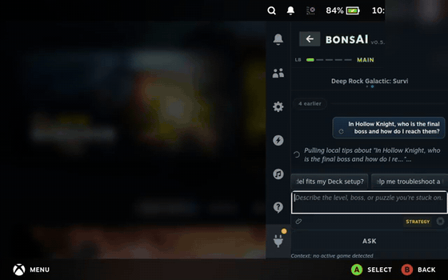

Close the menu while an answer is being written. A popup tells you when it's ready.

### Saved chats

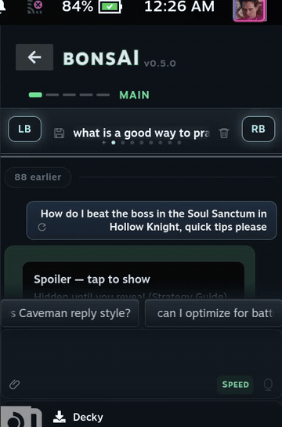

Keep up to eight chats and flip between them with the shoulder buttons. When a chat gets long,
bonsAI summarizes the older part so it isn't forgotten, and you can ask it to sum up at any time.

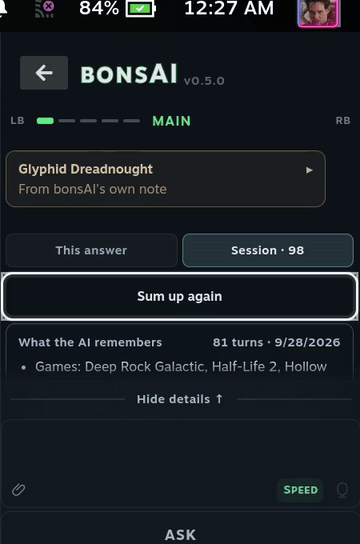

### Talk instead of typing

Press the mic button and talk. Your speech is turned into text on the Deck itself, and the
recording is deleted as soon as that's done. bonsAI can also read answers aloud (beta).

### See how it answered

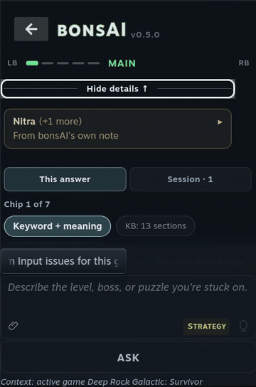

**Show details** under any answer shows which model wrote it and which notes it used.

There's more: performance and battery tips with numbers you can set (???), characters that change the
tone of replies, and a choice of AI models. The **[user guide](docs/guide.md)** covers everything.

## Before you start

- **AI answers can be wrong.** Treat them as suggestions, and check anything that matters.
- **Running the AI on the Deck slows your game down**, because they share the same chip. A PC on
  your home network is much faster.
- **This is a new release.** A few problems are known — see
  [known problems](docs/guide.md#known-problems).

## What you need

- A Steam Deck with **[Decky Loader](https://github.com/SteamDeckHomebrew/decky-loader)** installed.
  Decky is a free add-on that lets plugins like bonsAI into the Quick Access Menu.
- Somewhere to run the AI: the Deck itself, or a PC on your home network. bonsAI installs the
  program it needs, **Ollama**, on the Deck for you.
- About 4 GB free on the Deck for the first AI model, if it runs on the Deck.

## Install

bonsAI isn't in Decky's plugin store, because the store doesn't accept plugins built on an AI
model. You install it from this page instead. It takes a few minutes.

**1. Add bonsAI to Decky**

1. Press **`...`**, open **Decky** (the plug icon), then the **gear** for Decky's settings.
2. Under **General**, switch on **Developer mode**. A **Developer** section appears.
3. In **Developer**, find **Install Plugin from URL**, paste this link and press **Install**:

   ```
   https://github.com/qd313/bonsAI/releases/latest/download/bonsAI.zip
   ```

4. bonsAI now shows in the Decky list. Open it.

**2. Allow downloads**

Open the **Permissions** tab and switch on **Internet downloads**. Everything is off on a fresh
install, so nothing downloads without your say-so.

**3. Choose where the AI runs**

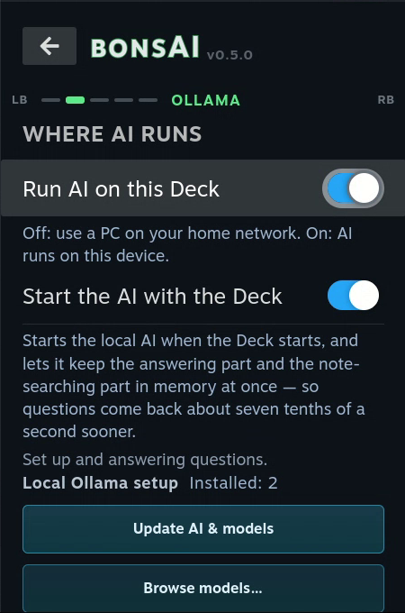

Open the **Ollama** tab. Pick one:

- **On the Deck** (works anywhere, slower in games): switch on **Run AI on this Deck**, then press
  **Install Ollama**. When it asks whether to add the starter model too, say yes. That's about a
  3 GB download.
- **On a PC on your home network** (much faster): install [Ollama](https://ollama.com/download) on
  the PC and download a model there. Then type the PC's address into **PC address** on the Deck —
  something like `http://192.168.1.20:11434` — and press **Test connection**. The
  [guide](docs/guide.md#running-the-ai-on-a-pc) shows how to let the PC accept the connection.

**4. Ask something**

Open the **Main** tab, pick a suggestion chip or type a question, and press **ask**.

**Optional:** for notes from game wikis, open **Ollama → Knowledge base (offline)**, switch on
**Use local knowledge base** and press **Download knowledge base**.

## Getting help

- The **[user guide](docs/guide.md)** explains every tab and setting.
- **[Troubleshooting](docs/troubleshooting.md)** covers network, screenshot and permission problems.
- Found a bug or have an idea? [Open an issue on GitHub](https://github.com/qd313/bonsAI/issues).
  Please say which bonsAI version you have (the small number beside the bonsAI title) and where the AI
  runs.

## Help build it

Want to help, or build it yourself? Start with the [development guide](docs/development.md).

## Licence

- **The code** is [Apache-2.0](LICENSE). A little of it comes from the Decky plugin template, under
  its own BSD licence; [NOTICE](NOTICE) has the details.
- **The game notes** and the **knowledge library** are CC BY-SA 4.0. Many notes are reworded from fan
  wikis, and each keeps a link to its source and that wiki's licence; see
  [data/kb/NOTICE.md](data/kb/NOTICE.md).
- **Other people's code** that bonsAI uses keeps its own licence. The download carries all of them in
  `dist/THIRD-PARTY-LICENSES.txt`.

## Buy me a beer

Supporting my Steam sale habit — scan or tap:

[](https://paypal.me/quentind313)
