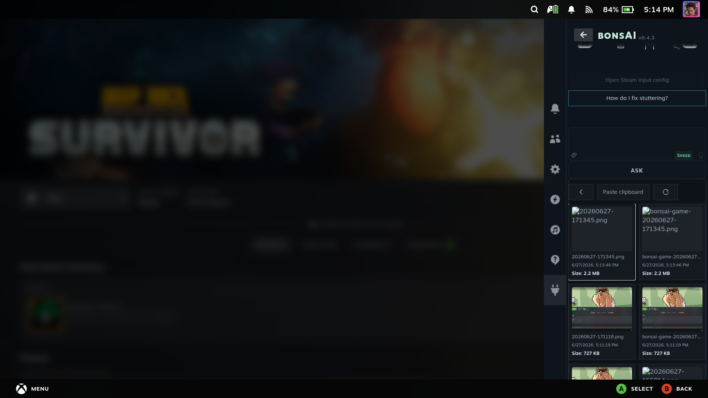

# bonsAI

**An AI helper for your Steam Deck that runs on hardware you own.**

bonsAI is a plugin for [Decky Loader](https://github.com/SteamDeckHomebrew/decky-loader). It puts an
AI helper in the Quick Access Menu, the panel the `...` button opens. Ask it about the game you are
playing, a setting you cannot find, or why something stutters.

## Free, open and yours

bonsAI is free and open source. You host it yourself, and it puts your privacy first.

- Your questions go only to your own AI: on your Deck, on your own PC, or wherever you point it.
- There is no account, no cloud service, and nothing is collected.
- Every line of code is here to read.

<!-- CONFIRM: the 0.6.0 security review checks this list against the code before release. -->
**What does reach the internet**, so you can check the claim instead of trusting it:

- **Installing Ollama and downloading AI models** — from Ollama and GitHub.
- **The knowledge library and the voice models** — from Hugging Face and GitHub.
- **The recommended-models list**, which refreshes itself from GitHub.
- **The Steam lookup**, only if you give it your own Steam key.

Downloads ask first. The **Internet downloads** permission is off until you allow it, and while it is
off nothing downloads. Before each download starts, bonsAI tells you where it comes from.

## Before you start

- **AI answers can be wrong.** Treat every answer as a suggestion, and check anything that matters.
- **Running the AI on the Deck slows your games down.** It shares the same chip. A PC on your home
  network is much faster.
- **Spoiler hiding does its best** and will sometimes miss.
- **About the parental lock.** When Steam reports that parental controls are on, bonsAI switches its
  higher-impact permissions off. Be clear about what that does not do: **it does not filter what the
  AI says.** It is a guard rail, not a security boundary. It knows only what Steam tells it, and if
  that signal fails, your permissions stay exactly as you set them. It is not a playtime limiter, a
  content filter or a game blocker, it has no PIN of its own, and it covers bonsAI only.

## What it does

### Ask about the game you are playing

<!-- GIF: asking about the game you are playing -->

Ask from the **Main** tab. While a game is running, bonsAI knows which one. Pick how it answers:
**Speed** for a short answer, **Strategy** for help getting past something, **Expert** for detail.

### The knowledge library

<!-- GIF: an answer with notes from the game's wiki -->

An optional library of notes from community wikis, downloaded once and then read offline. Answers
that use a note credit where it came from. Spoilers in the notes are held back until you ask.

### Spoiler hiding

<!-- GIF: a hidden spoiler opened on request -->

When an answer would give something away, bonsAI covers it. Open it only if you want to know.

### Your chats

<!-- GIF: naming, saving and summing up a chat -->

Keep up to eight saved chats. Name them, save them, and have bonsAI sum up a long one.

### Hear answers, talk instead of typing

<!-- GIF: talking to it and hearing the answer read aloud -->

- **Read aloud:** answers can be read to you, always, only when you asked by voice, or never.
- **Voice input:** talk instead of typing. The speech is turned into text on the Deck itself, and the
  recording is deleted as soon as that is done. Needs the microphone permission and a voice model.

### Characters

Give written replies a different tone by picking a character. This changes the words only; there are
no character voices.

### Find a setting by typing

<!-- GIF: typing to find a Steam setting -->

Type in the Ask bar to find a Steam or Decky setting and jump straight to it. This needs no AI model.

### The AI models screen

On the **Ollama** tab: choose where the AI runs, download models, and remove the ones you no longer
want.

### Show details

**Show details** on any reply shows what was sent and which model answered.

### The Permissions tab

Everything that reaches outside the chat is off until you allow it here: saving files to the
Desktop, the Steam ban lookup, the microphone, and internet downloads.

## What you need

- A Steam Deck running **Decky Loader**.
- **Ollama** — on the Deck, or on a PC on your network. bonsAI can install it on the Deck for you.
- At least one AI model. bonsAI can download one for you.

## Install

bonsAI is **not** in the Decky plugin store. The store does not accept plugins built on an AI
language model, so bonsAI is installed from its GitHub release instead.

1. Install **[Decky Loader](https://github.com/SteamDeckHomebrew/decky-loader)** on your Steam Deck.
2. Open **Decky** from the Quick Access Menu → **Settings** → **Developer** → install plugin from URL,
   and paste this link:
   `https://github.com/qd313/bonsAI/releases/latest/download/bonsAI.zip`
<!-- CONFIRM after the first-install check -->
3. Open **bonsAI → Ollama** and set up where the AI runs:
   - **On the Deck:** switch on **Run AI on this Deck**, then press **Install Ollama**. Under
     **Install options…** you can pick a starter model bundle. Allow **Internet downloads** when asked.
   - **On a PC on your network:** install [Ollama](https://ollama.com/download) on the PC, download a
     model there, then type the PC's address under **PC address** and press **Test connection**.
4. Open **Main** and ask something.

Stuck on the words? There is a [short glossary](#glossary) below.

**Used 0.4.9 before?** Installing over it keeps your settings and permissions, because Decky keeps
plugin data. To start fresh, use **Settings → Advanced → Clear all data**
([more on this](docs/troubleshooting.md#1b-uninstall-vs-clear-all-data-settings)).

## Getting help

- [Troubleshooting](docs/troubleshooting.md) covers the network, screenshots, permissions and the menu.
- Found a bug or have a question? [Open an issue on GitHub](https://github.com/qd313/bonsAI/issues).

## Glossary

| Word | What it means |
|---|---|
| **Ollama** | A free app that runs AI models on your own machine, on port `11434` |
| **Model** | The thing that actually writes the answers. bonsAI can download one for you |
| **Decky Loader** | The framework that puts plugins like bonsAI into Steam's menu |
| **QAM** | Quick Access Menu — the panel the `...` button opens. Decky lives here |
| **LAN** | Your home network. You need one if Ollama runs on a separate PC |
| **PC address** | Where bonsAI finds Ollama on a PC, such as `http://192.168.1.20:11434` |

## Where to run Ollama

| Where | When it suits |
|---|---|
| **On the Steam Deck** | Works anywhere, no PC needed. Switch on **Run AI on this Deck** on the Ollama tab. It shares the Deck's chip with your game, so both get slower |
| **On a PC on your network** | Much faster, especially with a graphics card. Type the PC's address under **PC address**, such as `http://192.168.1.20:11434`. The PC has to accept connections from the network — set `OLLAMA_HOST=0.0.0.0` and open port 11434. [Details](docs/troubleshooting.md#2-network--communication-the-bridge) |

bonsAI does not run on the Steam Frame headset. To use it alongside one, run bonsAI on a Steam Deck
on the same network and point it at the PC that streams your Frame games.

## Model policy

The model policy on the **Ollama** tab decides which of your installed models bonsAI will try.

| Tier | What it allows |
|---|---|
| **Tier 1** | Open source only. The default, and the recommended one |
| **Tier 2** | Also tries open-weight models, such as the Gemma family |
| **Tier 3** | Any installed model, only after you explicitly unlock it |

Each reply can say which model wrote it. Licensing detail is in
[troubleshooting](docs/troubleshooting.md).

## Building it yourself

Start with the [development guide](docs/development.md) — setup, the build and deploy scripts, and
how the plugin is put together. If you are working on the code with an AI tool, read
[AGENTS.md](AGENTS.md) first. There is also a Developer tab for testing, hidden by default.

| Document | Who it is for | What it covers |
|---|---|---|
| [troubleshooting.md](docs/troubleshooting.md) | Anyone stuck | Network, screenshots, permissions, the menu, deploy problems |
| [development.md](docs/development.md) | Contributors | Setup, build and deploy, how it is put together |
| [AGENTS.md](AGENTS.md) | Contributors and AI tools | How to work in this repo without breaking things |
| [lessons-learned.md](docs/lessons-learned.md) | Contributors and AI tools | Traps this project has already fallen into |
| [testing.md](docs/testing.md) | Testers | What is tested automatically, and what needs a real Deck |
| [roadmap.md](docs/roadmap.md) | Anyone curious | Bugs, planned features, what is waiting to be checked |
| [CHANGELOG.md](CHANGELOG.md) | Anyone | What changed in each release |

## Buy me a beer

Supporting my Steam sale habit — scan or tap:

