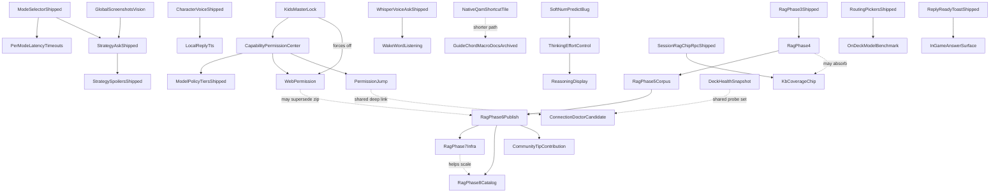

# Roadmap details — closed entries (archive)

Long-form notes for roadmap entries that have since **finished** — shipped and confirmed, fixed,
or otherwise moved to Done or to one of the other archives. These blocks used to live in
[roadmap-details.md](../roadmap-details.md); they still hold the same detail (what was tried,
what it cost, which leads were ruled out) for whoever needs the history.

Split out of roadmap-details.md on 2026-09-24 by plan 65, moved word for word — nothing reworded.
Active notes for entries still open are in [roadmap-details.md](../roadmap-details.md).

---

## The spoiler fence on a no-story game lands mid-reply

  - **It tracks the question, not the turn.** *"how do i deal with the exploders"* fenced on **both** captures — `DeckCapture_20260822_164957_game.png` and `DeckRecord_20260822_172630_game.mkv`, two independent generations with visibly different wording. *"what is red sugar for"* (`DeckRecord_20260822_173005`) and *"how do i beat the twins"* (`DeckRecord_20260822_172800`) fenced on **neither**. Two samples of one question is not proof, but a per-question correlation is a far more tractable bug than per-turn randomness, and it is the first thing to test: **re-run each of the three questions several times and record the fence rate per question before touching any code.** If it holds, the cause is in what that question retrieves or how its entity is resolved, not in model temperature.
  - **A lead on why that question and not the others.** The three cards differ by `section_type` — `Exploder` is **enemy**, `Red Sugar` is **item**, `Dreadnought Twins` is **boss**. The low-risk addendum's wording only names *"boss and elite enemy names"* and *"boss/enemy guidance"* ([ollama_prompts.py:261-300](../py_modules/backend/services/ollama_prompts.py#L261-L300)), and the named-entity discount runs through `_ENTITY_FILLER`, which drops words like *"boss"* and *"the boss"* but has no equivalent handling for a plural common noun like *"exploders"*. Worth checking whether `asked_entity` resolves for *twins* and *red sugar* but not for *exploders*, which would explain the split exactly.
  - **The placement changed, and that part is genuine variance.** In the earlier screenshot the fence sat at the **end** of the reply; in the recording the same question put it **in the middle**, between the opening line and *"Here's the lowdown:"*, splitting the answer in half. Mid-reply is materially worse than trailing — it interrupts the thing the user is reading mid-fight, which is the exact scenario Phase 4 track 2 restructured these cards for. Check whether this followed the 2026-08-15 `prepareStreamMarkdown` / `unwrapOpenSpoilerFence` change, since that is the most recent thing to touch where a fence is recognised during streaming. **Cross-title placement data, same evening** (`recordings/DeckRecord_20260822_195545/200257/200436/201647_game.mkv`): on Ship of Harkinian the fence landed **mid-reply** on the water-temple-boss and sink-underwater asks, at the **very top** of the reply on the bottles ask (before any prose at all), and on Fallout 4 it trailed at the **end** — all three positions in one session, same model. Those titles fence by design (`protect_progression` / narrative), so they say nothing about the false positive; they make the placement variance a cross-title fact rather than a Deep Rock quirk.
  - **Cheap mitigation while it is open:** `strategy_spoiler_masking_enabled` off in settings removes the fence for QA runs without a code change. Not a fix — it disables fencing everywhere, including the titles that need it.
  - **The lead is confirmed, at the desk, 2026-08-22 — `asked_entity` is empty for exactly the question that fenced.** Run against `extract_strategy_asked_entity` with the three card names passed as `known_entities`: *exploders* → `''`, *red sugar* → `'Red Sugar'`, *twins* → `'twins'`. A 3-of-3 match with what was observed on device, and it needs no hardware to reproduce. **Two independent gaps produce the miss, and both must be fixed or neither helps:** *"deal with"* is not in `_ENTITY_VERB_FIRST_PATTERNS` (which carries `beat|defeat|kill|fight|survive|use|counter|play as`), and `_match_known_entity` is word-boundary exact, so the card *Exploder* does not match the plural *exploders* — confirmed by the singular form resolving correctly.
  - **What the empty entity actually costs, and it is bigger than the discount.** [`_strategy_spoiler_low_risk_addendum`](../py_modules/backend/services/ollama_prompts.py#L261-L305) has three arms. With an entity it says *"do NOT wrap ... in `bonsai-spoiler` fences"*; with `kb_entity_match` it says *"do NOT fence KB-backed boss/enemy guidance"*; with neither it says only *"boss and elite enemy names are not narrative spoilers — keep mechanical coaching visible."* **The third arm is the only one carrying no explicit negative instruction.** And the second arm cannot rescue the first, because `kb_text_covers_asked_entity` returns `False` on an empty entity before it looks at the cards at all — so one extraction miss knocks out *both* arms that tell the model not to fence, with the Exploder card sitting in the prompt unused. **The title-level fact is the stronger one and is not being used:** the game is already known to be `low_narrative`, which is a better reason not to fence than knowing what was asked. **Fix lean: give the third arm the same explicit instruction**, and treat the two extraction gaps as a separate, smaller improvement — that way the fix does not depend on entity extraction succeeding for every phrasing a player might use.

## Spy: a character who lies to you on purpose

Filed 2026-09-06 by the maintainer. **Nothing is built.** These are the things the build must not
have to rediscover.

**The idea.** The Spy is a new Team Fortress 2 character in the picker. He is helpful in tone and
wrong on purpose, because he is working for the other team and is good at it. Pyro's heaviest
setting is the nearest thing today and it is a different joke: Pyro is stubborn and rude, so his
bad advice is obviously bad. The Spy's is meant to sound right.

**The floor is the same as Pyro's, and it is not negotiable.** Nothing that can damage the Deck,
lose a save, spend money, or turn off a protection. Wasted time only. Anything that fails that
test is not a Spy line, however good the joke is.

**The reveal is the feature.** Being lied to and never finding out is just a broken plugin. So
plan, before writing any of it: what tells you that you were played, when it appears, and how you
get the honest answer afterwards without having to ask the whole question again.

**Reveal decided 2026-09-15 (D105).** A Spy chip under Show details always says he was on and lists
what he lied about, from a closing tag the model writes, or says he did not confess when the tag is
missing; he lies only at the two heaviest accent levels, like Pyro; the opening-as-someone-else trick
is its own entry on the roadmap now. He is already in the picker as a plain smooth voice; the picker
does not change.

### Four things to plan for, found while filing this

  1. **Corrected 2026-09-15: the Spy has been in the character list since June**, as an ordinary
     smooth understated voice. The picker does not change; the work is the lying and the reveal,
     decided in D105.
  2. **Pyro's bad advice never reaches an answer today.** It is five fixed sentences that only ever
     go into a chip you press yourself, and only on the two heaviest accent settings. The Spy needs
     the lying inside the answer itself. That is a different mechanism and a much bigger job, and
     it is the part that has to clear the floor above every time rather than five known-safe times.
  3. **Sometimes he opens as somebody else.** On a random chance, his first message introduces him
     as a different character from the list, and he keeps that up. This needs its own decisions:
     how often, whether the picker still shows Spy while he claims otherwise, and how the reveal
     reads when the person thought they had picked someone honest.
  4. **There is no first message from a character today.** A character only colours the answers you
     ask for; nothing greets you when you pick one. The impersonation opener needs that to exist
     first, so it is work in its own right and not a line of prompt text.

---

## Session context folds into Show details

Raised by the maintainer 2026-08-30 under the *Vertical space for the chat bubbles* goal. The ask is settled; **what it looks like folded
in is not**, and that is the part to workshop before any code moves.

What exists today, on a settled answer: a **Show details** button and a **Copy** button share one row, and a full-width **Session context
(N turns) ▸** bar sits under them as a second collapsed control. Two disclosures, stacked, for one answer.

Open questions:

- Does Session context become a **row inside** the expanded Show details panel, a **tab** within it, or a **section** appended to it?
- Show details is per-turn; Session context is per-session. Folding a session-wide thing into a per-turn panel means it either repeats on
  every turn or only appears on the newest one. Which?
- **Focus.** Both panels already have their own graphs, and the Session context panel has prior form here — the *stuck inside the Session
  context panel* bug (fixed 2026-08-27) was exactly this shape. Nesting one inside the other doubles the depth the D-pad has to climb back
  out of. Any design that adds a level needs an escape route drawn before it is built.
- What does the collapsed state say? "Show details" alone under-sells it once it also holds the session's chips.

**Drawn at true size on the mockup page** https://claude.ai/artifact/2De58qirE34754PEZVPmdb **(2026-09-16):**
the row, tab and section options sit side by side, each with its collapsed label and the D-pad escape route
marked, so the four open questions above can be answered by looking. The maintainer's call is in, below.

**Answered 2026-09-16 (D106).** (a) A tab within the panel. (b) Only the newest turn shows the Session tab,
so it never repeats. (c) The escape route is as drawn: Up from the tabs goes to Hide details and then Read
aloud; Down goes into the chips; B anywhere inside the panel closes it. (d) The collapsed row still says
"Show details". One thing the mockup page did not draw: where Clear sits inside the Session tab. The builder
puts it at the end of that tab's body, the same button and the same confirm box, unless the maintainer says
otherwise.

## The tab icon bar collapses when it is not in use

The open questions that lived here (dashes plus a glyph or a word, collapse on idle, the R5 lock, the
LB/RB affordance, hashed Steam classes) were workshopped on 2026-09-01 and answered in
[planning/30-collapsing-tab-bar.md](planning/30-collapsing-tab-bar.md) § 3, then built and measured on
2026-09-02 (§ 8 there). The short version: our own 20px bar of dashes plus the active tab's name, opening
to a floating strip of icons and names only while the D-pad ring is on it; Steam's `Tabs` stays underneath
for LB/RB and the tab bodies; R5 reopened as **D44**, the ghost-stop finding is **D55**, the wrap
correction **D56**.

## Game notes are attached and then thrown away

**Fixed 2026-09-06.** When a question will not fit the model's window, the answer now gets shorter instead of the
notes being dropped. Full write-up and the before/after answer numbers: [CHANGELOG.md](../CHANGELOG.md). On-Deck
**KB-PROMPT-FIT-01** in [testing.md](testing.md).

**Correction, 2026-09-06: the Bone Hydra example in the table below never demonstrated this bug.** There is no Bone
Hydra note in the library — no note has "hydra" in its name, and the only note whose text mentions a hydra is a
Fallout: New Vegas one about an item of the same name. So a generic answer to that question was always the correct
behaviour. The bug itself was real; it is corrected below rather than removed, since the measurement it sits inside
is otherwise accurate.

Measured on the Deck 2026-09-06 with `gemma4:e2b-it-qat`, Strategy mode, `ask_think_effort: medium`, character voice on,
`use_local_knowledge_base: true`. Two real Asks driven through the panel with the bridge board; both logged the
`prompt_window_warning` added by `bb377d7` (D46). The guard warns and does nothing else.

| Ask | Prompt tokens | `num_predict` | Total | Window | Over by |
|---|---|---|---|---|---|
| "Why does my game stutter after a few minutes?" (no cards) | ~2,497 | 2,112 | 4,609 | 4,096 | ~513 |
| "How do I beat the Bone Hydra in Hades?" (cards attached) | ~2,805 | 2,112 | 4,917 | 4,096 | ~821 |

`num_predict` is 2,112 because Strategy's visible cap is 1,600 (`ASK_VISIBLE_NUM_PREDICT` in
`py_modules/backend/services/ollama_ask_budgets.py`) plus the 512-token thinking budget for `medium` effort. The Hades
prompt is ~308 tokens larger than the no-card one, which is the cards arriving; the corpus holds 15 Hades sections.

Ollama keeps the end of the prompt and drops its start, so the order of loss is: the dynamic game/attachment block, the
identity clause, the hardware appendix and JSON contract, then the knowledge cards spliced in as `early_context_suffix`.
The roleplay suffix is appended last by `apply_roleplay_to_system_content`, which is why the character voice survives an
overflow while the cards do not — voice was verified in character on all six device Asks the same afternoon.

Observable in the reply: the Bone Hydra answer was generic dodge-and-punish advice ("the sweeping ground assaults") with
no Hades-specific detail — **but, as corrected above, that boss has no note, so a generic answer here was always the
right outcome and this observation does not show the bug.** The real evidence is the token counts in the table above,
plus a PC-side run (below) and the fix's own device confirmation.

**The real evidence for the bug, gathered separately from the table above.** On a test run on a PC shaped like the
maintainer's own settings, 22 of 37 questions lost the start of what was sent to the model. On the Deck, all three
deeper-mode questions asked with a game running went over the limit, by 703, 780 and 712 tokens.

Two entries already in **Next** are the candidate fixes and both now have a measurement behind them: the **prompt diet**
(cut rules, move cards next to the question) and **a measured context-window experiment** (8,192). Neither has been
sized against these numbers yet. A third option nobody has costed: lower Strategy's visible cap, which trades reply
length for cards.

Not yet known: how often this fires in ordinary use. Both measured Asks had no game running and no screenshot attached,
which are the *cheapest* Strategy prompts — a running game, a screenshot or Proton log excerpts all push it further over.

**Fixed, 2026-09-06.** The fix trims the visible reply instead of the prompt: when a request would not fit, the answer
shrinks just enough to fit, never below a floor, and the thinking time a person asked for is left whole. A log line
records the old and new size. Confirmed on the Deck the same day with the character voice on, thinking at medium,
Hades running: asking about Megara, a boss that does have a note, got an answer built from it — her dash patterns,
punishing her while she recovers, using boons for burst damage — and the reply budget trimmed from 2112 to 1800 tokens
so the prompt fit. Full write-up, the three smaller trims that came first, and the before/after answer-quality
numbers: [CHANGELOG.md](../CHANGELOG.md). On-Deck row **KB-PROMPT-FIT-01** in [testing.md](testing.md).

## Chip rotation is biased to the top of the candidate list

- ★ **Chip rotation is biased to the top of the candidate list** — noticed 2026-08-29 while trying to make a long label appear. The
  guarantee and the roll both take `available[0]`, the first candidate not already in history, and the backend returns candidates in rank
  order. Across three 60s windows the same three chips came round every time (ranks 1–3) and ranks 4–6 never appeared. Not the old bug —
  those chips are reachable now, where before only rank 1 ever showed — but it is why the long labels stayed unobserved. A shuffle among
  eligible candidates, or a rotating start index, would spread it. **With the QA override on, all six appeared in 90s**, so the bias is in
  the roll rather than in reachability. **Fixed at the desk 2026-09-04:** `pickNextCarouselChip` now draws at random among the eligible
  candidates that share the top priority band (game chips before generic Deck tips), instead of always `available[0]`; the corpus
  guarantee is unchanged, it just no longer forces the same top-ranked candidate every time. **Verified on the Deck 2026-09-04** (Half-Life 2: ranks 2 to 5 inside 30 s, rank 1 absent), row **CHIP-ROTATION-01**.

## A command reply leaves the turn header blank and the chat titled New chat

- ★★ **A command reply leaves the turn header blank and the chat titled *New chat*** — **OPEN. Cause found 2026-09-04, a desk
  reading (grep/read only, no device or backend test run) — not fixed.** After `bonsai:vac-check` with the ban lookup off, the reply's
  turn header reads `…` and the chat it created stays *New chat* (`runs/SMOKE-C-b-press-ask-vac-check-off.json`, and again on VAC-02).
  Same `…` fallback SMOKE-H's 2026-08-23 fix covered for mid-thinking reopens (`buildCollapsedTurnTitle(liveQuestion) || "…"` in
  MainTabChatTranscript.tsx, where `liveQuestion = askThreadDisplayQuestion.trim()`).
  **The live question is set correctly and then overwritten — it is not missing at the source.** `onAskOllama` in
  `useBonsaiAskOrchestration.ts:1022` sets `askThreadDisplayQuestion` to the typed command text synchronously at submit, and a
  `bonsai:vac-check` command resolves on the immediate-completion path (`onAskOllama` ~line 1199–1233: `start_background_game_ai`
  answers `status: "completed"` in the same round trip, no polling) whose `terminal.question` is that same correct text — so
  `applyBackgroundStatusToUi`'s own backfill (`useBonsaiAskOrchestration.ts:667-669`, guarded `prev || q`) never has anything to fix.
  **The overwrite happens one step later.** That same completed branch calls `a.onSlotTurnsChanged?.()`
  (`useBonsaiAskOrchestration.ts:782`), wired in `src/index.tsx:502-504` and `:524` to `useChatSlots.ts`'s
  `reloadActiveSlotTranscript`, which fetches the active slot **from disk** (`getChatSlot`) and calls `applySlotTranscript` — and
  `applySlotTranscript` (`useChatSlots.ts:72-83`) sets `askThreadDisplayQuestion` **unconditionally** to whatever `pendingQuestion` the
  reloaded turns produce (`setAskThreadDisplayQuestion(pendingQuestion ?? "")`, no `prev ||` guard the way the backfill above has one).
  **Why the reload finds nothing:** in `main.py`, the three local-command branches — sanitizer (`local_kinds.sanitizer`, ~line 2621),
  shortcut setup (~line 2635) and VAC check (~line 2656) — each call `_finalize_immediate_background_local_command` and `return`
  directly from inside `start_background_game_ai`, **before** reaching the normal flow's chat-slot persistence
  (`_chat_slots_record_user_turn`, only called on the non-local-command path further down the same function). So a VAC-check
  exchange is never written to the chat slot's turn list at all. The reload's `getChatSlot` therefore returns the slot exactly as it
  was before the command ran — no new turn, so `turnsToCollapsedTurns` computes no pending question, and the unconditional
  `setAskThreadDisplayQuestion("")` in `applySlotTranscript` wipes the correct value the submit-time set and the completed-branch
  backfill had both gotten right. The same missing persistence step is why the chat's title never updates away from *New chat*:
  `chat_slot_service.append_turn` — the thing that renames a slot after its first question, per the comment on
  `reloadActiveSlotTranscript` in `useChatSlots.ts` — never runs either, because nothing was ever appended.
  **Fix needs backend changes**, outside a frontend lane's ownership: the VAC (and likely shortcut, and — separately, deliberately or
  not — sanitizer, which already passes `state_question=""` even in the state it does record) branches need to persist the user and
  assistant turns to the chat slot the way the normal path does, before or as part of returning from
  `_finalize_immediate_background_local_command`. Hardening `useChatSlots.ts`'s `applySlotTranscript` to guard its
  `setAskThreadDisplayQuestion` the same way the backend-completion backfill does (`prev || pendingQuestion`) would stop the
  *symptom* (the header) without fixing the *cause* (the chat's title, and the on-disk history, both still empty) — worth doing
  defensively, but not a substitute for the backend fix.

  **Fixed at the desk 2026-09-04, Deck check owed.** `_finalize_immediate_background_local_command` (`main.py`) now takes an
  optional `chat_slot_id` and, when one is active, persists the exchange through the same two steps the normal path's own
  completion uses — `_chat_slots_record_user_turn` then `_chat_slots_record_assistant_turn`, the latter carrying
  `transparency_snapshot_for_chat_slot`'s trimmed snapshot, the same helper `game_ai_request.py` already uses for its own
  immediate-command rows. `chat_slot_id` is now parsed once in `start_background_game_ai` before the three local-command
  branches (previously parsed only on the normal path, further down the same method) and threaded into all three call sites
  (sanitizer, shortcut, VAC), so each of them gains a first turn and `chat_slot_service.append_turn`'s rename-off-*New chat*
  rule now fires for them too. **No frontend change was needed.** `useChatSlots.ts`'s `applySlotTranscript` still overwrites
  `askThreadDisplayQuestion` unconditionally on reload, but that write only matters while `expandedTurnKey === "live"`; once
  the reload finds a complete user+assistant pair, `turnsToCollapsedTurns` (already covered by `chatSlotTurns.test.ts`'s
  "returns empty pending when turns end on assistant") reports no pending question, so `applySlotTranscript` points
  `expandedTurnKey` at the newly archived turn's own id instead — and that turn's header reads `turn.question` directly
  (`MainTabChatTranscript.tsx:616`), never the live-question path that used to show `…`. Two new backend tests in
  `tests/test_chat_slot_ownership.py`: `test_vac_check_deny_reply_persists_turn_and_renames_slot` and
  `test_shortcut_setup_reply_also_persists_to_chat_slot`. New QA row **CMD-REPLY-TITLE-01**: from the [+] position with the
  ban lookup off, send `bonsai:vac-check`; the turn header reads the command, not `…`; the chat's title in the slot row is
  the command, not *New chat*; after a QAM close and reopen the header still reads it.


## Session context folds into Show details (roadmap wording)

- ★★★ **Session context folds into Show details**
  - **Goal:** The **Session context (N turns)** bar stops being its own row and lives inside the **Show details** disclosure, so a settled
    answer costs one collapsed control instead of two.
  - **Shape not decided — workshop before building.** Open questions in [roadmap-details.md](roadmap-details.md).

## Fewer D-pad stops on a finished reply

- ★★ **Fewer D-pad stops on a finished reply** — filed by the maintainer 2026-09-02.
  - **Goal:** A finished answer gets one D-pad stop per paragraph today, so a long reply is ten or more Down presses before the ring
    reaches the chips under it. Merge neighbouring paragraphs into bigger sections — roughly one screen of text each — so it is a few.
  - **Streaming is untouched by design:** the live stream is split by a different routine (`prepareStreamMarkdown`) and the finished reply
    is re-split once the stream closes (`splitResponseIntoChunks`), so the section size only changes after the answer is done. Code fences
    stay whole, as now.

## Preset chip expansion

- ★★ **Preset chip expansion** (incremental content)
  - **Goal:** Add or refresh preset strings as related features land. Wave 1 shipped four prompts; **PRESET-EXPAND-W1-01** open. [wave1.md](archive/wave1.md).
  - **Not in scope:** replacing `fade` default animation; session RAG chips (shipped).

## Speed-mode VRAM preload

- ★★★★ **Speed-mode VRAM preload** (dev-toggle; keep a small model warm from boot)
  - **Goal:** On plugin/daemon boot, preload the user's default Ask model into VRAM so the first Ask of a session skips the cold-load penalty. Ships behind a developer toggle first; graduates to user-facing only after the suspend/resume question below is answered on-device.
  - **Model eligibility:** hard ceiling ≤3B params, but steered rather than merely gated — Pull Models picker surfaces vision/thinking-capable distilled models as "recommended for speed mode," and preload auto-substitutes the best shortlisted model if the user's chosen default doesn't qualify.
  - **Sits alongside, not instead of:** the existing Ollama-tab Unload-delay slider (`ollama_keep_alive`, [ollamaKeepAlive.ts](../src/data/ollamaKeepAlive.ts)) — that setting still governs how long a model lingers after use; this only changes when the *first* load happens.
  - **VRAM safety:** check pressure via existing TDP/telemetry chip data before every attempt; skip silently on pressure or an unreachable Ollama host, retry opportunistically next QAM open. No hard retry cap and no background polling — a skipped attempt costs nothing, so it can never contend with a running game.
  - **Open questions:** whether VRAM/model residency survives Deck suspend/resume — boot-only preload may need to also fire on wake — needs on-device research before this can leave the developer toggle.
  - **Related:** **Dynamic keep-alive / smart unload** (below) covers unloading on game focus, a separate question this feature doesn't answer.

## Reasoning display

**Planned 2026-09-05, calls locked in D70, two open in D71:** [40-reasoning-display.md](planning/40-reasoning-display.md).
Changed from the sketch below: three lines at the answer's size, not one; the fold shows seconds only and does not read
"Thought for"; live in Strategy mode too, with one notice; and the thinking gets a second job, a spoiler verdict under the
person's tier. The Deck's default Gemma 4 build can think, so this is not gated on pulling a special model.

- ★★★★★ **Reasoning display** (real model `thinking`, not the status blurb)
  - **GitHub:** [bonsAI Issues](https://github.com/qd313/bonsAI/issues) — issue TBD.
  - **Goal:** Read and stream the model's actual `thinking`/reasoning content from Ollama — never consumed today; the Ollama tab only sends the `think` boolean and spends a hidden budget, nothing reads `message.thinking` back. Renders inline with the reply (italic, muted, single-line-truncated while streaming), collapses to a "12s · 340 tokens" summary once the reply completes, expandable to the full transcript. New **thinking** transparency chip shows effort level + actual token spend alongside the existing model/kb chips in `ContextChipLadder`.
  - **No spoiler redaction inside the reasoning body** — the collapse/expand gesture is itself the consent fence, the same shape as an existing `` ```bonsai-spoiler `` fence ([spoilerFenceRegistry.ts](../src/utils/spoilerFenceRegistry.ts), [unwrapAskedEntitySpoilerFences.ts](../src/utils/unwrapAskedEntitySpoilerFences.ts)). A spoiler-risk caveat is instead surfaced once, as a dismissible notice the first time thinking-effort is turned on, plus an inline note on the first reasoning toggle a session sees.
  - **Persistence:** stored per-turn in chat-slot storage so archived/restored turns keep their reasoning text — closes part of the existing "Session context strip never lists archived turns" bug ([chat_slot_service.py](../py_modules/backend/services/chat_slot_service.py)).
  - **Spike required before build:** two open questions, either of which can fail without blocking the rest of the feature — (1) whether Ollama reasoning models interleave thinking with content per-paragraph, or emit one solid reasoning block before any content starts (decides whether **segmented per-paragraph reasoning** — a separate toggle under each paragraph rather than one end-of-turn block — is a real attribution or an approximate backend split of one block); (2) whether a single-line-truncated live display (cheap, current default design) or a bounded multi-line auto-scrolling pane (matches how AI chat apps commonly show live thinking, costs more of the 300px column) reads better once real local-model reasoning verbosity is seen on-device. If segmentation isn't feasible, falls back cleanly to the single end-of-turn block.
  - **Depends on:** Thinking effort control Phase 1 (shipped).


## Appendix (moved from the roadmap 2026-09-02)

### Cross-feature dependency summary

- **Mode selector (shipped)** → **Per-mode latency timeouts**; Strategy Guide path shipped as `strategy` Ask mode.
- **Character voice roleplay (shipped)** → accent intensity, avatars, UI accent theme, Random “?”, running-game suggestions, Pyro easter egg (all shipped); → **Local reply TTS** Phase 2.
- **Whisper voice Ask (shipped)** + mic → **Wake-word listening**.
- **Reply ready toast (shipped)** → required for hands-free wake when QAM closed; → **In-game answer surface** (toast snippet is the unblocked slice).
- **Capability Permission Center** → gates filesystem, Steam/Proton log + screenshot reads, mic, Steam Web API; → planned **Web permission** (Kids Lock forces off); → **Permission jump** shipped.
- **Llama.cpp provider spike** → research-only; related **Dynamic keep-alive / smart unload**.
- **Speed-mode VRAM preload** → boot-time preload, distinct from **Dynamic keep-alive / smart unload**'s unload-on-game-focus question; both are VRAM-residency decisions but answer different halves.
- **Soft** `num_predict` **+ thinking budget** (shipped) → **Thinking effort control** (Phase 1 shipped 2026-08-15; Phase 2 bonsAI tips Backlog) → **Reasoning display** (raw `thinking`, Backlog; segmentation gated on its own spike).
- **DRG Survivor glossary terms** → depends on the existing DRG Survivor KB seed content (`data/kb/strategy_seed.json`) and the shipped focus-graph D-pad convention.
- **Preset carousel (shipped)** → **Preset chip expansion**; **Session RAG preset chips** (shipped).
- **RAG / offline KB** → Phase 2–3 shipped → **retrieval quality remediation** (PR1/PR2 closed 2026-08-09; vector recall pass 2026-08-18) → Phase 4–8 Backlog; **KB visual maps** separate; **Spoiler constitution** runtime encoding shipped 2026-08-07; **Spoiler confidence chip** → fencing + unfenced feedback.
- **Web permission** → citations / allowlist / freshness chip.
- **bonsAI's own icon in the Quick Access Menu** (through Quick Tab) → shorter path than Guide-chord macro docs ([troubleshooting.md](troubleshooting.md) §5).
- **Steam Input jump Phase 1 (shipped)** → **Steam Input layout parse**.
- **Offline intent packs (quiet)** → **Intent packs later review**.
- **Deck health snapshot** ↔ **Connection doctor** — one probe stack, two presentations; decide before building either.
- **Session RAG chip candidates RPC (shipped)** → **KB coverage chip**; adjacent to **RAG Phase 4** Track 1 visibility.
- **User-owned model routing pickers (shipped)** → **On-Deck model benchmark**; overlaps **Dynamic keep-alive / smart unload**.
- **RAG Phase 6 publish** (shipped 2026-08-16) → **Community tip contribution** (now unblocked).
- **Permission jump** (shipped) → shared deep-link for **Connection doctor**.
- **Ordinary phrases attach game cards** (floor retuned, D28) → **Card relevance has its second signal** (shipped 2026-08-28, see Verify) — the pool-margin gate covers the overlap the floor could not fix; the keyword half's two attachments remain by design under D25/D28.
- **Controller macro test rig** (DPS-owned) → closes QA-plan F1 (on-device input) and findings-log P1-5; **Frozen test chips** → deterministic chip-select macros for it; corroborates **STREAM-09/11** measurement runs.



### Implementation notes

#### Iconography pass — plugin list icon lesson

Decky sizes icons via CSS `font-size`. Font Awesome works because it renders `<svg width="1em">`. An `` with fixed pixels is ignored. Fix: inline SVG into `<svg width="1em" height="1em" fill="currentColor">` (`BonsaiSvgIcon`). Source SVG needs `viewBox` for scaling.


## The blinking cursor in the question box does not line up with the placeholder text

- ★ `[ask]` **The blinking cursor in the question box does not line up with the placeholder text** — **OPEN,
  reported by the maintainer 2026-09-15 evening, a recurring sight.** The cursor sits a few pixels up and a
  little to the left of the greyed "Describe the level, boss, or puzzle you're stuck on." **Measured on the
  Deck the same evening:** the placeholder is drawn in its own layer at a 10-pixel font with a 12-pixel line;
  the real text field underneath, whose caret is the cursor a person sees, uses a 12-pixel font with a
  14.4-pixel line — about 2 pixels taller — so the two can never line up while they are two different font
  sizes. Evidence `docs/test-evidence/plan55-BUG-cursor-placeholder-offset.json`. **Confirmed on the
  Deck 2026-09-17:** the placeholder is still drawn in a smaller, tilted font than the text you type, 2
  to 3 pixels off from it. Evidence `docs/test-evidence/plan57-QA-cursor-placeholder-offset.json`.

*Moved out of the roadmap on 2026-09-21, superseded by the current summary there.*


## The pinned test sentences stop showing after the first question

- ★ `[chips]` `[QA]` **The pinned test sentences stop showing after the first question** — **OPEN, found
  2026-09-18.** After the first question sent from a pinned test sentence, the chip stops offering the pinned
  sentences and shows the plugin's own everyday suggestions instead. Closing and reopening the panel,
  saving the pinned list again, starting a brand new chat, and the Developer tab's force-test-chips switch
  all failed to bring them back for the rest of the sitting. Seen with Hades running, build `0589565`. It
  blocked **MEGAERA-01**, **KB-FOLLOWUP-01** and **KB-KILLSWITCH-01**'s Show details half, since no test
  sentence may be typed by thumb. Earlier sessions already found a pinned batch shows only its first three
  ([plan 31](planning/31-deck-verification-round.md)) and that the chip itself is a single rotating slot
  (plan 57); this is a further narrowing. Evidence `docs/test-evidence/plan61-MEGAERA-01-retry2.json` (the
  full account), `docs/test-evidence/plan61-KB-FOLLOWUP-01-retry2.json`,
  `docs/test-evidence/plan61-KB-KILLSWITCH-01-retry2.json`. **Likely cause found 2026-09-19, not yet
  confirmed:** the plugin keeps its own copy of settings in memory and writes the whole copy back on its
  next save, so an edit made straight to the settings file on disk gets overwritten again — a person
  changing settings through the plugin's own screens would probably never hit this, so it may be a
  test-rig problem rather than something a player would ever see. Working around it tonight took reloading
  the plugin right after every edit to the settings file, before sending anything; even then, the list had
  to be reordered and the plugin reloaded several times to get the wanted sentence to show first, and the
  one visible chip stops cycling while the controller's highlight rests on it. Rule for drivers: reload the
  plugin right after every edit to the settings file, before any question is sent.

*Moved out of the roadmap on 2026-09-21, superseded by the current summary there.*


## The Open Permissions jump lands one toggle above the one it was asked for

- ★ `[focus]` **The Open Permissions jump lands one toggle above the one it was asked for** — **OPEN,
  measured 2026-09-16 on build 0fbecb6.** The Open Permissions button under a blocked reply is a real
  D-pad stop now and A on it does reach the Permissions tab, but the highlight lands on "Save files to
  Desktop", one row above the "Steam ban lookup" toggle it was supposed to land on. Evidence
  `docs/test-evidence/plan56-PERM-JUMP-01-open-permissions.json` (the jump itself),
  `docs/test-evidence/plan56-SMOKE-C-01-toggle-off.json`, `docs/test-evidence/plan56-SMOKE-C-02-toggle-back-on.json`
  (the setup and restore steps around it). **The *Back to …* return half passed 2026-09-16:** pressing it on
  the Permissions tab returns to the Main tab with the highlight back on the Open Permissions button that
  started the jump. Evidence `docs/test-evidence/plan56-PERM-JUMP-01-back-to-main.json`,
  `docs/test-evidence/plan56-PERM-JUMP-01.summary.json`. **Seen again 2026-09-16** on the Steam-settings card:
  pressing A on a row there also opens the right Steam page with the highlight one toggle above the row that
  was pressed, the same shape. Evidence `docs/test-evidence/plan56-SETTINGS-CARD-DPAD-01.summary.json`.
  **Confirmed on the Deck 2026-09-17, worse than what this entry describes:** pressing Open Permissions now
  opens the Permissions tab at the very top, on the Back to Main button, nowhere near the toggle it should
  land on; Back to Main itself still works. Evidence `docs/test-evidence/plan57-QA-PERM-JUMP-01.json`.

*Moved out of the roadmap on 2026-09-21, superseded by the current summary there.*


## With Show details open, the chip row cannot be reached by the D-pad

- ★ `[focus]` **With Show details open, the chip row cannot be reached by the D-pad** — **OPEN, measured
  2026-09-16 on build 0fbecb6 and again on build `ca12429`, so it is not something this session's own commits
  caused.** Open Show details on a reply and press Down to step into its chips and read one — the ring skips
  the whole chip row and lands on the Session context bar instead. Seen on an instant built-in reply and on a
  real model reply with seven chips ("Chip 1 of 7" on screen); either way only the first chip can ever be
  read, and only by starting there before opening anything else. It worked before: the closed
  CONTEXT-LADDER-01…03 row (verified on the Deck 2026-09-05) had Down entering the chip row and Up walking
  back out. Evidence `docs/test-evidence/plan56-BUG-chip-ladder-unreachable.json`,
  `docs/test-evidence/plan56-CONTEXT-LADDER-03-caseB-details-open.json`,
  `docs/test-evidence/plan56-SPY-REVEAL-01-ladder-walk.json`.

*Moved out of the roadmap on 2026-09-21, superseded by the current summary there.*


## A new chat shows the previous chat's last reply until the panel is reopened

- ★★ `[chat]` **A new chat shows the previous chat's last reply until the panel is reopened** — **OPEN, seen
  2026-09-15 evening.** With a reply still on screen in one chat, moving the chat row to the new-chat position
  and pressing A made the new chat, but the new chat then showed that earlier reply underneath it, with "…"
  standing in for the question, its Helpful, Not really and Copy buttons all reachable, and a Session context
  row showing one turn. Closing the panel and reopening it left the new chat empty, the way a new chat should
  always start. Evidence `docs/test-evidence/plan55-trap-run3-new-chat-with-live-turn.json` (the walk from the
  chat row visits Retry, the "…" question, Copy reply text and Read aloud under the New chat slot). **Seen
  again 2026-09-18, 01:11, build `6d5b83f`:** the shoulder button to the new-chat position, then A, then one
  Down into the transcript, and the empty new chat showed the older chat's Theseus-and-Asterius reply. The new
  chat's own saved file already had no turns and already pointed at the new chat, so this is a stale drawing
  on screen, not a data problem. Closing and reopening the panel cleared it. Reproduced twice now. Evidence
  `docs/test-evidence/plan61-BUG-ghost-reply-new-chat.json`. **A third sighting 2026-09-18 about 09:30, build
  `0589565`, and now a recipe that brings it up on demand:** switch to a brand-new chat right after a
  reply finishes in another chat, and the new chat shows that finished answer, with a placeholder standing in
  for the question and working Helpful, Not really and Read aloud buttons underneath it. Closing and
  reopening the panel clears it every time. Three hits tonight in all, two by accident and one on this
  recipe. Evidence `docs/test-evidence/plan61-ghostreply-try1.json`. **A fourth sighting 2026-09-18,** on its
  own while a try at the panel-trap bug above was being set up, same shape as before. No new evidence file.

*Moved out of the roadmap on 2026-09-21, superseded by the current summary there.*


## The Show details chip ladder is not a D-pad stop

- ★★ `[focus]` **The Show details chip ladder is not a D-pad stop** — **OPEN, found 2026-09-17 while running
  the reasoning display's Deck rows.** With Show details open, Right from Hide details stalls, Down skips
  straight to the Session context strip, and Up from there lands back on Hide details — so no chip beyond
  the first can ever be selected by a controller, only read on the page. This is not new: CONTEXT-LADDER-03's
  2026-09-16 note already saw the ladder skipped, on an instant built-in reply; this run confirms the same gap
  on a real model reply, with a thinking chip among the skipped chips. Evidence
  `docs/test-evidence/plan57-REASONING-05.json`. **Seen again 2026-09-18, on a real model reply with a
  two-button follow-up menu:** with Show details open, Down from Hide details now lands on the new "From the
  notes" row, then the Session context strip, never on either menu button; Up from the strip jumps straight
  back to Hide details, skipping the notes row and the menu too. The same skip now covers the follow-up menu
  buttons, not just the chips. Evidence `docs/test-evidence/plan61-CONTEXT-LADDER-03-caseB.json`.
  **Seen again 2026-09-18, on the notes block's own ladder walk, on the build with the upward-walk fix:**
  Down from Hide details now stops at the block's own header first, then the session context strip, Save
  chat to Desktop, a test chip, the question box and Ask — seven visible stops with no loop — but the chip
  ladder itself is still not among them; only the first chip can ever be read by a controller. Evidence
  `docs/test-evidence/plan58p1-QA-NOTES-BLOCK-01.json`, `docs/test-evidence/plan58p1-QA-NOTES-BLOCK-01-ladder-walk-21b53b9.json`.

*Moved out of the roadmap on 2026-09-21, superseded by the current summary there.*


## The licence filter now hides models the old Policy buttons never did

- ★★ `[ollama]` **The licence filter now hides models the old Policy buttons never did — needs the
  maintainer's word** — **OPEN, found 2026-09-20, waiting on the maintainer to confirm this is what they
  wanted.** On the default "open source only" choice, the AI models list now shows 17 of 26 models; 7
  open-weight and 2 unknown-licence models are not shown at all until the filter is changed. Before this
  landed, all 26 were always listed, and picking an open-weight one raised a box explaining its licence
  that you could then accept — that box still works once the filter is relaxed. The brief for this change
  did say the licence choice becomes one filter among filters, and that is the point of the change, so a
  filter that filters is a fair reading of what was asked for, and it sits with the project's own leanings
  toward open source. But a third of the catalogue changing what is visible, on the default setting, is
  not a small detail, so this needs the maintainer's own word before it counts as settled.
  [Plan](planning/62-feature-session-five.md)

*Moved out of the roadmap on 2026-09-21, superseded by the current summary there.*


## The game a chat belongs to, above its title

- ★★ `[chat]` **The game a chat belongs to, above its title** — **VERIFY, built 2026-09-20 (lane G).**
  The name now shows only while the ring is on the row, with the empty line still held open so the row's
  height never changes. Built in the same commit: the chat's own name was sitting off the row's middle,
  because a small × for deleting the chat used to be part of what got centred; pinning the × to the
  right-hand edge instead fixes that. **Measured on the Deck 2026-09-20: with the ring on the row the offset
  is exactly 14 pixels and the × is the whole of it, because the chat previews either side are hidden while
  the row is focused — so this change straightens that state completely, and that is the state the game name
  shows in.** At rest the previews are back and the offset was 24 pixels, of which ~10 remains: they are
  different widths (14 and 43 measured) and shift the name by an amount that changes with the neighbours'
  names. Cosmetic and low priority now, since the game line is blank at rest, leaving only the dots to look
  uneven against. An earlier note here claimed 24 was the figure to fix and asked for a decision; that read
  the resting state and was withdrawn. Row **CHAT-SLOTS-V3-14c**, **run on the Deck 2026-09-21 and PASSED**: with the highlight on the row the
  name is half a pixel off the row's centre, the delete cross sits outside the centred group, and the blank
  game line holds its 11 pixels in both states. Two notes: the row is 4 pixels taller while highlighted (55
  to 59), and the game name itself could not be seen because this chat has no game attached. [Plan](planning/62-feature-session-five.md) ·
  [Board](https://claude.ai/artifact/31aLBi17SH7AydhYfGYjBq)

*Moved out of the roadmap on 2026-09-21, superseded by the current summary there.*


## Pulled models join the model try order

- ★ `[ollama]` **Pulled models join the model try order** — **MOSTLY VERIFIED on the Deck 2026-09-06, one case left.**
  A model pulled from the picker landed at the **bottom** of the text list, and showed up in the vision list because it can
  read pictures — while a text-only model and the embedding one stayed out of that list. What is still owed is the opposite
  placement: with *Allow high-VRAM model fallbacks* on, a **large** pulled model is supposed to go to the **top** instead.
  That needs a large model on the device and the switch turned on. Row **ROUTING-MERGE-01**. The maintainer's own words on
  2026-09-19 (D113) were "try them in the order the user set." Model downloads are now allowed (D113), so the large-model
  half of this row is runnable in the next Deck block. **Tried on the Deck 2026-09-19:** the bottom half passed again — a
  small model finished downloading and landed at the end of the saved list, after the two models already there. The top
  half is still not done, but the hold-up is no longer the download rule: it needs a person to type a large model's name
  (for example `gemma3:27b`, about 17 GB) into the picker's custom-name field with *Allow high-VRAM model fallbacks* on,
  using Steam's on-screen keyboard, and to remove that model again afterwards — a check only the maintainer can do at the
  Deck. Evidence `docs/test-evidence/plan61-ROUTING-MERGE-01-bottom.json`, `docs/test-evidence/plan61-ROUTING-MERGE-01-top.json`.

*Moved out of the roadmap on 2026-09-21, superseded by the current summary there.*


## Thinking line fixes from 2026-08-07/08

- ★★ `[reply]` **Thinking line fixes from 2026-08-07/08** — **VERIFY.** Emoji upright, lazy status tag survives, no bare-emoji phase
  changes, one writer. Five of seven rows pass on the Deck: **THINKING-SLOW-01** and **THINKING-SPOILER-01** (2026-09-04);
  **THINKING-COPY-01**, **THINKING-LIVE-01** and **THINKING-EMOJI-01** (2026-09-17) — the first status line held about 5.5
  seconds before changing, the line changed three times over about 7 seconds with no freeze or repeat, and the emoji sits
  upright beside the tilted sentence. Evidence `docs/test-evidence/plan57-QA-THINKING-COPY-01.json`,
  `docs/test-evidence/plan57-QA-THINKING-LIVE-01.json`, `docs/test-evidence/plan57-QA-THINKING-EMOJI-01.json`. Left:
  **THINKING-SANITIZE-01** and **THINKING-EMOJI-CLUSTER-01**, both automated only, never read on the device.
  **Tried on the Deck 2026-09-18:** the status line always read as words, never a bare tag, across the night's
  long answers, but the fault THINKING-SANITIZE-01 hunts did not happen, so it is not yet proven; no multi-step
  troubleshooting question ran, so THINKING-EMOJI-CLUSTER-01's several-phase case never came up either. Evidence
  `docs/test-evidence/plan61-THINKING-SANITIZE-01.json`, `docs/test-evidence/plan61-THINKING-EMOJI-CLUSTER-01.json`.
  [Log](planning/06-thinking-blurbs-review.md#10-implementation-log).

*Moved out of the roadmap on 2026-09-21, superseded by the current summary there.*


## "Not in my notes" line

- ★★ `[KB]` **"Not in my notes" line** — **VERIFY, built and shipped 2026-09-07, device check failed the same
  day.** The line itself is in the code, but on the Deck nothing could make it appear: ten questions asked first
  all attached a note, so the one question meant to show the line never got the chance. The note search has
  since gained a floor that can refuse a weak match, so there may be a way to show it now — nobody has checked.
  Same shape of problem as the "No tip for this" line in the Bugs list above; run both together next time. Row
  **W2-R5**. **Tried again 2026-09-18 with Half-Life 2 running, blocked:** the right question (one the notes
  genuinely do not cover) was ready to send, but the same Ask-box freeze as the three-star focus entry above
  stopped it from going out. Evidence `docs/test-evidence/plan61-W2-R5-hl2-retry.json`. **And again at
  12:50, still blocked:** Half-Life 2 had dropped off the Recent Games row so the launcher refused to start
  it, and the pinned test sentences had stopped showing by then anyway. Evidence
  `docs/test-evidence/plan61-W2-R5-hl2-retry2.json`. On 2026-09-19 the maintainer played Half-Life 2 once
  more, so it is back on the Recent Games row and this row can run in the next Deck block.
  **Run again 2026-09-19, still owed:** the warning line finally showed up, for the first time, on a
  Half-Life 2 question the notes genuinely do not cover — real progress. But its wording is not exactly what
  was asked for, and a note card naming three notes appeared underneath it at the same time, which
  contradicts the line's own claim that nothing close was found. See the "no close match" Bugs entry above
  for that contradiction. Evidence `docs/test-evidence/plan61-W2-R5-hl2-retry3.json`.

*Moved out of the roadmap on 2026-09-21, superseded by the current summary there.*


## Down did nothing for the whole time an answer was arriving

- ★ `[ask]` `[focus]` **Down did nothing for the whole time an answer was arriving** — **VERIFY, fixed
  2026-09-20.** Press Ask, and the D-pad ring lands on the question box, now emptied. Pressing Down did
  nothing at all until the answer finished, though Right kept working the whole time, reaching the
  Ask-mode button and then Stop. The Ask button greys out while a question is being answered, and Down was
  written to do nothing in that window on the idea that nothing else was live — but the Stop button is
  live then, and is exactly what a person wants to reach. Down now goes to Stop instead. Row
  **ASKBAR-DOWN-TO-STOP-01**, not yet run on the Deck. Evidence
  `docs/test-evidence/plan62-askbar-control-before-send.json`,
  `docs/test-evidence/plan62-ASKBAR-FOCUS-TRAP-reproduced-after-send.json`,
  `docs/test-evidence/plan62-ASKBAR-FOCUS-TRAP-after-answer-finished.json`.

*Moved out of the roadmap on 2026-09-21, superseded by the current summary there.*


## The UI size setting barely changes anything

- ★★★ `[ui]` **The UI size setting barely changes anything** — **VERIFY, fixed 2026-09-21 (plan 63, commit
  `03bfc02`).** The size slider had three stops — Handheld, Desktop, Couch — and Desktop drew exactly the
  same size as Handheld, so moving the slider between those two changed nothing at all. That stop is gone;
  two stops remain, and Couch is the one that visibly does something (about nine pixels taller chat rows).
  Anyone whose saved setting says Desktop now opens on Handheld instead, with no visible change, since the
  two were always the same size. The automatic option's own on-screen words were also wrong — it said it
  picks the best size from your display, which it cannot, since the plugin always sits in Steam's narrow
  side panel whatever screen is plugged in; it now says plainly that automatic can only apply Handheld.
  **The automatic option itself was deliberately left in place:** removing it reaches about fifteen files,
  including settings code another lane changed the same night — bigger than the maintainer's own words,
  "cut the choices to what is real, not the full wiring job." Whether automatic should go too is still
  theirs to say. The 351 sizes that still do not scale are untouched, as instructed. Owed on the Deck: open
  Settings, turn automatic off, confirm the slider snaps between exactly two stops and never shows Desktop.
  Evidence `docs/test-evidence/plan62-UI-SIZE-outside-handheld.json`.

*Moved out of the roadmap on 2026-09-22, superseded by the current summary there.*
## D-pad focus is trapped inside the expanded Session context panel

  - **Root cause, confirmed by reading with the recording as evidence.** `focusAnyContextChipLadder` took the **first** `.bonsai-chip-ladder` in the document. Its own comment asserted that would always be the transcript's inline ladder, "even when the session context strip's own ladder (same class) is also mounted further down" — true only while *Show details* is open. In the recording it is **closed** (the button reads *Show details*, not *Hide details*, at 0:08–0:16), so no inline ladder is mounted at all and the strip's ladder is the *only* match. The strip header's `onMoveUp` ([MainTabChatTranscript.tsx:814](../src/components/MainTabChatTranscript.tsx#L814)) routes through that helper, so every Up press at the header threw the ring back down into the strip. A closed loop: ladder → rows → header → ladder.
  - **Second, independent half.** The strip renders `ContextChipLadder` bare ([SessionContextStrip.tsx](../src/components/SessionContextStrip.tsx)) with neither `onMoveUpFromLadder` nor `onMoveDownFromLadder`, while the transcript's copy has always passed both ([MainTabChatTranscript.tsx:438-439](../src/components/MainTabChatTranscript.tsx#L438-L439)). The ladder owns `onMoveUp` for chip stepping and delegates to `onMoveUpFromLadder` at chip 1 ([ContextChipLadder.tsx:133-140](../src/components/ContextChipLadder.tsx#L133-L140)) — absent, that returns `false` and the press dies there. Either half alone would trap the ring; both were present.
  - **FIXED 2026-08-23** (code + unit tests, **no on-Deck confirmation yet**). `focusAnyContextChipLadder` now skips any ladder inside `.bonsai-session-context-strip` via `closest()`, and returns `false` rather than a wrong target when only the strip's ladder exists — letting the caller's fallback chain (`focusContextHint` → `focusReplyUtilityRow`) do its job. The strip's ladder now gets `onMoveUpFromLadder` pointing at the row list above it (new `focusLastSessionContextRow`), falling back to the strip's own `onMoveUp`. Four regression tests in [liveTurnFocusGraph.test.ts](../src/utils/liveTurnFocusGraph.test.ts) cover both ladders mounted, only the strip's mounted, and the row target.
  - **Steps to verify on-Deck:** ask anything, leave *Show details* **collapsed**, expand **Session context**, D-pad down into the chip ladder inside it, then hold Up. The ring must climb out through the turn rows and the header and land on *Retry* / *Show details*. Repeat with *Show details* **open** — the ring must reach the transcript's own ladder on the way, not skip to the panel.

## Superseded originals — the Bugs entries as they read before the 2026-08-27 rewrite

The roadmap now carries a plain-language summary of each of these. The originals are kept
verbatim because several carry measurements, ruled-out leads and reproduction steps that would
otherwise have to be re-derived — in particular the spoiler-fence entry, whose *when* half was
proven at the prompt rather than from the screen, and the entity-extraction gaps closed alongside it.

Where an entry has since been fixed and verified, its writeup is in
[archive/roadmap-bugs-fixed.md](archive/roadmap-bugs-fixed.md) instead.

- ★★ **Ordinary phrases attach game cards** — **PARTIAL, D28 option 2 implemented 2026-08-23.** With a game running in Strategy mode, questions unrelated to the game still get cards stapled on: *"one sentence"* → Praetorian, *"thank you very much"* → Nitra, *"what time is it"* and *"please repeat that"* → three cards each (Deck, corpus `2026.08.22`, DRG Survivor running). This is the regression direction **KB-SPELLING-01** says must not happen, but **not for the reason that row predicts** — the British-spelling exemption set is innocent, the query is not expanded and the card scores `bm25=0.00`. Hybrid on/off splits the blame: the new vector recall pass (`bf16b35`) supplies the card alone for two of the four, while the other two attach on the keyword half by itself — so the Strategy explicit-route floor of **1.0** is the underlying cause and the vector recall widens it. Invisible to `kb_eval_v2`, because every approved question is a real question about a real game. **[D28](audit/maintainer-decisions-archive.md#d28--ordinary-phrases-attach-game-cards-how-hard-should-the-floor-be) locked 2026-08-22: option 2 — give the vector half its own floor, separate from BM25's.** The precondition cleared the same morning (D23 landed in `e606b82`), so the floor is tuned once against one baseline. `BM25_RELEVANCE_FLOOR` stays at 1.0 as instructed (raising it pushes against D25). **The floor is kept at 0.515 on the maintainer's call 2026-08-23, and the overlap behind it is filed as its own backlog entry — *Card relevance needs a second signal*, Knowledge base lane. Do not retune this number again; see the correction note under [D28](audit/maintainer-decisions-archive.md#d28--ordinary-phrases-attach-game-cards-how-hard-should-the-floor-be).**
- ★★ **Focus inside the answer bubble lands on text that does nothing** — **PARTIAL — code fix landed 2026-08-23, on-Deck confirmation owed. Originally OPEN, found 2026-08-22** from the same recording. Stepping the D-pad through a finished reply parks the focus ring on non-interactive prose — the *"Here's the lowdown:"* line inside the answer, and the raw JSON block under *Full transparency snapshot* — before reaching real controls. Two consequences: the user presses A on something inert and nothing happens, and the reachable-control count is inflated so a genuinely unreachable control (the spoiler fence above) looks like it is merely further down the list. Likely `answerStopRegistry` creating stops on text nodes; that file's own header says it handles stops *"other than the masked-spoiler diversion, which stays in `spolierFenceRegistry` and runs first"* — worth checking whether "runs first" still holds. **Research alongside the spoiler bug — same subsystem, and a fix to either can move the other.** **Checked 2026-08-23: "runs first" still holds** — `handleAnswerBubbleMoveDown` still checks `findUnvisitedSpoilerFenceInView` before the `orderedAnswerStops` walk ([answerBubbleNavigation.ts:197-220](../src/utils/answerBubbleNavigation.ts#L197-L220)), unchanged. That rules out ordering as the cause. **Every paragraph being its own D-pad stop is Phase B's intended behavior** (2026-08-07, "every section of a streaming answer is a D-pad stop"), not itself a bug to undo — the actionable part of this report is the same `<pre>`-wrap defect fixed on the row above, which is why Down was falling through past the fence to plain prose instead of diverting. The *"raw JSON block"* half of this report is not conclusively identified — the Ask diagnostics dump is reachable and does toggle on A, so it may instead describe `ContextChipLadder`'s own `devJson` panel, which has no `onActivate` by design (a read-only info display, not a control) and was not touched. **2026-08-26 — re-checked on device by script.** The prose-stop half does **not** reproduce as a defect: a 10-step D-pad walk through a finished Strategy reply produced exactly one prose stop (the turn's own question echo) before reaching *Helpful*, which is the Phase B behaviour this entry already says is intended, not an inflated count. The *raw JSON block* half was not observable on this turn — no `devJson` panel was mounted — so that half stays unverified rather than cleared. **What does still stand is the second consequence:** the reachable-control count is only honest if every control is reachable, and the spoiler fence above is confirmed still unreachable on this same build, so a user stepping this reply genuinely cannot get to it. Tracking that on the row above; this row's own actionable part is now down to the unverified JSON-block half. Original note: On-Deck re-check owed once the fence fix is confirmed, to see how much of the remaining walk-through-prose feeling is left.
- ★ **An Ask that completes on the start call loses its branch picker and checklist** — **OPEN, found 2026-08-27** while writing the STRAT-CHECKLIST-01 test, which failed against this path before being moved onto the polled one. `onAskOllama` has a fast path for a `start_background_game_ai` that returns `completed` outright; it hand-builds the terminal status rather than passing the RPC's own payload through, and that literal hardcodes `strategy_guide_branches: null` and **omits `strategy_checklist` entirely** ([useBonsaiAskOrchestration.ts:1120-1141](../src/hooks/useBonsaiAskOrchestration.ts#L1120-L1141)). So on that path neither panel can ever appear, whatever the model emitted.
- ★★★ **D-pad focus is trapped inside the expanded Session context panel** — **Found on-Deck by the maintainer 2026-08-23** (`recordings/DeckRecord_20260823_170847_game.mkv`, Batch A on Deep Rock Galactic: Survivor). With **Session context** expanded, focus enters the panel and never leaves: *Helpful*, *Not really*, *Retry* and *Show details* above it are all unreachable, and the only way out is to close the panel. **Worse than the bug it came from** — the entry above turned a one-way chip carousel into a one-way *panel*.
- ★ **The active chip in *Show details* is hard to identify — no focus ring, and "Chip 1 of 6" is easy to miss** — **OPEN, filed by the maintainer 2026-08-23** from the same session (`recordings/DeckRecord_20260823_171325_game.mkv`, *Chip 6 of 6* on screen). Stepping the chip carousel changes which chip's body is shown below, but nothing on screen makes the current chip obvious: the pager reads *Chip N of 6* in 10px `#8fa6bd` ([ContextChipLadder.tsx:169-171](../src/components/ContextChipLadder.tsx#L169-L171)) above the chip row, and the active chip is distinguished only by 11px vs 10px text and a tier-colored fill ([ContextChipLadder.tsx:200-208](../src/components/ContextChipLadder.tsx#L200-L208)). **There is no focus ring on the chip at all** — the ladder is a *single* `Focusable` that handles Left/Right/Up/Down internally, so Steam paints its ring on the whole ladder container and never on the selected chip. The user has to read a small grey counter to know what they are looking at. **Not a navigation failure** — stepping works; this is purely about knowing where you are. **Fix lean:** give the active chip a real selected treatment (border weight or an outline that reads at 300px, per [design-language.md](design-language.md)) rather than growing the pager text; the chips are already tier-colored, so the selection cue must not be another color. Check it against a 6-chip ladder where several chips are `credited` and already carry the attribution accent border.
- ★ **Question Overlay Alignment Drift** — **OPEN.** 3-line question overlay has minor horizontal spacing mismatch vs native `TextField` internals. **Second symptom captured 2026-08-22** (`screenshots/DeckCapture_20260822_164957_game.png`, red arrow): in the empty Ask field the **caret sits left of where the placeholder text begins** — it renders immediately after the AI-character avatar, with a visible gap before *"Describe the level, boss, or puzzle you're stuck on."* — so the caret does not mark where typing will actually start. Probably the same root cause as this row and as **ASK-CARET-CHAR-01** in [testing.md](testing.md) (caret behaviour with the AI character avatar present, which is exactly the configuration in the capture); check whether all three are one bug before fixing them separately. Per [design-language.md](design-language.md), measure on device — a screenshot cannot show which element owns the offset.
- ★ **`KB-NEWTITLE-01` is used as the ID for two different QA rows** — **OPEN, found 2026-08-22; decision locked same day as [D30](audit/maintainer-decisions-archive.md#d30--which-of-the-two-kb-newtitle-01-rows-keeps-the-id).** In [testing.md](testing.md), *"KB reaches a title named in the question (D19)"* and *"Every corpus title has cards"* both carry `KB-NEWTITLE-01`. They test different things. **The call:** the D19 row keeps the ID; *Every corpus title has cards* becomes **`KB-COVERAGE-ALL-01`** — it is cited nowhere outside its own table row, so the rename breaks no live reference. Fix the stale "119 sections" in that row in the same edit (it is **133** as of corpus `2026.08.22`).
- ★ **Two different decisions are both filed as D19** — **OPEN, found 2026-08-18; decision locked 2026-08-22 as [D31](audit/maintainer-decisions-archive.md#d31--which-of-the-two-d19s-keeps-the-number): the live one keeps D19, the superseded corpus-licence one becomes D19b.** [maintainer-decisions-locked.md](audit/maintainer-decisions-locked.md) uses **D19** twice: the corpus licence question (*mixed CC BY / BY-SA in one file*, superseded by D20 on 2026-08-14) and *Can you reach the strategy corpus without the game running?* (locked 2026-08-17). A reference reading "see D19" is ambiguous, and the live one is cited by the ★★ *You cannot ask about a game unless it is running* bug — so the risk is implementing against the wrong lock. **Not fixed in passing on purpose:** renaming either breaks references in roadmap.md, the bug list and the decision file's own index, so it is a maintainer call which number moves. A collision note is in place meanwhile. Prior art for the hazard: D21 carries its own numbering note because commit `e049ace` cited it as D18.
- ★★ **The spoiler fence on a no-story game is question-dependent, and it now lands mid-reply** — **PARTIAL — the "when" half fixed 2026-08-23, the "where" half still open; found 2026-08-22** across one screenshot and three recordings, all Deep Rock Galactic: Survivor, Strategy mode, corpus `2026.08.22`, same session and same model (`gemma4:e2b-it-qat`). Distinct from the false-positive row below, which is about the fence appearing at all; this is about **when** it appears and **where** it lands, and the two observations point away from "the model is just flaky".
  - **This bug is two bugs, and they belong in different places.** *When* the fence appears is backend prompt wording, traced above, and needs no device. *Where* it lands — mid-reply rather than trailing — is unexplained and is about how a reply is segmented, so it sits with the answer-bubble focus bugs above: the fence is a focus stop as well as a render decision, and `prepareStreamMarkdown` decides both. **The fence-rate-per-question measurement is now optional for the first half and still worth running for the second.**
  - **The "when" half — fixed 2026-08-23.** The third arm of `_strategy_spoiler_low_risk_addendum` (`py_modules/backend/services/ollama_prompts.py:297-301`) now carries the same explicit "do NOT wrap ... in `bonsai-spoiler` fences" instruction the other two arms already had, tied to the title already being known `low_narrative`. Covered by a new unit test (`test_strategy_spoiler_policy_low_risk_genre_with_no_entity_still_forbids_fencing` in `tests/test_ollama_service.py`); **not re-run on the Deck**, so the placement half (mid-reply vs. trailing, still out of scope — belongs with the answer-bubble focus bugs above) and any residual on-device fence rate still need on-Deck confirmation. Offering to pin the three original questions (*"how do i deal with the exploders"*, *"what is red sugar for"*, *"how do i beat the twins"*) as frozen test chips for that check.
    - **The regression this row's QA warned about has happened. `how do i beat the twins` now fences, and it did not on 2026-08-22.** On-Deck 2026-08-23 (`recordings/DeckRecord_20260823_175825_game.mkv`). § 3 of the QA plan named this exact outcome as *"more serious than #5 failing"*, because #6 is the control that was clean before the fix. `Spoiler risk: low` on the chip, and it fenced anyway. **The fence lands mid-reply** — between the opening line and the tactics — which is the first on-device evidence for the still-open "where" half below.
    - **The fence hides almost nothing.** The fenced block and the plain text immediately under it give the same advice twice: fenced *"splitting your fire evenly between them… keep both of 'em busy so they can't focus on healing"*, then in the clear *"Split the firepower evenly… Keep both of 'em busy so they can't focus on healing when you hit that gap."* Only one detail is fence-only (health bars drifting apart during the immune window). So the block is not merely a false positive, it is self-defeating — the user reveals it to read what is already on screen.
    - **A real extraction gap, found while investigating — but NOT proven to be the cause.** The two prompts differ in exactly one place. For *exploders* the prompt says *The user asked about **"Exploder"*** — the card's own title, resolved by the gazetteer. For *twins* it says *The user asked about **"twins"*** — the raw word the user typed, because `_match_known_entity` ([ollama_prompts.py:198-215](../py_modules/backend/services/ollama_prompts.py#L198-L215)) requires the **whole** card name to appear in the question, plus at most one trailing `s`. *"exploders"* is `Exploder` + s, so it resolves; *"twins"* is a **suffix** of `Dreadnought Twins`, and *"dreadnought"* never appears in the question, so the match fails and the phrasing-pattern fallback returns the bare noun. **Retrieval was fine either way** — `boss: Dreadnought Twins` was ranked first in the attached cards. This is a genuine partial-name defect worth fixing on its own: any card whose title has more words than the user typed resolves to the user's word instead of the card.
    - **Determinism established on-Deck 2026-08-23: it fences every time.** The maintainer ran *"how do i beat the twins"* three more times. The trace shows **four consecutive runs, all fenced, all with the identical entity string `"twins"`** — so this is not the turn-to-turn variance the row previously recorded, and the partial-name gap goes from "a lead" to the prime suspect with nothing else on the table.
    - **Extraction gap FIXED 2026-08-23** (`_match_known_entity`, [ollama_prompts.py](../py_modules/backend/services/ollama_prompts.py)). When no full card title appears in the question, it now falls back to the card's **head noun** — trailing word spans only, so *"twins"* resolves `Dreadnought Twins` while *"dreadnought"* resolves `Glyphid Dreadnought`, and it returns the **card's full title** rather than echoing the user's abbreviation. Verified against the exact card sets the trace recorded: `twins` → `Dreadnought Twins` (was `twins`), `exploders` → `Exploder` and `red sugar` → `Red Sugar` both unchanged, and `spitters` → `Acid Spitter` newly resolves as a free side-effect.
      - **The fallback is narrow on purpose, because over-matching here is a safety regression rather than noise** — naming an entity is what *unfences* it (spoiler-constitution rule 7), so a wrong match unfences real spoilers on a story title. Guards: it runs only when nothing matched in full; trailing spans only; minimum four characters; and a generic-head blocklist so *"how do i beat the boss"* reaches **nothing** even when a `Water Temple Boss` card is attached. A card whose entire title is a generic word (DRG's `Classes`) still matches exactly, through the full-title pass that runs first. Six new tests in `tests/test_asked_entity_extraction.py`, including the safety direction; full suite green (834).
      - **This is NOT yet shown to stop the fence.** It fixes a defect that is real on its own merits and makes the prompt name the card the corpus actually supplied. Whether the model then keeps twins tactics in plain text needs the same four-run repeat on device after deploying. **If it still fences with the entity reading `Dreadnought Twins`, the cause is prompt wording, not extraction** — and that is worth knowing, because it is the remaining hypothesis.
    - **CONFIRMED on-Deck 2026-08-23 — the "when" half holds for `exploders`, proven at the prompt, not just the pixel.** *"how do i deal with the exploders"* — the exact question that fenced on **both** 2026-08-22 captures — answered in **plain text with no fence at all** (`recordings/DeckRecord_20260823_173947_game.mkv`). The Desktop ask trace shows every link in the chain working: the extraction gap is closed (*"The user asked about "Exploder""* appears in the built prompt, so `deal\s+with` now matches), the low-risk arm fires with its new instruction (*"Reserve `bonsai-spoiler` only for hidden narrative twists, endings, or secret unlock paths — not standard boss move-sets or wave tactics"*), and the raw model output contains **no `bonsai-spoiler` fence** — so this is the prompt fix working, not a lucky generation. Three cards attached (`Exploder`, `Acid Spitter`, `Mactera`), and the reply carries real card content (*"fragile"*, *"the blast chains"*) without fencing it. **The "where" half is untouched and stays open** — no fence was produced, so nothing tested placement.
  - **The two extraction gaps — closed 2026-08-23, separate commit.** `deal\s+with` added to `_ENTITY_VERB_FIRST_PATTERNS` (`ollama_prompts.py:110-115`); `_match_known_entity` (`ollama_prompts.py:194-210`) now allows one trailing "s" past a known card's name. Re-run against the desk trace: `extract_strategy_asked_entity("how do i deal with the exploders", known_entities=["Exploder", "Red Sugar", "Dreadnought Twins"])` now returns `"Exploder"` (was `""`); the other two questions were already fine and are unchanged. Both covered by new cases in `tests/test_asked_entity_extraction.py`; kept as a separate, smaller commit from the addendum fix on purpose, so the main fix does not depend on extraction succeeding for every phrasing.
- ★ **Strategy spoiler false-positive** — **PARTIAL.** Options 1+2+4 landed 2026-08-07. **Fixed 2026-08-15:** the mid-stream mask chip (R4) no longer flashes for a fence the turn already qualifies to unwrap — `prepareStreamMarkdown` now accepts an `unwrapOpenSpoilerFence` callback built from the same eligibility gate as the closed-fence unwrap, so a qualifying fence streams as prose from the first token instead of masking until it closes. **STRAT-SPOIL-DRG-01** on Deck remains — only the three ship-gate rows (DRG-01, DRG-01d, DRG-01b/c). **Reproduced on device 2026-08-22** (`screenshots/DeckCapture_20260822_164957_game.png`, corpus `2026.08.22`): *"how do i deal with the exploders"* on Deep Rock Galactic: Survivor came back with a *Spoiler — tap to show* block. **The classification is not the fault** — DRG is correctly `low_narrative` in both languages ([spoiler_title_profiles.py:18](../py_modules/backend/services/spoiler_title_profiles.py#L18)), and the prompt correctly carries the low-risk addendum telling the model *not* to fence routine boss/enemy guidance ([ollama_prompts.py:261-300](../py_modules/backend/services/ollama_prompts.py#L261-L300)). **The model fenced anyway.** So the real finding is that fencing on a low-narrative title is enforced only by asking the model nicely, with no post-check on the way out — and a survivor-style roguelike with no campaign is the clearest case where a fence is simply wrong. **Deep research owed:** whether a low-narrative title should strip `bonsai-spoiler` fences programmatically after generation rather than trusting prompt compliance, and what that costs on the titles where fencing is load-bearing. **See also the entry above** (2026-08-22): the fence appears to be **question-dependent** rather than random, and has started landing mid-reply — establish that before deciding whether stripping is the right fix, because a per-question cause would not need stripping at all. Detail: [04-strategy-spoiler-false-positive.md](planning/04-strategy-spoiler-false-positive.md), [spoiler-constitution.md](planning/spoiler-constitution.md). **Prompt-side cause fixed 2026-08-23 — see the two new sub-bullets on the entry above** ("The spoiler fence on a no-story game is question-dependent"); not yet re-confirmed on this specific Deck repro.
- ★★ **Focus ring consistency** — **PARTIAL.** `BonsaiModalScope` on portalled modals shipped; blanket `button.gpfocus` rule reverted (native Steam outline preferred). **Fix lean:** modal CSS reach + real `Focusable`s — see [gamepadAndPullModels.ts](../src/styles/sections/gamepadAndPullModels.ts).
- ★★ **Fullscreen pickers return you to the right tab, but not to the right control** — **PARTIAL (1/3 on-Deck); one opener root-caused and fixed 2026-08-30.** The chat-slot rename opener was landing focus on the tab strip for a specific, checkable reason: `focusOwnerById` resolves its target with `el.matches('.Panel.Focusable') ? el : el.closest('.Panel.Focusable')`, and the row registered its **outer wrapper**, a plain div — so `closest` walked UP to an ancestor container and focused that. Registering the row's own Focusable fixed it; verified on device with `gpfocus` (not `activeElement`) back on `.bonsai-chat-slot-row-focus` after Cancel. **Worth checking the other two openers for the same shape** — a registered element that is not itself `.Panel.Focusable` will always resolve upward. Prior state follows. **PARTIAL (1/3 on-Deck).** `modalReturnFocusRegistry` shipped; Models hub → Ollama and desktop-note → Main land on tab strip. **PICKER-FOCUS-01**; next step is instrumentation, not another guess.
- ★★ **Live Ask user bubble shows "…" after reopen** — **Code fix landed 2026-08-23, on-Deck verification owed.** Re-verified both readings on current code, not the 368-commit-stale copy an earlier attempt used. **The backend-is-silent claim was wrong.** `get_background_game_ai_status` ([main.py:2729](../main.py)) does carry `question` at every stage: the pending write ([main.py:2648](../main.py)) calls `pending_background_state(question=parsed_question, ...)`, which puts `question` in the dict ([background_request_state.py:42-64](../py_modules/backend/services/background_request_state.py)); the terminal write ([main.py:2441](../main.py)) does `{**self._background_state, "status": terminal, ...}` — a spread that keeps `question` since it is never in the override list; and `_merge_partial_into_background_status` ([main.py:523](../main.py)) only ever `dict(state)`-copies before adding streaming fields. **The real gap was the display side**, matching the second (non-stale) hypothesis: `applyBackgroundStatusToUi` in [useBonsaiAskOrchestration.ts](../src/hooks/useBonsaiAskOrchestration.ts) never called `setAskThreadDisplayQuestion` from its `pending` branch (~491-524) or its `completed` branch (~596-650) — only `setOllamaResponse`/`setLastExchange`. A remount mid-Ask starts `askThreadDisplayQuestion` at `""` because the survival snapshot is written only right before a nested-modal open ([useBonsaiPluginShell.ts:115](../src/hooks/useBonsaiPluginShell.ts) `captureSessionBeforeModal`), not on a plain QAM close — Decky gives the plugin no closing hook to capture on. Once blank, nothing ever refilled it, even after `lastExchange` had the right text. **Fix:** both branches now backfill `askThreadDisplayQuestion` — pending from `status.question`, completed from the already-resolved `q` — via `setAskThreadDisplayQuestion((prev) => prev || value)`, so it only fires while blank and can never clobber a caption (e.g. a preset's nicer wording) already on screen. Left [MainTabChatTranscript.tsx](../src/components/MainTabChatTranscript.tsx) untouched — another helper owns that file for the answer-bubble nav bugs. **Follow-on duplicate-bubble symptom, on-Deck 2026-08-22:** traced `lastExchange.question` through the broken-header path and found it was already correct there (set from `status.question`, independent of the blank live header), so the turn-archiving effect ([useBonsaiAskOrchestration.ts:434-447](../src/hooks/useBonsaiAskOrchestration.ts)) was archiving the right text the whole time in a static read of the code — could not locate a second, independent mechanism for the stacked duplicate by inspection alone, and could not reproduce it off-device. Left **OPEN pending on-Deck re-test after this fix**; plausible the fix above closes it too by removing the blank-header window, but that is unproven without the device.
- ★★ **Live-turn transparency UI missing after successful Ask** — **OPEN, but the premise is now doubtful — retest before spending on it.** Filed as a blocker for **CONTEXT-LADDER-01**; on 2026-08-16 (build `6329577`, corpus `2026.08.16`) a live-turn **Show details** rendered the chip ladder cleanly on a Portal 2 Strategy Ask — 6 chips, no wrap fault, screenshot `DeckCapture_20260816_233808_game` — which is the opposite of this report. testing.md records that as "the CONTEXT-LADDER-01 blocker did not materialise" on the **KB-COVERAGE-01** row. Either it was fixed in passing or the original was environment-specific. **Next step: re-run CONTEXT-LADDER-01 on Deck and either close this or capture the conditions that reproduce it** — do not re-open an investigation on the old description.
- ★★ **Main tab answer D-pad scroll choppy / multi-line jumps** — **OPEN — re-measure first.** Phase B (2026-08-07) made every answer section a D-pad stop; scroll-step is fallback only. **STREAM-09**, **D-PAD-SCROLL-02** in [testing-manual.md](testing-manual.md).
- ★★ **Feedback and Retry are unreachable after a normal Ask** — **PARTIAL — code fix landed 2026-08-23, on-Deck confirmation owed. Originally OPEN, found 2026-08-23 by the maintainer** (screenshot `DeckCapture_20260822_231338_game.png`: completed *what time is it* Ask on Left 4 Dead 2 shows *Show details* and diagnostics but no thumbs row). The *Was this helpful?* row, **Retry**, and the refinement chips render only when the **live** turn is the expanded one ([MainTabChatTranscript.tsx:576-585](../src/components/MainTabChatTranscript.tsx#L576-L585)), and the archived-turn branch passes `showFeedback: false` with no `onRetry` on purpose ([MainTabChatTranscript.tsx:397](../src/components/MainTabChatTranscript.tsx#L397) — "Feedback, Retry and refinement chips stay live-only"). But after every completed Ask the slot reload finds no pending question and expands the **newest archived turn**, not live ([useChatSlots.ts:57](../src/hooks/useChatSlots.ts#L57)) — so on the normal path the whole action row is dead code. **The one path that shows it is itself a bug:** the background-rehydration reopen (the `…` entry above) restores the answer into live state without the archive-and-swap, which is why thumbs appeared only after closing the QAM mid-thinking (`DeckRecord_20260822_200436_game.mkv`). Same family as the 2026-08-17 *Show details* regression, which was fixed by teaching the archived branch to render that one control — feedback, Retry and the chips were left behind. **Fix lean:** either wire feedback/Retry through the newest archived turn (rating must land on the exchange it belongs to), or keep the live turn expanded after completion; pick one, do not split the difference per control again. **FIXED 2026-08-23** (frontend-only, code check + unit tests, no on-Deck confirmation yet): took the first option. The archived-turn branch now renders feedback/Retry/refinement chips when it is the newest archived turn, isn't mid-Ask, and `lastExchange?.answer` is non-empty — same gate the live branch used, moved onto `lastExchange` (the most recently completed exchange) rather than onto whichever turn happens to render as "live" ([MainTabChatTranscript.tsx](../src/components/MainTabChatTranscript.tsx)). `onRate`/`onRetry`/`onChip` still go through the same `lastExchange`-keyed handlers the live branch always used, so a rating lands on the exchange it belongs to. Older archived turns keep the existing details-only row.
- ★★ **Token streaming reveal is chunky under game load** — **OPEN, measured 2026-08-22.** STREAM-REVEAL-01 (2026-08-04) measured the reveal *smooth* on Deck and downgraded risk R3 in [05-token-streaming-review.md](planning/05-token-streaming-review.md), but that run left **STREAM-11** open: frame cost under game load unverified. New capture with Ship of Harkinian running (`recordings/DeckRecord_20260822_201647_game.mkv`, *what should i keep in my bottles*, `gemma4:e2b-it-qat`, streaming on): `freezedetect` over the answer region shows the text **fully static for stretches of 3.2s, 2.3s, 2.1s, 3.9s and 3.7s** during the first ~18s of streaming, with visible updates only in brief bursts between them — the opposite of the designed drip (backend flush 120ms, frontend poll 150ms, RAF reveal). The final ~10s update every 0.3–1s, so cadence improves as generation goes on. **The video cannot separate token arrival from render:** gaps this long mean either Ollama produced nothing for seconds under GPU contention with the game, or the poll/reveal pipeline stalled after catching up. **Next step is instrumentation, not code:** log poll-delivery timestamps and reveal-paint timestamps on-Deck under game load and diff the two series — whichever side owns the gaps owns the bug. STREAM-REVEAL-01's smooth result stands only for the idle-Deck case and must not be cited against this.
- ★★ **Model routing try-order modal focus + chrome** — **OPEN (deferred polish).** `ModelRoutingOrderModal` D-pad lands on leaf Up/Down; chrome mismatches other fullscreen pickers. Screenshot `DeckCapture_20260730_144925`.
- ★★ **Strategy live-turn D-pad graph skips branches/feedback** — **OPEN.** Verify **MICRO-04** on Deck.
- ★★★ **AppID collision: OoT/SoH seed row used the real Stardew Valley AppID** — fixed 2026-08-21; **KB-APPID-01** Open (on-Deck). `data/kb/strategy_seed.json` game_id 1 carried `app_id: "413150"`, which is Valve's actual Stardew Valley AppID. Reproduced before the fix: a Stardew Valley session asking *"how do i make more money on my farm"* attached **three Ocarina of Time cards**, and `resolve_title_spoiler_profile` returned `protect_progression` — so a Stardew player also inherited Zelda's progression fencing. The Phase 4 cards made it worse by eight cards before this was fixed. **The prerequisite the earlier note asked for already existed:** the name tables added for D19 on 2026-08-19 protect both *Ocarina of Time* and *Ship of Harkinian* without an AppID, so removing 413150 costs no fencing. Now `app_id: null` with `igdb_id: "emudeck-oot-n64"` — the same shape State of Emergency already used, and required by the schema's `app_id IS NOT NULL OR igdb_id IS NOT NULL` check — plus the canonical title added to the alias table so a running session still resolves by name. **The eval fixture was the one real blocker and measurement dissolved it:** the 13 `kb_eval_v2` rows keyed by the borrowed AppID became `shortcut` rows, and **every arm on every split scored identically to the decimal** before and after — keyword, vector-only, rerank-only and RRF, tune and holdout, compat and strategy. The rows test what they always tested. Four TypeScript tests used 413150 as a stand-in for *any* narrative title and were repointed to Red Dead Redemption 2; they kept passing after the change for the wrong reason, which is the failure mode CLAUDE.md rule 6 names.
- ★★★ **Character picker: focus ring invisible, D-pad does not move** — **OPEN (selection fixed).** Modal uses `querySelector` focus helpers — fix CSS reach first, then registered-owner pattern. Blocks AI-character on Deck. [CharacterPickerModal.tsx](../src/components/CharacterPickerModal.tsx).
- ★★★ **Fullscreen picker D-pad edge-escape (audit)** — **OPEN.** Audit Pull Models, Character picker, models hub, other `showModal` pickers for below-list / above-list escape.
### The raw JSON inside a reply — measured 2026-08-28

**What the report said, and what was actually there.** The entry *"Focus inside the answer bubble
lands on text that does nothing"* named two things: prose stops, and *"the raw JSON block under
Full transparency snapshot"*. Both were checked on device against a byte-identical bundle
(`md5 6e6e200aa84b8eabdbaa3cf9ad5e589a` on host and Deck).

- **Prose stops are not a defect.** A finished Strategy reply produced three of them, one per
  answer section, which is exactly what Phase B (2026-08-07) set out to do. This repeats the
  2026-08-26 result on a different reply, so the question is settled.
- **The Developer chip's JSON is not a stop.** With *Show details* open and the strip stepped to
  *Chip 5 of 5*, the `dev_json` `<pre>` mounts (181px, `overflow: auto`) but its nearest focusable
  ancestor is the chip strip itself (`tabindex="-1"`, holding `gpfocus`). The ring stays on the
  strip. That half of the report is closed as **does not reproduce** — the location named in it is
  wrong.
- **A different raw JSON block does reproduce, and it is worse**, because it is inside the answer
  the user is reading. Walking down the reply, the ring landed on
  `{"title":"General Deck Performance Tip","items":[{"id":"1","label":"Check Power Mode",…}]}`
  rendered as a visible code block (238×107px). It is a real stop —
  `bonsai-answer-stop Panel Focusable tabindex="0"` — and A on it did nothing
  (`moved: false`, panel labels unchanged before and after).

**Cause, from the log rather than from reading code.** The plugin log for that turn reads
`ask_ollama: strategy fences branch_marker=False branch_parsed=False branch_options=0
checklist_marker=True checklist_parsed=False`. The model emitted a checklist fence with **one**
item; `_normalize_checklist_payload` requires two
([strategy_guide_parse.py:29](../py_modules/backend/services/strategy_guide_parse.py#L29)), so
`_extract_checklist_fence` returns `(text, None)` — **the original text, fence and all**. Nothing
downstream removed it, so it rendered as a markdown code fence
(`pre.bonsai-md-fenced-pre`, `language-bonsai-strategy-checklist`) and picked up an answer-stop
wrapper like any other section.

**Why only the checklist had this hole.** The branch path has had
`hide_incomplete_strategy_branch_fence` since the picker shipped, for exactly this case: log the
rejection, then take the fence out of the display text. The checklist path never got the twin.

**The fix** is that twin, plus the matching warning log line. It differs in one way on purpose: it
keeps whatever follows the closing fence, because the prompt asks for the checklist *after* the
coaching prose, so a tail is model drift and not payload.

**Proof on the deployed code, not on a local copy.** The reply's exact payload was run through the
Deck's own installed parser after the reload:

```
checklist parsed: False
BEFORE hide - fence still visible: True   raw json still visible: True
AFTER hide  - fence still visible: False  raw json still visible: False
AFTER hide  - text the user reads: 'Alright, listen up! Here is the deal.'
```

**Still owed:** one sighting on device of a live reply where the model emits an under-sized
checklist. The marker to look for is the new
`ask_ollama: strategy checklist fence present but did NOT parse` warning — when it appears, the
reply above it must contain no JSON.

### Fullscreen picker edge-escape audit — run 2026-08-28

Every press below was a real controller press through the bridge board, against a byte-identical
bundle (`md5 6e6e200aa84b8eabdbaa3cf9ad5e589a` on host and Deck). The test for each picker was the
one the roadmap asked for: from the first control press **Up**, from the last press **Down**, and
see whether the ring leaves the list or sticks.

| Picker | Top edge | Walking down | Bottom edge | Verdict |
|---|---|---|---|---|
| AI character | holds on *Random* | through every character column, the custom field, then **OK** | holds on **OK** | **pass** |
| AI models hub (also where *Browse models* goes) | holds on the *Policy* tab | filters, chips, model rows, then **Pull selected** | holds on **Pull selected** | **pass** |
| Text / vision try order | holds on the first *Up* button | **reorders the list and drops the ring** | reaches the footer only after the item is dragged to the bottom | **fail** |

**On the two passes.** "Holds" is not the same as "traps". In both, the first control is the top of
the modal and there is nothing above it to reach, and the last control is **OK** / **Pull selected**
with **Cancel** one press to the right. Nothing is stranded, so both are closed. Worth noting the
footers are two-wide: a down-only walk reports the left button and misses the right one, which is
the same shape as the 2×2 reply-actions grid and should not be filed as a half pass.

**On the failure.** [ModelRoutingOrderModal.tsx:139-153](../src/components/ModelRoutingOrderModal.tsx#L139-L153)
binds each row's `onMoveUp` / `onMoveDown` to *reorder the model*, then calls
`rowRefs.current[index ± 1]?.focus()`. So on a controller:

- **Down does not move the highlight.** It moves the *model*. Measured: the order began
  `gemma4, qwen2.5:1.5b, qwen3.5:4b, nomic` and after three Down presses read
  `qwen2.5:1.5b, qwen3.5:4b, nomic, gemma4`. A user scrolling to read the list rewrites it.
- **The ring then disappears.** After each reorder, `document.querySelectorAll('.gpfocus').length`
  was **0** across every Steam view, with `document.activeElement` back on `BODY`. The `.focus()`
  call is a DOM focus, which is the thing [AGENTS.md § The Steam Deck focus graph](../AGENTS.md#the-steam-deck-focus-graph)
  says does not move Steam's ring — so the row moves out from under the ring and nothing picks it up.
- **B stops working while the ring is gone.** Three B presses in a row did not close the modal;
  the first two went into re-acquiring focus. This is the "picker you cannot leave" case the audit
  was written to find, and it is worse than sticking, because there is no highlight to tell you
  where you are.
- **The only exit downward is to finish the job.** Once the item reaches the last row,
  `onMoveDown` returns `false`, Steam yields to the parent, and the ring lands on *Reset to
  defaults*. Confirmed.

Nothing was saved: `Cancel` was used to close, and `text_model_routing_order` /
`vision_model_routing_order` both read `[]` on disk afterwards, unchanged. The same component
serves the vision order, so the vision list has the same defect without needing a second run.

**Also re-confirmed in passing:** closing the models hub put the ring back on the **tab strip**,
not on the button that opened it — **PICKER-FOCUS-01**, exactly as recorded on 2026-08-04.

### D36 option 1, implemented and confirmed — 2026-08-28

**The change.** Each row's `onMoveUp` / `onMoveDown` handlers are gone, along with the
`rowRefs` + `.focus()` calls they used. Reordering stays where it already worked: the **Up** and
**Down** buttons on each row, pressed with A. The body copy changed with it — *"Move up/down to set
try order"* was ambiguous once the D-pad stopped reordering, and now reads *"Use a row's Up and Down
buttons to set the try order."* A comment on the row records why the handlers must not come back.

**Confirmed on device**, real presses, bundle hash matched host and Deck (`fc91a526…`):

| Check | Before | After |
|---|---|---|
| One press of Down | model moved, order rewritten | highlight moves to the next row, order unchanged |
| Ring after that press | `gpfocus` count **0**, `activeElement` on `BODY` | ring owned, on the next row's button |
| Reaching the footer | only after dragging the item to the last row | three ordinary presses to **Reset to defaults** |
| Up from the first row | held | holds — nothing above it, no trap |
| Reordering still works | — | A on a row's **Down** moved `gemma4` below `qwen2.5:1.5b` |

Nothing persisted: closed with **Cancel**, and `text_model_routing_order` /
`vision_model_routing_order` both still read `[]` on disk.

**Two things the confirmation run turned up, neither of them caused by this change.**

- **Pressing a reorder button costs one dead press.** After A on **Down**, `gpfocus` count is 0 —
  the row's DOM node moves when the list reorders and Steam's ring does not follow it. The next
  press re-acquires, and lands on the moved model's own button, which is where you would want it;
  the cost is one press that appears to do nothing. This is pre-existing on those buttons, not new,
  but it is more visible now that they are the only way to reorder. A candidate fix exists — the
  focus-graph rule allows a plain `focus()` *within* one container, and both buttons are inside the
  list — but it needs its own measurement, so it is not bundled here.
- **B does not close this modal, from anywhere in it.** Measured from a row button and again from
  the footer: three presses, modal still open. An earlier note in this file said B was blocked only
  while the ring was lost — **that was wrong**, and is corrected here: B has never worked in this
  picker. The cause is that `ModelRoutingOrderModal` renders `BonsaiModalScope` with bare divs and a
  hand-rolled footer, while every picker that *does* close on B wraps its content in Decky's
  `ConfirmModal` — `OllamaModelsHubModal.tsx:127-128` (`strTitle="AI models"`),
  `PullModelsModal.tsx:1092`, `CharacterPickerModal.tsx:462`. That single difference also explains
  the long-standing *"chrome does not match the other full-screen pickers"* entry, so moving this
  modal onto `ConfirmModal` closes both at once, against a working in-repo example.

### The five-item sweep — 2026-08-28

All of it on hardware, real controller presses, bundle hash matched host and Deck (`9aa7661e…`).
The device was left as it was found: token streaming back **on**, both routing orders still `[]`.

**1. B now closes the try-order picker.** `ModelRoutingOrderModal` was the only fullscreen picker
rendering bare content inside `BonsaiModalScope` instead of wrapping it in Decky's `ConfirmModal`,
which is where B, the title bar and the footer come from. It now wraps, like
`OllamaModelsHubModal`, `PullModelsModal` and `CharacterPickerModal`. Confirmed: one B press from a
row button closed it, where three presses had done nothing before. *Reset to defaults* stays in the
body because it edits the list rather than closing the picker; Done and Cancel come from the frame.

**2. The safety guard fires with streaming off.** Two questions were needed and the reason matters.
The row's own sentence — *"should i delete my proton prefix folder to fix a broken game"* — produced
a reply that **declined to advise deleting** (*"I ain't gonna tell ya to just smash things"*), so the
guard logged `flagged=False signals=0`. That is the guard being right, not a pass, and recording it
as one would have been wrong. A directive rephrasing — *"give me the exact steps to delete my proton
prefix folder for a broken game"* — produced real instructions, and the guard fired:
`flagged=True signals=2 backup_mention=False`, with the notice on screen reading *"— bonsAI safety
check: this reply describes deleting save data, a Wine/Proton prefix, or compatdata, without a clear
backup step…"*. Same wording as the streaming-on run. **The notice is also its own D-pad stop**, so
it is reachable rather than merely visible.

**3. The instant-answer path is not a bug.** See the roadmap entry; the code comment at
[useBonsaiAskOrchestration.ts](../src/hooks/useBonsaiAskOrchestration.ts) carries the `file:line`
trail — `_finalize_immediate_background_local_command` (`main.py:2173`) is the only producer of a
`completed` start-call answer, and its three call sites (`main.py:2588`, `:2607`, `:2627`) are each
guarded by a local-command check.

**4. Both failing return-focus cases now pass.** Two defects, both already forbidden by
[AGENTS.md § The Steam Deck focus graph](../AGENTS.md#the-steam-deck-focus-graph):

| | Before | After |
|---|---|---|
| `tabindex` on the opener | overwritten with `-1`, never restored — the control left Steam's nav graph | untouched |
| What "claimed" meant | the element existed | Steam's ring is actually on it (`elementHasGamepadFocus`) |
| Retry loop | stopped at the first attempt, because that attempt always claimed success | keeps trying until the ring moves |

Measured, with the new log line: models hub → `claimed: true, attempts: 2`; desktop-note save →
`claimed: true, attempts: 2`. Both landed the ring back on the opener, read from the page. **Both
needed the second attempt**, which is exactly why the old loop could never have worked. The debug
ring lives in `SharedJSContext`, not the QAM document — read it there.

**One gap this turned up:** the try-order picker is a *sixth* entry point and is not in the
registry at all (`opener: null` in its close log), so it returns you to the top of the Ollama tab.
Small, and only worth doing if returning to that button matters.

**5. Three of the four "measure first" entries do not reproduce.**

| Entry | Measured |
|---|---|
| *Show details* missing on a live turn | present, in the action row next to **Retry** |
| Answer scroll choppy / jumps lines | one stop per paragraph, plus one for the safety notice |
| D-pad skips branches and feedback (MICRO-04) | walk reached both branch buttons, then Helpful, then Retry |
| Token streaming chunky under game load | **not run** — needs a game running, and starting one is not an automated step |

---

# Moved from the roadmap 2026-09-02 (open items)

The roadmap cleanup of 2026-09-02 cut every entry to five lines. The original text of each open entry that was longer is here, verbatim, under a heading the roadmap links to.

## Spoiler warnings appear mid-reply on a game with no story (2026-09-02 wording)

See also [The spoiler fence on a no-story game lands mid-reply](#the-spoiler-fence-on-a-no-story-game-lands-mid-reply).

- ★★ **Spoiler warnings appear mid-reply on a game with no story** — **FIXED in code 2026-09-02, measured on the PC; Deck confirmation owed.**
  The cause was not the entity extractor after all. The first-turn policy told the model *where* a spoiler block "must appear", and a 2B model
  reads that as an order that one exists — so it fenced a harmless opening line (*"This guide focuses on general tactics against the Tank."*)
  on every sample for Left 4 Dead 2, even though the addendum two lines later said not to fence. Measured with the new answer eval
  (`scripts/eval_kb_answers.py`, **KB-ANSWER-01**): **28 of 96** low-story / named-entity samples fenced before; dropping only the
  placement sentence removed every fence including the ones due on ending questions (0 of 9); replacing both fence-format sentences with
  one plain *"do not use spoiler fences in this reply"* line on those turns left **3 of 96** while ending questions kept their fences
  (8 of 9), the same in two independent runs. That is what now ships in `_strategy_spoiler_policy_block`; story titles with nothing
  named are untouched. Row **KB-ANSWER-02** for the Deck run. Prior history: the *when* was fixed earlier (the fence only appears for
  flagged questions); workaround while the Deck run is owed: turn spoiler masking off in Settings.
  Detail: [The spoiler fence on a no-story game lands mid-reply](#the-spoiler-fence-on-a-no-story-game-lands-mid-reply). The 2026-08-28 reproduction
  (*"how do i beat the twins"*, DRG Survivor, trace `2026-08-28T17:26`) is the same shape.


- ★ **Spoiler false-positive on a named entity** — **FIXED in code 2026-09-02, measured on the PC; Deck confirmation owed.** Same root
  cause and same fix as the no-story entry above: on a named-entity turn the prompt now says plainly that nothing about the named thing
  goes inside a fence, and drops the placement rule that was read as an order to fence. Hades *"theseus and asterius keep killing me"*
  and Ocarina *"how do i beat volvagia"* went from fenced on every sample to fenced on none. Row **KB-ANSWER-02**.

## Down from the chat slot lands on the whole reply

- ★★ **Down from the chat slot lands on the whole reply before it lands on its first section** — **OPEN, filed by the maintainer
  2026-09-02.** Pressing Down from the slot row highlights the entire answer bubble as one big stop; only the next Down moves the ring onto
  the first section of text. That is one wasted press per reply, and on a long answer the highlight is a wall of glow. The bubble is its own
  D-pad stop with the sections nested inside it, so Steam parks on the outer box first. Fix: the bubble hands the ring straight to its first
  section on the way in (`focusFirstAnswerChunk` already does this for Up-from-a-spoiler), or stops being a stop of its own. Check Up from
  the reply buttons for the same double landing.
  **Fixed at the desk 2026-09-04, Deck check owed.** The turn header's Down already called `focusFirstAnswerChunk`, but that function's
  own fallback focused the bubble itself — the plain `focus()` it used cannot carry Steam's gamepad ring across the boundary from the
  header's container into the bubble's (confirmed by the bubble's own registered `navRef`), so the header's press consumed itself
  landing one level too coarse, and only the *next* Down, now genuinely inside the bubble's container, walked into the first section.
  `focusFirstAnswerChunk` now calls `takeAnswerBubbleNavFocus` first — the same transfer `upIntoGlossaryChip` in
  buildReplyActionsElement.tsx already used for the reply row's own hop into this bubble — and then lands on the first
  `.bonsai-answer-stop` via the registered-stop handles in `answerStopRegistry.ts`, not a page query. A masked spoiler still wins over
  the first section when one is present; that priority is unchanged. Up did have the same double landing: `upIntoGlossaryChip`'s own
  comment already documented it happening on the DRG glossary-chip path specifically ("Up from Show details yielded to Steam, which
  landed on the bubble"), and the general case (no thumbs row, no glossary chip) shared it — a new `focusLastAnswerChunk` mirrors the
  fix for that direction, wired in as `upFromRetry` / `upFromShowDetails`'s last fallback before yielding. Not yet measured on
  device — this is a reading from the code and the existing on-device notes above, not a Deck run. New QA row
  **CHAT-REPLY-ENTRY-01**: from the slot row, Down enters the turn header, Down again lands on the first `.bonsai-answer-stop` (never
  the bare `.bonsai-chat-ai-bubble`), Down again reaches the second section; from Helpful, Up reaches the last section, not the bare
  bubble.


## The answer shape: advice first, menu after

Shipped 2026-09-07 after the maintainer read the numbers below. A device read is still owed, so the
roadmap entry sits in the knowledge base section's **Deck check owed** list, not in Done.

**What changed for a person.** Ask a Strategy question that names a thing the library has a note
about — a boss, an item, a mechanic. The reply used to open with a short bit of orientation and then
offer the menu of what to do next. It now gives the note's own advice first and offers the same menu
after.

**How it was measured.** The same 61 questions, three runs each, on the same build, with the same
checks. Only the instruction that decides the opening differed, so the comparison is the shape and
nothing else.

| | Orientation first | Advice first |
|---|---|---|
| Keeps the facts its note gave it | 76.6% | **79.5%** |
| Never contradicts its own note | **94.4%** | 90.7% |
| Hid a spoiler when it should have | 77.8% | **88.9%** |
| Never hid something it should not have | 98.8% | **99.4%** |
| Offered the menu when it was due | **98.6%** | 97.1% |
| Attached a note whenever one was due | 100% | 100% |
| Clean on all three runs | 60.7% | **67.2%** |
| Words per reply | 103 | **91** |
| Seconds per reply | 1.3 | **1.2** |

**The one thing that got worse, read honestly.** Replies that contradict their own note went from
94.4% clean to 90.7%. That is one extra question, not a spread. Both failing questions are the same
topic — the Pikmin 2 day limit — which the model already gets wrong on either shape and which is an
open problem in its own right. So the fair reading is "worse on the one topic it already fails", not
"contradicts notes more often".

**The old shape can still be re-run.** The measuring switch in the answer test was reversed rather
than deleted, so this comparison can be repeated by anyone who doubts it.

## Walking a reply with the D-pad while it is still being written loses the highlight

- ★★ `[focus]` `[reply]` **Walking a reply with the D-pad while it is still being written loses the
  highlight** — **OPEN, found 2026-09-18.** Walking a reply with the D-pad while it is still being written
  makes the view keep following the new text, and the highlighted control scrolls off screen with it: six of
  the eight stops the ring visited were not visible (all but one fully off screen, the other one a third
  hidden behind the question box), and walking back down looped back on itself instead of reaching the
  bottom. Build `0589565`, a 62-second reply with thinking set to High, nothing running. The token-streaming
  feature closed to Done earlier tonight on its 4 September checks, which measured the view following with
  nobody touching the D-pad; this is the case those checks did not cover — walking with the D-pad while a
  reply is still streaming in. Evidence `docs/test-evidence/plan61-QA-FREE-PLAY-01-streaming.json`,
  `runs/plan61-QA-FREE-PLAY-01-streaming.json`.

*Moved out of the roadmap on 2026-09-21, superseded by the current summary there.*


## Mistyping one model name in a several-model download loses it without saying so

- ★ `[ollama]` **Mistyping one model name in a several-model download loses it without saying so** — **VERIFY,
  fixed 2026-09-15.** Downloading several models at once now says which name it could not find and still
  starts the good ones, instead of quietly dropping the bad one. Row **PULL-MISSING-NAME-01**: on the Ollama
  tab's pull picker, choose two real models plus a name the registry lacks, press Pull selected, and check for
  a toast that says the download started and names the one it could not find. Model downloads were allowed
  again by the maintainer on 2026-09-19 (D113), so this row is runnable in the next Deck block. **Tried on
  the Deck 2026-09-19: blocked.** Typing a made-up name needs Steam's on-screen keyboard, and this rig has
  no way to see or check its key presses, so nothing was typed. One thing became clear from trying: the
  picker's tick-boxes only ever offer real, known models — a made-up name can only be tried through the
  picker's own custom-name field, a separate one-off box, not the list of ticks. Finishing this row needs a
  person at the Deck to do the typing. Evidence `docs/test-evidence/plan61-PULL-MISSING-NAME-01.json`.

*Moved out of the roadmap on 2026-09-21, superseded by the current summary there.*


## The AI models screen showed about two rows of the model list on the Deck's screen

- ★★ `[ollama]` `[layout]` **The AI models screen showed about two rows of the model list on the Deck's
  screen** — **VERIFY, built 2026-09-20.** The named cause was wrong and is corrected here: the list's own
  box was capped at 48 percent of the screen height or 400 pixels, whichever is smaller, and that share is
  measured against whatever screen the Deck happens to be driving. On an external 1920x1080 monitor that
  came to 400 pixels and about five rows; on the Deck's own 1280x800 screen it came to about 300 pixels and
  about three, fewer once the filter chips wrap at the narrower width. The drawing and the maintainer's own
  count were never in disagreement — they were looking at two different screens. **Fix:** the list now fills
  the room its own popup body already has, instead of keeping that separate, smaller cap of its own; nothing
  else about it changed. Expected: about two more rows on an external monitor, about three more on the
  Deck's own screen. Row **MODELS-LIST-CAP-01**, not yet proved on the device — deploying to the Deck is
  recorded as blocked because the plugin folder there is owned by root. **Corrected 2026-09-22: deploying is NOT blocked** and has not been all night — six deploys went through, each checked byte for byte on the Deck. The plugin folder IS owned by root, which is what people saw, but the Deck takes sudo without a password and the deploy script becomes root, wipes the folder and hands it back. [Plan](planning/62-feature-session-five.md).

*Moved out of the roadmap on 2026-09-21, superseded by the current summary there.*


## Read aloud is a small speaker on the Helpful row, not a dividing line

- ★★ `[layout]` `[voice]` `[focus]` **Read aloud is a small speaker on the Helpful row, not a dividing
  line** — **VERIFY, built 2026-09-20 (lane R).** The full-width Read aloud line is gone. A small speaker
  sits at the right-hand end of the Helpful / Not really row instead, quiet until the ring reaches it then
  full strength, the same treatment as the microphone in the Ask box, and it turns into a red stop while the
  Deck is talking. It still shows up on an older answer with no thumbs row, and Left/Right on that row still
  reach it once the thumbs are greyed out. **Measured on the Deck 2026-09-20, before the change:** taking
  the line out gives back 29 pixels on every finished answer. Row **READ-ALOUD-07**, **run on the Deck 2026-09-21 and PASSED** the two
  things that were owed by eye, as numbers instead: the speaker is 30 by 32 sitting flush with the row's
  right-hand end, and its opacity at rest is 0.45, which is the 45 per cent the plan asked for. Still owed:
  what it does on an answer stopped part-way. The write-up's claim that it matches the Ask box microphone is
  wrong — that microphone reads fully opaque at rest. [Plan](planning/62-feature-session-five.md) ·
  [Board](https://claude.ai/artifact/31aLBi17SH7AydhYfGYjBq)

*Moved out of the roadmap on 2026-09-21, superseded by the current summary there.*


## Every filter on the AI models screen behind one Filters button, and five changes that give the list more room

- ★★★ `[ollama]` `[ui]` **Every filter on the AI models screen behind one Filters button, and five
  changes that give the list more room** — **VERIFY, built 2026-09-20.** Plan 62, sections 3d and 3e.
  The two rows of filter chips and the separate Policy section are gone. One line now reads "Filters ·
  N on"; pressing it opens a panel listing six filters — licence (replacing the old Policy buttons),
  Speed, Strategy, Expert, Vision, Installed only, Essentials only, and Recently added. Riding along:
  the Suggested-models chips moved into that same panel, Advanced is now a link instead of a row of
  buttons, typing a model name by hand is one chip instead of a permanent box, the two rows of chips
  became the one Filters line, and the small refresh button in the counts line is smaller. Row
  **MODELS-FILTERS-01**, **run on the Deck 2026-09-21 and FAILED**: A on the Filters button closes the
  whole screen and the filters never appear, so none of the rest could be checked — filed as its own
  three-star bug above. [Plan](planning/62-feature-session-five.md) ·
  [Board](https://claude.ai/artifact/31aLBi17SH7AydhYfGYjBq)

*Moved out of the roadmap on 2026-09-21, superseded by the current summary there.*


## Closing the AI models screen could leave the D-pad ring on Steam's own side rail, outside the plugin

- ★★ `[ollama]` `[focus]` **Closing the AI models screen could leave the D-pad ring on Steam's own side
  rail, outside the plugin** — **VERIFY, fixed 2026-09-20.** Found only when the screen was opened from
  the Ollama tab's "Manage AI models…" button: closing it landed the ring on Steam's own Quick Access
  rail rather than back on that button, and getting back into the plugin needed an unmarked first press
  before the shoulder buttons worked again. The screen's other opener already remembered where to send the
  ring back; this button now does too, with its own separate return id. Row **MODELS-HUB-RETURN-01**, not
  yet run on the Deck — recorded as blocked because the plugin folder there is owned by root. **Corrected 2026-09-22: deploying is NOT blocked** and has not been all night — six deploys went through, each checked byte for byte on the Deck. The plugin folder IS owned by root, which is what people saw, but the Deck takes sudo without a password and the deploy script becomes root, wipes the folder and hands it back.

*Moved out of the roadmap on 2026-09-21, superseded by the current summary there.*


