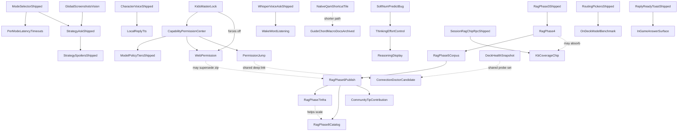

# Roadmap details — closed entries (archive)

Long-form notes for roadmap entries that have since **finished** — shipped and confirmed, fixed,
or otherwise moved to Done or to one of the other archives. These blocks used to live in
[roadmap-details.md](../roadmap-details.md); they still hold the same detail (what was tried,
what it cost, which leads were ruled out) for whoever needs the history.

Split out of roadmap-details.md on 2026-09-24 by plan 65, moved word for word — nothing reworded.
Active notes for entries still open are in [roadmap-details.md](../roadmap-details.md).

---

## The spoiler fence on a no-story game lands mid-reply

  - **It tracks the question, not the turn.** *"how do i deal with the exploders"* fenced on **both** captures — `DeckCapture_20260822_164957_game.png` and `DeckRecord_20260822_172630_game.mkv`, two independent generations with visibly different wording. *"what is red sugar for"* (`DeckRecord_20260822_173005`) and *"how do i beat the twins"* (`DeckRecord_20260822_172800`) fenced on **neither**. Two samples of one question is not proof, but a per-question correlation is a far more tractable bug than per-turn randomness, and it is the first thing to test: **re-run each of the three questions several times and record the fence rate per question before touching any code.** If it holds, the cause is in what that question retrieves or how its entity is resolved, not in model temperature.
  - **A lead on why that question and not the others.** The three cards differ by `section_type` — `Exploder` is **enemy**, `Red Sugar` is **item**, `Dreadnought Twins` is **boss**. The low-risk addendum's wording only names *"boss and elite enemy names"* and *"boss/enemy guidance"* ([ollama_prompts.py:261-300](../py_modules/backend/services/ollama_prompts.py#L261-L300)), and the named-entity discount runs through `_ENTITY_FILLER`, which drops words like *"boss"* and *"the boss"* but has no equivalent handling for a plural common noun like *"exploders"*. Worth checking whether `asked_entity` resolves for *twins* and *red sugar* but not for *exploders*, which would explain the split exactly.
  - **The placement changed, and that part is genuine variance.** In the earlier screenshot the fence sat at the **end** of the reply; in the recording the same question put it **in the middle**, between the opening line and *"Here's the lowdown:"*, splitting the answer in half. Mid-reply is materially worse than trailing — it interrupts the thing the user is reading mid-fight, which is the exact scenario Phase 4 track 2 restructured these cards for. Check whether this followed the 2026-08-15 `prepareStreamMarkdown` / `unwrapOpenSpoilerFence` change, since that is the most recent thing to touch where a fence is recognised during streaming. **Cross-title placement data, same evening** (`recordings/DeckRecord_20260822_195545/200257/200436/201647_game.mkv`): on Ship of Harkinian the fence landed **mid-reply** on the water-temple-boss and sink-underwater asks, at the **very top** of the reply on the bottles ask (before any prose at all), and on Fallout 4 it trailed at the **end** — all three positions in one session, same model. Those titles fence by design (`protect_progression` / narrative), so they say nothing about the false positive; they make the placement variance a cross-title fact rather than a Deep Rock quirk.
  - **Cheap mitigation while it is open:** `strategy_spoiler_masking_enabled` off in settings removes the fence for QA runs without a code change. Not a fix — it disables fencing everywhere, including the titles that need it.
  - **The lead is confirmed, at the desk, 2026-08-22 — `asked_entity` is empty for exactly the question that fenced.** Run against `extract_strategy_asked_entity` with the three card names passed as `known_entities`: *exploders* → `''`, *red sugar* → `'Red Sugar'`, *twins* → `'twins'`. A 3-of-3 match with what was observed on device, and it needs no hardware to reproduce. **Two independent gaps produce the miss, and both must be fixed or neither helps:** *"deal with"* is not in `_ENTITY_VERB_FIRST_PATTERNS` (which carries `beat|defeat|kill|fight|survive|use|counter|play as`), and `_match_known_entity` is word-boundary exact, so the card *Exploder* does not match the plural *exploders* — confirmed by the singular form resolving correctly.
  - **What the empty entity actually costs, and it is bigger than the discount.** [`_strategy_spoiler_low_risk_addendum`](../py_modules/backend/services/ollama_prompts.py#L261-L305) has three arms. With an entity it says *"do NOT wrap ... in `bonsai-spoiler` fences"*; with `kb_entity_match` it says *"do NOT fence KB-backed boss/enemy guidance"*; with neither it says only *"boss and elite enemy names are not narrative spoilers — keep mechanical coaching visible."* **The third arm is the only one carrying no explicit negative instruction.** And the second arm cannot rescue the first, because `kb_text_covers_asked_entity` returns `False` on an empty entity before it looks at the cards at all — so one extraction miss knocks out *both* arms that tell the model not to fence, with the Exploder card sitting in the prompt unused. **The title-level fact is the stronger one and is not being used:** the game is already known to be `low_narrative`, which is a better reason not to fence than knowing what was asked. **Fix lean: give the third arm the same explicit instruction**, and treat the two extraction gaps as a separate, smaller improvement — that way the fix does not depend on entity extraction succeeding for every phrasing a player might use.

## Spy: a character who lies to you on purpose

Filed 2026-09-06 by the maintainer. **Nothing is built.** These are the things the build must not
have to rediscover.

**The idea.** The Spy is a new Team Fortress 2 character in the picker. He is helpful in tone and
wrong on purpose, because he is working for the other team and is good at it. Pyro's heaviest
setting is the nearest thing today and it is a different joke: Pyro is stubborn and rude, so his
bad advice is obviously bad. The Spy's is meant to sound right.

**The floor is the same as Pyro's, and it is not negotiable.** Nothing that can damage the Deck,
lose a save, spend money, or turn off a protection. Wasted time only. Anything that fails that
test is not a Spy line, however good the joke is.

**The reveal is the feature.** Being lied to and never finding out is just a broken plugin. So
plan, before writing any of it: what tells you that you were played, when it appears, and how you
get the honest answer afterwards without having to ask the whole question again.

**Reveal decided 2026-09-15 (D105).** A Spy chip under Show details always says he was on and lists
what he lied about, from a closing tag the model writes, or says he did not confess when the tag is
missing; he lies only at the two heaviest accent levels, like Pyro; the opening-as-someone-else trick
is its own entry on the roadmap now. He is already in the picker as a plain smooth voice; the picker
does not change.

### Four things to plan for, found while filing this

  1. **Corrected 2026-09-15: the Spy has been in the character list since June**, as an ordinary
     smooth understated voice. The picker does not change; the work is the lying and the reveal,
     decided in D105.
  2. **Pyro's bad advice never reaches an answer today.** It is five fixed sentences that only ever
     go into a chip you press yourself, and only on the two heaviest accent settings. The Spy needs
     the lying inside the answer itself. That is a different mechanism and a much bigger job, and
     it is the part that has to clear the floor above every time rather than five known-safe times.
  3. **Sometimes he opens as somebody else.** On a random chance, his first message introduces him
     as a different character from the list, and he keeps that up. This needs its own decisions:
     how often, whether the picker still shows Spy while he claims otherwise, and how the reveal
     reads when the person thought they had picked someone honest.
  4. **There is no first message from a character today.** A character only colours the answers you
     ask for; nothing greets you when you pick one. The impersonation opener needs that to exist
     first, so it is work in its own right and not a line of prompt text.

---

## Session context folds into Show details

Raised by the maintainer 2026-08-30 under the *Vertical space for the chat bubbles* goal. The ask is settled; **what it looks like folded
in is not**, and that is the part to workshop before any code moves.

What exists today, on a settled answer: a **Show details** button and a **Copy** button share one row, and a full-width **Session context
(N turns) ▸** bar sits under them as a second collapsed control. Two disclosures, stacked, for one answer.

Open questions:

- Does Session context become a **row inside** the expanded Show details panel, a **tab** within it, or a **section** appended to it?
- Show details is per-turn; Session context is per-session. Folding a session-wide thing into a per-turn panel means it either repeats on
  every turn or only appears on the newest one. Which?
- **Focus.** Both panels already have their own graphs, and the Session context panel has prior form here — the *stuck inside the Session
  context panel* bug (fixed 2026-08-27) was exactly this shape. Nesting one inside the other doubles the depth the D-pad has to climb back
  out of. Any design that adds a level needs an escape route drawn before it is built.
- What does the collapsed state say? "Show details" alone under-sells it once it also holds the session's chips.

**Drawn at true size on the mockup page** https://claude.ai/artifact/2De58qirE34754PEZVPmdb **(2026-09-16):**
the row, tab and section options sit side by side, each with its collapsed label and the D-pad escape route
marked, so the four open questions above can be answered by looking. The maintainer's call is in, below.

**Answered 2026-09-16 (D106).** (a) A tab within the panel. (b) Only the newest turn shows the Session tab,
so it never repeats. (c) The escape route is as drawn: Up from the tabs goes to Hide details and then Read
aloud; Down goes into the chips; B anywhere inside the panel closes it. (d) The collapsed row still says
"Show details". One thing the mockup page did not draw: where Clear sits inside the Session tab. The builder
puts it at the end of that tab's body, the same button and the same confirm box, unless the maintainer says
otherwise.

## The tab icon bar collapses when it is not in use

The open questions that lived here (dashes plus a glyph or a word, collapse on idle, the R5 lock, the
LB/RB affordance, hashed Steam classes) were workshopped on 2026-09-01 and answered in
[planning/30-collapsing-tab-bar.md](planning/30-collapsing-tab-bar.md) § 3, then built and measured on
2026-09-02 (§ 8 there). The short version: our own 20px bar of dashes plus the active tab's name, opening
to a floating strip of icons and names only while the D-pad ring is on it; Steam's `Tabs` stays underneath
for LB/RB and the tab bodies; R5 reopened as **D44**, the ghost-stop finding is **D55**, the wrap
correction **D56**.

## Game notes are attached and then thrown away

**Fixed 2026-09-06.** When a question will not fit the model's window, the answer now gets shorter instead of the
notes being dropped. Full write-up and the before/after answer numbers: [CHANGELOG.md](../CHANGELOG.md). On-Deck
**KB-PROMPT-FIT-01** in [testing.md](testing.md).

**Correction, 2026-09-06: the Bone Hydra example in the table below never demonstrated this bug.** There is no Bone
Hydra note in the library — no note has "hydra" in its name, and the only note whose text mentions a hydra is a
Fallout: New Vegas one about an item of the same name. So a generic answer to that question was always the correct
behaviour. The bug itself was real; it is corrected below rather than removed, since the measurement it sits inside
is otherwise accurate.

Measured on the Deck 2026-09-06 with `gemma4:e2b-it-qat`, Strategy mode, `ask_think_effort: medium`, character voice on,
`use_local_knowledge_base: true`. Two real Asks driven through the panel with the bridge board; both logged the
`prompt_window_warning` added by `bb377d7` (D46). The guard warns and does nothing else.

| Ask | Prompt tokens | `num_predict` | Total | Window | Over by |
|---|---|---|---|---|---|
| "Why does my game stutter after a few minutes?" (no cards) | ~2,497 | 2,112 | 4,609 | 4,096 | ~513 |
| "How do I beat the Bone Hydra in Hades?" (cards attached) | ~2,805 | 2,112 | 4,917 | 4,096 | ~821 |

`num_predict` is 2,112 because Strategy's visible cap is 1,600 (`ASK_VISIBLE_NUM_PREDICT` in
`py_modules/backend/services/ollama_ask_budgets.py`) plus the 512-token thinking budget for `medium` effort. The Hades
prompt is ~308 tokens larger than the no-card one, which is the cards arriving; the corpus holds 15 Hades sections.

Ollama keeps the end of the prompt and drops its start, so the order of loss is: the dynamic game/attachment block, the
identity clause, the hardware appendix and JSON contract, then the knowledge cards spliced in as `early_context_suffix`.
The roleplay suffix is appended last by `apply_roleplay_to_system_content`, which is why the character voice survives an
overflow while the cards do not — voice was verified in character on all six device Asks the same afternoon.

Observable in the reply: the Bone Hydra answer was generic dodge-and-punish advice ("the sweeping ground assaults") with
no Hades-specific detail — **but, as corrected above, that boss has no note, so a generic answer here was always the
right outcome and this observation does not show the bug.** The real evidence is the token counts in the table above,
plus a PC-side run (below) and the fix's own device confirmation.

**The real evidence for the bug, gathered separately from the table above.** On a test run on a PC shaped like the
maintainer's own settings, 22 of 37 questions lost the start of what was sent to the model. On the Deck, all three
deeper-mode questions asked with a game running went over the limit, by 703, 780 and 712 tokens.

Two entries already in **Next** are the candidate fixes and both now have a measurement behind them: the **prompt diet**
(cut rules, move cards next to the question) and **a measured context-window experiment** (8,192). Neither has been
sized against these numbers yet. A third option nobody has costed: lower Strategy's visible cap, which trades reply
length for cards.

Not yet known: how often this fires in ordinary use. Both measured Asks had no game running and no screenshot attached,
which are the *cheapest* Strategy prompts — a running game, a screenshot or Proton log excerpts all push it further over.

**Fixed, 2026-09-06.** The fix trims the visible reply instead of the prompt: when a request would not fit, the answer
shrinks just enough to fit, never below a floor, and the thinking time a person asked for is left whole. A log line
records the old and new size. Confirmed on the Deck the same day with the character voice on, thinking at medium,
Hades running: asking about Megara, a boss that does have a note, got an answer built from it — her dash patterns,
punishing her while she recovers, using boons for burst damage — and the reply budget trimmed from 2112 to 1800 tokens
so the prompt fit. Full write-up, the three smaller trims that came first, and the before/after answer-quality
numbers: [CHANGELOG.md](../CHANGELOG.md). On-Deck row **KB-PROMPT-FIT-01** in [testing.md](testing.md).

## Chip rotation is biased to the top of the candidate list

- ★ **Chip rotation is biased to the top of the candidate list** — noticed 2026-08-29 while trying to make a long label appear. The
  guarantee and the roll both take `available[0]`, the first candidate not already in history, and the backend returns candidates in rank
  order. Across three 60s windows the same three chips came round every time (ranks 1–3) and ranks 4–6 never appeared. Not the old bug —
  those chips are reachable now, where before only rank 1 ever showed — but it is why the long labels stayed unobserved. A shuffle among
  eligible candidates, or a rotating start index, would spread it. **With the QA override on, all six appeared in 90s**, so the bias is in
  the roll rather than in reachability. **Fixed at the desk 2026-09-04:** `pickNextCarouselChip` now draws at random among the eligible
  candidates that share the top priority band (game chips before generic Deck tips), instead of always `available[0]`; the corpus
  guarantee is unchanged, it just no longer forces the same top-ranked candidate every time. **Verified on the Deck 2026-09-04** (Half-Life 2: ranks 2 to 5 inside 30 s, rank 1 absent), row **CHIP-ROTATION-01**.

## A command reply leaves the turn header blank and the chat titled New chat

- ★★ **A command reply leaves the turn header blank and the chat titled *New chat*** — **OPEN. Cause found 2026-09-04, a desk
  reading (grep/read only, no device or backend test run) — not fixed.** After `bonsai:vac-check` with the ban lookup off, the reply's
  turn header reads `…` and the chat it created stays *New chat* (`runs/SMOKE-C-b-press-ask-vac-check-off.json`, and again on VAC-02).
  Same `…` fallback SMOKE-H's 2026-08-23 fix covered for mid-thinking reopens (`buildCollapsedTurnTitle(liveQuestion) || "…"` in
  MainTabChatTranscript.tsx, where `liveQuestion = askThreadDisplayQuestion.trim()`).
  **The live question is set correctly and then overwritten — it is not missing at the source.** `onAskOllama` in
  `useBonsaiAskOrchestration.ts:1022` sets `askThreadDisplayQuestion` to the typed command text synchronously at submit, and a
  `bonsai:vac-check` command resolves on the immediate-completion path (`onAskOllama` ~line 1199–1233: `start_background_game_ai`
  answers `status: "completed"` in the same round trip, no polling) whose `terminal.question` is that same correct text — so
  `applyBackgroundStatusToUi`'s own backfill (`useBonsaiAskOrchestration.ts:667-669`, guarded `prev || q`) never has anything to fix.
  **The overwrite happens one step later.** That same completed branch calls `a.onSlotTurnsChanged?.()`
  (`useBonsaiAskOrchestration.ts:782`), wired in `src/index.tsx:502-504` and `:524` to `useChatSlots.ts`'s
  `reloadActiveSlotTranscript`, which fetches the active slot **from disk** (`getChatSlot`) and calls `applySlotTranscript` — and
  `applySlotTranscript` (`useChatSlots.ts:72-83`) sets `askThreadDisplayQuestion` **unconditionally** to whatever `pendingQuestion` the
  reloaded turns produce (`setAskThreadDisplayQuestion(pendingQuestion ?? "")`, no `prev ||` guard the way the backfill above has one).
  **Why the reload finds nothing:** in `main.py`, the three local-command branches — sanitizer (`local_kinds.sanitizer`, ~line 2621),
  shortcut setup (~line 2635) and VAC check (~line 2656) — each call `_finalize_immediate_background_local_command` and `return`
  directly from inside `start_background_game_ai`, **before** reaching the normal flow's chat-slot persistence
  (`_chat_slots_record_user_turn`, only called on the non-local-command path further down the same function). So a VAC-check
  exchange is never written to the chat slot's turn list at all. The reload's `getChatSlot` therefore returns the slot exactly as it
  was before the command ran — no new turn, so `turnsToCollapsedTurns` computes no pending question, and the unconditional
  `setAskThreadDisplayQuestion("")` in `applySlotTranscript` wipes the correct value the submit-time set and the completed-branch
  backfill had both gotten right. The same missing persistence step is why the chat's title never updates away from *New chat*:
  `chat_slot_service.append_turn` — the thing that renames a slot after its first question, per the comment on
  `reloadActiveSlotTranscript` in `useChatSlots.ts` — never runs either, because nothing was ever appended.
  **Fix needs backend changes**, outside a frontend lane's ownership: the VAC (and likely shortcut, and — separately, deliberately or
  not — sanitizer, which already passes `state_question=""` even in the state it does record) branches need to persist the user and
  assistant turns to the chat slot the way the normal path does, before or as part of returning from
  `_finalize_immediate_background_local_command`. Hardening `useChatSlots.ts`'s `applySlotTranscript` to guard its
  `setAskThreadDisplayQuestion` the same way the backend-completion backfill does (`prev || pendingQuestion`) would stop the
  *symptom* (the header) without fixing the *cause* (the chat's title, and the on-disk history, both still empty) — worth doing
  defensively, but not a substitute for the backend fix.

  **Fixed at the desk 2026-09-04, Deck check owed.** `_finalize_immediate_background_local_command` (`main.py`) now takes an
  optional `chat_slot_id` and, when one is active, persists the exchange through the same two steps the normal path's own
  completion uses — `_chat_slots_record_user_turn` then `_chat_slots_record_assistant_turn`, the latter carrying
  `transparency_snapshot_for_chat_slot`'s trimmed snapshot, the same helper `game_ai_request.py` already uses for its own
  immediate-command rows. `chat_slot_id` is now parsed once in `start_background_game_ai` before the three local-command
  branches (previously parsed only on the normal path, further down the same method) and threaded into all three call sites
  (sanitizer, shortcut, VAC), so each of them gains a first turn and `chat_slot_service.append_turn`'s rename-off-*New chat*
  rule now fires for them too. **No frontend change was needed.** `useChatSlots.ts`'s `applySlotTranscript` still overwrites
  `askThreadDisplayQuestion` unconditionally on reload, but that write only matters while `expandedTurnKey === "live"`; once
  the reload finds a complete user+assistant pair, `turnsToCollapsedTurns` (already covered by `chatSlotTurns.test.ts`'s
  "returns empty pending when turns end on assistant") reports no pending question, so `applySlotTranscript` points
  `expandedTurnKey` at the newly archived turn's own id instead — and that turn's header reads `turn.question` directly
  (`MainTabChatTranscript.tsx:616`), never the live-question path that used to show `…`. Two new backend tests in
  `tests/test_chat_slot_ownership.py`: `test_vac_check_deny_reply_persists_turn_and_renames_slot` and
  `test_shortcut_setup_reply_also_persists_to_chat_slot`. New QA row **CMD-REPLY-TITLE-01**: from the [+] position with the
  ban lookup off, send `bonsai:vac-check`; the turn header reads the command, not `…`; the chat's title in the slot row is
  the command, not *New chat*; after a QAM close and reopen the header still reads it.


## Session context folds into Show details (roadmap wording)

- ★★★ **Session context folds into Show details**
  - **Goal:** The **Session context (N turns)** bar stops being its own row and lives inside the **Show details** disclosure, so a settled
    answer costs one collapsed control instead of two.
  - **Shape not decided — workshop before building.** Open questions in [roadmap-details.md](roadmap-details.md).

## Fewer D-pad stops on a finished reply

- ★★ **Fewer D-pad stops on a finished reply** — filed by the maintainer 2026-09-02.
  - **Goal:** A finished answer gets one D-pad stop per paragraph today, so a long reply is ten or more Down presses before the ring
    reaches the chips under it. Merge neighbouring paragraphs into bigger sections — roughly one screen of text each — so it is a few.
  - **Streaming is untouched by design:** the live stream is split by a different routine (`prepareStreamMarkdown`) and the finished reply
    is re-split once the stream closes (`splitResponseIntoChunks`), so the section size only changes after the answer is done. Code fences
    stay whole, as now.

## Preset chip expansion

- ★★ **Preset chip expansion** (incremental content)
  - **Goal:** Add or refresh preset strings as related features land. Wave 1 shipped four prompts; **PRESET-EXPAND-W1-01** open. [wave1.md](archive/wave1.md).
  - **Not in scope:** replacing `fade` default animation; session RAG chips (shipped).

## Speed-mode VRAM preload

- ★★★★ **Speed-mode VRAM preload** (dev-toggle; keep a small model warm from boot)
  - **Goal:** On plugin/daemon boot, preload the user's default Ask model into VRAM so the first Ask of a session skips the cold-load penalty. Ships behind a developer toggle first; graduates to user-facing only after the suspend/resume question below is answered on-device.
  - **Model eligibility:** hard ceiling ≤3B params, but steered rather than merely gated — Pull Models picker surfaces vision/thinking-capable distilled models as "recommended for speed mode," and preload auto-substitutes the best shortlisted model if the user's chosen default doesn't qualify.
  - **Sits alongside, not instead of:** the existing Ollama-tab Unload-delay slider (`ollama_keep_alive`, [ollamaKeepAlive.ts](../src/data/ollamaKeepAlive.ts)) — that setting still governs how long a model lingers after use; this only changes when the *first* load happens.
  - **VRAM safety:** check pressure via existing TDP/telemetry chip data before every attempt; skip silently on pressure or an unreachable Ollama host, retry opportunistically next QAM open. No hard retry cap and no background polling — a skipped attempt costs nothing, so it can never contend with a running game.
  - **Open questions:** whether VRAM/model residency survives Deck suspend/resume — boot-only preload may need to also fire on wake — needs on-device research before this can leave the developer toggle.
  - **Related:** **Dynamic keep-alive / smart unload** (below) covers unloading on game focus, a separate question this feature doesn't answer.

## Reasoning display

**Planned 2026-09-05, calls locked in D70, two open in D71:** [40-reasoning-display.md](planning/40-reasoning-display.md).
Changed from the sketch below: three lines at the answer's size, not one; the fold shows seconds only and does not read
"Thought for"; live in Strategy mode too, with one notice; and the thinking gets a second job, a spoiler verdict under the
person's tier. The Deck's default Gemma 4 build can think, so this is not gated on pulling a special model.

- ★★★★★ **Reasoning display** (real model `thinking`, not the status blurb)
  - **GitHub:** [bonsAI Issues](https://github.com/qd313/bonsAI/issues) — issue TBD.
  - **Goal:** Read and stream the model's actual `thinking`/reasoning content from Ollama — never consumed today; the Ollama tab only sends the `think` boolean and spends a hidden budget, nothing reads `message.thinking` back. Renders inline with the reply (italic, muted, single-line-truncated while streaming), collapses to a "12s · 340 tokens" summary once the reply completes, expandable to the full transcript. New **thinking** transparency chip shows effort level + actual token spend alongside the existing model/kb chips in `ContextChipLadder`.
  - **No spoiler redaction inside the reasoning body** — the collapse/expand gesture is itself the consent fence, the same shape as an existing `` ```bonsai-spoiler `` fence ([spoilerFenceRegistry.ts](../src/utils/spoilerFenceRegistry.ts), [unwrapAskedEntitySpoilerFences.ts](../src/utils/unwrapAskedEntitySpoilerFences.ts)). A spoiler-risk caveat is instead surfaced once, as a dismissible notice the first time thinking-effort is turned on, plus an inline note on the first reasoning toggle a session sees.
  - **Persistence:** stored per-turn in chat-slot storage so archived/restored turns keep their reasoning text — closes part of the existing "Session context strip never lists archived turns" bug ([chat_slot_service.py](../py_modules/backend/services/chat_slot_service.py)).
  - **Spike required before build:** two open questions, either of which can fail without blocking the rest of the feature — (1) whether Ollama reasoning models interleave thinking with content per-paragraph, or emit one solid reasoning block before any content starts (decides whether **segmented per-paragraph reasoning** — a separate toggle under each paragraph rather than one end-of-turn block — is a real attribution or an approximate backend split of one block); (2) whether a single-line-truncated live display (cheap, current default design) or a bounded multi-line auto-scrolling pane (matches how AI chat apps commonly show live thinking, costs more of the 300px column) reads better once real local-model reasoning verbosity is seen on-device. If segmentation isn't feasible, falls back cleanly to the single end-of-turn block.
  - **Depends on:** Thinking effort control Phase 1 (shipped).


## Appendix (moved from the roadmap 2026-09-02)

### Cross-feature dependency summary

- **Mode selector (shipped)** → **Per-mode latency timeouts**; Strategy Guide path shipped as `strategy` Ask mode.
- **Character voice roleplay (shipped)** → accent intensity, avatars, UI accent theme, Random “?”, running-game suggestions, Pyro easter egg (all shipped); → **Local reply TTS** Phase 2.
- **Whisper voice Ask (shipped)** + mic → **Wake-word listening**.
- **Reply ready toast (shipped)** → required for hands-free wake when QAM closed; → **In-game answer surface** (toast snippet is the unblocked slice).
- **Capability Permission Center** → gates filesystem, Steam/Proton log + screenshot reads, mic, Steam Web API; → planned **Web permission** (Kids Lock forces off); → **Permission jump** shipped.
- **Llama.cpp provider spike** → research-only; related **Dynamic keep-alive / smart unload**.
- **Speed-mode VRAM preload** → boot-time preload, distinct from **Dynamic keep-alive / smart unload**'s unload-on-game-focus question; both are VRAM-residency decisions but answer different halves.
- **Soft** `num_predict` **+ thinking budget** (shipped) → **Thinking effort control** (Phase 1 shipped 2026-08-15; Phase 2 bonsAI tips Backlog) → **Reasoning display** (raw `thinking`, Backlog; segmentation gated on its own spike).
- **DRG Survivor glossary terms** → depends on the existing DRG Survivor KB seed content (`data/kb/strategy_seed.json`) and the shipped focus-graph D-pad convention.
- **Preset carousel (shipped)** → **Preset chip expansion**; **Session RAG preset chips** (shipped).
- **RAG / offline KB** → Phase 2–3 shipped → **retrieval quality remediation** (PR1/PR2 closed 2026-08-09; vector recall pass 2026-08-18) → Phase 4–8 Backlog; **KB visual maps** separate; **Spoiler constitution** runtime encoding shipped 2026-08-07; **Spoiler confidence chip** → fencing + unfenced feedback.
- **Web permission** → citations / allowlist / freshness chip.
- **bonsAI's own icon in the Quick Access Menu** (through Quick Tab) → shorter path than Guide-chord macro docs ([troubleshooting.md](troubleshooting.md) §5).
- **Steam Input jump Phase 1 (shipped)** → **Steam Input layout parse**.
- **Offline intent packs (quiet)** → **Intent packs later review**.
- **Deck health snapshot** ↔ **Connection doctor** — one probe stack, two presentations; decide before building either.
- **Session RAG chip candidates RPC (shipped)** → **KB coverage chip**; adjacent to **RAG Phase 4** Track 1 visibility.
- **User-owned model routing pickers (shipped)** → **On-Deck model benchmark**; overlaps **Dynamic keep-alive / smart unload**.
- **RAG Phase 6 publish** (shipped 2026-08-16) → **Community tip contribution** (now unblocked).
- **Permission jump** (shipped) → shared deep-link for **Connection doctor**.
- **Ordinary phrases attach game cards** (floor retuned, D28) → **Card relevance has its second signal** (shipped 2026-08-28, see Verify) — the pool-margin gate covers the overlap the floor could not fix; the keyword half's two attachments remain by design under D25/D28.
- **Controller macro test rig** (DPS-owned) → closes QA-plan F1 (on-device input) and findings-log P1-5; **Frozen test chips** → deterministic chip-select macros for it; corroborates **STREAM-09/11** measurement runs.



### Implementation notes

#### Iconography pass — plugin list icon lesson

Decky sizes icons via CSS `font-size`. Font Awesome works because it renders `<svg width="1em">`. An `` with fixed pixels is ignored. Fix: inline SVG into `<svg width="1em" height="1em" fill="currentColor">` (`BonsaiSvgIcon`). Source SVG needs `viewBox` for scaling.


## The blinking cursor in the question box does not line up with the placeholder text

- ★ `[ask]` **The blinking cursor in the question box does not line up with the placeholder text** — **OPEN,
  reported by the maintainer 2026-09-15 evening, a recurring sight.** The cursor sits a few pixels up and a
  little to the left of the greyed "Describe the level, boss, or puzzle you're stuck on." **Measured on the
  Deck the same evening:** the placeholder is drawn in its own layer at a 10-pixel font with a 12-pixel line;
  the real text field underneath, whose caret is the cursor a person sees, uses a 12-pixel font with a
  14.4-pixel line — about 2 pixels taller — so the two can never line up while they are two different font
  sizes. Evidence `docs/test-evidence/plan55-BUG-cursor-placeholder-offset.json`. **Confirmed on the
  Deck 2026-09-17:** the placeholder is still drawn in a smaller, tilted font than the text you type, 2
  to 3 pixels off from it. Evidence `docs/test-evidence/plan57-QA-cursor-placeholder-offset.json`.

*Moved out of the roadmap on 2026-09-21, superseded by the current summary there.*


## The pinned test sentences stop showing after the first question

- ★ `[chips]` `[QA]` **The pinned test sentences stop showing after the first question** — **OPEN, found
  2026-09-18.** After the first question sent from a pinned test sentence, the chip stops offering the pinned
  sentences and shows the plugin's own everyday suggestions instead. Closing and reopening the panel,
  saving the pinned list again, starting a brand new chat, and the Developer tab's force-test-chips switch
  all failed to bring them back for the rest of the sitting. Seen with Hades running, build `0589565`. It
  blocked **MEGAERA-01**, **KB-FOLLOWUP-01** and **KB-KILLSWITCH-01**'s Show details half, since no test
  sentence may be typed by thumb. Earlier sessions already found a pinned batch shows only its first three
  ([plan 31](planning/31-deck-verification-round.md)) and that the chip itself is a single rotating slot
  (plan 57); this is a further narrowing. Evidence `docs/test-evidence/plan61-MEGAERA-01-retry2.json` (the
  full account), `docs/test-evidence/plan61-KB-FOLLOWUP-01-retry2.json`,
  `docs/test-evidence/plan61-KB-KILLSWITCH-01-retry2.json`. **Likely cause found 2026-09-19, not yet
  confirmed:** the plugin keeps its own copy of settings in memory and writes the whole copy back on its
  next save, so an edit made straight to the settings file on disk gets overwritten again — a person
  changing settings through the plugin's own screens would probably never hit this, so it may be a
  test-rig problem rather than something a player would ever see. Working around it tonight took reloading
  the plugin right after every edit to the settings file, before sending anything; even then, the list had
  to be reordered and the plugin reloaded several times to get the wanted sentence to show first, and the
  one visible chip stops cycling while the controller's highlight rests on it. Rule for drivers: reload the
  plugin right after every edit to the settings file, before any question is sent.

*Moved out of the roadmap on 2026-09-21, superseded by the current summary there.*


## The Open Permissions jump lands one toggle above the one it was asked for

- ★ `[focus]` **The Open Permissions jump lands one toggle above the one it was asked for** — **OPEN,
  measured 2026-09-16 on build 0fbecb6.** The Open Permissions button under a blocked reply is a real
  D-pad stop now and A on it does reach the Permissions tab, but the highlight lands on "Save files to
  Desktop", one row above the "Steam ban lookup" toggle it was supposed to land on. Evidence
  `docs/test-evidence/plan56-PERM-JUMP-01-open-permissions.json` (the jump itself),
  `docs/test-evidence/plan56-SMOKE-C-01-toggle-off.json`, `docs/test-evidence/plan56-SMOKE-C-02-toggle-back-on.json`
  (the setup and restore steps around it). **The *Back to …* return half passed 2026-09-16:** pressing it on
  the Permissions tab returns to the Main tab with the highlight back on the Open Permissions button that
  started the jump. Evidence `docs/test-evidence/plan56-PERM-JUMP-01-back-to-main.json`,
  `docs/test-evidence/plan56-PERM-JUMP-01.summary.json`. **Seen again 2026-09-16** on the Steam-settings card:
  pressing A on a row there also opens the right Steam page with the highlight one toggle above the row that
  was pressed, the same shape. Evidence `docs/test-evidence/plan56-SETTINGS-CARD-DPAD-01.summary.json`.
  **Confirmed on the Deck 2026-09-17, worse than what this entry describes:** pressing Open Permissions now
  opens the Permissions tab at the very top, on the Back to Main button, nowhere near the toggle it should
  land on; Back to Main itself still works. Evidence `docs/test-evidence/plan57-QA-PERM-JUMP-01.json`.

*Moved out of the roadmap on 2026-09-21, superseded by the current summary there.*


## With Show details open, the chip row cannot be reached by the D-pad

- ★ `[focus]` **With Show details open, the chip row cannot be reached by the D-pad** — **OPEN, measured
  2026-09-16 on build 0fbecb6 and again on build `ca12429`, so it is not something this session's own commits
  caused.** Open Show details on a reply and press Down to step into its chips and read one — the ring skips
  the whole chip row and lands on the Session context bar instead. Seen on an instant built-in reply and on a
  real model reply with seven chips ("Chip 1 of 7" on screen); either way only the first chip can ever be
  read, and only by starting there before opening anything else. It worked before: the closed
  CONTEXT-LADDER-01…03 row (verified on the Deck 2026-09-05) had Down entering the chip row and Up walking
  back out. Evidence `docs/test-evidence/plan56-BUG-chip-ladder-unreachable.json`,
  `docs/test-evidence/plan56-CONTEXT-LADDER-03-caseB-details-open.json`,
  `docs/test-evidence/plan56-SPY-REVEAL-01-ladder-walk.json`.

*Moved out of the roadmap on 2026-09-21, superseded by the current summary there.*


## A new chat shows the previous chat's last reply until the panel is reopened

- ★★ `[chat]` **A new chat shows the previous chat's last reply until the panel is reopened** — **OPEN, seen
  2026-09-15 evening.** With a reply still on screen in one chat, moving the chat row to the new-chat position
  and pressing A made the new chat, but the new chat then showed that earlier reply underneath it, with "…"
  standing in for the question, its Helpful, Not really and Copy buttons all reachable, and a Session context
  row showing one turn. Closing the panel and reopening it left the new chat empty, the way a new chat should
  always start. Evidence `docs/test-evidence/plan55-trap-run3-new-chat-with-live-turn.json` (the walk from the
  chat row visits Retry, the "…" question, Copy reply text and Read aloud under the New chat slot). **Seen
  again 2026-09-18, 01:11, build `6d5b83f`:** the shoulder button to the new-chat position, then A, then one
  Down into the transcript, and the empty new chat showed the older chat's Theseus-and-Asterius reply. The new
  chat's own saved file already had no turns and already pointed at the new chat, so this is a stale drawing
  on screen, not a data problem. Closing and reopening the panel cleared it. Reproduced twice now. Evidence
  `docs/test-evidence/plan61-BUG-ghost-reply-new-chat.json`. **A third sighting 2026-09-18 about 09:30, build
  `0589565`, and now a recipe that brings it up on demand:** switch to a brand-new chat right after a
  reply finishes in another chat, and the new chat shows that finished answer, with a placeholder standing in
  for the question and working Helpful, Not really and Read aloud buttons underneath it. Closing and
  reopening the panel clears it every time. Three hits tonight in all, two by accident and one on this
  recipe. Evidence `docs/test-evidence/plan61-ghostreply-try1.json`. **A fourth sighting 2026-09-18,** on its
  own while a try at the panel-trap bug above was being set up, same shape as before. No new evidence file.

*Moved out of the roadmap on 2026-09-21, superseded by the current summary there.*


## The Show details chip ladder is not a D-pad stop

- ★★ `[focus]` **The Show details chip ladder is not a D-pad stop** — **OPEN, found 2026-09-17 while running
  the reasoning display's Deck rows.** With Show details open, Right from Hide details stalls, Down skips
  straight to the Session context strip, and Up from there lands back on Hide details — so no chip beyond
  the first can ever be selected by a controller, only read on the page. This is not new: CONTEXT-LADDER-03's
  2026-09-16 note already saw the ladder skipped, on an instant built-in reply; this run confirms the same gap
  on a real model reply, with a thinking chip among the skipped chips. Evidence
  `docs/test-evidence/plan57-REASONING-05.json`. **Seen again 2026-09-18, on a real model reply with a
  two-button follow-up menu:** with Show details open, Down from Hide details now lands on the new "From the
  notes" row, then the Session context strip, never on either menu button; Up from the strip jumps straight
  back to Hide details, skipping the notes row and the menu too. The same skip now covers the follow-up menu
  buttons, not just the chips. Evidence `docs/test-evidence/plan61-CONTEXT-LADDER-03-caseB.json`.
  **Seen again 2026-09-18, on the notes block's own ladder walk, on the build with the upward-walk fix:**
  Down from Hide details now stops at the block's own header first, then the session context strip, Save
  chat to Desktop, a test chip, the question box and Ask — seven visible stops with no loop — but the chip
  ladder itself is still not among them; only the first chip can ever be read by a controller. Evidence
  `docs/test-evidence/plan58p1-QA-NOTES-BLOCK-01.json`, `docs/test-evidence/plan58p1-QA-NOTES-BLOCK-01-ladder-walk-21b53b9.json`.

*Moved out of the roadmap on 2026-09-21, superseded by the current summary there.*


## The licence filter now hides models the old Policy buttons never did

- ★★ `[ollama]` **The licence filter now hides models the old Policy buttons never did — needs the
  maintainer's word** — **OPEN, found 2026-09-20, waiting on the maintainer to confirm this is what they
  wanted.** On the default "open source only" choice, the AI models list now shows 17 of 26 models; 7
  open-weight and 2 unknown-licence models are not shown at all until the filter is changed. Before this
  landed, all 26 were always listed, and picking an open-weight one raised a box explaining its licence
  that you could then accept — that box still works once the filter is relaxed. The brief for this change
  did say the licence choice becomes one filter among filters, and that is the point of the change, so a
  filter that filters is a fair reading of what was asked for, and it sits with the project's own leanings
  toward open source. But a third of the catalogue changing what is visible, on the default setting, is
  not a small detail, so this needs the maintainer's own word before it counts as settled.
  [Plan](planning/62-feature-session-five.md)

*Moved out of the roadmap on 2026-09-21, superseded by the current summary there.*


## The game a chat belongs to, above its title

- ★★ `[chat]` **The game a chat belongs to, above its title** — **VERIFY, built 2026-09-20 (lane G).**
  The name now shows only while the ring is on the row, with the empty line still held open so the row's
  height never changes. Built in the same commit: the chat's own name was sitting off the row's middle,
  because a small × for deleting the chat used to be part of what got centred; pinning the × to the
  right-hand edge instead fixes that. **Measured on the Deck 2026-09-20: with the ring on the row the offset
  is exactly 14 pixels and the × is the whole of it, because the chat previews either side are hidden while
  the row is focused — so this change straightens that state completely, and that is the state the game name
  shows in.** At rest the previews are back and the offset was 24 pixels, of which ~10 remains: they are
  different widths (14 and 43 measured) and shift the name by an amount that changes with the neighbours'
  names. Cosmetic and low priority now, since the game line is blank at rest, leaving only the dots to look
  uneven against. An earlier note here claimed 24 was the figure to fix and asked for a decision; that read
  the resting state and was withdrawn. Row **CHAT-SLOTS-V3-14c**, **run on the Deck 2026-09-21 and PASSED**: with the highlight on the row the
  name is half a pixel off the row's centre, the delete cross sits outside the centred group, and the blank
  game line holds its 11 pixels in both states. Two notes: the row is 4 pixels taller while highlighted (55
  to 59), and the game name itself could not be seen because this chat has no game attached. [Plan](planning/62-feature-session-five.md) ·
  [Board](https://claude.ai/artifact/31aLBi17SH7AydhYfGYjBq)

*Moved out of the roadmap on 2026-09-21, superseded by the current summary there.*


## Pulled models join the model try order

- ★ `[ollama]` **Pulled models join the model try order** — **MOSTLY VERIFIED on the Deck 2026-09-06, one case left.**
  A model pulled from the picker landed at the **bottom** of the text list, and showed up in the vision list because it can
  read pictures — while a text-only model and the embedding one stayed out of that list. What is still owed is the opposite
  placement: with *Allow high-VRAM model fallbacks* on, a **large** pulled model is supposed to go to the **top** instead.
  That needs a large model on the device and the switch turned on. Row **ROUTING-MERGE-01**. The maintainer's own words on
  2026-09-19 (D113) were "try them in the order the user set." Model downloads are now allowed (D113), so the large-model
  half of this row is runnable in the next Deck block. **Tried on the Deck 2026-09-19:** the bottom half passed again — a
  small model finished downloading and landed at the end of the saved list, after the two models already there. The top
  half is still not done, but the hold-up is no longer the download rule: it needs a person to type a large model's name
  (for example `gemma3:27b`, about 17 GB) into the picker's custom-name field with *Allow high-VRAM model fallbacks* on,
  using Steam's on-screen keyboard, and to remove that model again afterwards — a check only the maintainer can do at the
  Deck. Evidence `docs/test-evidence/plan61-ROUTING-MERGE-01-bottom.json`, `docs/test-evidence/plan61-ROUTING-MERGE-01-top.json`.

*Moved out of the roadmap on 2026-09-21, superseded by the current summary there.*


## Thinking line fixes from 2026-08-07/08

- ★★ `[reply]` **Thinking line fixes from 2026-08-07/08** — **VERIFY.** Emoji upright, lazy status tag survives, no bare-emoji phase
  changes, one writer. Five of seven rows pass on the Deck: **THINKING-SLOW-01** and **THINKING-SPOILER-01** (2026-09-04);
  **THINKING-COPY-01**, **THINKING-LIVE-01** and **THINKING-EMOJI-01** (2026-09-17) — the first status line held about 5.5
  seconds before changing, the line changed three times over about 7 seconds with no freeze or repeat, and the emoji sits
  upright beside the tilted sentence. Evidence `docs/test-evidence/plan57-QA-THINKING-COPY-01.json`,
  `docs/test-evidence/plan57-QA-THINKING-LIVE-01.json`, `docs/test-evidence/plan57-QA-THINKING-EMOJI-01.json`. Left:
  **THINKING-SANITIZE-01** and **THINKING-EMOJI-CLUSTER-01**, both automated only, never read on the device.
  **Tried on the Deck 2026-09-18:** the status line always read as words, never a bare tag, across the night's
  long answers, but the fault THINKING-SANITIZE-01 hunts did not happen, so it is not yet proven; no multi-step
  troubleshooting question ran, so THINKING-EMOJI-CLUSTER-01's several-phase case never came up either. Evidence
  `docs/test-evidence/plan61-THINKING-SANITIZE-01.json`, `docs/test-evidence/plan61-THINKING-EMOJI-CLUSTER-01.json`.
  [Log](planning/06-thinking-blurbs-review.md#10-implementation-log).

*Moved out of the roadmap on 2026-09-21, superseded by the current summary there.*


## "Not in my notes" line

- ★★ `[KB]` **"Not in my notes" line** — **VERIFY, built and shipped 2026-09-07, device check failed the same
  day.** The line itself is in the code, but on the Deck nothing could make it appear: ten questions asked first
  all attached a note, so the one question meant to show the line never got the chance. The note search has
  since gained a floor that can refuse a weak match, so there may be a way to show it now — nobody has checked.
  Same shape of problem as the "No tip for this" line in the Bugs list above; run both together next time. Row
  **W2-R5**. **Tried again 2026-09-18 with Half-Life 2 running, blocked:** the right question (one the notes
  genuinely do not cover) was ready to send, but the same Ask-box freeze as the three-star focus entry above
  stopped it from going out. Evidence `docs/test-evidence/plan61-W2-R5-hl2-retry.json`. **And again at
  12:50, still blocked:** Half-Life 2 had dropped off the Recent Games row so the launcher refused to start
  it, and the pinned test sentences had stopped showing by then anyway. Evidence
  `docs/test-evidence/plan61-W2-R5-hl2-retry2.json`. On 2026-09-19 the maintainer played Half-Life 2 once
  more, so it is back on the Recent Games row and this row can run in the next Deck block.
  **Run again 2026-09-19, still owed:** the warning line finally showed up, for the first time, on a
  Half-Life 2 question the notes genuinely do not cover — real progress. But its wording is not exactly what
  was asked for, and a note card naming three notes appeared underneath it at the same time, which
  contradicts the line's own claim that nothing close was found. See the "no close match" Bugs entry above
  for that contradiction. Evidence `docs/test-evidence/plan61-W2-R5-hl2-retry3.json`.

*Moved out of the roadmap on 2026-09-21, superseded by the current summary there.*


## Down did nothing for the whole time an answer was arriving

- ★ `[ask]` `[focus]` **Down did nothing for the whole time an answer was arriving** — **VERIFY, fixed
  2026-09-20.** Press Ask, and the D-pad ring lands on the question box, now emptied. Pressing Down did
  nothing at all until the answer finished, though Right kept working the whole time, reaching the
  Ask-mode button and then Stop. The Ask button greys out while a question is being answered, and Down was
  written to do nothing in that window on the idea that nothing else was live — but the Stop button is
  live then, and is exactly what a person wants to reach. Down now goes to Stop instead. Row
  **ASKBAR-DOWN-TO-STOP-01**, not yet run on the Deck. Evidence
  `docs/test-evidence/plan62-askbar-control-before-send.json`,
  `docs/test-evidence/plan62-ASKBAR-FOCUS-TRAP-reproduced-after-send.json`,
  `docs/test-evidence/plan62-ASKBAR-FOCUS-TRAP-after-answer-finished.json`.

*Moved out of the roadmap on 2026-09-21, superseded by the current summary there.*


## The UI size setting barely changes anything

- ★★★ `[ui]` **The UI size setting barely changes anything** — **VERIFY, fixed 2026-09-21 (plan 63, commit
  `03bfc02`).** The size slider had three stops — Handheld, Desktop, Couch — and Desktop drew exactly the
  same size as Handheld, so moving the slider between those two changed nothing at all. That stop is gone;
  two stops remain, and Couch is the one that visibly does something (about nine pixels taller chat rows).
  Anyone whose saved setting says Desktop now opens on Handheld instead, with no visible change, since the
  two were always the same size. The automatic option's own on-screen words were also wrong — it said it
  picks the best size from your display, which it cannot, since the plugin always sits in Steam's narrow
  side panel whatever screen is plugged in; it now says plainly that automatic can only apply Handheld.
  **The automatic option itself was deliberately left in place:** removing it reaches about fifteen files,
  including settings code another lane changed the same night — bigger than the maintainer's own words,
  "cut the choices to what is real, not the full wiring job." Whether automatic should go too is still
  theirs to say. The 351 sizes that still do not scale are untouched, as instructed. Owed on the Deck: open
  Settings, turn automatic off, confirm the slider snaps between exactly two stops and never shows Desktop.
  Evidence `docs/test-evidence/plan62-UI-SIZE-outside-handheld.json`.

*Moved out of the roadmap on 2026-09-22, superseded by the current summary there.*
