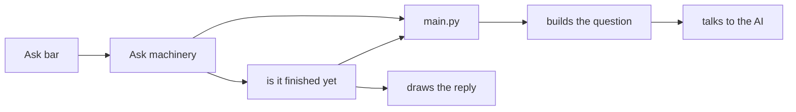

# How to write a header here

House style for every file under `src/`, plus `main.py` and `py_modules/`. Parts of this are
checked by `scripts/check_headers.py`, which fails the build. See also [glossary.md](glossary.md).

## Who you are writing for

**Somebody who has never seen this code.** Not a colleague who already knows the system. That is
the whole rule, and it is the one thing that is easy to get wrong while writing something that
looks perfectly professional:

> Purpose: Map frontend settings snapshot input into the backend BonsaiSettings RPC payload shape.

That sentence is accurate and tells a newcomer nothing. Rewritten:

> Purpose: The Settings tab holds every setting under a screen-side name, spelled the way screen
> code spells things. The back end that writes them to disk knows the same settings under
> different names, spelled its own way. This file is the translation between the two.

Lead with what the thing does for a person using the plugin, then how it does it.

`python scripts/plain_words_check.py --file <path>` lists the terms of art in a header and prints
the everyday wording to use instead. It never fails a run, on purpose — a word list cannot tell
good writing from bad, and the cheapest way to pass one would be a thesaurus rather than an
explanation. Read its list, then decide. Keeping a term of art because it genuinely is the
clearest word is a fine answer; using one instead of explaining is not.

## The shape

```ts
/**
 * Title: what it is, in a few words
 * Purpose: what it is for and how it fits. Three to six sentences for a small
 *          helper, a paragraph for a normal file.
 * Used for: who uses it, in words
 * Solves: the problem it exists for
 * Does not: what a reader might expect to find here and will not
 * How it works: required over 400 lines of code — the main flow, numbered,
 *          naming the functions in order, as long as it needs
 * Gotchas: only when there are any — known traps, why odd code is odd
 */
```

Python modules use the same labels in the module docstring.

**Write it at whatever length the file needs.** There is no limit and length is not measured. The
count of large files excludes comments and docstrings entirely, so explaining a file well can
never make it look worse. If you ever find yourself shortening an explanation to satisfy a number,
the number is wrong — say so. Four workers did exactly that on 2026-09-14 against a measure that
turned out to be broken, and all four wrote worse for a day before anybody spoke up.

**Drawings are welcome** where a shape is easier seen than read — an order of checks, what sits
inside what on screen, the two routes a request can take.
[`capabilities.py`](../py_modules/backend/services/capabilities.py) draws the order its checks
happen in; [`buildAnswerBubbleElement.tsx`](../src/utils/buildAnswerBubbleElement.tsx) draws the
reply bubble. Do not add one for its own sake.

**Check every claim before you write it.** A header that confidently states something false is
worse than one that says nothing, because the next person believes it. Read the lines that make a
thing happen before writing what happens. Both worked examples above contained a confident
falsehood on their first draft, caught only by going and checking.

## What is checked, and what is not

`scripts/check_headers.py` runs inside `scripts/verify.py` and fails the build on:

- any app file with no `Purpose:` line in its first 60 lines;
- any file over 400 lines of code with no `How it works:` line;
- a name written in backticks with brackets after it — `` `likeThis()` `` — that does not exist in
  that file and is not imported into it. A backticked word with no brackets is ordinary quoting
  and is not checked.

Nothing checks wording. That part is a person's judgement, which is why the examples above matter
more than the list.

## Notes on functions

Sixty lines and up: two or three sentences at the top saying what goes in, what comes out, and
what can go wrong. Over a hundred and twenty: a numbered list of the steps. Skip anything obvious —
plain getters, values passed straight through, one-line helpers.

Names of files and functions are allowed inside comments, and writing them is often the clearest
thing to do.

## Generated files

Three files are written from scratch on every commit, so a header typed into them disappears:

| File | Its header lives in |
|---|---|
| [`src/pluginVersion.ts`](../src/pluginVersion.ts) | [`scripts/sync-version-from-plugin.mjs`](../scripts/sync-version-from-plugin.mjs) |
| [`src/types/rpcMethods.ts`](../src/types/rpcMethods.ts) | [`packages/bonsai-mcp/scripts/generate-architecture.mjs`](../packages/bonsai-mcp/scripts/generate-architecture.mjs) |
| [`docs/code-map.md`](code-map.md) | [`scripts/code_map.py`](../scripts/code_map.py) |

This is worth knowing before you spend an afternoon on one: the header checker went on reporting
`pluginVersion.ts` as undescribed however many times somebody described it.

## Files that do not need a full header

Pure data dumps (`characterPlaceholderEmoticonGrids.ts`), anything under `dist/`, ambient
`types.d.ts`, the stylesheet section dumps under `styles/sections/`, tiny re-exports, empty
`__init__.py`, one-line stand-ins.

## Structure changes

1. **Reorder and label sections** first (`// --- Submit ---`, `# --- Ask ---`).
2. **Split a file** only when a section has a clear second owner and can still be tested alone.
3. **Renaming for clarity is fine**, except the back-end method names, which are the contract with
   the screen and must stay exactly as they are (`start_background_game_ai` and the rest).

## The Ask path, in order

Walk this to trace a question from the Main tab to the AI and back — about ten minutes.

| Step | File | What it does |
|------|------|------|
| 1 | [`MainTab.tsx`](../src/components/MainTab.tsx) | Lays out the chip row, the Ask bar, the screenshot browser and the chat. |
| 2 | [`MainTabUnifiedAskBar.tsx`](../src/components/MainTabUnifiedAskBar.tsx) | The Ask box itself: the mode menu, send and cancel, the attachment row. |
| 3 | [`index.tsx`](../src/index.tsx) | Hands the Ask machinery down into the Main tab. |
| 4 | [`useBonsaiAskOrchestration.ts`](../src/hooks/useBonsaiAskOrchestration.ts) | Sending, waiting, the chat thread, strategy branches, revealing the reply as it arrives, restoring a session. |
| 4b | [`useStrategyChecklistSession.ts`](../src/hooks/useStrategyChecklistSession.ts) | Keeps the per-game strategy checklist in step with the disk. |
| 5 | [`useBackgroundGameAi.ts`](../src/hooks/useBackgroundGameAi.ts) | Asks "is it finished yet" over and over until it is. |
| 6 | [`deckyCall.ts`](../src/utils/deckyCall.ts) | Sends a request to the back end and gives up if it hangs. |
| 7 | [`main.py`](../main.py) | The back end's front door: start a question, ask how it is going, stop it. |
| 8 | [`game_ai_request.py`](../py_modules/backend/services/game_ai_request.py) | Builds the question: what game is running, the knowledge base, the safety check, then the AI. |
| 9 | [`ollama_ask_service.py`](../py_modules/backend/services/ollama_ask_service.py) | Actually talks to the AI. |
| 10 | [`MainTabChatTranscript.tsx`](../src/components/MainTabChatTranscript.tsx) | Draws the reply, the buttons under it, and the strategy parts. |

**Moving focus with the D-pad:** [`replyStopRegistry.ts`](../src/utils/replyStopRegistry.ts),
[`liveTurnFocusGraph.ts`](../src/utils/liveTurnFocusGraph.ts). Never move focus by hand — the
browser's idea of what is focused then disagrees with Steam's own highlight ring, and this project
has lost three separate fixes to that trap. The rule in full is in [AGENTS.md](../AGENTS.md).


