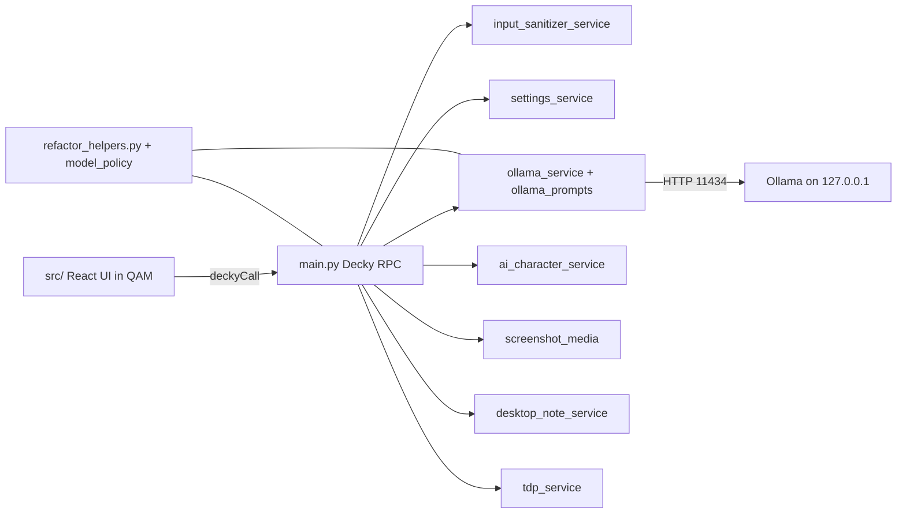

# bonsAI Development Guide

This guide is for contributors building and deploying bonsAI from source. **Primary target:** one Steam Deck runs everything — Cursor, the git repo, Ollama, Decky, and bonsAI on the same machine. A separate PC on the LAN still works; see [Other-machine LAN workflow](#other-machine-lan-workflow).

## What you'll have when done

- **bonsAI** loaded in the Quick Access Menu (QAM) via Decky Loader
- **Ollama** on `http://127.0.0.1:11434` on the same Deck
- A repeatable **build → deploy → test** loop without leaving Desktop Mode for most UI work

## Prerequisites (Steam Deck, Desktop Mode)

1. **Switch to Desktop Mode** — Steam button → **Power** → **Switch to Desktop**.
2. Open **Konsole** (or your terminal).
3. Set a sudo password if you have not already (required for Decky deploy restarts):

   ```bash
   sudo passwd
   ```

4. Install **[Decky Loader](https://github.com/SteamDeckHomebrew/decky-loader)** if it is not already on the Deck (Stable channel is a good default).

## Install Cursor and clone the repo

Install Cursor on the Deck (Flatpak or AppImage from [cursor.com](https://cursor.com)). Then:

```bash
cd ~
git clone https://github.com/cantcurecancer/bonsAI.git
cd bonsAI
```

Open the `~/bonsAI` folder in Cursor.

## One-time developer setup

From the repo root:

```bash
cp .env.example .env
```

For **same-machine** development on the Deck, edit `.env`:

```bash
DECK_IP=127.0.0.1
DECK_USER=deck
PC_IP=127.0.0.1
```

Then run the setup script (installs `pnpm`, Decky CLI to `cli/decky`, SSH key auth to self, and `pnpm install`):

```bash
./scripts/setup-dev.sh
```

On **Windows** (remote deploy to a Deck on the LAN), use `.\scripts\setup-dev.ps1` instead and set `DECK_IP` / `PC_IP` to real LAN addresses.

## Install Ollama on the Deck

```bash
./scripts/setup-ollama.sh
```

This installs Ollama and pulls starter models (`gemma4`, `llama3`). For Tier-1 FOSS tags aligned with bonsAI routing, see `TIER1_FOSS_STARTER_PULL_TAGS` in [`refactor_helpers.py`](../refactor_helpers.py) (`qwen2.5:1.5b`, `llava:7b`).

Verify:

```bash
curl -s http://127.0.0.1:11434/api/tags
ollama run qwen2.5:1.5b "Hello from bonsAI"
```

**In-app model management:** With **Ollama on this Deck** enabled, open **Settings → Connection → Browse models…** to open the Pull Models picker — curated catalog with live registry sizes (offline fallback), multi-select pull, and per-row delete. Progress appears in the Local Ollama setup log on the same tab.

## Build and deploy (same Deck)

```bash
./scripts/build.sh local
```

What this does:

- `pnpm install` (when needed) → `pnpm run build` → writes dev `src/config.ts` from `.env`
- Copies `main.py`, `refactor_helpers.py`, `py_modules/`, and `dist/` into `~/homebrew/plugins/bonsAI/`
- Restarts `plugin_loader` via `sudo systemctl`

**Modes** (all from repo root):

| Command | Use when |
| -------- | -------- |
| `./scripts/build.sh local` | Build + deploy on **this** machine (Deck-native default) |
| `./scripts/build.sh` | Build + deploy to a **remote** Deck (`DECK_IP` in `.env`) |
| `./scripts/build.sh deploy --local` | Re-deploy last build without rebuilding |
| `./scripts/build.sh release` | Produce distributable zip under `out/` (no `.env` required) |
| `pnpm run watch` | Rebuild on file changes; pair with Decky **Reload** in QAM |
| `./scripts/watch-deploy.sh` | Rollup watch + debounced **deploy** to remote Deck (see `--local` below) |
| `./scripts/watch-deploy.sh --local` | Watch + deploy on **this** Deck (Deck-native fast loop) |

Windows equivalent: `.\scripts\build.ps1` (remote deploy only; loads `.env`). Watch deploy: `.\scripts\watch-deploy.ps1`.

### Maintainer dev loop (Cursor)

- Skill: [`.cursor/skills/bonsai-deck-dev-loop/SKILL.md`](../.cursor/skills/bonsai-deck-dev-loop/SKILL.md) — build/deploy, BPM vs Gaming Mode, screenshots, optional log tunnel.
- Screenshots: [`.cursor/skills/decky-screenshot-ingest/SKILL.md`](../.cursor/skills/decky-screenshot-ingest/SKILL.md).
- Visibility workflow: [spikes/cursor-deck-visibility.md](spikes/cursor-deck-visibility.md).

### Headless Decky harness (Vitest)

Frontend tests use a fake `@decky/api` registry under `src/test-harness/` (jsdom). Run `pnpm test` after `src/` or hook changes. Registry contract: `src/test-harness/fakeDeckyRpc.test.ts`.

## Test bonsAI after deploy (two tracks)

Decky injects into Steam's **gamepadui** layer — the same React/CEF surface as **Gaming Mode** and **Big Picture Mode (BPM)**. The classic Desktop Steam window does **not** load QAM or Decky. See [steam-input-research.md](steam-input-research.md) § "Game Mode / Big Picture".

### Track A — Fast loop (recommended; stay in Desktop Mode)

Use this for daily UI, Settings, Permissions, Ask flow, Ollama RPC, and QAM focus work.

1. After `./scripts/build.sh local`, if Steam was already running, **fully exit Steam and relaunch** (or use Decky **Reload** in QAM after the first open) so the new bundle loads.
2. Open Steam in Desktop Mode → **Steam menu → View → Big Picture Mode** (or the BPM icon, top-right).
3. Press **`...` (Quick Access)** on the controller (or click the QAM glyph) → **Decky plug icon** → **bonsAI**.
4. Exit BPM via **Exit Big Picture** or `Alt+Tab` back to Konsole/Cursor — no Gaming Mode switch required.

**Iterating:** run `pnpm run watch` in Konsole, then **Reload** the plugin in Decky QAM for a near-HMR loop.

**Screenshots for Cursor (BPM / QAM UI):** After reproducing UI in BPM (or with BPM still running in the background), Alt+Tab to Cursor and run:

```bash
./scripts/screenshot-deck.sh
```

With `DECK_IP=127.0.0.1` in `.env` (recommended for same-machine Deck), or `steamdeck.local` while running on the Deck, the script captures **locally** (no SSH). Saves `screenshots/DeckCapture_<timestamp>.png` for agents using the [decky-screenshot-ingest](../.cursor/skills/decky-screenshot-ingest/SKILL.md) skill. Keep Steam/BPM running for composited QAM captures; fully quitting Steam may fall back to KMS grab (game plane only). If a run hangs on `deck@steamdeck.local's password:`, press Ctrl+C and retry (auto-local should apply) or run `./scripts/screenshot-deck.sh --local`. Windows remote deploy: `.\scripts\screenshot-deck.ps1`.

**What BPM proves:** Main tab UI, Settings, Permissions, Ask flow, backend RPC, D-pad focus in QAM overlays.

**What BPM does not prove:** Guide-chord shortcuts (`bonsai:shortcut-setup-deck`), TDP apply under gamescope, in-game overlay behavior, gamescope screenshot capture during a running title — use Track B for those.

### Track B — Full validation (Gaming Mode)

Use before merge when changes touch Steam Input, TDP, screenshot attach, or in-session overlay behavior.

1. Double-click **Return to Gaming Mode** on the Desktop (or Steam → Power → Switch to Gaming Mode).
2. Press **`...` (QAM)** → **Decky plug icon** → **bonsAI**.

### Troubleshooting (both tracks)

If the plugin does not appear after deploy:

```bash
sudo systemctl restart plugin_loader
journalctl -u plugin_loader -f --no-pager
```

Some Decky installs run the loader as a user unit; if the above shows nothing, try `journalctl --user -u plugin_loader -f --no-pager`.

More deploy edge cases: [troubleshooting.md](troubleshooting.md) § Build & Deploy.

## First Ask

1. Open **bonsAI** → **Settings** → set **Ollama host / base URL** to `http://127.0.0.1:11434`.
2. Open **Main** → send `hello`.
3. If it fails, confirm Ollama is up (`curl http://127.0.0.1:11434/api/tags`) and check **Permissions** for gated features.

## Architecture at a glance

<a id="stack-and-layout"></a>



**Request path (Ask):** User types in `MainTab` → `useBonsaiAskOrchestration` → `deckyCall` → `main.py` RPC → `input_sanitizer_service` → `ollama_service` (model selection via `refactor_helpers.select_ollama_models`) → HTTP to Ollama → response chunks back to the UI.

### Frontend (`src/`)

| Path | Role |
| ---- | ---- |
| [`index.tsx`](../src/index.tsx) | Decky plugin shell, tab routing, `.bonsai-scope` glass styles |
| [`components/`](../src/components/) | Tabs: `MainTab`, `SettingsTab`, `PermissionsTab`, `AboutTab`, `DebugTab`, `DeveloperTab`, modals |
| [`hooks/`](../src/hooks/) | `usePluginSettings`, `useBonsaiAskOrchestration`, disclaimer/runtime gates |
| [`data/`](../src/data/) | Presets, character catalog, model policy, settings keys, ask modes |
| [`utils/`](../src/utils/) | `deckyCall`, `settingsAndResponse`, focus navigation, chunk splitting |
| [`features/unified-input/`](../src/features/unified-input/) | Ask bar measurement and layout constants |
| [`styles/bonsaiScopeStylesheet.ts`](../src/styles/bonsaiScopeStylesheet.ts) | Durable scoped CSS for Decky focus/layout |

Build output: [`dist/index.js`](../dist/index.js) (referenced by [`plugin.json`](../plugin.json)).

### Backend (`main.py` + `py_modules/backend/services/`)

| Module | Role |
| ------ | ---- |
| [`main.py`](../main.py) | Decky RPC entrypoint; wires UI calls to services |
| [`refactor_helpers.py`](../refactor_helpers.py) | Ollama URL normalization, model fallback chains, TDP parse helpers |
| `input_sanitizer_service.py` | Ask sanitization lane and magic-phrase commands |
| `settings_service.py` | Load/save/normalize `settings.json` |
| `ollama_service.py` + `ollama_prompts.py` | Prompt assembly and Ollama HTTP transport |
| `game_ai_request.py` | Orchestrates Ask pipeline (sanitizer → Ollama → response) |
| `model_policy.py` | Tier classification for model routing |
| `ai_character_service.py` | Roleplay system-prompt suffix |
| `screenshot_media.py` | Vision attachment capture and encoding |
| `local_ollama_setup_service.py` | In-plugin Ollama install/pull helpers |
| `ollama_catalog_service.py` | Pull Models tag validation + registry.ollama.ai metadata fetch |
| `tdp_service.py` | TDP/sysfs read/write |
| `desktop_note_service.py` | Desktop note and verbose Ask trace append |
| `capabilities.py` | Permission capability checks |
| `steam_vac_service.py` / `vac_check_commands.py` | Steam ban lookup |
| `shortcut_setup_commands.py` | Guide-chord setup guidance |
| `plugin_data_reset.py` | Reset plugin persisted data |
| `strategy_guide_parse.py` | Strategy-mode response parsing |
| `proton_troubleshooting_logs.py` | Proton log helpers |

Decky loads `py_modules` on `sys.path`; keep the `backend` package name for imports.

### Deep-dive pointers (preserved for agents and contributors)

- **Unified input refactor (complete):** [refactor-specialist-sweep.md § Unified input refactor](refactor-specialist-sweep.md#unified-input-refactor-completed) — [`useUnifiedInputSurface.ts`](../src/features/unified-input/useUnifiedInputSurface.ts), [`MainTab.tsx`](../src/components/MainTab.tsx).
- **AI character roleplay:** [`characterCatalog.ts`](../src/data/characterCatalog.ts), [`CharacterPickerModal.tsx`](../src/components/CharacterPickerModal.tsx), [`ai_character_service.py`](../py_modules/backend/services/ai_character_service.py).
- **Input sanitizer:** [`inputSanitizerCommands.ts`](../src/data/inputSanitizerCommands.ts) (must match Python); `input_sanitizer_user_disabled` in settings.
- **Input transparency:** RPC `get_input_transparency`; optional Desktop trace via `desktop_note_service.py`.
- **Ask modes:** `ask_mode` (`speed` \| `strategy` \| `deep`); chains in `refactor_helpers.select_ollama_models`.
- **Model policy tiers:** [`modelPolicy.ts`](../src/data/modelPolicy.ts), [`model_policy.py`](../py_modules/backend/services/model_policy.py).

## Toolchain

- Node.js (modern LTS; Node 16.14+ minimum)
- `pnpm` (v9 recommended)
- SSH/SCP (for remote deploy only)

```bash
pnpm install
pnpm run build
pnpm run watch
pnpm test          # Vitest (frontend)
pnpm run test:py   # Python unit tests
```

Regression gates: [regression-and-smoke.md](regression-and-smoke.md) §1. On-device run order: [device-qa-runbook.md](device-qa-runbook.md) (Tier 0–1 first); coverage and scenarios: [prompt-testing.md](prompt-testing.md).

If Decky UI packages drift:

```bash
pnpm update @decky/ui --latest
```

## Other-machine LAN workflow

Still supported when Ollama runs on a PC and the Deck is the deploy target:

1. In `.env`: `DECK_IP=<deck-lan-ip>`, `PC_IP=<pc-lan-ip>`.
2. On the PC: install Ollama, set `OLLAMA_HOST=0.0.0.0`, open firewall **TCP 11434**. See [troubleshooting.md](troubleshooting.md#2-network--communication-the-bridge).
3. Run `./scripts/setup-dev.sh` (or `setup-dev.ps1` on Windows) once, then `./scripts/build.sh` (default `dev` — remote deploy).
4. In bonsAI Settings, point Ollama URL at `http://<PC-IP>:11434`.

Ollama helpers: [`scripts/setup-ollama.sh`](../scripts/setup-ollama.sh) (Linux), [`scripts/setup_ollama.ps1`](../scripts/setup_ollama.ps1) (Windows).

## Release (plugin zip)

**Version source:** bump **`version`** in [`plugin.json`](../plugin.json). [`pnpm run build`](../package.json) syncs [`PLUGIN_VERSION`](../src/pluginVersion.ts) and [`package.json`](../package.json) via [`scripts/sync-version-from-plugin.mjs`](../scripts/sync-version-from-plugin.mjs).

**Prepare-only bump** (updates manifest, package.json, pluginVersion.ts, CHANGELOG header; does **not** commit or tag):

```bash
pnpm run version:bump patch   # or minor | major | 0.4.0
```

Then edit CHANGELOG bullets, commit, `git tag vX.Y.Z`, push tag for CI zip.

**CI:** [`.github/workflows/build-plugin-zip.yml`](../.github/workflows/build-plugin-zip.yml) — triggers on **`v*` tags** and **workflow_dispatch**. Artifact: `bonsai-plugin-*`; verified by [`scripts/verify-decky-plugin-zip.sh`](../scripts/verify-decky-plugin-zip.sh).

**Local release:**

```bash
./scripts/build.sh release
```

Output under **`out/*.zip`**.

## Documentation maintenance (releases)

When you mark a feature **complete**, update the same change set (see [`.cursorrules`](../.cursorrules)):

- [roadmap.md](roadmap.md)
- [prompt-testing.md](prompt-testing.md) and [device-qa-runbook.md](device-qa-runbook.md) — when behavior is user-visible
- [troubleshooting.md](troubleshooting.md) — new setup steps or FAQs
- [CHANGELOG.md](../CHANGELOG.md)

## Docs and references

- Doc index: [DOCUMENTATION_INDEX.md](DOCUMENTATION_INDEX.md)
- Power-user troubleshooting: [troubleshooting.md](troubleshooting.md)
- [device-qa-runbook.md](device-qa-runbook.md) — Deck QA run order (Tier 0–4)
- [prompt-testing.md](prompt-testing.md) — shipped-feature coverage + scenario detail
- RAG research (not implemented): [rag-sources-research.md](rag-sources-research.md)
- [Decky frontend library](https://github.com/SteamDeckHomebrew/decky-frontend-lib)
- [Decky wiki](https://wiki.deckbrew.xyz/)
