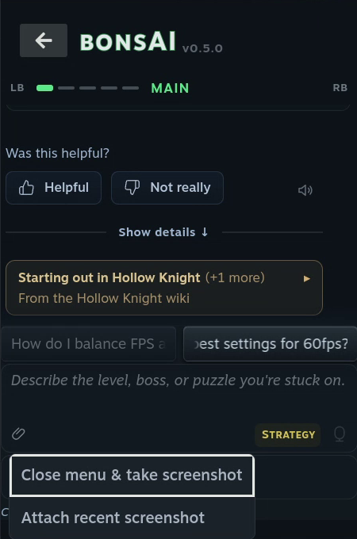
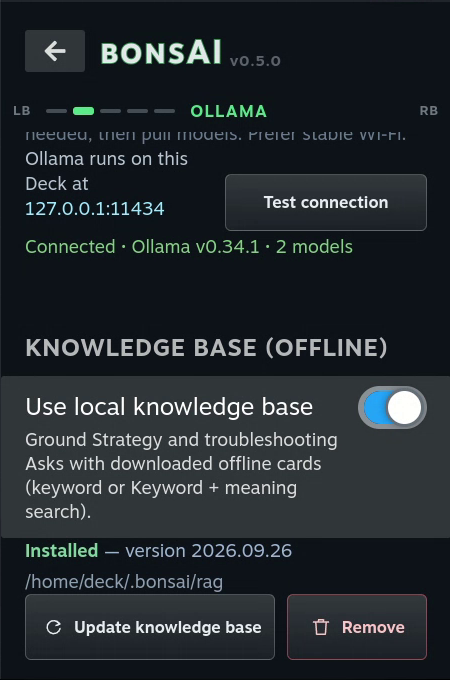
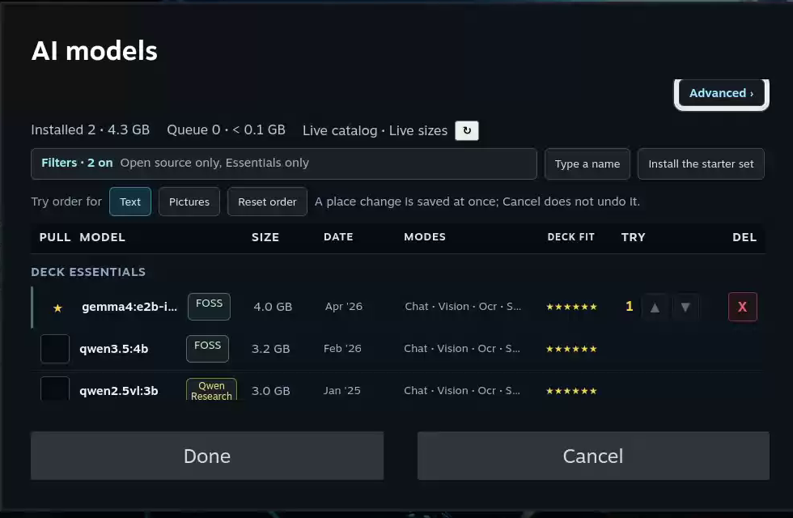
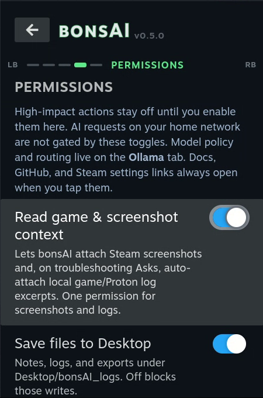
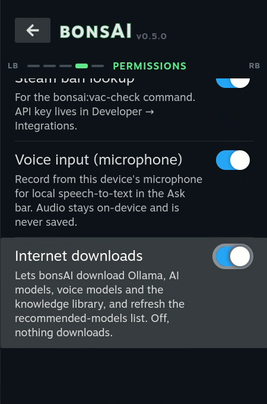

# How to use bonsAI

This guide walks through everything bonsAI does, tab by tab. If you haven't installed it yet, start
with the [install steps in the README](../README.md#install).

**Moving around:** bonsAI is used with the D-pad and **A**, like the rest of the Quick Access Menu.
The shoulder buttons switch tabs, as they do elsewhere in Steam. **B** steps back out.

- [The tabs](#the-tabs)
- [Asking questions](#asking-questions)
- [The knowledge library](#the-knowledge-library)
- [Spoilers](#spoilers)
- [Saved chats](#saved-chats)
- [Voice input and read aloud](#voice-input-and-read-aloud)
- [Characters](#characters)
- [Where the AI runs](#where-the-ai-runs)
- [Running the AI on a PC](#running-the-ai-on-a-pc)
- [AI models and licences](#ai-models-and-licences)
- [Permissions](#permissions)
- [The parental lock](#the-parental-lock)
- [Starting fresh](#starting-fresh)
- [Known problems](#known-problems)
- [Words used here](#words-used-here)

## The tabs

| Tab | What's on it |
|---|---|
| **Main** | Your chats, suggestion chips, answers and the question box |
| **Ollama** | Where the AI runs, the knowledge library, how answers are written, and the AI models |
| **Settings** | Screenshots, spoilers, suggestion chips, voice, characters, and clearing data |
| **Permissions** | The switches that let bonsAI reach outside the chat. All off to start |
| **About** | What bonsAI is, the language answers are written in, and links |

## Asking questions

Type in the question box on **Main**, or pick a suggestion chip, then press **ask**.

**Which game:** while a game runs, bonsAI knows which one and includes it in your question. With no
game running, name the game in your question.

**How it answers** — the mode chip on the question box:

| Mode | Use it for |
|---|---|
| **Speed** | A short answer, fast. The default |
| **Strategy** | Help getting past something. Can ask where you are in the game, then gives a checklist of steps you can tick off (saved for each game). Hides spoilers, and ends with an optional "If you want to cheat…" section for single-player games |
| **Expert** | A longer, more detailed answer. Slower |

**Suggestion chips** sit above the question box. Pick one to start a question. A game that has notes
in the knowledge library gets chips of its own. **Settings → Suggestion chips** can show one chip
instead of two. **Settings → Remember what I typed** keeps an unsent question when you close the menu.

**Screenshots:** press the paperclip on the question box, then pick **Close menu & take screenshot**
or **Attach recent screenshot**, and ask about it. This needs the **Read game & screenshot context**
permission and a model that can see pictures (the starter model can). **Settings → Screenshot
quality** trades memory for detail: **Save memory** (the default), **Balanced** or **Best detail**.

**Performance and battery:** ask about frame rate or battery life and the answer gives numbers you
can set yourself in the Deck's Performance menu — a power limit in watts, a frame cap, a refresh
rate. bonsAI never changes these for you.

**Find a setting:** type a few words, like "brightness", and bonsAI offers the
matching Steam setting. Pick it to jump straight there. No AI is needed for this.

**While it answers:** the words appear as they're written. You can stop an answer partway. If you
close the menu, the answer keeps going, and a **Reply ready** popup shows its first lines when it's
done.

**Under each answer:**

- **Helpful** / **Not really** — saved in a small file on your Deck and never sent anywhere. It
  doesn't change your answers.
- The **speaker** button reads the answer aloud.
- **Copy**, and **retry** on your question to ask it again.
- **Show details** — which model answered, which notes it used and where they came from, and the
  rest of the chat's history.

**Ollama → Reply style** sets how long answers are: **Caveman**, **Balanced** or **Detailed**.
**Thinking** (off by default) lets the model think step by step first. It's slower, but can help
with hard questions. You can watch its steps while it thinks.

**About → reply language** sets the language answers are written in. It follows Steam's language
unless you change it.

## The knowledge library

AI models know a little about a lot of games, and often get details wrong. The knowledge library is a
set of notes from community wikis — bosses, areas, items, enemies — for 38 games so far, plus Deck
tips for common problems. When a question matches a note, the answer uses it and says where it came
from.

**To set it up:** switch on **Internet downloads** (Permissions), then on the **Ollama** tab under
**Knowledge base (offline)**, switch on **Use local knowledge base** and press **Download knowledge
base**. It's a small download, and after that it works offline. Press **Update knowledge base** now
and then to get new games.

After it installs, bonsAI offers a second, optional download (about 270 MB) that helps it find the
right note when your question uses different words from the note.

**Speed** uses one note at most and finds it by matching words only. **Strategy** and **Expert** use
more notes and also search by meaning, which is what the optional download helps with.

## Spoilers

**Settings → Hide spoilers until I tap** is on to start. In Strategy answers, anything that would
give the story away — a boss's name, a twist, an ending — is covered. Press **A** on a cover to open
it.

Covers stay closed in **Show details**, in the thinking steps, and in the "where are you at?" choices.
Copying an answer or reading it aloud leaves covered parts out.

Spoiler hiding does its best and will sometimes miss.

## Saved chats

The row at the top of **Main** holds up to eight chats. They're kept for you automatically; when you
start a ninth, the one you used longest ago is removed. Move along the row to switch chats, or use
the shoulder buttons while the row is selected.

- The **pencil** starts a new chat.
- Chats name themselves after your first question. You can rename one.
- The **save** icon copies a chat to a file on your Desktop. It needs the **Save files to Desktop**
  permission.
- The **bin** deletes a chat. It asks first.

**Sum up this chat** is at the top of the **Session** tab inside **Show details**. It writes a short
card of what the AI remembers from the chat, and may suggest a better name. A long chat also sums
itself up on its own, so older parts aren't forgotten.

## Voice input and read aloud

**Voice input** — talk instead of typing.

1. Switch on **Voice input (microphone)** and **Internet downloads** on the Permissions tab.
2. On **Settings → Voice input**, pick a speech model — **tiny.en** is quicker, **base.en** is more
   accurate — then press **Install voice engine**. It builds the speech engine on the Deck, which
   takes a few minutes.
3. Press the mic button on the question box and speak.

Your speech is turned into text on the Deck. The recording is deleted as soon as that's done.

**Read aloud** uses the Deck's own voice, so there's nothing to download. Press the speaker under an
answer, or set **Settings → Voice replies**:

| Setting | What happens |
|---|---|
| **Off** | Only when you press the speaker. The default |
| **By voice** | Answers are read aloud when you asked by voice |
| **Always** | Every answer is read aloud |

Code, tables and covered spoilers are mentioned, not read out.

## Characters

**Settings → AI voice & personality** gives written answers the tone of a character — the Spy, GLaDOS
and about thirty more, or one you describe yourself. **Accent intensity** sets how strong the tone
is. It changes the words only; there are no character voices.

At the strongest settings some characters may give wrong advice on purpose, as a joke. **Show
details** says when that's switched on.

## Where the AI runs

bonsAI doesn't contain an AI itself. It talks to **Ollama**, a free program that runs AI models.
Ollama can run on the Deck or on a PC.

| Where | Good for |
|---|---|
| **On the Deck** | Works anywhere, no PC needed. But the AI and your game share the same chip, so both slow down while it answers |
| **On a PC on your home network** | Much faster, especially with a graphics card. The PC has to be on |

**On the Deck:** on the **Ollama** tab, switch on **Run AI on this Deck** and press **Install
Ollama**. Say yes when it offers the starter model. **Start the AI with the Deck** starts it each
time the Deck turns on, so the first answer comes sooner. Later, the same button reads **Update AI &
models**.

**On a PC:** see the next section.

**Connection tuning** on the Ollama tab sets how long bonsAI waits before warning you that an answer
is slow (60 seconds to start) and before giving up (3 minutes), and **Keep models loaded** sets how
long a model stays ready after an answer.

## Running the AI on a PC

1. Install [Ollama](https://ollama.com/download) on the PC.
2. Download a model on the PC. In a terminal: `ollama pull qwen2.5vl:3b` (the same starter model the
   Deck uses), or pick a bigger one if your graphics card has room.
3. Let Ollama accept connections from your network. Set the setting `OLLAMA_HOST` to `0.0.0.0`
   and restart Ollama, then allow port **11434** through the PC's firewall.
   [Troubleshooting](troubleshooting.md#2-network--communication-the-bridge) has the steps for each
   system.
4. Find the PC's address on your network, such as `192.168.1.20`.
5. On the Deck, **Ollama** tab: make sure **Run AI on this Deck** is off, type
   `http://192.168.1.20:11434` (with your PC's address) into **PC address**, and press **Test
   connection**.

**Save current PC address as quick host** keeps up to four addresses, so you can switch between PCs
with one press.

bonsAI doesn't run on the Steam Frame headset. To use it alongside one, run bonsAI on a Steam Deck on
the same network and point it at the PC that streams your Frame games.

## AI models and licences

**Ollama → Browse models…** shows models you can download. Filter by what they're good at, whether
they can see pictures, or what's already installed. Models too big for the Deck are marked. **Install
the starter set** gets the recommended model in one press.

**Ollama → AI models…** decides which of your installed models bonsAI may use, and in which order.

The model policy decides which licences are allowed:

| Policy | What it allows |
|---|---|
| **Open source only** | Models under open source licences (Apache 2.0 or MIT), such as Qwen 3, Gemma 4, Granite and gpt-oss. The default, and the recommended one |
| **Also try open-weight models** | Also models whose weights are public but whose licence is the maker's own, such as Llama, Gemma 3 and older |
| **Any installed model** | Anything you've installed, once you unlock it |

The starter model, Qwen 2.5 VL 3B, is an exception you should know about. Qwen's own page gives this
size the Qwen Research licence (Ollama's page lists Apache 2.0). It stays allowed under **Open source
only** for now so the default works. Its licence label shows in amber. These labels were checked on
2026-09-29; they're a guide, not legal advice. The full list is in
[troubleshooting](troubleshooting.md#model-licences-and-the-tiers).

## Permissions

 

Everything that reaches outside the chat is off until you switch it on here. If a question needs a
permission that's off, bonsAI says so and offers a button that jumps here.

| Permission | What it allows |
|---|---|
| **Read game & screenshot context** | One switch for two things: attaching screenshots, and adding bits of the game's logs to troubleshooting questions |
| **Save files to Desktop** | Saving chats, notes and logs to a `bonsAI_logs` folder on the Desktop |
| **Voice input (microphone)** | Using the mic button |
| **Internet downloads** | Installing Ollama, AI models, the knowledge library and the voice engine, and refreshing the recommended-models list. bonsAI tells you where each download comes from before it starts |
| **Steam ban lookup** | Checking Steam accounts you name for public ban flags: type `bonsai:vac-check` followed by profile links or Steam IDs. It doesn't look up your recent players. Needs your own Steam Web API key, which goes on the hidden Developer tab: switch on **Settings → Data → Show Developer tab**, then **Developer → Integrations** |

## The parental lock

When Steam reports that parental controls are on, bonsAI switches off its higher-impact permissions —
saving files, screenshots and game logs, the microphone, the ban lookup and downloads — and greys them out.

Be clear about what that doesn't do:

- **It doesn't filter what the AI says.**
- It's a guard rail, not a security barrier. It knows only what Steam tells it; if that signal fails,
  your permissions stay as you set them.
- It isn't a playtime limit or a game blocker, it has no PIN of its own, and it covers bonsAI only.

## Starting fresh

**Settings → Clear cache...** clears what's on screen right now — the question box, the current
answer and the open chat — so your next question starts fresh. It doesn't touch your settings,
models or files.

**Settings → Clear all data...** puts bonsAI back to how it was when first installed: chats,
settings and permissions. **If the AI runs on the Deck, it also deletes the models you downloaded and
Ollama itself**, which can be several GB. Both ask first.

Removing bonsAI from Decky doesn't erase its saved data. To start completely fresh, use **Clear all
data...** first. [More on this](troubleshooting.md#1b-uninstall-vs-clear-all-data-settings).

## Known problems

- Rarely, the D-pad may stop moving in the panel. Closing and reopening the Quick Access Menu should
  clear it; restarting the Deck always does.
- Rarely, a chat opened with **R1** while a game runs is missing the buttons under its newest answer,
  and Down stops on the question. Closing and reopening the Quick Access Menu fixes it.
- With a game running, the panel can update more slowly while an answer arrives, and very long
  answers can dip further.
- Answers come from a small AI model on your Deck or PC. They can be wrong, can repeat wording from an
  earlier answer, and questions that aren't about a game can pick up game notes.
- Once, with a game running and the AI on the Deck itself, Steam's screen stopped responding a few
  minutes after an answer; restarting the Deck cleared it.

Found something else? [Open an issue on GitHub](https://github.com/qd313/bonsAI/issues).

## Words used here

| Word | What it means |
|---|---|
| **Quick Access Menu** | The panel the `...` button opens. Decky and bonsAI live here |
| **Decky Loader** | A free add-on that puts plugins like bonsAI into the Quick Access Menu |
| **Ollama** | A free program that runs AI models, on the Deck or a PC |
| **Model** | The AI that actually writes the answers. Bigger models are smarter but slower |
| **Home network** | The Wi-Fi or wired network your Deck and PC share |
| **PC address** | Where bonsAI finds Ollama on a PC, such as `http://192.168.1.20:11434` |
