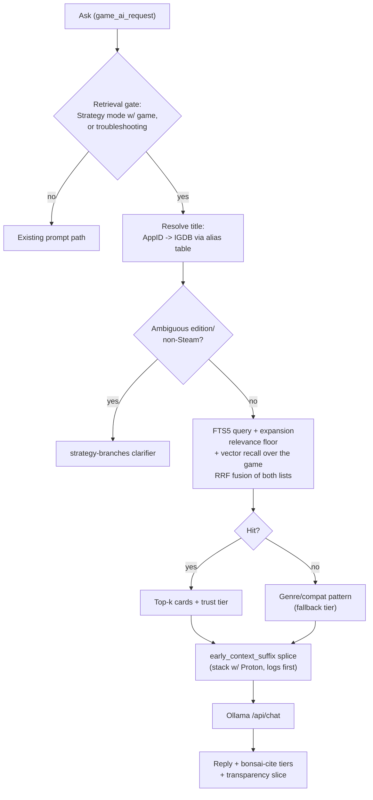

# Knowledge base (offline RAG v1)

Maintainer architecture for the **on-Deck offline strategy + compat knowledge base**. User setup: [troubleshooting.md](troubleshooting.md) § Knowledge base. QA: [testing.md](testing.md) **KB-*** rows. **Phase 2 hybrid** shipped 2026-07-28; **Phase 3** shipped 2026-07-29; **Phase 4–5** discovery locked 2026-07-30; **Phase 6** shipped 2026-08-14 (first public push live on HF + GitHub; on-Deck QA still open); **Phase 8** light discovery 2026-07-30; **Phase 7** tight discovery locked 2026-07-30 (see [roadmap.md](roadmap.md) Planned).

## Overview

v1 grounds Strategy and troubleshooting Asks by **pre-retrieval prompt-splice** into `early_context_suffix` (not model-facing tools). The corpus is **maintainer-built**, **manifest-driven**, and **downloaded on demand** (Hugging Face primary, GitHub Releases mirror). Retrieval is **FTS5 + rule-based query expansion**, fused with an optional **vector recall pass** over the resolved game's sections (`nomic-embed-text`, when vectors and the embed model are both available). Two lists, RRF-fused — see [§ Vector recall pass](#vector-recall-pass-2026-08-18).

> **Corrected 2026-08-05 (remediation PR1).** Phases 2 and 3 shipped what this document
> called hybrid, but was a **cosine-only re-rank**: the vector sort replaced the keyword
> order outright instead of combining with it. Retrieval is genuinely hybrid as of PR1 —
> see [§ Retrieval quality remediation](#retrieval-quality-remediation-pr1-2026-08-05).
> Any Phase 2/3/4/5 wording below that says "FTS shortlist → cosine re-rank" describes what
> those phases shipped at the time, not current behaviour.

## Retrieval flow



## Runtime components

| Component | Path | Role |
|-----------|------|------|
| Retrieval | `py_modules/backend/services/knowledge_base_service.py` | Gate, AppID/alias resolve, FTS5 search, adaptive byte budget, genre/compat fallback |
| Schema + manifest helpers | `py_modules/backend/services/knowledge_base_schema.py` | SQLite DDL, FTS triggers, `resolve_corpus_db_path`, trust tiers |
| Downloader | `py_modules/backend/services/rag_corpus_download_service.py` | Manifest fetch, curl download, zlib decompress, SHA-256 verify |
| Ask splice | `py_modules/backend/services/game_ai_request.py` | `searching_kb` thinking phase; stack KB + Proton into `early_context_suffix` |
| System prompt | `py_modules/backend/services/ollama_prompts.py` | `bonsai-cite` + spoiler instructions when KB block present |
| Transparency | `py_modules/backend/services/transparency_service.py` | KB slice (sources, bytes, tier) on last Ask |
| UI | `src/components/KnowledgeBaseSection.tsx`, `OllamaTab.tsx` | Download/update/**cancel**/remove, toggle, availability indicator. Cancel shares the action row's second slot with Remove and only exists while a download runs — see **KB-CANCEL-01** in [testing.md](testing.md) |

> **Two names, one feature — grepping either one finds only half of it.** Everything
> user-facing says **knowledge base**: the strings, this file, `KnowledgeBaseSection.tsx`,
> `knowledge_base_service.py`. Everything machine-facing says **`rag_corpus`**: every RPC
> (`get_rag_corpus_status`, `start_rag_corpus_download`, …), every setting key
> (`rag_corpus_path`, `rag_corpus_version`), and the install path. The one exception in
> each direction is `use_local_knowledge_base`, a setting that uses the human name, and
> `get_session_rag_chip_candidates`, an RPC that uses neither convention cleanly. **Search
> both terms.** A step 11 friction reader grepped "knowledge base", got 60 files, and missed
> all five RPCs that manage the corpus.
| RPC | `main.py` | `start_rag_corpus_download`, `get_rag_corpus_status`, `cancel_rag_corpus_download`, `update_rag_corpus`, `remove_rag_corpus` |

## Maintainer build pipeline

```bash
python scripts/build_rag_db.py --seed --out ./build/knowledge-base
```

- **Never commit** the corpus to git.
- Emits `corpus.db`, `corpus.db.zlib`, `corpus-manifest.json`, `ATTRIBUTIONS.md`.
- **SoH → OoT** alias lives in the alias table (replaces the hardcoded prompt rule).
- Full crawl + LLM distillation is maintainer-batch work; `--seed` ships a dev/sample DB for QA.
- **Phase 2 (shipped 2026-07-28):** `build_rag_db.py` populates `section_vectors` when local Ollama has `nomic-embed-text`; manifest `embeddings_populated` + `embedding_section_count`.
- **Phase 3 (shipped 2026-07-29):** expand `compat_patterns` (~100–150 tips with `topic` + `platforms`); bake compat-pattern vectors; expand strategy sections for the interim 11-title game mix (see § Phase 3). Draft tips/cards on maintainer PC with **`qwen3.6:27b`**; embed with **`nomic-embed-text`** only.
- **Since the 2026-09-07 release, a build refuses to finish if any note or tip is missing its meaning index** — it used to only print a warning — and the publish check refuses to push a corpus that is short of its full index.

## Corpus layout on Deck

Default install path: `~/.bonsai/rag/` containing:

- `corpus.db` — read-only SQLite (FTS5 external content over sections)
- `corpus-manifest.json` — version, chunk SHA-256, HF/GitHub URLs

Settings: `rag_corpus_path`, `rag_corpus_version`, `use_local_knowledge_base`.

## Title resolution ladder

1. **Steam AppID** → `games.app_id`
2. **Normalized alias** (shortcut name, display title) → `aliases` table
3. **Canonical title** exact match
4. Miss → genre/compat-pattern fallback (tagged **fallback, no source**)

## Trust tiers + `bonsai-cite`

| Tier | Meaning |
|------|---------|
| `wiki_verified` | Wiki card with `source_version` patch marker |
| `wiki` | Wiki card with URL/license |
| `fallback` | Genre/compat pattern — no per-game source |

Replies should use existing `bonsai-cite` markers; spoilery cards obey `bonsai-spoiler` policy.

## Source attribution (2026-08-09)

**The rule, enforced by `tests/test_source_attribution.py`:**

- A card claiming a **third-party licence must carry a `source_url`**. Claiming CC BY or
  CC BY-SA and naming nobody does not satisfy the licence.
- A card carrying a **`source_url` must declare a `source_license`**. Terms that were never
  written down cannot be honoured downstream.
- **Maintainer-authored cards carry neither** and are not pushed into inventing a citation.

`_format_block` builds one source record per card that **survived the context budget** — a
citation for text the model never saw is worse than none. `build_attribution_entries` then
groups those into one credit per `(source, licence)`, keeping the card titles, so a block of
three cards from one wiki reads as one credit line rather than three.

**A credit also says when the text was read.** A seed row may carry `crawled_at`; the build
falls back to its own timestamp only for rows that do not. This matters because four corpus
sources are archive.org snapshots between one and six years old, and without a per-row date
every rebuild would relabel 2022 wiki text with today's. The chip reads
`left4dead.fandom.com · CC-BY-SA-3.0 · as of 2025-04-05`, and cards grouped under one wiki
report the **oldest** capture in the group rather than the newest.

**Read the licence from the snapshot, not from the archive.org item.** The two disagree.
`wiki-hadesfandomcom` advertises `licenseurl` CC BY-SA 3.0 at the item level while its own
`dumpMeta/siteinfo.json` says **CC BY-NC-SA 3.0** — NonCommercial, which this corpus cannot
carry. [scripts/fetch_wiki_dump_pages.py](../scripts/fetch_wiki_dump_pages.py) prints both and
prefers the snapshot.

Two UI constraints, both measured rather than assumed:

- The accent must **not** reuse `tier_class`. That is the *model*-licensing axis and its
  `open_weight` value already paints amber, so a knowledge chip would read as a model chip.
- The accent must sit on the chip **outline**, not the fill. `ContextChipLadder` paints
  `tierBackground` only on the active chip; the border always renders.

This covers the credit **on the reply**. Credit on *distribution* follows the same per-card
rules and is discharged in the separately downloaded corpus package (not the plugin zip):

| Surface | What it does |
|---|---|
| Generated `ATTRIBUTIONS.md` | Built from the corpus DB at `build_rag_db.py` time; redistribution header + per-source groups + maintainer section |
| Plugin `NOTICE` | States the plugin ships **no** corpus; points auditors at the corpus package |
| Zip guard | `scripts/plugin_zip_corpus_guard.py` (via `verify-decky-plugin-zip.sh`) fails release if `corpus.db` / related files are bundled |

Plan (all executable stages done 2026-08-09):
[15-corpus-licensing-attribution-plan.md](archive/15-corpus-licensing-attribution-plan.md).
**D20** (2026-08-14, supersedes D19b): the published corpus ships as one **CC BY-SA 4.0** work,
including ShareAlike sources; only GFDL and NonCommercial sources are excluded (they don't mix
with CC BY-SA). Per-card `source_license` stays authoritative for individual reuse.
On-Deck: reply credit → **KB-ATTRIB-01**; published corpus file beside DB → **KB-ATTRIB-02**.

## Phasing

| Phase | Scope |
|-------|--------|
| **v1 (shipped)** | FTS5, on-Deck download (or Dev-tab seed), Model A consent, Ollama tab UI |
| **Phase 2 (shipped 2026-07-28)** | Hybrid retrieval for **Strategy / per-game section cards only**: bake vectors in `build_rag_db.py`; query embed via Ollama `/api/embed` (`nomic-embed-text`) on the **same host as Ask**; **FTS shortlist → cosine re-rank**; soft UI hint to install `nomic` (no auto-pull; Ask never blocked). User-facing transparency labels: **Keyword + meaning** (hybrid), **Keyword search**, **Keyword search (embed unavailable)**. Dev-tab vectorized seed first. |
| **Phase 3 (shipped 2026-07-29)** | **Compat/troubleshooting hybrid** on shared `compat_patterns` tip sheet (~124 platform-tagged maintainer tips) + **corpus maturity** (interim **11-title** strategy seed, 22 section cards). Schema v2: `compat_patterns_fts`, `compat_pattern_vectors`. Show details **Source: shared troubleshooting tips**. Eval set `tests/fixtures/kb_eval_v0.json`. **Not** public HF (→ Phase 6). |
| **Phase 4** | Extended retrieval (discovery locked 2026-07-30; **not implementing yet**): session chip **visibility** (not vector ranking); structured enemy/item **sample** cards + light reply bullets; T1 per-game AppID compat tips; lean compat phrase-gate fix. |
| **Phase 5** | **Corpus expansion** (discovery locked 2026-07-30; **not implementing yet**): deepen all **11** Phase 3 titles (content → chip vector ranking); profiled depth; baked chip ranking; Dev-tab install only until Phase 6. |
| **Phase 6 (shipped 2026-08-14)** | **Public publish + legal**: HF primary (`qd313/bonsai-knowledge-base`) + GitHub mirror (`knowledge-base-v1`); shipped the **13-title / 117-section** PR2-deepened corpus + 124 shared tips rather than a separate Phase 5 matured-11 pass. First push `2026.08.14`; **point release `2026.08.16`** replaced it as the first *reproducible* artifact. **KB-DOWNLOAD** stays Partial until the download **UI** is exercised on-Deck. |
| **Phase 7** | **Retrieval infra + optional paths** (tight discovery 2026-07-30): prior ANN + nomic auto-pull; plus RRF fusion, vision→entity→retrieve, thumbs demote, delta/packs, named thinking hit. One umbrella row; tracks not gated on each other; UX may ship early. Fuller discovery later. **The meaning-fallback half of the ranking blend shipped 2026-08-18** as a per-game vector recall pass (§ Vector recall pass), which makes sqlite-vss/ANN an optimisation rather than a prerequisite. |
| **Phase 8** | **Catalog corpus** (intent): large title coverage (Steam ~1000 / Deck ~100 / emu eras) — fuller discovery later. |

**Separate roadmap row (not Phase 3–8):** **KB visual maps** — light prelim only until closer to implementation.

### Phase 2 — locked decisions (2026-07-27)

| Topic | Lock |
|-------|------|
| Hybrid algorithm | FTS top-N shortlist → vector re-rank within resolved `game_id` |
| Missing `nomic-embed-text` | Soft install hint (B2); silent keyword path; never block Ask |
| Query embed host | Same Ollama host as Ask (Deck or LAN) |
| Ship / QA path | Vectorized Dev-tab seed first; production HF download **not** a Phase 2 gate (→ Phase 6) |
| Compat hybrid | **Out of Phase 2** → Phase 3 |
| Out of scope | Chip semantic ranking, edition clarifier, sqlite-vss/ANN, new permission, auto-pull nomic, Chroma |

### Phase 3 — locked decisions (2026-07-28)

**Goals:** **A** compat/troubleshooting hybrid + **B** corpus maturity (tips + game mix + eval).

| Topic | Lock |
|-------|------|
| Compat hybrid data | Shared **`compat_patterns`** tip sheet only — **not** per-game AppID compat rows |
| Tip schema | Minimal: `topic` + `platforms` tags |
| Hybrid algorithm | FTS shortlist → vector re-rank (mirror Strategy; default N=30) |
| When hybrid runs | **Always** on troubleshooting-shaped Asks (same nomic/keyword fallbacks as Phase 2) |
| Tip corpus size | “Decent” ~**100–150** distilled tips; Steam Frame / FEX **thin** best-effort |
| Tip categories | Deck, Steam Machine, BPM, Wine, Windows Steam, SteamVR, Proton, gamescope, Desktop vs Gaming Mode, anti-cheat, streaming, storage, updates, Steam Input, controller/gyro, Frame/FEX stubs, etc. |
| Strategy budget | Tips stay tiny vs ~5 GB strategy corpus — do **not** shrink game knowledge for tips |
| Transparency | Reuse Phase 2 chip labels; Show details bullet **Source: shared troubleshooting tips** |
| Nomic UI | **One** Ollama-tab soft hint (covers hybrid generally — Strategy + troubleshooting) |
| Authoring (PC) | **`qwen3.6:27b`** for drafting cards/tips (`ollama pull qwen3.6:27b`) |
| Embeddings | **`nomic-embed-text`** only — do not swap without full re-bake. Bake-off (2026-07-31): [kb-embed-bakeoff-2026-07-31.md](archive/research/kb-embed-bakeoff-2026-07-31.md) — keep nomic; no FOSS alternative cleared ≥5 pt margin; keyword baseline beat hybrid on seed eval.
| Public publish | **Phase 6** — not a Phase 3 exit gate |
| Done when | Code + Dev-tab/seed + smoke QA + labeled eval set (~20–30 queries) |

**Interim strategy game mix (final):**

| Title | AppID / notes |
|-------|----------------|
| Left 4 Dead 2 | `550` |
| Baldur's Gate 3 | `1086940` |
| Fallout 4 | `377160` |
| State of Emergency | PCSX2 / EmuDeck (Non-Steam; alias path) |
| Deep Rock Galactic: Survivor | `2321470` (hybrid regression anchor) |
| Ocarina of Time / SoH | `413150` + aliases |
| Hades | `1145360` |
| Cyberpunk 2077 | `1091500` (Steam Input / gyro) |
| GTA San Andreas — Definitive Edition | `1547000` |
| The Sims 4 | `1222670` |
| Red Dead Redemption 2 | `1174180` |

**Not in Phase 3:** Session RAG chips polish, structured enemy/item cards, per-game AppID compat, visual maps implementation, sqlite-vss/ANN, auto-pull nomic, public HF/GitHub publish.

### Phase 4 — locked decisions (2026-07-30)

**Status:** Discovery complete; **document only** — implementation deferred. Ship all three tracks together when implemented.

**Discovery note:** Session RAG Strategy chips were hard to notice on Deck even when Ask Show details proved corpus path OK — ~30% mix, reseed gaps (survivalPeek can skip cold-mount remix), and compat RAG text overlapping static presets. Phase 4 optimizes **visibility**, not ranking.

| Topic | Lock |
|-------|------|
| Ship shape | **All three tracks** in one Phase 4 implementation pass |
| Track 1 intent | **Visibility first** (vector ranking → Phase 5) |
| Chip guarantee (V1) | When RAG candidates exist, ≥1 of 3 carousel chips is RAG |
| Guarantee preference (G2) | Prefer a **game** Strategy RAG chip; fall back to compat RAG only if no game candidates |
| Reseed (V3) | Fix reseed so remix runs when QAM opens / AppID is known (don’t leave restored static trio forever) |
| Badge (V4) | Small **Tip** prefix/badge on **game** RAG chips only (not compat Proton/Deck RAG) |
| Track 2 bar (C3) | Structured enemy/item **corpus + retrieval** and clearer reply shape |
| Reply shape (R1) | Light labeled bullets in the answer panel (e.g. Weak points / Phases / Tips) — not a custom UI card |
| Sample coverage (S1) | Handful of enemies **and** items on **DRG Survivor** + **OoT/SoH** only |
| Card fields (F2) | name, type, summary, weaknesses/uses, tips; phases optional for bosses |
| Spoiler | Stay **unfenced** when the user asked about that boss/item **by name** |
| Track 3 retrieval (P1) | Prefer per-game AppID tips first; fall back to shared `compat_patterns` |
| Tip volume (T1) | ~3–5 tips each for the sample titles |
| Per-game hybrid | Same FTS→vector hybrid as shared tips |
| Phrase gate (B1) | **Superseded — shipped early, 2026-08-06, as decision D16 in remediation PR2.** Did not wait for Phase 4: measurement showed only 3 of 40 troubleshooting questions reached the tip sheet at all. See § Compat routing below |
| No running game (N1) | Shared tips only |
| Settings (U1) | No new Settings — existing **Use local knowledge base** + corpus install |
| Out of Phase 4 | Chip vector ranking; broad per-game tips beyond T1; structured cards beyond DRG+OoT; custom UI cards / KB visual maps; public publish (→ Phase 6); sqlite-vss/ANN / auto-pull nomic (→ Phase 7) |

### Phase 5 — locked decisions (2026-07-30)

**Status:** Discovery complete; **document only** — implementation deferred until Phase 4 is implemented and smoke-passed. One Phase 5 ship; internal order **content → chip vector ranking**.

**North star:** Depth-first on the existing **11-title** mix (**B**), with publish-credible maturity as the **exit bar (C)** — not raw title count. No net-new titles in Phase 5.

| Topic | Lock |
|-------|------|
| Ship shape | **One** Phase 5 pass; sequence **content first**, then session chip **vector ranking** |
| Gate vs Phase 4 | **Strict** — no Phase 5 content or ranking work until Phase 4 is implemented **and** sample-path smoke has passed |
| Title set | Deepen **all 11** Phase 3 interim titles; **no net-new titles** in Phase 5 (catalog scale → Phase 8) |
| Depth profile | **Profiled minimum bar:** every title gets ~3–5 per-game AppID tips + richer strategy sections; enemy/item structured cards only where genre fits (Sims → systems/career; SoE → perf/compat-heavy). Selective tip bump (~8) for Proton-heavy titles (e.g. Cyberpunk, RDR2, GTA SA DE) if eval shows shared tips aren’t enough |
| Strategy sections | ~**4–6** short section cards per title (up from ~2) |
| Structured entity volume | Default **handful** (~3–8 enemies and/or items) per eligible title; allow more on dense titles that need it |
| Shared `compat_patterns` | **Leave ~as-is** (~124); expand only if Phase 4 QA / KB-EVAL forces clear gaps |
| Authoring | Heavier **wiki/fandom ingest** OK for speed; complete `source_url` / `source_license` / ATTRIBUTIONS **as cards are added** (no “fix later”) |
| Install size | **No** Phase 5 Deck size budget |
| Install path | **Dev-tab / local seed only** until Phase 6 public publish |
| Chip ranking | **Hybrid:** cold QAM open = AppID/game pool ranked with **precomputed** corpus vectors (baked game centroid / candidate vectors); after Ask = re-rank vs recent question/mode (live embed OK). Fallback to Phase 4 visibility path if embed/nomic fails |
| Chip mix | Keep ~**30%** RAG roll + Phase 4 **≥1 RAG when candidates exist**; ranking only improves *which* tip |
| Settings / UX chrome | **No new Settings**; Tip badge / Show details unchanged except better ranking |
| Reply shape | Inherit Phase 4 light labeled bullets + F2 fields; **genre-specific bullet labels** OK (still text bullets — no custom UI cards) |
| Spoiler flag | Authoring-time **high-spoiler** metadata on sections; **no Phase 5 runtime behavior** (future Spoiler confidence / fencing rows may consume it) |
| Non-Steam / alias | Deepen SoE + **verify** tip/card attach via alias / Non-Steam resolution on Deck; SoH→OoT unchanged |
| Ask modes | Strategy + troubleshooting keep full paths; **Speed/Expert** may get **light** KB splice/tips when KB is on — **no** full structured enemy/item blocks (those stay Strategy) |
| Exit bar | Content checklist for all 11 + expanded **KB-EVAL** + on-Deck smoke subset: **DRG Survivor, OoT/SoH, Cyberpunk, RDR2, State of Emergency** |
| Out of Phase 5 | Public HF/GitHub publish (→ Phase 6); sqlite-vss/ANN + auto-pull nomic (→ Phase 7); catalog-scale titles (→ Phase 8); custom UI cards / **KB visual maps**; new Settings; higher RAG chip mix; runtime spoiler behavior from the new flag; material shared-tip-sheet growth |

### Phase 6 — locked decisions (light, 2026-07-30)

**Status:** **Shipped 2026-08-14** — the locks below were implemented, not deferred. Both channels
are live: HF dataset `qd313/bonsai-knowledge-base` (primary) and GitHub release `knowledge-base-v1`
(mirror). Publish path is `scripts/publish_corpus.py --push-hf --push-github`. It shipped ahead of a
formal Phase 5 exit: the 13-title / 117-section corpus came out of the remediation PR2 seed
deepening rather than a separate Phase 5 pass.

| Release | Corpus version | `compressed_sha256` | Bytes | Note |
|---|---|---|---|---|
| First public push, 2026-08-14 | `2026.08.14` | `081af237…` | 758507 | Not reproducible from source (see below) |
| **Point release, 2026-08-16** | **`2026.08.16`** | **`34bff336…`** | **758502** | First reproducible artifact; supersedes the above on both channels |
| **Point release, 2026-09-06** | **`2026.09.06`** | **`f3d9a608…`** | **1267645** | 266 notes across 25 games, 124 tips. Twelve games added. Both channels read back over the wire and matched. |
| **Point release, 2026-09-07** | **`2026.09.07`** | **`0b4dae3e…`** | **1460254** | 293 notes across 25 games, 156 tips, schema 3, 1.39 MB to download (2,289,664 bytes uncompressed). Every note and every tip has its meaning index — none missing. Both channels read back over the wire and matched. |

**The table above has gaps.** Two releases that did go out are not listed — `2026.08.22` (133 notes) and
`2026.09.01`, the one that was on the maintainer's Deck before today. Nobody wrote them down at the time. Do not read
the table as a complete history until those two are recovered from the release channels.

**About the 2026-09-06 release.** Twelve games gained notes: Hollow Knight and DOOM Eternal 13 each, Black Mesa and
Fallout: New Vegas 11, Pikmin 2 10, Grand Theft Auto V and Super Smash Bros. Melee 9, Grand Theft Auto IV 8, Paper
Mario: The Thousand-Year Door and Super Mario 64 6, Doom 64 5, Mario Kart 64 4. **The coverage is thin at the bottom
and this was known before shipping:** of 72 questions a player might plainly ask about these twelve games, only 43
have a note that answers them. Someone asking about Mario Kart 64 or Doom 64 will often get nothing. Nothing already
installed goes stale, because the format has not changed.

**About the 2026-09-07 release.** Twenty-seven notes filled the 21 real gaps left by that twelve-game tranche and
topped up the four thinnest games — Mario Kart 64 to nine notes, Doom 64 to eight, Super Mario 64 to eight, Paper
Mario to nine. Thirty-two troubleshooting tips were rewritten, because the old crash tips told a Deck player to check
a desktop that game mode does not have. **The build now refuses to finish if a single note or tip is missing its
meaning index** — it used to only print a warning, and this is the first release built under that guarantee. Nothing
already installed goes stale; the format is unchanged at schema 3.

**Still open:** the **UI half** of **KB-SMOKE-01** / **KB-DOWNLOAD** — the download path is
backend-verified on device, the QAM progress row is not. **KB-ATTRIB-02** closed Verified 2026-08-15.

**Reproducibility (fixed 2026-08-15).** The build used to stamp `crawled = _utc_now()` into the 58
maintainer-authored rows, so every rebuild produced a different `db_sha256` — three builds on
2026-08-14 gave 758505 / 758506 / 758507 bytes. Those rows have no `source_url` and were never
crawled from anywhere, and `collect_third_party_attribution_sources` already skips url-less rows,
so the stamp fed nothing. `crawled_at` is now empty for them, and a row that cites a `source_url`
without a `crawled_at` **fails the build** — that date is what ATTRIBUTIONS reports as "Oldest
capture in this group", so guessing it is a licensing error, and backdating it to build time is
what broke reproducibility. Two consecutive `--seed` builds now yield identical `db_sha256`.
Guarded by `tests/test_build_rag_reproducible.py` (3 tests; the build-time stamp turns 2 red).

Caveat: this pins the *corpus rows*. Vectors still come from Ollama at bake time, so cross-machine
reproducibility is unproven — only same-machine rebuilds are shown identical.

**Republished 2026-08-16 to close that gap.** `2026.08.14` predated the fix and could not be
rebuilt from source, so its manifest hash attested download integrity only — not provenance. Two
consecutive `--seed` builds on the maintainer PC produced an identical `db_sha256`
(`019acc7c…`) and an identical 758502-byte `corpus.db.zlib` (`34bff336…`); that artifact was
pushed to both channels and both were then re-read over the wire, returning version `2026.08.16`
with a payload hash matching the local build byte-for-byte. The size moved 758507 → 758502 because
the 58 maintainer-authored rows no longer carry a build-time `crawled_at`. Anyone with `2026.08.14`
installed sees a genuine version-compare **Update**, which is also what finally exercises that path
on device (**KB-SMOKE-01**).

**Split from older “three bullets” row:** publish/legal stays Phase 6 (plus forward-compatible manifest hooks for packs/deltas); sqlite-vss/ANN + nomic auto-pull + Phase 7 optional paths → **Phase 7**; catalog-scale corpus → **Phase 8**.

| Topic | Lock |
|-------|------|
| Scope | **Publish + legal only** — closes **KB-DOWNLOAD** Partial |
| Artifact | Phase 5 matured **11-title** corpus + shared `compat_patterns` tips — **not** catalog-scale |
| Channels | Versioned `corpus-manifest.json` on **Hugging Face (primary)** + **GitHub Releases mirror** (existing download path) |
| Manifest hooks | **Forward-compatible** fields for future packs/deltas (may be empty/unused at first public tag) so Phase 7 clients stay compatible — v1 artifact can still be **one** matured-11 zip |
| Legal | **Full scrub** before first public tag — complete ATTRIBUTIONS / `source_*`; **no placeholder licenses**. Public **NOTICE**: wiki/community sources can err; fix forward via point releases |
| Updates | **Point releases** — rebuild → new manifest version → user re-download / update |
| Not Phase 6 | sqlite-vss/ANN; auto-pull nomic; RRF/demote/vision→KB UX (→ Phase 7); Steam ~1000 / Deck ~100 / emu catalog (→ Phase 8). Pack/delta **wire format** is Phase 7+ (manifest hooks only here) |

### Phase 7 — locked decisions (tight, 2026-07-30; intent retrieval extended 2026-07-31)

**Status:** Tight discovery complete; **document only** — fuller discovery later; **not implementing yet**, with one exception: the **meaning-fallback** line of the ranking blend below shipped 2026-08-18 (§ Vector recall pass), because an open bug — the vector half adding no recall — could not be fixed without it. One Phase 7 roadmap/KB umbrella; internal **optional tracks** are **not** gated on each other. UX tracks **may ship earlier** when dependencies exist. **Must not block** Phase 6 first public publish. May spike in parallel with Phase 6.

**Prior scope (kept):** optional **sqlite-vss / ANN**; optional **auto-pull `nomic-embed-text`** with explicit consent UX (never silent pull).

**Intent / paraphrase / cross-lingual (locked 2026-07-31):** Goal = best KB hit for the user’s **intended** question (not only exact wording), while exact tokens like `proton` stay a **heavy** signal. Bake-off: [kb-embed-bakeoff-2026-07-31.md](archive/research/kb-embed-bakeoff-2026-07-31.md) — keep **`nomic-embed-text`**; FTS-only re-rank can underperform keyword; do **not** swap embeds to fix intent.

| Topic | Lock |
|-------|------|
| Shape | **Soft split under one row** — document as Phase 7 umbrella; tracks (infra / ranking / distribution / UX) ship independently when ready |
| RRF default | **Silent upgrade** of hybrid when enough signals exist — **no new Settings** |
| RRF signals v1 | **FTS** + **vector cosine** + **trust tier**; **+ local demote** when demote exists; **patch/freshness deferred** |
| Ranking blend (intent) | **C:** when FTS is **strong**, **keyword-heavy** blend (exact terms outvote vague meaning); when FTS is **empty/weak**, **meaning fallback** over tips (vector/ANN list into RRF) — do **not** replace a good FTS order with cosine-only re-rank |
| Embed default | **`nomic-embed-text` only** for the published corpus — query model must match baked vectors; no dual vector tables in one zip |
| Multilingual embed | **Out of Phase 7 v1** — optional second embed needs an explicit later track: **second corpus artifact** *or* **on-device re-embed** (never mix v2-moe queries against nomic vectors) |
| Cross-lingual v1 | **Gated translate → English → search** — short LLM rewrite (user’s Ask / routing model, **not** nomic); run only when text looks non-English **and/or** FTS+meaning still weak; prefer **one reply Ask**; treat translate as **rare** second call (Deck VRAM) |
| Fuzzy glossary | **Nice-to-have** (Deck terms: proton, gamescope, steamvr, …) — not a Phase 7 exit gate |
| Avoid | Dual `nomic` + multilingual vector tables in one download; routine translate on every Ask; soft-hinting a second embed against a nomic-baked KB |
| RRF ↔ ANN | **Do not lock** until ANN spike; working hypothesis = ANN as **another ranked list into RRF** (not hard-replace of FTS gate); ANN/meaning list is what powers empty/weak-FTS fallback |
| Vision→entity pipeline | **Same Ask**, no confirm modal — extract/parse entities then retrieve+answer in one user action |
| Vision→entity gate | **Lean** Strategy + screenshot attached + KB on; **final when-it-runs decision deferred** to fuller discovery |
| Vision→entity cost | **No** separate pre-retrieve Ollama extract call — **piggyback** on the vision Ask; parse entities from that path (accept weaker/later retrieval timing); fall back to normal screenshot Ask + text-question KB if parse fails |
| Thumbs chips (retrieval) | New downs: **`wrong_tip`** · **`outdated`** · **`wrong_edition`**. Spoiler chip stays on its own Planned row (**Unfenced spoiler feedback**) |
| Demote store | **JSONL audit** (existing feedback log) **+** compact demote index (e.g. `rag_demote.json`) for fast ranking |
| Demote strength | **Soft** RRF/rank penalty first; **hard exclude** after repeated downs (threshold **N** in fuller discovery) |
| Demote IDs | Require spliced **`section_id`s** on the turn’s KB transparency slice before demote ships |
| Packs | **Core** corpus always; **optional add-on packs**; Phase 8 catalog ≈ many add-ons |
| Delta / incremental | **Goal only** this pass: refresh without full ~5 GB re-pull. Wire format deferred (lean preference: **pack-sized zips** over sqlite row patches) |
| Named thinking hit | After retrieve, thinking phase may **name the hit** (title/tier); spoiler **fencing stays on the reply** (not stripped from the phase label) |
| Screenshot + KB preset | Behavior **deferred** to fuller discovery (convenient entry to vision→KB, not necessarily the only door) |
| First-run wow script | **Out** of Phase 7 |
| Out of Phase 7 (this pass) | Cite-to-source tap; faithfulness/groundedness chip; abstain gate; KB browser; cross-encoder / ColBERT; cloud sync of demotes; first-run wow; multilingual default embed; dual vector tables in one zip |
| Open (fuller discovery) | Exact vision→KB mode gate; entity-parse without pre-call; screenshot+KB preset behavior; ANN↔RRF after spike; delta/pack wire format; demote repeat threshold **N** + chip copy; translate gate heuristics; fuzzy glossary term list; whether/when to offer second corpus or local re-embed for multilingual |

### Phase 8 — locked intent (2026-07-30)

**Catalog corpus** (long-horizon; fuller discovery later). Target sketch (not Phase 6/7 scope):

- ~**Top 1000** Steam titles across years  
- ~**Top 100** Steam Deck titles (mostly a priority slice of Steam after dedupe)  
- ~**Top 50 emulated** per era from Sega Genesis through Xbox 360 / PS3 (~6 era buckets → ~**300–500** emu titles), with verified Non-Steam/alias matching  

**Not** a thin redefinition of Phase 6 publish — Phase 6 ships the matured 11 first.

The first study of sources that cover many games under one licence is at
[kb-catalog-sources-2026-09.md](archive/research/kb-catalog-sources-2026-09.md) (2026-09-17), and the
first step is planned as [58 phase 1](planning/58-phase-1-notes-shown-and-wiki-extracts.md).

### Transparency retrieval labels

| User-facing (chip / Show details) | When |
|-----------------------------------|------|
| **Keyword + meaning** | Hybrid ran successfully. Since 2026-08-18 the *meaning* half genuinely widens the search on the explicit route rather than only re-ordering keyword hits — see [§ Vector recall pass](#vector-recall-pass-2026-08-18) |
| **Keyword search** | Vectors unused, missing, or corpus has no embeddings |
| **Keyword search (embed unavailable)** | Hybrid attempted but could not run: embed failed/timeout, or the corpus vectors are an incompatible format (`embedding_variant` / `embedding_model` mismatch, dimension mismatch) |
| **Keyword search (hybrid disabled)** | The Developer hybrid kill-switch (`rag_hybrid_retrieval_enabled`, default on) is off. **Deliberately a different string** from embed-unavailable (Decision 5) — a chosen setting must not read as a broken install. Label shipped in PR1; the setting shipped in PR2 stage 6a. Checked before the corpus-format gate, so the switch reports itself even when the corpus could not have run hybrid either. |

Chip stays **Keyword search** for every non-hybrid variant; the parenthetical is Show details only.

## Compat routing — which Asks reach the tip sheet (D16, 2026-08-06)

Two independent gates decide whether a troubleshooting Ask searches the shared tip sheet, and
they are deliberately not the same function.

| Gate | Lives in | Also drives | Reach |
|---|---|---|---|
| Phrase gate | `question_matches_troubleshooting_log_context` ([ollama_prompts.py:386](../py_modules/backend/services/ollama_prompts.py)) | Proton log attachment, system-prompt framing, stream tags, the client permission hint | Needs the literal word `deck` or `proton`, or one of ~6 preset phrases |
| Topic router | [compat_topic_router.py](../py_modules/backend/services/compat_topic_router.py) | **Knowledge base routing only** | Any Ask naming a topic the corpus covers |

`should_retrieve_knowledge` runs the compat path when **either** matches.

**Why two.** The phrase gate has five consumers. Widening it to fix retrieval would also start
attaching Proton logs, re-framing the prompt, changing stream tags and showing a permission
hint on Asks that never asked for any of that — four behaviour changes to fix one. The router
is additive and only the knowledge base reads it.

**What it fixed.** Before D16, 24 of the corpus's 27 topics — storage, Steam Input, anti-cheat,
streaming, VR, Wine, emulation — could not be reached by anything a user would plausibly type,
despite 6–10 tips shipped behind each. Measured on 40 drafted troubleshooting questions:

| | Before | After |
|---|---|---|
| Reaches the tip sheet | 3 / 40 | **39 / 40** |
| …of those phrased as a player types | 0 / 19 | **19 / 19** |
| Blind holdout split (rules written without reading it) | — | **13 / 13** |
| Strategy questions wrongly routed | 0 / 107 | **0 / 107** |

**The trade is asymmetric on purpose.** A missed topic is silent — no tip, no sign one existed.
A false positive is caught downstream, because retrieval still has to clear
`BM25_RELEVANCE_FLOOR` and a question with no real match attaches nothing. So the rules lean
toward firing. Two guards keep that honest: weak topics (`deck`, `linux`, `crash`) never route
on their own, since they are ordinary words in a game question; and terms match at a word
boundary, after `lan` was found firing inside *plants*, *plane* and *island*.

A test asserts every topic in `data/kb/compat_patterns.json` has a routing rule, so adding
corpus content with no way to reach it fails rather than ships.

## Retrieval quality remediation (PR1, 2026-08-05)

Plan: [rag-retrieval-quality-remediation-implementation-plan.md](archive/rag-retrieval-quality-remediation-implementation-plan.md).
PR1 (Stages 1–5) and **PR2 (Stage 6 + D16) are closed 2026-08-09** — see
[archive/research/kb-retrieval-pr2-bakeoff-2026-08-09.md](archive/research/kb-retrieval-pr2-bakeoff-2026-08-09.md).
Equal RRF weights and a loose BM25 floor are locked; holdout could not separate keyword from RRF.

### What changed

| Area | Before | After (PR1) |
|---|---|---|
| Task prefixes | Eval applied `search_query:` / `search_document:`; **production applied neither** | `ollama_embed_service.format_embed_query` / `format_embed_document` are the only owner; the eval imports them |
| Corpus schema | v2 | **v3** + manifest `embedding_variant: "nomic-prefixed-v1"` |
| Incompatible corpus | Prefixed query silently searched unprefixed vectors | Fails closed → keyword, `retrieval_method="keyword_embed_unavailable"` |
| Dimension mismatch | `zip()` truncated and returned a plausible score | Raises; hybrid disabled for that request |
| Ranking | Cosine-only sort; vectorless cards exiled behind every scored card | **RRF** over the FTS and vector rankings, both strategy and compat |
| Relevance | Every OR-matched card injected | **BM25 floor**, column weighting (`name` 10× `card`; compat `topic` 5× / `platforms` 2× / `card` 1×) |
| Query text | Follow-up header + app name displaced the question | Retrieval searches the user's words; app name only on the unresolved path |
| Stopwords | OR'd, including `how` / `do` / `i` | Function words filtered; token cap 12 → 24; all-stopword question returns no match |
| Block trust tier | `cards[0]` | **Lowest** tier present |
| Budget overflow | Byte-sliced mid-sentence, sentinel lost, sources over-claimed | Whole cards dropped, sentinel kept, sources = survivors |
| Transparency | `kb_attached` recorded before stacking | Built after stacking; starved block reports `attached=false` |

### Corpus rebuild is mandatory

Schema v3 changes what the baked vectors *mean*, not just the file layout. A v2 corpus has the same model and the same dimension, so only the manifest can tell them apart — and there is **no migration** (Decision 6). Existing corpora keep working in keyword mode and report **Keyword search (embed unavailable)** until rebuilt:

```bash
python scripts/build_rag_db.py --seed --out ./build/knowledge-base
```

The builder now embeds in batches of 16 with progress, clears the vector table only after the host answers (a failure no longer wipes existing vectors), and checkpoints + `VACUUM`s so the shipped `corpus.db` is a single self-contained file. The Deck opens it `?mode=ro&immutable=1`.

### Constants (locked PR2, 2026-08-09)

`RRF_K=60`, `RRF_W_FTS=1.0`, `RRF_W_VEC=1.0`, `BM25_RELEVANCE_FLOOR=1.0` in `knowledge_base_service.py`. Holdout top-3 could not separate RRF from keyword on the deepened seed (overlapping CIs); equal weights stay. The floor remains loose: off-topic Asks score ≤ 0.75 and genuine hits score well above 1.0. Report: [kb-retrieval-pr2-bakeoff-2026-08-09.md](archive/research/kb-retrieval-pr2-bakeoff-2026-08-09.md).

### One deviation from the plan's formula

The plan specifies `score = w_fts/(k + rank_fts) + w_vec/(k + rank_vec)`, which is undefined for a card missing from the vector list. Textbook RRF omits such documents — and omission **rebuilds the exile it is meant to remove**: on a 30-card shortlist the worst possible vectored card scores `1/90 + 1/90 = 0.0222` while the best keyword hit with no vector scores `1/61 = 0.0164`, so *having* a vector would beat *being the best match*. Missing entries are therefore backfilled at one rank past the end of the vector list, which implements the plan's stated intent ("cards without a vector retain their FTS rank contribution"). The backfill rank is another knob for PR2.

### Related (not Phase 2–8 code by default)

- **Spoiler confidence chip** — Planned Near-term in [roadmap.md](roadmap.md); decisions locked 2026-07-29 (bands, heuristics + same-Ask risk tag, transparency-only); ready to implement. Related Planned: user-adjustable fencing, unfenced-spoiler feedback (distinct from Phase 7 retrieval thumbs chips).
- **KB visual maps** — separate Planned row; light prelim only.

## Vector recall pass (2026-08-18)

**Both halves search. Neither is a filter on the other.**

Until this landed, "hybrid" meant: run one FTS query, load vectors **for the cards it
returned**, RRF those. The vector half could only re-order a keyword shortlist, so a card that
shared no keyword with the question was unreachable — and when BM25 returned nothing, no
embedding was computed at all. Measured on Deck 2026-08-17 against corpus `2026.08.16`:
*"how do i kill the big armoured bug boss"* returned **0 candidates** with DRG Survivor's
Glyphid Dreadnought card sitting in the corpus.

This is the **meaning-fallback** blend Phase 7 locked on 2026-07-30 ("when FTS is empty/weak,
meaning fallback ... vector/ANN list into RRF"), so it is a locked decision implemented, not a
new one.

| | |
|---|---|
| **Scope** | Sections of the **resolved game** only — same reason `_search_sections` refuses an unscoped search: the best cosine match in the whole corpus for an uncovered title is another game's card |
| **Cost** | Brute force over 5–13 cards: one indexed query plus a few hundred dot products. No ANN index; Phase 7's sqlite-vss is an optimisation of a path that now exists |
| **Fusion** | A recall-only card enters `_fuse_cards_by_rrf` with an FTS rank one past the end of the keyword list — the same one-step backfill a vectorless card takes in the vector ranking, so a card FTS never found cannot unseat the top keyword hit |
| **Floor** | `VECTOR_RECALL_FLOOR = 0.50`, `VECTOR_RECALL_K = 3` |
| **Route** | **Explicit route only** — the pass runs when the user declared the Ask to be about the game, keyed off the same `implicit_route` flag that picks the relevance floor |
| **Compat tips** | **Unchanged** — still re-rank only. The same flaw exists there and belongs with the D16 topic-filter fix, which edits the same search |

### Why the route gate carries the precision, not the floor

The floor was measured, and the measurement says a floor cannot do this job. Across 15
paraphrased questions with a known answer and 12 off-topic Asks (4 titles, corpus
`2026.08.16`):

| group | range |
|---|---|
| cosine of the **correct** card | 0.519 – 0.738 |
| best cosine on an **off-topic** Ask | 0.435 – 0.593 |

They **overlap**. A shape-based rule (z-score over the game's own cards) was measured and
rejected — off-topic z(top) ran 1.10–2.32 against 1.10–2.42 for relevant, because with 5–13
cards in a game *something* always stands out. **Whether an Ask is about the game is a routing
question, not a retrieval one.** So the route gate answers it, and the floor only has to clear
a low bar: on the explicit route, what it replaces when BM25 finds nothing is `_genre_fallback`
— a generic genre card with no relation to the question at all.

The gate also buys the latency back. The pass costs an embed round trip (**793–900 ms** on
Deck), and D17 routes *every* Ask made while a covered game runs; paying that on "what is the
weather tomorrow" is the trade `IMPLICIT_ROUTE_RELEVANCE_FLOOR` already refused for keyword
hits.

**Effect** on `kb_eval_v2` (98 labeled strategy rows, paired, one query embedding per case):
top-3 **95.9% → 100.0%**, top-1 unchanged, **zero** regressions. Full measurement:
[audit/rag-vector-recall-floor-2026-08-18.md](archive/rag-vector-recall-floor-2026-08-18.md).
On-Deck QA owed: **KB-RECALL-01**.

## Time budget for a game question (2026-09-07)

Nobody had ever written down how long a game question is allowed to take. So when it got slower,
it only got noticed because one QA row happened to have a number written next to it to compare
against. This section writes two numbers down, with a game running: how long it takes to search
the notes, and how long until the first word of an answer appears — so the next slowdown fails a
check instead of being caught by luck. `scripts/probe_deck_kb_retrieval.py` prints pass, over
budget, or not verified against the search-time number (see below for what that third state
means); it prints pass or over-budget against the first-word number, timed by hand.

**Searching the notes.** In Strategy or Expert mode, where the meaning search runs, this has been
measured twice on the Deck, both times with Deep Rock Galactic: Survivor running and the same
three questions: 1078.87, 1094.34 and 1090.17 milliseconds one evening
(`docs/planning/34-feature-verification-round.md`, backed by
`runs/round34-drg-q1-open-show-details.json`, `runs/round34-drg-q2-open-show-details.json` and
`runs/round34-drg-q3-to-details.json`), then 1103.03, 1230.22 and 1193.75 milliseconds the next
(`runs/plan46-R2-strategy-half.json`). A person feels this as roughly a one-second beat before an
answer starts, not a stall. **The budget is 1.0 second.** That is what the second reading's own
row already asked for in writing ("the row wants the second and third at or under 1.0 s"), and
every reading above is at or over that line — on purpose: an earlier reading on this same Deck,
back on 2026-08-18, had it at 793–900 milliseconds ("Vector recall pass" above), so the cost has
already crept up once, and a check that only ever passed by luck should not keep passing by luck.
In Speed mode the notes should not be searched by meaning at all, so the budget there is zero —
any measured time is over budget, because it means the plain word search let the slower meaning
search run when it should not have (the same evening's reading caught this happening on two of
three Speed questions, at 1140.40 and 943.70 milliseconds).

**A one-off warm-up does not explain the slow readings away.** On the maintainer's PC, the first
search after a quiet spell is slow and every one after it is fast: 1.47 seconds, then 0.05 seconds.
Neither Deck reading looks like that. In the first, all three questions came back within 16
milliseconds of each other, the third no faster than the first. In the second, the third question
(1.19 s) was no faster than the first (1.10 s), and the second question (1.23 s) was the slowest
of the three. Two separate readings, on two different evenings, both without a fast later
question, is enough to say the Deck pays this cost on every search — the budget is written for
that, not for a warm-up that only shows up on a different machine.

**The check itself passed while a real question failed (2026-09-07).** Run on the device right
after the readings above, the probe read 23–38 milliseconds for the same search and printed PASS;
a real question, minutes apart on the same Deck, took 1067 milliseconds for that same step and
would have printed OVER BUDGET (`runs/plan48-R6-time-budget.json`). The cause was the order the
reading was taken in. A real question always has the chat model finish answering the *previous*
question right before the notes are searched for this one; the probe never asked the chat model
anything, so its reading skipped whatever that leaves behind. **The fix is not a fresh process per
reading** — the same evidence file shows two separate probe runs both reading fast, so a fresh
process was never the difference. Instead, `scripts/probe_deck_kb_retrieval.py --with-chat-before-search`
now runs one short, throwaway reply from the chat model — the one named first in the Deck's own
saved model order — immediately before it times the search, so the reading pays the same cost a
real question does. That costs real time and memory on the Deck, so it is off by default. **A
reading taken without that flag can no longer print a bare PASS**: it prints NOT VERIFIED instead,
saying plainly that it did not reproduce a real question's order and cannot be read as the device
being within budget. An OVER BUDGET reading is left alone either way, with or without the flag,
because it is already the worse news.

**Time to the first word of an answer.** This figure is not pinned down the way the search time
is. The only whole-reply reading with a game running is 69 seconds, which tripped the app's own
"this is running slow" warning (`runs/plan46-R2-strategy-half.json`) — but that reading was taken
while a since-fixed bug was feeding the model far more text than it needed (the same run recorded
all three Strategy questions overflowing the model's window by 700-plus tokens), so it overstates
how long a question takes today and is not a fair number to build a budget on. Rather than guess,
the budget borrows a number that already exists in the app for a related purpose — the 60-second
"this is running slow" warning it already shows a person — as a stand-in. It is written down here
as a stand-in and nothing more: a real Deck reading of "how long from pressing Ask to the first
word landing on screen, with a game running" is still owed, and the probe's `--reply-ms` prints
its verdict once someone times one by hand.

## Related docs

- [archive/research/rag-sources-research.md](archive/research/rag-sources-research.md) — source research (superseded for runtime by this doc)
- [development.md](development.md) — contributor index
- [troubleshooting.md](troubleshooting.md) — download, storage, update, removal
- [roadmap.md](roadmap.md) — Phase 4–8 Planned rows (Phase 7 optional paths), Spoiler confidence chip, KB visual maps
