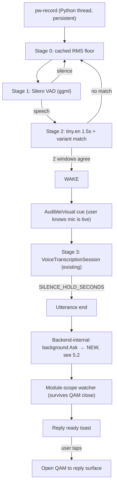

# 10 — Wake-word listening — feasibility (2026-08-03)

Research only. No code, no roadmap edits, no implementation. Answers the six
questions raised against the Planned item at
[roadmap.md § Planned — Wake-word listening](../roadmap.md#planned) — *"Opt-in always-on local wake on
fixed keyword **bonsAI** → STT → quiet Ask"* — whose stated dependencies are
"Shipped Whisper voice Ask; Reply ready toast; Voice STT session daemon".

**Verdict: CONDITIONAL GO, scope reduced.** The architecture works and needs
**zero new Python dependencies**. Two things block a ship date:

1. **The stated dependency is not verified.** "Shipped Whisper voice Ask" was
   *completely broken* from 2026-07-17 to 2026-08-03, and a live recording
   round-trip on-Deck **is still unverified** ([docs/testing.md:72](../testing.md)).
   Building always-on listening on an unproven capture path is how you get a
   second two-and-a-half-week silent outage, this time with the mic open.
2. **True always-on is the wrong v1.** Recommend a **bounded listening session**
   instead (§6). The blocker is not CPU — it is that the Deck's speakers sit
   next to its microphones (§3.3), which no amount of tuning fixes.

Recommended detection stack: **whisper.cpp's own Silero VAD + a gated `tiny.en`
keyword pass**, reusing the binaries the plugin already builds. Rejected:
openWakeWord (licence + native wheel), Porcupine (phone-home), Vosk (native wheel).

Implementation effort: **★★★★** for the bounded-session v1; **★★★★★** stands
for true always-on. Roadmap currently says ★★★★★ for the whole item.

---

## 1. The foundation problem — read this before anything else

[docs/testing.md:72](../testing.md), verbatim:

> **2026-08-03: voice was completely broken since `742db60` (2026-07-17)** —
> `VoiceTranscriptionSession.status()` had been deleted signature-only, leaving
> its body as unreachable code, so every start raised `AttributeError`. […]
> **A live recording round-trip on-Deck is still unverified** — that is VOICE-01.
> Deferring this tier is what let a total outage sit for two and a half weeks.

The scar tissue is still visible in the code — the restored `status()` method
carries its own postmortem in the docstring
([voice_transcription_service.py:1219-1231](../../py_modules/backend/services/voice_transcription_service.py)).

Every wake-word design in this document assumes `pw-record` → PCM → whisper →
text works on hardware. **Nobody has observed that end to end.** VOICE-01 is a
hard predecessor, not a nice-to-have. It is also nearly free to run: hold the
mic button, say a sentence, watch text appear.

A second reason this matters specifically for wake: the mic path fails
*silently* in the places wake would depend on. `_capture_reader_loop` only
reports an error when `chunks_read == 0`
([:1373-1380](../../py_modules/backend/services/voice_transcription_service.py));
a stream that opens and then delivers silence looks identical to a quiet room.
With a button, the user notices nothing happened. With wake, "it never triggers"
and "the mic is broken" are indistinguishable — to the user *and* to us.

---

## 2. Detection options

### 2.1 The dependency constraint that decides this

The bonsAI backend is **stdlib-only**. Every import across `main.py` and
`py_modules/` resolves to the standard library, `decky`, or the repo's own
`backend.*` — with exactly one exception, `PIL`, which is imported **lazily
inside `try/except` at three call sites** and degrades gracefully
([screenshot_media.py:230](../../py_modules/backend/services/screenshot_media.py),
[:254](../../py_modules/backend/services/screenshot_media.py),
[:492](../../py_modules/backend/services/screenshot_media.py)). There is no
`requirements.txt`. `py_modules/` contains one directory: `backend/`.

Native code is handled a different way entirely: whisper.cpp is **compiled from
source inside a digest-pinned podman container** at install time, with Deck-safe
CMake flags, because prebuilt binaries `SIGILL`'d on Deck's Zen 2
([voice_transcription_service.py:906-912](../../py_modules/backend/services/voice_transcription_service.py),
[:95-100](../../py_modules/backend/services/voice_transcription_service.py),
and the postmortem at [archive/voice-input-follow-up.md:11](../archive/voice-input-follow-up.md)).

So "just `pip install openwakeword`" is not a small ask. It means the first hard
third-party dependency, plus a native ONNX/TFLite wheel, onto an immutable OS,
in a plugin whose entire native story is "compile it in a container because the
prebuilt one crashed." **Any option requiring a native Python wheel is
disfavoured on those grounds alone.**

### 2.2 The options

| Option | Licence | New deps | Model size | Est. CPU (1 core) | FA rate | Verdict |
|---|---|---|---|---|---|---|
| **whisper.cpp VAD + gated `tiny.en`** | MIT | **none** | ~2 MB VAD + 75 MB (already installed) | ~1–3% idle | unpublished; **poor** — see §2.4 | **Recommended v1** |
| whisper.cpp `whisper-command` guided mode | MIT | none | as above | higher (constant decode) | unpublished | Fallback / spike |
| **openWakeWord** | Apache-2.0 code, **CC BY-NC-SA models** | onnxruntime **or** tflite-runtime, numpy, scipy | ~200 KB/model | low (RPi 3 runs 15–20 models real-time) | **<0.5/hr target, FRR <5%** | Best accuracy, **blocked** |
| Porcupine | Proprietary | `pvporcupine` wheel | small | low | strong | **Rejected** |
| Vosk KWS | Apache-2.0 | `vosk` wheel (bundles `libvosk.so`) | ~40 MB+ | moderate | moderate | Rejected |
| Always-on full Whisper | MIT | none | 75 MB | **~100% of a core** | n/a | **Rejected — and correctly excluded by the roadmap** |

**Porcupine — rejected on principle, not performance.** It needs an AccessKey and
devices "need to be activated by contacting the Picovoice server every now and
then", and the free tier covers **three users**. A phone-home dependency in the
offline-first feature of a self-hosted plugin contradicts the stance the repo
already took when it listed "Cloud STT for default path (privacy / offline
promise)" as an anti-pattern ([archive/voice-input-follow-up.md:90](../archive/voice-input-follow-up.md)).
Three users also does not describe a distributed plugin.

**openWakeWord — technically the best, blocked on two independent grounds.**
Its published targets (**false-reject <5%, false-accept <0.5/hour**) are the only
real accuracy numbers in this table, and its "hey mycroft"/"alexa" models
reportedly match or beat Porcupine. But:

- **Its pre-trained models are CC BY-NC-SA 4.0 — NonCommercial.** The *code* is
  Apache-2.0; the shipped models are not. This collides with the repo's model
  policy machinery, whose default tier is `open_source_only`
  (`src/data/modelPolicy.ts:29`, per [08-kids-master-lock-feasibility.md:132](../archive/08-kids-master-lock-feasibility.md)).
- **None of the six pre-trained models is "bonsAI"** (they are `alexa`,
  `hey mycroft`, `hey jarvis`, `hey rhasspy`, `current weather`, `timers`). A
  fixed "bonsAI" keyword requires **training a custom model** — a Colab pipeline,
  synthetic TTS data, and a licence review of whatever negative dataset is used.
  That is a maintainer project, not a feature branch.

Worth revisiting post-v1 *if* someone trains and licence-clears a "bonsAI" model.
The `.tflite`/`.onnx` artefact could then ship in `voice_bin/` alongside the
whisper binaries. The runtime dependency remains the sticking point.

### 2.3 Why the recommended stack costs nothing new

Two upstream features land this without adding a dependency:

1. **whisper.cpp has built-in Silero VAD.** `--vad --vad-model
   ggml-silero-v6.2.0.bin`, a ggml model on the same runtime already installed,
   fetched by `models/download-vad-model.sh`. Threshold, min-speech-duration and
   min-silence-duration are all flags. This replaces the hand-rolled RMS gate
   with a real speech/non-speech classifier at negligible cost.
2. **whisper.cpp ships a `command` example with guided mode.** `-cmd
   commands.txt` constrains decoding to a small command list, and `-ac 128`
   shrinks the audio context for "extra performance" — upstream documents both
   specifically for Raspberry Pi.

Both are already in the container. The build is generic — `cmake -S /app -B …`
with examples on by default ([:906-912](../../py_modules/backend/services/voice_transcription_service.py))
— so `whisper-command` is **already compiled and then thrown away** by
`_prune_voice_bin_non_libs`, which keeps only `{cli_path, server_path}`
([:944-949](../../py_modules/backend/services/voice_transcription_service.py)).
Adding a third target is one entry in a keep-set, not a new build pipeline.

**Cascade design (v1):**

```text
pw-record (continuous, 16 kHz mono s16)
  └─ Stage 0: cached per-chunk RMS floor        ~free      (exists, see §3.2)
      └─ Stage 1: Silero VAD via ggml            ~1-3% core (is this speech at all?)
          └─ Stage 2: tiny.en decode, 1.5 s window, -ac, 1-2 threads
              └─ keyword match against a variant list  (§2.4)
                  └─ Stage 3: hand off to existing VoiceTranscriptionSession
```

Stage 3 is the part that already exists and already works this way — the
`WhisperEngine` refcounts by **reason string** and its module header already
names the second consumer: *"Session-scoped whisper-server process facade for
mic and future wake-word STT"*
([voice_whisper_daemon.py:1-7](../../py_modules/backend/services/voice_whisper_daemon.py),
`acquire(reason=…)` at [:220-228](../../py_modules/backend/services/voice_whisper_daemon.py)).
`acquire("wake", …)` alongside the existing `acquire("mic", …)`
([voice_transcription_service.py:1308](../../py_modules/backend/services/voice_transcription_service.py))
is exactly the shape the daemon was built for. **This is the one place where the
groundwork is genuinely already done.**

### 2.4 The uncomfortable part: whisper is a bad wake-word detector

This repo already knows it. `WHISPER_FILLER_WORDS` exists because
*"Whisper tiny/base often hallucinate these on quiet/noise windows"*, and
`FILLER_MIN_RMS = 875.0` exists to *"Keep high bar for whisper filler
hallucinations on noise"*
([:41-47](../../py_modules/backend/services/voice_transcription_service.py)).
`WHISPER_NON_SPEECH_TAGS` exists for the same reason. A detector built on a model
that invents words on silence will produce false wakes. That is not a tuning
problem; it is the model.

Compounding it, **"bonsAI" is a weak wake word.** Two syllables sits below the
common three-syllable industry guideline, and the phonetics collide with real
words — *banzai*, *bonzai*, *bonsai* (the plant, said by anyone gardening in a
podcast), and near-misses like *Bon Jovi*. Note the counter-evidence is real but
narrow: two-syllable words can hit <0.01% FA **in close-range conditions** with a
purpose-trained model — which describes openWakeWord, not a whisper transcript
string-match at arm's length.

Mitigations, all of which belong in v1:

- Match a **variant list**, not the literal string: `bonsai`, `banzai`, `bonzai`,
  `bon sai`, `bonsly`. Reuse `_normalize_whisper_word`
  ([:382-383](../../py_modules/backend/services/voice_transcription_service.py)).
- Require the match **at the start** of the decoded window, not anywhere in it.
- Apply an RMS floor at least as strict as `FILLER_MIN_RMS`.
- Require **two consecutive windows** to agree before waking.
- **Recommend "hey bonsAI" to the maintainer.** Three syllables, a far rarer
  bigram, and it costs nothing but a copy change now versus a breaking change
  later. This is a §7 decision, not mine to make.

---

## 3. Deck cost model

### 3.1 Hardware envelope

Steam Deck APU (Van Gogh): **Zen 2, 4 cores / 8 threads**, 2.4–3.5 GHz, RDNA 2,
**15 W TDP**; battery **40 Wh** (LCD) / 50 Wh (OLED). Games on Deck are routinely
CPU-bound, so any sustained background CPU competes directly with frame time.

**`WHISPER_THREADS = 4` is all four physical cores**
([:38](../../py_modules/backend/services/voice_transcription_service.py)). It was
raised from 2 → 4 in the 2026-07-07 latency pass, whose recorded tradeoff is
*"More CPU/battery while the mic is active; may contend with heavy games"*
([archive/voice-input-follow-up.md:19-27](../archive/voice-input-follow-up.md)).
That tuning is correct for its use case — press-and-hold dictation with the QAM
open, where the game is backgrounded and latency is everything. **It is the wrong
constant for a background wake loop running under an active game.** The wake path
needs its own thread count (1–2), not a shared one. Reusing `WHISPER_THREADS` for
wake would be the single most damaging thing this feature could do to frame
times.

### 3.2 A repo-specific cost the generic literature misses

`_pcm_rms` is **pure Python** — `struct.unpack` of every sample, then a generator
`sum(s * s for s in samples)`
([:369-379](../../py_modules/backend/services/voice_transcription_service.py)).
It runs in the GIL, alongside the plugin's asyncio loop.

Today it runs in two places, and only while a user holds a mic session open:

- `_append_pcm`, per 4096-byte chunk ([:1236-1247](../../py_modules/backend/services/voice_transcription_service.py))
  → ~16 000 samples/s. Cheap.
- `_transcribe_loop`, **re-RMS'ing the entire 3-second window every 0.4 s**
  ([:1398-1404](../../py_modules/backend/services/voice_transcription_service.py))
  → 48 000 samples × 2.5/s = **120 000 samples/s**. Est. 2–5% of a core,
  sustained, for a value that could be derived incrementally.

For a seconds-long dictation burst nobody notices. For an always-on loop it is
permanent overhead in the interpreter, under a game. **Fix before wake ships:**
cache the per-chunk RMS computed in `_append_pcm` and derive the window RMS from
those, instead of unpacking the whole window again. That is a contained,
behaviour-preserving change worth doing on its own merits.

### 3.3 The risk that dominates everything: the Deck's speakers feed its mic

The Deck's stereo speakers and its dual microphone array are inches apart on the
same chassis, and the capture path targets `Internal_Mic` by name
([`_resolve_pipewire_mic_target`:504-532](../../py_modules/backend/services/voice_transcription_service.py)).
There is no acoustic echo cancellation anywhere in this pipeline, and adding one
is not in scope for any version of this feature.

Consequence: **with speakers on, game dialogue and music are, to the VAD, speech.**
A cascade gated on "is someone talking?" degrades toward a ~100% duty cycle during
any dialogue-heavy or voiced-soundtrack game. The idle-vs-active table below is
therefore not a description of two equally likely states — for a speaker user in a
story game, **"active" is the resting state.**

This also feeds §2.4: every line of in-game dialogue is another sample drawn
against the false-accept rate. A game character shouting "banzai!" is not a
hypothetical.

**This is the finding that should decide v1 scope**, and it argues for a bounded
session (§6) plus explicit headphone guidance, not for more tuning.

### 3.4 Cost table

**All figures are engineering estimates. Nothing here has been measured on
hardware** — see §9. Percentages are of *one* Zen 2 core; the APU has four.
Battery figures assume a game already drawing ~20 W total from a 40 Wh pack.

| State | What runs | Est. CPU (1 core) | Est. extra power | Est. battery cost / 2 h session |
|---|---|---|---|---|
| **Disabled** (default) | nothing | 0 | 0 | 0 |
| **Idle — quiet room** | `pw-record` + cached RMS + VAD | **~2–4%** | ~0.1–0.2 W | ~0.5–1% (≈1–2 min) |
| **Active — real speech present** | above + `tiny.en` 1.5 s window, 2 threads, ~every 2 s | **~20–50%** | ~0.3–0.6 W | ~1.5–3% (≈3–6 min) |
| **Worst case — speakers on, dialogue-heavy game** | decode near-continuously | **~80–100%** | ~1.0–1.5 W | ~5–8% (≈10–15 min) **+ frame-time contention** |
| **Post-wake STT session** | existing path, `WHISPER_THREADS=4` | ~300–400% (all cores) | high, bounded | seconds per interaction |
| *(rejected)* always-on full Whisper | continuous decode, 4 threads | ~400% | very high | unusable |

The gap between row 2 and row 4 is **20–50×**, and the user does not control which
row they are in — the game's sound design does. That is the whole argument.

**Acceptable duty cycle:** budget **≤5% of one core sustained** for the idle path
and **≤25% of one core averaged over a minute** for the gated path. Above that,
ship it as a bounded session rather than always-on. Thermally the Deck will not
throttle on this in isolation, but it does not run in isolation: an extra
0.5–1.5 W inside a 15 W envelope is taken from the GPU by the shared power budget,
which shows up as frame drops, not as a temperature warning.

---

## 4. Lifecycle / platform

### 4.1 Can a Decky plugin keep listening with the QAM closed? Yes — in Python

This is the question with the cleanest answer, and the repo has already solved
the frontend half of it.

- **The Python backend is a persistent process.** `main.py` is imported by
  `plugin_loader` and lives for the plugin's lifetime (`_main` at
  [main.py:319](../../main.py)). The existing voice threads are plain
  `threading.Thread(daemon=True)` started from `start()`
  ([:1340-1343](../../py_modules/backend/services/voice_transcription_service.py))
  and are entirely independent of whether any UI is mounted. **A wake loop must
  live here.**
- **The frontend `Content` unmounts when the QAM closes.** That is why
  `bonsaiAskCompletionWatch.ts` exists at module scope, documented in as many
  words: *"Module-level Ask status poll — **survives Content unmount when QAM
  closes**"* ([:66-69](../../src/utils/bonsaiAskCompletionWatch.ts)). Compare
  `useQuickAccessVisible()` at [index.tsx:142](../../src/index.tsx), and the
  plugin-scope `definePlugin` return at [index.tsx:1247-1290](../../src/index.tsx)
  whose `onDismount() {}` is empty.

So the split is: **detection and STT in Python; toast in module-scope JS.** No
persistent React tree required, and no new mechanism invented — §5 reuses the
watcher that already exists.

### 4.2 Suspend / resume — the real lifecycle work

`SteamClient.System` exposes both hooks, confirmed in the installed dependency:

```
RegisterForOnResumeFromSuspend(callback: () => void): Unregisterable;
RegisterForOnSuspendRequest(callback: () => void): Unregisterable;
```

— `@decky/ui` → `dist/globals/steam-client/system/index.d.ts:43-44`.

They are **TS-only**. The Python backend cannot see suspend, exactly as the Kids
Lock memo found for parental state ([08:99-101](../archive/08-kids-master-lock-feasibility.md)),
so the state must be pushed over RPC. Register at **plugin scope**, not inside
`Content`, or the hook dies with the QAM.

Two things almost certainly break across suspend and must be handled:

1. **`pw-record` will not survive.** The child process holds a PipeWire node
   across a suspend/resume cycle in which PipeWire itself may restart. Expect a
   dead stream, or worse, a live stream delivering silence — which
   `_capture_reader_loop` cannot detect once `chunks_read > 0` (§1). Tear the
   session down on `OnSuspendRequest` and re-acquire on `OnResumeFromSuspend`.
2. **`XDG_RUNTIME_DIR` must be re-resolved, not cached.**
   `_discover_session_runtime_dir()` finds it by `pgrep`-ing gamescope/steam/
   plasmashell and reading `/proc/<pid>/environ`
   ([:456-489](../../py_modules/backend/services/voice_transcription_service.py)).
   If the session restarts, a cached value is stale. Re-run resolution on every
   wake-session start.

**Gaming Mode vs Desktop/BPM:** the capture path already degrades across backends
(`pw-record` → `parecord` → `arecord`,
[:535-566](../../py_modules/backend/services/voice_transcription_service.py)), and
troubleshooting already records that *"Gaming Mode usually has PipeWire; desktop
BPM may need `wf-recorder`'s audio stack intact"*
([troubleshooting.md:124](../troubleshooting.md)). Wake inherits both the
fallbacks and the caveat. Treat Desktop Mode as best-effort.

**A separate PipeWire stream is required.** Wake cannot share the mic session's
capture process, because wake owns the stream *before* any session exists. When a
wake fires, the cleanest handoff is for the wake loop to stop its own capture and
let `VoiceTranscriptionSession.start()` open its own — accepting a small gap — or
to hand the buffered PCM across. **Which of those is correct is a spike item
(§8.5), not a decision I can make from source.**

---

## 5. Product flow

### 5.1 Wire diagram



### 5.2 The one genuine gap: the backend cannot start an Ask by itself

`start_background_game_ai` is an **RPC** — a public `async def` on `class Plugin`
([main.py:2230](../../main.py)) — and every caller is the frontend. The Ask
payload is parsed from a frontend-shaped envelope by `_parse_ask_payload`
([:2234-2244](../../main.py)), and the flow requires a `PcIp`, rejecting the
request outright without one unless a local command is detected
([:2254-2259](../../main.py)).

When wake fires with the QAM closed, **there is no frontend to call it.** So v1
needs an internal seam: factor the body of `start_background_game_ai` so the
backend can submit an Ask with a synthesised payload (question from STT, `PcIp`
from saved settings, app context from the running game). The RPC keeps its
name and shape — renaming it is a two-language breaking change with no compiler
to catch it (`CLAUDE.md` § Conventions).

The rest of the chain then works unmodified: `_background_state` is backend-owned
([:2439-2462](../../main.py)), and the module-scope watcher already polls
`get_background_game_ai_status` to a terminal state and fires the toast
([bonsaiAskCompletionWatch.ts:30-64](../../src/utils/bonsaiAskCompletionWatch.ts)),
deduped per `request_id` by `toastedRequestIds`
([bonsaiReplyReadyToast.ts:13-38](../../src/utils/bonsaiReplyReadyToast.ts)).

One change there: `startAskCompletionWatch()` is currently called only after a
*frontend-initiated* Ask (`useBonsaiAskOrchestration.ts:668`, `:911`). For wake,
the watcher must run whenever wake mode is enabled, so a wake-initiated Ask is
observed. Small and clean — the watcher is already idempotent via `watchSeq`.

### 5.3 The raw `call()` question

`start_voice_transcription` and `stop_voice_transcription` deliberately use
unbounded raw `call()`, with the reason in a comment: stop runs whisper
finalization and start may load the model, *"either of which can exceed any UI
timeout on Deck hardware"*
([useVoiceTranscription.ts:9-13](../../src/hooks/useVoiceTranscription.ts),
calls at [:120](../../src/hooks/useVoiceTranscription.ts) and
[:138](../../src/hooks/useVoiceTranscription.ts)); this is one of the four
sanctioned exceptions in `CLAUDE.md` § The TS ↔ Python boundary.

**Wake sidesteps the issue rather than inheriting it.** The unbounded calls are
justified because a *user* is waiting on a button press. The wake path's
detection→STT→Ask chain runs entirely in Python, so no RPC sits on the critical
path at all. The new control RPCs are all fast and should use
`callDeckyWithTimeout()` normally:

| RPC | Purpose | Wrapper |
|---|---|---|
| `start_wake_listening` | Arm the wake loop (returns immediately; capture starts on a thread) | `callDeckyWithTimeout` |
| `stop_wake_listening` | Disarm + tear down capture | `callDeckyWithTimeout` |
| `get_wake_status` | Armed / listening / last-wake-at / error, for the UI + indicator | `callDeckyWithTimeout` |
| `set_system_suspend_state` | Push suspend/resume from TS (§4.2) | `callDeckyWithTimeout` |
| `get_background_game_ai_status` | **reused unchanged** | already wrapped |

Do **not** make `start_wake_listening` block on engine warm-up — return an
accepted/pending ack and expose readiness through `get_wake_status`, mirroring
the `{"accepted": …}` shape `start_voice_transcription` already returns
([main.py:2713-2736](../../main.py)).

---

## 6. Safety / consent

### 6.1 A new capability key, gated on the existing one

Add `wake_word_listening` to `CAPABILITY_KEYS`
([capabilities.py:12-18](../../py_modules/backend/services/capabilities.py)),
and require **both** it and `microphone_access` — wake is strictly more invasive
than push-to-talk, so it must not be reachable by a user who only ever agreed to
a mic button. A `_require_wake_access` helper alongside
`_require_microphone_access` ([main.py:2602-2610](../../main.py)) is the obvious
shape.

It must also be added to `legacy_grandfather_capabilities()` as an explicit
`False`, next to the two existing opt-in exceptions — the function returns
all-`True` by default, so a new key that is not named there would silently
**auto-enable always-on microphone listening on every legacy install**
([:34-41](../../py_modules/backend/services/capabilities.py)). That is the single
highest-consequence line of code in this feature.

Cost note: a new capability key is not free. It is the six-file settings path
(`CLAUDE.md` § Where settings live) plus `PermissionsTab.tsx`, plus a focus-graph
entry for the new toggle (`.cursor/rules/decky-focus-graph.mdc`), plus both test
suites.

### 6.2 Kids lock interaction — free, if the key is added

If Kids Lock ships as recommended option **A** — all `CAPABILITY_KEYS` forced off
via a guard inside `capability_enabled()`
([08:167-190](../archive/08-kids-master-lock-feasibility.md)) — then wake is covered
automatically the moment its key joins the tuple. **No additional Kids Lock work,
provided the key lives in `CAPABILITY_KEYS` rather than as a bare settings
boolean.** That is a good reason to add it properly rather than shortcutting.

### 6.3 False wakes during multiplayer voice chat

The scenario that matters: a user in Discord or Steam party chat says something
near-enough to "bonsai", the mic session opens, and several seconds of a private
conversation are transcribed and sent to Ollama — which may be a LAN box, not
this device. Add game audio through the speakers (§3.3) and the trigger surface
is large.

Non-negotiables for v1:

- **A visible indicator whenever the wake loop is armed**, not only while
  recording. The user must never be unsure whether the mic is live.
- **An unmissable cue at the moment of wake** — the transition from "listening for
  a word" to "recording you" is the one the user must never miss.
- **A hard cap on post-wake capture** (~10 s), independent of
  `SILENCE_HOLD_SECONDS = 2.0` ([:43](../../py_modules/backend/services/voice_transcription_service.py)).
- **Show the transcript before or as it is sent**, so a false wake is visible
  after the fact even if the QAM was closed.
- **Never chain a second wake** from audio captured during a wake session.

Audio never leaves the Deck — whisper is local and cloud STT is out of scope. But
the **transcript** goes wherever Ollama is, and for LAN users that is another
machine. Say so plainly; do not let "local voice" imply "nothing leaves the
device".

### 6.4 ConfirmModal copy

Draft — needs a maintainer copy pass, not shipped as-is:

> **Turn on wake-word listening?**
>
> bonsAI will keep your microphone open and listen for the word **"bonsAI"**.
> Audio is processed **on your Deck** and is not uploaded anywhere. When you say
> the wake word, bonsAI records your question, then sends the **text** to your
> Ollama server — which may be another computer on your network.
>
> This uses extra battery and CPU while it runs, which can affect performance in
> demanding games. **Headphones are strongly recommended** — game audio from the
> Deck's speakers reaches its microphone and causes false triggers.
>
> bonsAI may wake up when you did not mean it to, including during voice chat.
> You can turn this off at any time in Permissions.

The headphone sentence is the one most likely to be cut for length. It should not
be — §3.3 is the difference between the idle row and the worst-case row of the
cost table.

---

## 7. Go / no-go and v1 scope

### 7.1 Recommendation: bounded listening session, not always-on

| Option | Description | Verdict |
|---|---|---|
| **A — Bounded listening session** | User arms listening (QAM toggle or Steam Input chord); wake stays live for a capped window (~10–15 min) or until disarmed; auto-disarms on suspend and on game exit | **Recommended v1** |
| B — True always-on | Armed permanently once the capability is granted | Defer to beta. §3.3 makes the cost unbounded and user-invisible |
| C — Hold-to-talk only | Ship nothing; the mic button already exists | The honest fallback if VOICE-01 fails or the §8 spike shows unacceptable FA |
| D — Steam Input chord only | Already documented ([roadmap.md § Planned — Native QAM shortcut tile](../roadmap.md#planned), troubleshooting §5) | Not a substitute — it is not hands-free, which is the entire point |

**A gives most of the value for a fraction of the risk.** The user is hands-free
during the window that matters (mid-game, controller in hand), battery exposure is
capped and predictable, consent is explicit and recent rather than granted once
months ago, and the worst case of §3.3 is bounded by a timer instead of running
until the battery dies. It also produces the field data needed to decide whether B
is viable at all — false-wake counts per armed hour, per game.

Note this is a **deliberate narrowing of the roadmap's stated goal**, which says
"always-on". The roadmap line is not wrong; it is written from before the
speaker-bleed and duty-cycle analysis existed. Whether to accept the narrowing is
a maintainer call — §7.3.

### 7.2 Phased plan

**Phase 0 — Unblock (no wake code).** Verify VOICE-01 on hardware. Fix the
window-RMS recomputation (§3.2). Both stand on their own merits and are
prerequisites regardless of what happens next.

**Phase 1 — Spike (§8).** Answer the four unknowns on-device. **Go/no-go gate.**

**Phase 2 — Detection service.** `wake_word_service.py` — capture thread, VAD,
gated keyword pass, its own thread-count constant, `acquire("wake", …)` against
the existing engine. Backend-only, no UI, behind a Developer-tab flag. Log
detections and false accepts; ship nothing to users.

**Phase 3 — Capability + consent.** The `wake_word_listening` key, the legacy
`False`, `_require_wake_access`, PermissionsTab row, focus-graph entry,
ConfirmModal, armed indicator.

**Phase 4 — The Ask seam.** Backend-internal Ask submission (§5.2) + the
always-on watcher change. This is where hands-free actually starts working.

**Phase 5 — Session lifecycle.** Suspend/resume RPC bridge, the arming timer,
auto-disarm rules, docs, `docs/testing.md` + `docs/roadmap.md` in the same change
set (`CLAUDE.md` § Conventions).

One refactor per commit, tests green between commits (`CLAUDE.md` § Refactor
rules).

### 7.3 Decisions needed from the maintainer

These belong in `docs/roadmap.md` § **Decisions needed**, not in chat
(`CLAUDE.md` § Refactor rules). Recorded here; **not** added to the roadmap by
this document, per the research-only scope.

1. **"bonsAI" or "hey bonsAI"?** Two syllables versus three materially changes the
   false-accept rate (§2.4). Cheap now, breaking later.
2. **Bounded session (A) or hold the line on always-on (B)?** §7.1.
3. **Is a narrowed v1 acceptable against the roadmap's "always-on" wording?**
4. **Is a headphone recommendation acceptable product framing**, or does wake need
   to work on speakers to be worth shipping? If the latter, the answer is probably
   openWakeWord and a trained model, not this stack.

### 7.4 Effort

**★★★★** for option A. Priced: `wake_word_service.py` with capture/VAD/keyword
cascade and its own tuning constants; VAD model download added to the existing
install flow; one keep-set entry if `whisper-command` is used; new capability key
across the six-file settings path plus PermissionsTab and focus graph; four new
RPCs; the `start_background_game_ai` internal seam; the watcher change; suspend/
resume bridge; ConfirmModal and indicator; README/troubleshooting copy; unit tests
both languages; `docs/testing.md` and `docs/roadmap.md`.

**★★★★★** stands for option B (true always-on) — the extra star is thermal/battery
validation across a game library, not more code.

Unlike the Kids Lock memo, **this research does not lower the estimate.** It
converts "is this possible?" into "this is possible and here is the shape", but
the work itself is broad, and Phase 0 adds prerequisite work that did not
previously exist.

---

## 8. Spike steps (on-Deck, before any implementation)

Record results back into this file.

1. **VOICE-01 first.** Mic button, one spoken sentence, text in the Ask field. If
   this fails, everything below is moot. See §1.
2. **Does whisper hear "bonsAI"?** With the engine installed, run `whisper-cli`
   over ~20 recordings of "bonsAI" and "hey bonsAI" from arm's length in Gaming
   Mode. **Record the exact strings it returns** — that is the variant list from
   §2.4, and it cannot be guessed from a desk.
3. **Speaker bleed (§3.3) — the decisive one.** Launch a dialogue-heavy game at
   normal speaker volume. Capture 10 minutes of mic PCM. Measure: what fraction
   of windows exceed `VOICE_RMS_THRESHOLD`; what fraction the VAD calls speech;
   how many decodes that implies per minute; **how many contain a §2.4 variant.**
   That last number is the false-wake rate on speakers, and it decides §7.3 Q4.
   Repeat with headphones for the contrast.
4. **Measured cost.** With the cascade running, sample CPU and package power in
   the idle and speech-present states and fill in §3.4 with real numbers. Replace
   the estimates; do not leave both.
5. **Capture handoff.** Can a second `pw-record` open `Internal_Mic` while the
   first holds it, or must the wake stream be released before
   `VoiceTranscriptionSession.start()`? Measure the gap either way (§4.2).
6. **Suspend/resume.** Arm the loop, suspend, resume. Does `pw-record` survive?
   If it "survives", does it still deliver non-silent audio, or only
   `chunks_read > 0` (§1)? Does `XDG_RUNTIME_DIR` still resolve (§4.2)?
7. **Build check.** Confirm `whisper-command` is present in the container build
   before `_prune_voice_bin_non_libs` runs, and that
   `download-vad-model.sh silero-v6.2.0` fetches a model the pinned image's
   binaries accept. The image is digest-pinned
   ([:95-100](../../py_modules/backend/services/voice_transcription_service.py))
   and may predate the VAD support — **if so, bumping the digest pulls in the
   full re-validation ritual** at [archive/voice-input-follow-up.md:39-45](../archive/voice-input-follow-up.md).
8. **Contention.** With the cascade armed, play a CPU-bound game and compare frame
   times against a disarmed baseline. This is what the duty-cycle budget in §3.4
   is ultimately protecting.

---

## Cannot promise — for README / troubleshooting

Lift into user-facing docs when the feature ships.

- **It will miss you, and it will trigger when you did not speak to it.** Wake-word
  detection is probabilistic. bonsAI ships one fixed wake word and no per-user
  tuning.
- **Game audio from the Deck's speakers reaches the Deck's microphone.** Expect
  more false triggers and higher battery use on speakers than on headphones.
  bonsAI does not cancel its own audio.
- **It costs battery and can cost frames.** Listening runs on the same CPU as your
  game.
- **Audio stays on your Deck; the transcript does not.** Speech is transcribed
  locally. The resulting text goes to your Ollama server, which may be another
  machine on your network.
- **It can wake during voice chat.** If you play with an open mic, expect
  occasional accidental triggers and check the transcript.
- **Desktop Mode is best-effort.** The capture stack is validated for Gaming Mode.
- **Not a voice assistant.** No device control, no wake-word-triggered actions —
  it dictates a question into the same Ask you already have.
- **Only English.** The STT models are `tiny.en` / `base.en`
  ([:74-75](../../py_modules/backend/services/voice_transcription_service.py)).

---

## What I could not verify

Marked `UNKNOWN` rather than inferred (`CLAUDE.md` § Refactor rules).

1. **Every CPU, power and battery number in §3.4 is an estimate.** No profiling
   was run on a Deck. Spike step 4 replaces them. Do not quote §3.4 to a user.
2. **Whether whisper `tiny.en` reliably transcribes "bonsAI" at all** — and what
   it emits instead. Spike step 2. If it renders as something unstable, the wake
   word itself has to change and §7.3 Q1 answers itself.
3. **Speaker-bleed magnitude.** §3.3 is a physical-layout argument plus the
   absence of AEC in the pipeline. Directionally I am confident; the *rate* is
   unmeasured, and it drives the v1 recommendation. Spike step 3.
4. **Whether the pinned container image contains Silero VAD support.** The image
   is pinned by digest and the VAD landed upstream in 2025; the pinned build may
   or may not include it. Spike step 7. If a digest bump is needed, cost rises.
5. **PipeWire multi-reader behaviour on `Internal_Mic`.** Whether two capture
   clients can hold the source simultaneously on SteamOS is not established from
   source. Spike step 5.
6. **Whether `pw-record` survives suspend.** Reasoned in §4.2; unobserved.
7. **openWakeWord install size** is not documented upstream, and the transitive
   weight of `onnxruntime`/`tflite-runtime` on SteamOS was not measured — it is
   moot given §2.2, but it is not a number I have.
