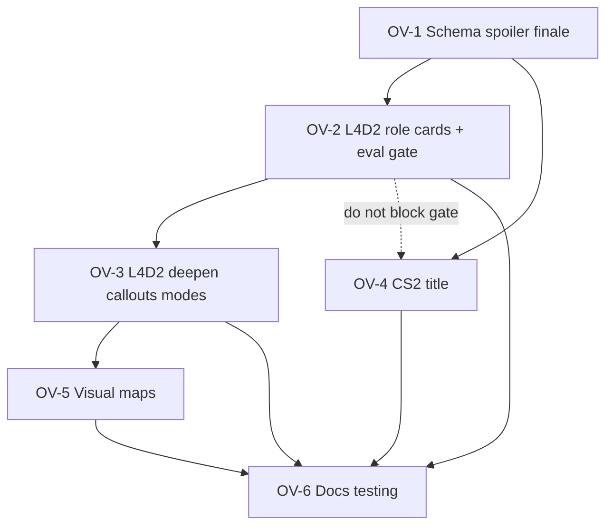

# 17 — KB online / versus strategy content

**Status:** `NOT STARTED` — discovery locked 2026-08-09 (maintainer chat).
**Overall effort:** ★★★★ (matches [roadmap.md](../roadmap.md) Backlog § Knowledge base).
**Roadmap:** [KB online / versus strategy content](../roadmap.md#knowledge-base) · related [KB visual maps](../roadmap.md#knowledge-base) (later wave in this plan).
**Adjacent:** [knowledge-base.md](../knowledge-base.md) · [15-corpus-licensing-attribution-plan.md](../archive/15-corpus-licensing-attribution-plan.md) · [spoiler-constitution.md](spoiler-constitution.md) · [rag-eval-query-style.md](../audit/rag-eval-query-style.md) · eval fixture `tests/fixtures/kb_eval_v2.json`.

## How to use this file

Every task has an id (`OV-n.n`), an acceptance criterion, and a verify hint. Work
**top to bottom**. Tick the box and update **Progress** when a stage lands; commit
that update with the work.

**Maintainer gates are real.** Do not rebuild the seed corpus or fill eval labels
until the content and labels for that stage are signed off (same rule as PR2 /
bake-off).

**Line numbers drift.** Re-grep before editing.

## Progress

| Task | Title | ★ | State |
|---|---|---|---|
| OV-0 | Discovery lock (this doc) | ★ | ✅ Done 2026-08-09 |
| OV-1.1…1.4 | Schema, spoiler table, finale prompt rule | ★★ | ☐ Not started |
| OV-2.1…2.4 | L4D2 versus **role cards** + eval sign-off (first ship gate) | ★★★ | ☐ Not started |
| OV-3.1…3.3 | L4D2 deepen — callouts, survival, realism, No Mercy versus | ★★★ | ☐ Not started |
| OV-4.1…4.4 | CS2 (`730`) — licence gate, aliases, starter cards | ★★★★ | ☐ Not started |
| OV-5.1…5.3 | Visual maps wave (after callout cards exist) | ★★★ | ☐ Not started |
| OV-6.1…6.3 | Docs / testing / roadmap writeback | ★★ | ☐ Not started |

States: `☐ Not started` · `▶ In progress` · `✅ Done` · `⛔ Blocked` · `✖ Dropped`

---

## Definition of done

**Ships (first gate):** L4D2 versus **role** cards are in the seed corpus with the
new `section_type` values, spoiler risk treats them as **low**, the finale
redirect rule is in the Strategy / KB prompt path, and the **existing** L4D2
versus rows in `kb_eval_v2.json` have maintainer-signed `expect_section` labels
(blank only where still intentionally uncovered).

**Ships later in this feature (same plan, later stages):** brief map-callout
cards; survival / realism / No Mercy versus deepening; CS2 as a new corpus
title; optional visual map attach once callouts exist.

**Does not ship — reject scope creep that adds these:**

- Tier lists (parked).
- Live wiki / web crawl (this feature is **WikiTeam / archive.org dumps only**).
- Opponent-intent splice / dual-side composition in one card (side handling = **A**).
- Phase 6 public HF/GitHub publish (separate plan; legal scrub stays in **15**).
- Phase 4 chip-visibility tracks (orthogonal; do not block text cards).

---

## Locked decisions (2026-08-09)

| # | Topic | Lock |
|---|---|---|
| 1 | Pilot title | **Left 4 Dead 2** (`550`) first |
| 2 | v1 content shape | Versus **role cards** first |
| 3 | New title | **Counter-Strike 2** (`730`) in scope — **not** in the current seed mix |
| 4 | Side handling | **A — separate cards per side** (survivor vs infected / T vs CT). No opponent-intent sibling splice. Eval keeps one `expect_section` per query |
| 5 | Callouts | As **brief as possible**; map art is a later wave, not v1 text |
| 6 | Tier lists | **Parked** |
| 7 | `section_type` set | `versus`, `coop`, `callout`, `survival`, `realism` — campaign/mode (e.g. No Mercy versus) is usually `name` + `section_type=versus`, not a type per campaign |
| 8 | Spoiler risk | Treat new types as **low** (`_LOW_SPOILER_SECTION_TYPES`); titles stay `low_narrative` where already profiled |
| 9 | Finale | Do **not** volunteer finale content until the player is there; strongly urge focusing on the problem at hand and talking about the finale later |
| 10 | Sources | **WikiTeam / archive.org dumps only** for this feature |
| 11 | Attribution | **Hybrid:** Deck chip stays short (wiki · licence · as-of date); **WikiTeam / archive.org snapshot** recorded in generated `ATTRIBUTIONS.md` (answers open Q2 in plan **15**) |
| 12 | Ingest appetite | Take any dump that clears the licence gate and helps the KB |
| 13 | Sequencing | Schema → L4D2 roles (eval gate) → L4D2 deepen → CS2 → maps. **Not** blocked on Phase 6 publish |
| 14 | Ship gate | Signed-off eval labels on **existing** L4D2 versus queries in `kb_eval_v2.json` |
| 15 | Visual maps | **In scope** as a later wave after callout cards; keeps the separate roadmap row but this plan owns the dependency order |

### Side handling A — product note

Paired survivor/infected (or T/CT) **wordings** still belong in the eval set
([rag-eval-query-style.md](../audit/rag-eval-query-style.md) § 7). Each wording
targets its **own** card. High accent / character voice will **not** systematically
weave “what the other side wants” from the corpus; that beat stays a future
prompt/character pass if desired.

### Attribution hybrid — product note

```text
Chip (Deck):     left4dead.fandom.com · CC BY-SA 3.0 · as of YYYY-MM-DD
ATTRIBUTIONS.md: same line + Source snapshot: archive.org/details/… (WikiTeam)
```

Chip path already shipped 2026-08-09; distribution file generation is **ATTR-2.***
in plan **15**. This feature must **populate** dump provenance fields so ATTR-2
can emit the snapshot line — do not hardcode a second attributions writer here.

---

## Stage 0 — Discovery lock

- [x] **OV-0.1** — Maintainer answers locked in this file (2026-08-09 chat).
- [x] **OV-0.2** — CS2 confirmed absent from interim strategy mix
      ([knowledge-base.md](../knowledge-base.md) Phase 3 table); AppID `730` used
      elsewhere in tests only.
- [x] **OV-0.3** — Eval already contains L4D2 versus / power-user gaps
      (`V2-S-L4D2-12`…`29` et al. in `kb_eval_v2.json`) that this feature fills.

---

## Stage 1 — Schema, spoiler table, finale rule ★★

Unlocks all content stages. No corpus rebuild required to land code alone, but
cards must not ship with unknown types before this lands.

- [ ] **OV-1.1 — Document allowed `section_type` values**
  - **Where:** [knowledge-base.md](../knowledge-base.md) (corpus layout / authoring)
    and seed/build helpers under `scripts/` as needed.
  - **Do:** Record `versus`, `coop`, `callout`, `survival`, `realism` alongside
    existing types (`boss`, `area`, `tip`, …). Campaign/mode titles use `name`
    (e.g. `No Mercy versus`) with `section_type=versus` unless a later bake-off
    proves a dedicated type is required.
  - **Accept:** A maintainer can author a card without inventing a type string.
  - **Verify:** Doc greppable; seed insert path accepts the new strings.

- [ ] **OV-1.2 — Spoiler risk table**
  - **Where:** `py_modules/backend/services/spoiler_risk_service.py`
    (`_LOW_SPOILER_SECTION_TYPES` / `_HIGH_SPOILER_SECTION_TYPES`).
  - **Do:** Add the Stage 1 types to **low**. Do not put them on high.
  - **Accept:** Unit coverage in `tests/test_spoiler_risk_service.py` for at least
    one new type → low band contribution.
  - **Verify:** `npm run test:py` (spoiler risk tests).

- [ ] **OV-1.3 — Finale redirect (prompt / constitution)**
  - **Where:** `ollama_prompts.py` (KB / Strategy policy) +
    [spoiler-constitution.md](spoiler-constitution.md) product rule.
  - **Do:** For L4D2 (and later other campaign+versus titles as needed): do not
    volunteer finale tactics/layout; if asked early, strongly urge focusing on
    the current problem and deferring the finale.
  - **Accept:** Prompt text and constitution rule agree; a unit or fixture pin
    exists if the repo already pins similar policy strings.
  - **Verify:** targeted Python tests + doc update.

- [ ] **OV-1.4 — Chip curtail / session RAG (if typed)**
  - **Where:** `knowledge_base_service.py` `_curtail_section_to_chip` and any
    section-type priority lists.
  - **Do:** Ensure new types produce sensible short chip labels (not empty /
    falling through badly).
  - **Accept:** Chip text for a `versus` / `callout` section is non-empty and short.
  - **Verify:** existing chip unit tests extended, or new cases.

---

## Stage 2 — L4D2 versus role cards (first ship gate) ★★★

**Gate:** maintainer sign-off on cards **and** on filled `expect_section` labels
for the existing versus-oriented L4D2 eval rows before treating this stage done.

- [ ] **OV-2.1 — Licence / dump provenance gate (L4D2)**
  - **Do:** Confirm dump id, licence version, and snapshot metadata for
    `left4dead.fandom.com` (ATTR-1 already records CC BY-SA 3.0). Record
    WikiTeam/archive.org item id for hybrid attributions.
  - **Accept:** Provenance fields ready for ATTR-2 generation; no card text from
    a dump that fails the gate.
  - **Verify:** notes in seed metadata / build input; cross-check plan **15**.

- [ ] **OV-2.2 — Author versus role cards**
  - **Do:** Distill **brief** role cards from the dump (not verbatim dump prose —
    ATTR-1.4). Separate survivor-counter vs infected-play cards where the eval
    pairs demand it (shape **A**). Prefer names that match intended
    `expect_section` strings already drafted in `kb_eval_v2.json`
    (e.g. `Playing as the Smoker`, `Playing as the Tank`).
  - **Accept:** Cards cover the role intents that already have non-blank
    `expect_section` targets; remaining blanks stay intentional gaps only.
  - **Verify:** `python scripts/build_rag_db.py --seed …` succeeds; spot-check
    section rows for `550`.

- [ ] **OV-2.3 — Eval label sign-off**
  - **Do:** Fill / correct `expect_section` on existing L4D2 versus queries;
    maintainer approves. Do **not** invent new query wording in this stage unless
    a hole blocks labelling.
  - **Accept:** Written maintainer approval (same bar as PR2 stage 6d).
  - **Verify:** fixture committed; bake-off / retrieval check can run later.

- [ ] **OV-2.4 — Retrieval sanity**
  - **Do:** Run the existing KB eval path against the new seed for the signed
    L4D2 versus subset; fix obvious wrong-side collisions (survivor query →
    infected card).
  - **Accept:** Signed rows meet the project’s current top-k expectation for
    seed eval (document the command/result in
    `docs/archive/research/` if numbers move).
  - **Verify:** project eval script / unittest used for PR2, scoped to L4D2
    versus ids.

**First ship gate met when OV-2.3 is signed and OV-2.4 shows no systematic
wrong-side retrieval on those rows.**

---

## Stage 3 — L4D2 deepen ★★★

Depends on Stage 2 gate. Still dump-only.

- [ ] **OV-3.1 — Callout cards**
  - **Do:** Ultra-short position/callout cards (`section_type=callout`) for
    intents like death-charge / coordination spots already in the eval notes.
    One fact per card where possible.
  - **Accept:** At least the maintainer-highlighted callout queries can take an
    `expect_section` or stay blank with an explicit “needs map / clarify” note.
  - **Verify:** seed rebuild + label pass.

- [ ] **OV-3.2 — Mode cards — survival, realism, No Mercy versus**
  - **Do:** Cards with `section_type` in `{survival, realism, versus}` and clear
    `name`s (No Mercy versus as a versus/mode card, not a new type).
  - **Accept:** Eval rows that target these modes can be labelled or remain
    deliberate gaps.
  - **Verify:** seed + fixture update.

- [ ] **OV-3.3 — Finale discipline check**
  - **Do:** Ensure deepen cards do not smuggle finale layout into early-campaign
    callouts; rely on OV-1.3 when the user asks early.
  - **Accept:** Spot review of new cards + one prompt fixture if available.
  - **Verify:** maintainer skim.

---

## Stage 4 — Counter-Strike 2 (`730`) ★★★★

Depends on Stage 1. May proceed in parallel with Stage 3 after Stage 2 ships,
but **must not** block the L4D2 eval gate.

- [ ] **OV-4.1 — Dump + licence gate**
  - **Do:** Locate a WikiTeam/archive.org dump suitable for CS2 (or acceptable
    CS:GO→CS2 carryover pages if the dump’s licence and factual overlap clear
    the same ATTR-1 bar). Record licence version + snapshot id.
  - **Accept:** Gate pass written down; if no usable dump, mark OV-4 **⛔ Blocked**
    with the finding (do not scrape live).
  - **Verify:** provenance note in planning or seed metadata.

- [ ] **OV-4.2 — Game row + aliases**
  - **Do:** Add CS2 to the seed game mix: AppID `730`, canonical title, aliases
    players actually type (`cs2`, `counter-strike 2`, etc.).
  - **Accept:** Title resolution ladder hits `730` from alias and AppID.
  - **Verify:** resolution unit tests / seed query.

- [ ] **OV-4.3 — Starter role / mode cards**
  - **Do:** Small starter set using Stage 1 types (role-oriented `versus` /
    `callout` as dump quality allows). Shape **A** if sided content appears.
  - **Accept:** A handful of cards retrieve for a short CS2 eval slice (new
    queries require maintainer query sign-off before rebuild — same discovery
    rule as L4D2).
  - **Verify:** seed rebuild; new eval rows only after sign-off.

- [ ] **OV-4.4 — Spoiler profile**
  - **Do:** Add CS2 to `low_narrative` title profile unless discovery shows
    progression secrets that need protect (unlikely for pure competitive).
  - **Accept:** `spoiler_title_profiles` / TS mirror updated together
    (`tests/contracts/spoiler-title-profiles.json`).
  - **Verify:** contract test green.

---

## Stage 5 — Visual maps wave ★★★

Depends on **OV-3.1** callout cards existing. Implements the roadmap **KB visual
maps** row as the maps half of this feature (prelim → executable here).

- [ ] **OV-5.1 — Discovery spike (short)**
  - **Do:** Decide asset storage (inside corpus package vs sidecar), how a
    callout card references a map id, and reply UX (inline image vs chip →
    expand). Plain-language options + recommendation; **maintainer picks**.
  - **Accept:** Written spike section appended below or in
    `docs/archive/spikes/` with a single chosen option.
  - **Verify:** maintainer sign-off on the option.

- [ ] **OV-5.2 — Schema / package hook**
  - **Do:** Minimal fields to attach a map asset to a callout (or level) card
    without bloating every section.
  - **Accept:** Seed can ship one L4D2 pilot map for one callout level.
  - **Verify:** build emits asset + manifest reference; Deck install path
    documented.

- [ ] **OV-5.3 — Reply surface**
  - **Do:** Show the map when a grounded callout/level hit carries an asset —
    Deck-readable, focus-safe (no new focus owner without
    `.cursor/rules/decky-focus-graph.mdc`).
  - **Accept:** On-Deck or preview evidence for one pilot; testing row added.
  - **Verify:** **KB-MAP-01** (new) in [testing.md](../testing.md).

Phase 4 chip work remains orthogonal: maps must not wait on Track 1 visibility
polish, but may share reply chrome if that lands first.

---

## Stage 6 — Docs / testing / roadmap writeback ★★

- [ ] **OV-6.1 — knowledge-base.md**
  - Document new types, L4D2 versus deepening, CS2 in the title mix, maps wave,
    dump-only source policy, hybrid attribution.
- [ ] **OV-6.2 — testing.md / testing-manual.md**
  - Rows for versus wrong-side retrieval, finale deferral smoke, CS2 resolve,
    **KB-MAP-01** when Stage 5 ships.
- [ ] **OV-6.3 — roadmap.md**
  - On first gate (Stage 2): leave the backlog row or split into Completed
    (roles) + smaller Planned (deepen / CS2 / maps) per
    [.cursor/rules/docs-on-ship.mdc](../../.cursor/rules/docs-on-ship.mdc).
  - Close or retarget **KB visual maps** when Stage 5 lands.
  - Note plan **15** open Q2 resolved (hybrid) when ATTR work next touches that
    file.

---

## Sequencing (summary)



Not blocked on: Phase 6 publish, Phase 4 chip tracks, Web permission, tier lists.

---

## Subagent reports and follow-ups

| Agent | Required? | Status |
|---|---|---|
| **foss-advocate** | Yes before Stage 2/4 ingest and Stage 5 assets — dump licence + hybrid attribution + map asset rights | Not run this session — **defer** to first ingest PR; archive via `bonsai.report.archive` |
| **security-auditor** | Only if Stage 5 adds new RPC / unpack paths for map blobs | N/A until OV-5.1 chooses packaging |
| **refactor-specialist** | No — content + small schema/prompt edits | N/A — scope did not apply |
| **master-debugger** | Only if Stage 5 reply UI creates a D-pad focus bug | N/A until OV-5.3 |

Before merge on Stage 2 or 4 card drops: triage foss-advocate (or record explicit
deferral with owner). Before merge on Stage 5 unpack/RPC: security-auditor triage.

---

## Open questions (none blocking Stage 1–2)

1. **CS2 dump identity** — which archive.org / WikiTeam item clears ATTR-1?
   Resolved in **OV-4.1**; may block Stage 4 without blocking L4D2.
2. **Maps packaging** — corpus sidecar vs reply-only asset; resolved in **OV-5.1**.

---

## Out of scope (explicit)

- Tier lists and live meta freshness.
- Live Fandom/Gamepedia API crawls.
- Dual-side “what they want” composition in retrieved cards.
- Community tip contribution (depends on Phase 6).
- Catalog-scale multiplayer coverage (Phase 8).
