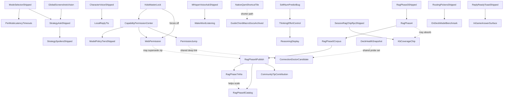

# Roadmap details

> **Clean-up task — trim this file.** ★★ · about 45 minutes with one worker · Sonnet 5 at high effort.
>
> Reading this costs roughly **39,000 tokens**. It holds the long version of roadmap entries that
> outgrew five lines. Many of those entries have since shipped, and their detail belongs in the
> archive with them. Getting it to about 50 KB would save roughly **26,000 tokens** per read.
>
> The work is a move, not a rewrite: match each block here against its roadmap entry, and archive
> the blocks whose entry is finished.
>
> Not started. Filed 2026-09-13 during the clean-up.

Long-form notes for **open** roadmap entries. The roadmap itself keeps each item to a few plain
sentences; everything that would otherwise have to be re-measured lives here — what was tried,
what it cost, which leads were ruled out, and the exact steps to reproduce.

Split out 2026-08-27, when roadmap entries had grown to twenty-plus lines each and the list had
stopped being readable as a list. **Fixed** items are not here; they go to
[archive/roadmap-bugs-fixed.md](archive/roadmap-bugs-fixed.md).

Each heading below matches a roadmap item's title, and the roadmap item links here.

## The panel stops half way down and the Ask button is out of reach

Long version of the roadmap entry. Moved here 2026-09-15; the roadmap keeps the symptom, what clears it and why the
entry is still open.

**The mechanism, found by reading after three deliberate attempts failed to reproduce it (2026-09-05).** The table that
hands the highlight between the panel's parts lives outside the panel and is keyed by fixed names, not by which copy of
the panel is on screen; it is only emptied when the plugin's code loads fresh. A stale entry therefore survives a panel
reopen, and the handler that asks it to move the highlight gets back something that still looks alive, reports the press
as handled, and moves nothing. That matches every symptom on record, including why only a loader restart clears it.

**The signature to chase.** At the moment of the trap Steam's ring and the page's own focus were on different elements
every time — the answer bubble versus a highlighted word, the question box versus the Ask button.

**A fix for that mechanism landed 2026-09-05** — a departing part of the panel can no longer unregister the one on
screen. Nothing proved it against the fault, because the fault never reproduced on demand. Three deliberate attempts
that day all failed to bring it back: leaving with B and reopening from the Decky list; a button-then-cancel around the
question box; and switching through all six tabs and back six times before walking the panel top to bottom. Every walk
reached the Ask button. How a person gets into the state is still not pinned down — it followed a game launch and
several panel reopens.

**Evidence, in order.** `round34-BUG-down-cannot-reach-ask-bar.json` (trapped, 10 presses),
`round34-BUG-down-walk-strategy-mode-control.json` (trapped, other Ask mode),
`round34-BUG-empty-chat-input-trap.json` (trapped, empty chat), then
`round34-BUG-down-walk-after-loader-restart.json` and `round34-BUG-input-to-ask-final-check.json` (both clean after the
restart). All under `docs/test-evidence/`. Also `docs/test-evidence/round35-trap-*.json` and
[plan 35](planning/35-bugfix-session.md) § 7.

**Reproduced on demand 2026-09-15, which the entry had been waiting for.** It happened twice in one
sitting, both times within seconds of starting a brand new, empty chat while the panel was showing a
Session context row — that is, while the session still carried turns from another chat. Down, Left and
Right all did nothing from the question box and only Up escaped; the character button, the mode chip and
the Ask button were all on screen and none could be reached. Emptying the box first made no difference, so
it is not the text. Restarting the plugin cleared it both times. Three walks in the same sitting where
that row was absent, or the chat already had a reply in it, all reached the Ask button normally. That is
five observations, not proof of a cause, but it is a recipe to try. Evidence
`docs/test-evidence/plan48-BUG-ask-input-ring-trap-2026-09-15.json`.

**Five more runs on 2026-09-15 evening, on build 1ac4d7a, and it did not come back once.** Run 1: a new chat
started from a chat with eight turns while the Session context row showed. Run 2: the box filled from a chip
press, then every direction. Run 3: a question asked first so the row carried a live turn, then a new chat.
Run 4: the same, plus the box filled from a chip. Run 5: an empty new chat with the row still showing one
turn, after the plugin was reopened with Hades running. Every Down, Left and Right from the box moved where
it should, every time. Evidence
`docs/test-evidence/plan55-trap-run1-walk-after-new-chat.json`,
`docs/test-evidence/plan55-trap-run2-chip-fill-then-dpad.json`,
`docs/test-evidence/plan55-trap-run3-new-chat-with-live-turn.json`,
`docs/test-evidence/plan55-trap-run4-chip-fill-with-live-turn-row.json`,
`docs/test-evidence/plan55-trap-run5-empty-chat-session-row-hades-running.json`.

**One more clean run 2026-09-18, build `0589565`, on the same 2026-09-15 recipe:** Down reached Ask and Up
climbed back out, no trap. Evidence `docs/test-evidence/plan61-focustrap-try1.json`.

**Found again 2026-09-18 with a game running, and the trigger is now known.** Pressing A on the question box
opens Steam's own on-screen keyboard; once B closes it, Down and Right out of the box stop moving the
highlight -- the page's own idea of what is focused moves on to the Ask button or the mode button, but the
ring a person actually sees stays on the box, and only Up still gets out. It happened five times across two
panel reopens and one full close-and-reopen of the whole Quick Access Menu on Half-Life 2, and again in a
brand-new chat with Hades running; by the time Portal 2 was running it had cleared on its own, with no
restart needed. Three tries of the 15 September new-chat recipe the same night came back clean, so opening
the keyboard, not starting a new chat, looks like the real trigger. Evidence
`docs/test-evidence/plan61-ASKBAR-FOCUS-TRAP-01.json` (the sighting), `docs/test-evidence/plan61-focustrap-try2.json`
and `-try3.json` (the clean tries).

**A second sighting, later the same night, reached a different way, with a working fix found.** This time
the question box itself was never pressed: a pinned suggestion filled the box, and the freeze appeared after
pressing the Ask button itself -- the press left no line in the plugin's own log, and the box emptied back to
its placeholder, as if the send had silently failed partway through. From there, Down and Right out of the
box did nothing a person could see, while the browser's own idea of what was focused had already moved to a
button; only Up worked. Four things were tried in order: going up to the chip row and back down did not
clear it; switching the panel's tabs with the shoulder buttons brought the two focus readings back into
agreement but Down was still dead; closing and reopening just the plugin panel left a different snag, the
ring stalling partway through an old reply, instead of a clean fix; **closing the whole Quick Access Menu and
reopening it did clear it**, restoring a normal walk from the top of the panel down through the chips to the
question box and the Ask button. On a controller alone, a person stuck like this can press the Steam button,
close the Quick Access Menu, and reopen it. Evidence `docs/test-evidence/plan61-ASKBAR-FOCUS-TRAP-02.json`.

**Later still the same night, with a game running throughout, the freeze stopped being occasional.** Across
the rest of the games block it reproduced on nearly every attempt to send a question, and reopening the whole
Quick Access Menu cleared it only until the next question. This is why the roadmap entry now says the trap
hits on most sends with a game running, not just sometimes. See the games-block write-up in plan 61's own log
for the full count.

**One more clean try 2026-09-18, after exiting Sifu, on the 15 September new-chat recipe:** Down and Right
both moved cleanly out of the question box; Left simply had nothing next to it. No trap this time. Evidence
`docs/test-evidence/plan61-focustrap-try5.json`.


**More history, moved from the roadmap 2026-09-21:**

- ★★★ `[focus]` **The panel can get into a state where pressing Down stops half way and the Ask button is out of reach** —
  **OPEN, found 2026-09-05.** Down walked as far as the answer and stopped dead: ten presses, no movement, Left and Right
  dead too, only Up escaping. The Ask button, the preset chips and the question box were all on screen below and none
  could be reached. It happened on a chat with history and on a brand new empty one, in both Ask modes, so the mode is
  not the cause. **Only a Decky loader restart clears it**, not a panel reopen — so this is stale navigation state, not a
  permanently trapping control. **A fix landed 2026-09-05, but the entry stays here rather than in Verify**, because the
  fault never reproduced on demand, so nothing proved the fix against it. It closes only when the panel is driven hard
  over time and the state does not come back. The unrevealed-spoiler entry above is most likely the same fault and closes
  with it. The mechanism, the signature to chase and every run, including how it was finally reproduced on
  demand:
  [detail](roadmap-details.md#the-panel-stops-half-way-down-and-the-ask-button-is-out-of-reach).
  **The trigger is now known, found 2026-09-18.** Pressing Ask can leave the highlight stuck on the question
  box, unable to move down or right, even when the box itself was never pressed. **By the second half of
  tonight's run, with a game still open, this was happening on almost every question sent, not just once in
  a while** — raising how urgent this entry is. The only thing that reliably clears it: back out with the
  Steam button, close the whole Quick Access Menu, and reopen it — going up and back down, or switching the
  panel's tabs, does not. Full run history and the exact steps:
  [detail](roadmap-details.md#the-panel-stops-half-way-down-and-the-ask-button-is-out-of-reach).
  **One more try 2026-09-18, later in the same night:** with Hades still running, one question sent with the
  usual workaround went through cleanly and did not trap — a sample of one, so the "nearly every send" reading
  from earlier tonight still stands. Evidence `docs/test-evidence/plan61-ASKBAR-FOCUS-TRAP-03-tally.json`.
  **Not seen at all on 2026-09-19:** about ten questions were sent with Hollow Knight, Half-Life 2, Hades and
  Black Mesa running in turn, and the trap never happened once. The one thing done differently from the
  night before is that the plugin was reloaded after every settings edit tonight (see the pinned-chip entry
  above), which is worth trying again before calling this closed.
  **A separate, smaller fault was found and fixed 2026-09-20** while chasing this very entry: pressing Ask
  left Down doing nothing for as long as an answer was arriving, though Right kept working throughout — and
  it reproduces every time, unlike this one. Now fixed and moved to Verify as **ASKBAR-DOWN-TO-STOP-01**; it
  may well be part of what has been feeding these reports. But it is not this bug — today's runs saw no dead
  Left or Right, and nothing needed a full Quick Access Menu close to clear, so this entry stays open.

*Moved out of the roadmap on 2026-09-21, superseded by the current summary there.*

## Ordinary phrases attach game cards

  - **Implemented 2026-08-23:** `VECTOR_RECALL_FLOOR` raised `py_modules/backend/services/knowledge_base_service.py:148` from 0.50 to 0.515, against a fresh local repro (real `nomic-embed-text` via a local Ollama, real seed cards for the six phrases and the seven `V2-PARA-*` strategy rows in `kb_eval_v2.json` — script not committed). The two ranges overlap (noise up to 0.5308, a genuine paraphrase hit as low as 0.4302), so no single floor separates them cleanly; 0.515 was chosen to sit just above "one sentence"'s noise score (0.5034) and just below the lowest genuine score this change must not break (Mind Flayer / `V2-PARA-S04`, 0.5169).
  - **Re-measured all six phrases end-to-end** through `retrieve_knowledge_context` against the real test corpus (`build/knowledge-base-test/corpus.db`, real embeddings, real local Ollama for the query) rather than eyeballed:

    | Phrase | Before | After |
    |---|---|---|
    | "one sentence" | Praetorian | clean (genre fallback only) |
    | "please repeat that" | Glyphid Dreadnought, Nitra, Dreadnought Twins | Glyphid Dreadnought only |
    | "thank you very much" | Nitra | **unchanged — Nitra still attaches** |
    | "what time is it" | Glyphid Dreadnought, Praetorian, Classes | **unchanged — all three still attach** |
    | "our team" | clean (genre fallback only) | unchanged |
    | "four hours" | clean (genre fallback only) | unchanged |

    Matches D28's own prediction exactly: the two BM25-driven phrases are untouched (fixing them would mean touching `BM25_RELEVANCE_FLOOR`, out of scope here), "one sentence" is fully clean, and "please repeat that" is reduced but not clean. **Still OPEN, re-scoped to the two BM25-driven phrases and the residual `Glyphid Dreadnought` on "please repeat that"** — a keyword-side fix is a separate decision.

    **Maintainer call 2026-08-27:** interim, **live with the residual attachments** — the model is expected to mostly talk past an irrelevant card — but this row is now **research-first, not tune-first**: find out *why* a bare phrase clears the keyword bar for these cards before proposing any change. The backlog entry *Card relevance needs a second signal* (Knowledge base lane) is the vehicle for the eventual fix; the floors stay where they are (D28's correction note already forbids retuning `VECTOR_RECALL_FLOOR`, and `BM25_RELEVANCE_FLOOR` stays at 1.0 per D25).

    **On-Deck 2026-08-23 — all four phrases confirmed on hardware. The device reproduces the desk table exactly, card for card. D28's re-measure obligation is discharged.** Deep Rock Galactic: Survivor (`app_id 2321470`), corpus `2026.08.22`, model `gemma4:e2b-it-qat`, Strategy mode. Recordings `DeckRecord_20260823_170847`, `_172915`, `_173649`, `_173825`, `_173947`.

    | Phrase | Desk prediction | Cards actually attached on Deck |
    |---|---|---|
    | "one sentence" | clean (genre fallback only) | `Genre/compat fallback` **only** — reproduced on all three runs |
    | "please repeat that" | Glyphid Dreadnought only (was 3) | `boss: Glyphid Dreadnought` **only** |
    | "thank you very much" | unchanged — Nitra still attaches | `item: Nitra` |
    | "what time is it" | unchanged — all three still attach | `boss: Glyphid Dreadnought`, `enemy: Praetorian`, `mechanic: Classes` |

    **Method — and the correction it forced.** The card names are **not readable from the device UI**: *Show details* reports retrieval mode, `Trust tier`, and a corpus section count, but never names what was retrieved, and a `fallback_no_source` tier looks identical whether the payload was the genre fallback or a real game card. An earlier note on this row read that chip as "no cards attached" for *"one sentence"* — **that was wrong**, and the conclusion was only accidentally right. `kb_attached: true` was in the same snapshot the whole time, and `fallback_no_source` is a **trust tier** ([knowledge_base_schema.py:48](../py_modules/backend/services/knowledge_base_schema.py#L48)), not an attachment count. The authoritative source is the Desktop ask trace — `~/Desktop/bonsAI_logs/bonsai-ask-trace-<date>.md`, written when `desktop_ask_verbose_logging` is on ([main.py:2135](../main.py#L2135)) — which dumps the verbatim `--- Local knowledge base ---` block with one `[title / kind: Card] (trust: tier)` header per attached card. **Read the trace, not the panel**, for any card-attachment QA.

## D-pad focus is trapped inside the expanded Session context panel

  - **Root cause, confirmed by reading with the recording as evidence.** `focusAnyContextChipLadder` took the **first** `.bonsai-chip-ladder` in the document. Its own comment asserted that would always be the transcript's inline ladder, "even when the session context strip's own ladder (same class) is also mounted further down" — true only while *Show details* is open. In the recording it is **closed** (the button reads *Show details*, not *Hide details*, at 0:08–0:16), so no inline ladder is mounted at all and the strip's ladder is the *only* match. The strip header's `onMoveUp` ([MainTabChatTranscript.tsx:814](../src/components/MainTabChatTranscript.tsx#L814)) routes through that helper, so every Up press at the header threw the ring back down into the strip. A closed loop: ladder → rows → header → ladder.
  - **Second, independent half.** The strip renders `ContextChipLadder` bare ([SessionContextStrip.tsx](../src/components/SessionContextStrip.tsx)) with neither `onMoveUpFromLadder` nor `onMoveDownFromLadder`, while the transcript's copy has always passed both ([MainTabChatTranscript.tsx:438-439](../src/components/MainTabChatTranscript.tsx#L438-L439)). The ladder owns `onMoveUp` for chip stepping and delegates to `onMoveUpFromLadder` at chip 1 ([ContextChipLadder.tsx:133-140](../src/components/ContextChipLadder.tsx#L133-L140)) — absent, that returns `false` and the press dies there. Either half alone would trap the ring; both were present.
  - **FIXED 2026-08-23** (code + unit tests, **no on-Deck confirmation yet**). `focusAnyContextChipLadder` now skips any ladder inside `.bonsai-session-context-strip` via `closest()`, and returns `false` rather than a wrong target when only the strip's ladder exists — letting the caller's fallback chain (`focusContextHint` → `focusReplyUtilityRow`) do its job. The strip's ladder now gets `onMoveUpFromLadder` pointing at the row list above it (new `focusLastSessionContextRow`), falling back to the strip's own `onMoveUp`. Four regression tests in [liveTurnFocusGraph.test.ts](../src/utils/liveTurnFocusGraph.test.ts) cover both ladders mounted, only the strip's mounted, and the row target.
  - **Steps to verify on-Deck:** ask anything, leave *Show details* **collapsed**, expand **Session context**, D-pad down into the chip ladder inside it, then hold Up. The ring must climb out through the turn rows and the header and land on *Retry* / *Show details*. Repeat with *Show details* **open** — the ring must reach the transcript's own ladder on the way, not skip to the panel.

## The spoiler fence on a no-story game lands mid-reply

  - **It tracks the question, not the turn.** *"how do i deal with the exploders"* fenced on **both** captures — `DeckCapture_20260822_164957_game.png` and `DeckRecord_20260822_172630_game.mkv`, two independent generations with visibly different wording. *"what is red sugar for"* (`DeckRecord_20260822_173005`) and *"how do i beat the twins"* (`DeckRecord_20260822_172800`) fenced on **neither**. Two samples of one question is not proof, but a per-question correlation is a far more tractable bug than per-turn randomness, and it is the first thing to test: **re-run each of the three questions several times and record the fence rate per question before touching any code.** If it holds, the cause is in what that question retrieves or how its entity is resolved, not in model temperature.
  - **A lead on why that question and not the others.** The three cards differ by `section_type` — `Exploder` is **enemy**, `Red Sugar` is **item**, `Dreadnought Twins` is **boss**. The low-risk addendum's wording only names *"boss and elite enemy names"* and *"boss/enemy guidance"* ([ollama_prompts.py:261-300](../py_modules/backend/services/ollama_prompts.py#L261-L300)), and the named-entity discount runs through `_ENTITY_FILLER`, which drops words like *"boss"* and *"the boss"* but has no equivalent handling for a plural common noun like *"exploders"*. Worth checking whether `asked_entity` resolves for *twins* and *red sugar* but not for *exploders*, which would explain the split exactly.
  - **The placement changed, and that part is genuine variance.** In the earlier screenshot the fence sat at the **end** of the reply; in the recording the same question put it **in the middle**, between the opening line and *"Here's the lowdown:"*, splitting the answer in half. Mid-reply is materially worse than trailing — it interrupts the thing the user is reading mid-fight, which is the exact scenario Phase 4 track 2 restructured these cards for. Check whether this followed the 2026-08-15 `prepareStreamMarkdown` / `unwrapOpenSpoilerFence` change, since that is the most recent thing to touch where a fence is recognised during streaming. **Cross-title placement data, same evening** (`recordings/DeckRecord_20260822_195545/200257/200436/201647_game.mkv`): on Ship of Harkinian the fence landed **mid-reply** on the water-temple-boss and sink-underwater asks, at the **very top** of the reply on the bottles ask (before any prose at all), and on Fallout 4 it trailed at the **end** — all three positions in one session, same model. Those titles fence by design (`protect_progression` / narrative), so they say nothing about the false positive; they make the placement variance a cross-title fact rather than a Deep Rock quirk.
  - **Cheap mitigation while it is open:** `strategy_spoiler_masking_enabled` off in settings removes the fence for QA runs without a code change. Not a fix — it disables fencing everywhere, including the titles that need it.
  - **The lead is confirmed, at the desk, 2026-08-22 — `asked_entity` is empty for exactly the question that fenced.** Run against `extract_strategy_asked_entity` with the three card names passed as `known_entities`: *exploders* → `''`, *red sugar* → `'Red Sugar'`, *twins* → `'twins'`. A 3-of-3 match with what was observed on device, and it needs no hardware to reproduce. **Two independent gaps produce the miss, and both must be fixed or neither helps:** *"deal with"* is not in `_ENTITY_VERB_FIRST_PATTERNS` (which carries `beat|defeat|kill|fight|survive|use|counter|play as`), and `_match_known_entity` is word-boundary exact, so the card *Exploder* does not match the plural *exploders* — confirmed by the singular form resolving correctly.
  - **What the empty entity actually costs, and it is bigger than the discount.** [`_strategy_spoiler_low_risk_addendum`](../py_modules/backend/services/ollama_prompts.py#L261-L305) has three arms. With an entity it says *"do NOT wrap ... in `bonsai-spoiler` fences"*; with `kb_entity_match` it says *"do NOT fence KB-backed boss/enemy guidance"*; with neither it says only *"boss and elite enemy names are not narrative spoilers — keep mechanical coaching visible."* **The third arm is the only one carrying no explicit negative instruction.** And the second arm cannot rescue the first, because `kb_text_covers_asked_entity` returns `False` on an empty entity before it looks at the cards at all — so one extraction miss knocks out *both* arms that tell the model not to fence, with the Exploder card sitting in the prompt unused. **The title-level fact is the stronger one and is not being used:** the game is already known to be `low_narrative`, which is a better reason not to fence than knowing what was asked. **Fix lean: give the third arm the same explicit instruction**, and treat the two extraction gaps as a separate, smaller improvement — that way the fix does not depend on entity extraction succeeding for every phrasing a player might use.

## An Ask that completes instantly loses its branch picker and checklist

  - **Not what the device measures**, and that is why it is one star rather than two: `gemma4:e2b-it-qat` takes 6-32s on this hardware, so the start call answers `pending` and the polled path — the fixed one — is what real Asks take. This bites a fast or cached completion.
  - **The same literal already carries `shortcut_setup`, `thinking_unsupported` and `model` through with a comment explaining why**, so the fix is to add the two strategy fields beside them. Confirm first that the RPC actually returns them on this path before adding the fields, and keep the test on the polled path as well — these are two different routes to the same panel.

## Live Ask user bubble shows a bare ellipsis after reopen

  - **On-Deck 2026-08-23 — half the fix works, and the failure moved.** Batch A chip #1 (*"one sentence"*, Deep Rock Galactic: Survivor), QAM closed and reopened mid-think. **The caption came back correctly and stayed correct for the whole thinking phase** — that is the `pending`-branch backfill ([useBonsaiAskOrchestration.ts:502-505](../src/hooks/useBonsaiAskOrchestration.ts#L502-L505)) doing exactly its job, and it is the first time this has been seen working on hardware. **It then reverted to `…` at the moment thinking finished.** So the bug is no longer "nothing ever refills the caption"; it is "something clears it again on the terminal transition".
  - **Lead, not yet proven — the one unguarded write.** All three in-flight writes to `askThreadDisplayQuestion` are blank-only (`(prev) => prev || value`) — pending at :504, completed at :605 — **except `restoreSessionSnapshot`, which assigns unconditionally** ([useBonsaiAskOrchestration.ts:1312](../src/hooks/useBonsaiAskOrchestration.ts#L1312)). A snapshot captured before the Ask was submitted holds `askThreadDisplayQuestion: ""`, and the survival snapshot is only written before a nested-modal open ([useBonsaiPluginShell.ts:115](../src/hooks/useBonsaiPluginShell.ts)), never on a plain QAM close — so the stored value is routinely stale. If the mount-restore effect lands after the pending poll, its bare assignment overwrites the good caption with the stale blank one, and the header falls back to the `|| "…"` literal at [MainTabChatTranscript.tsx:480](../src/components/MainTabChatTranscript.tsx#L480). The ordering is **not established** — do not fix on this alone. **Cheapest next step:** make :1312 blank-only like its two siblings and re-run the same chip; if the caption survives, that was it. Note the comment already at :599-603 anticipates the restore path but guards the *poll* writes rather than the *restore* write.
  - **Second asymmetry worth folding into the same fix:** the collapsed turn header at :480 reads `buildCollapsedTurnTitle(liveQuestion) || "…"` with no fallback, while the question bubble 46 lines below at :526 reads `liveQuestion || lastExchange?.question || ""`. Whatever clears `liveQuestion`, the header is the only one of the two with nothing to fall back on — which is why the symptom is a header showing `…` rather than a blank turn.
  - **Duplicate-question follow-on: not observed this run.** Batch A #1 produced a single turn. One clean run is not a close — the symptom was always intermittent — but it is one data point against it sharing a root cause with the caption bug, since the caption bug *did* reproduce in the same session.

---

## Spy: a character who lies to you on purpose

Filed 2026-09-06 by the maintainer. **Nothing is built.** These are the things the build must not
have to rediscover.

**The idea.** The Spy is a new Team Fortress 2 character in the picker. He is helpful in tone and
wrong on purpose, because he is working for the other team and is good at it. Pyro's heaviest
setting is the nearest thing today and it is a different joke: Pyro is stubborn and rude, so his
bad advice is obviously bad. The Spy's is meant to sound right.

**The floor is the same as Pyro's, and it is not negotiable.** Nothing that can damage the Deck,
lose a save, spend money, or turn off a protection. Wasted time only. Anything that fails that
test is not a Spy line, however good the joke is.

**The reveal is the feature.** Being lied to and never finding out is just a broken plugin. So
plan, before writing any of it: what tells you that you were played, when it appears, and how you
get the honest answer afterwards without having to ask the whole question again.

**Reveal decided 2026-09-15 (D105).** A Spy chip under Show details always says he was on and lists
what he lied about, from a closing tag the model writes, or says he did not confess when the tag is
missing; he lies only at the two heaviest accent levels, like Pyro; the opening-as-someone-else trick
is its own entry on the roadmap now. He is already in the picker as a plain smooth voice; the picker
does not change.

### Four things to plan for, found while filing this

  1. **Corrected 2026-09-15: the Spy has been in the character list since June**, as an ordinary
     smooth understated voice. The picker does not change; the work is the lying and the reveal,
     decided in D105.
  2. **Pyro's bad advice never reaches an answer today.** It is five fixed sentences that only ever
     go into a chip you press yourself, and only on the two heaviest accent settings. The Spy needs
     the lying inside the answer itself. That is a different mechanism and a much bigger job, and
     it is the part that has to clear the floor above every time rather than five known-safe times.
  3. **Sometimes he opens as somebody else.** On a random chance, his first message introduces him
     as a different character from the list, and he keeps that up. This needs its own decisions:
     how often, whether the picker still shows Spy while he claims otherwise, and how the reveal
     reads when the person thought they had picked someone honest.
  4. **There is no first message from a character today.** A character only colours the answers you
     ask for; nothing greets you when you pick one. The impersonation opener needs that to exist
     first, so it is work in its own right and not a line of prompt text.

---

## Terse mode (Speed answers in three lines)

Discovery ran with the maintainer on 2026-08-29. **Nothing is built.** This is the settled shape,
written down so the build does not have to re-ask any of it.

**What it is.** A toggle on the Ollama tab beside the reply-style slider, off out of the box, that
caps a **Speed**-mode answer at **three lines**. A line is a sentence or a bullet — one number
covering both shapes, because the promise is about what you can take in at a glance rather than
about grammar.

**It is an output rule, not an effort rule**, and this is the thing most likely to be got wrong by
whoever builds it. The model may think as long as it likes and read a screenshot as closely as it
likes; only what lands on screen is capped. The thinking-effort control is untouched, and a
screenshot question still comes back at three lines. The toggle's own help line has to say so,
because *shorter* reads as *dumber* otherwise.

**Speed mode only, and inside Speed it wins:**

| Against | Terse |
|---|---|
| Reply-style slider (Caveman / Balanced / Detailed) | **Ignored while in Speed** |
| AI character roleplay | **Overridden** — the character still picks the words, in three lines |
| Strategy and Expert ask modes | **Does not apply**, and the toggle says so in plain words |

The character override is a deliberate reversal of Caveman, which steps aside entirely when a
character is on ([ollama_prompts.py:967](../py_modules/backend/services/ollama_prompts.py#L967)).

**Two of Caveman's three escape hatches survive.**

- **Destructive warnings** drop out of terse and are written in normal prose — the same auto-clarity
  clause Caveman carries. A squeezed data-loss warning is the one failure worth spending lines on.
- **The ten depth phrases** still loosen the cap: `step by step`, `step-by-step`, `walkthrough`,
  `explain why`, `in detail`, `full guide`, `detailed guide`, `break it down`, `tutorial`,
  `comprehensive` (`user_asks_for_detail_depth`,
  [ollama_prompts.py:908](../py_modules/backend/services/ollama_prompts.py#L908)).
- **The character step-aside does not** — see the table above.

**Free alongside the three lines:** the existing fenced panels (`bonsai-strategy-branches`,
`bonsai-strategy-checklist`, the TDP `json` block, `bonsai-cite`), code blocks and file paths, and
pictures once anything can draw one. The `<bonsai-status>` line never counted — it is stripped
before display ([stripAssistantDisplayTags.ts](../src/utils/stripAssistantDisplayTags.ts)) and shown
as a streaming blurb, so it is not in the reply body at all.

**Getting more is the branch picker, and that is the real work.** Every terse reply ends with the
strategy branch fence; pressing an option gives three more lines and a fresh set of options, forever.
Buttons are **stacked full-width** in the 300px column rather than squeezed into one row, because a
full-width label can be a real phrase and the D-pad walk is then a straight line down. There is no
separate *explain further* chip, and no exit control — the Ask field stays live throughout, so the
menu is an offer rather than a trap. Today that fence is mandatory-once, Strategy-only, and
explicitly banned on follow-ups
([ollama_prompts.py:1317](../py_modules/backend/services/ollama_prompts.py#L1317)); all three have
to change. Locked as **[D40](audit/maintainer-decisions-locked.md)**.

**Enforcement is wording only** — nothing counts, nothing trims, nothing retries. Chosen with eyes
open: a trim can chop a reply mid-thought, and a retry costs a second round trip on a device where
that is slow. The cost is that the cap is a tendency rather than a guarantee, so it gets measured
instead of asserted.

**TERSE-01** counts lines across these ten questions — Speed mode, terse on — and passes at **8 of
10**. Approved by the maintainer 2026-08-29. They get pinned as a frozen chip batch when the work
starts, so each case is one press of A rather than a sentence thumb-typed on an on-screen keyboard.

| # | Question | Why it is in the set |
|---|---|---|
| 1 | how do i beat the dreadnought | KB boss card |
| 2 | what is the max tdp on a steam deck | short fact — should be one line |
| 3 | my game stutters when i turn | troubleshooting, invites rambling |
| 4 | should i cap fps at 30 or 40 | a choice — tempts pros and cons |
| 5 | what does proton do | a definition — tempts a paragraph |
| 6 | how do i deal with exploders | KB enemy card, and the known fence repro |
| 7 | is 8 watts enough for this game | a judgement — tempts hedging |
| 8 | what should i upgrade first | wide open; expected to fail first |
| 9 | why did my save not carry over | a cause question |
| 10 | how do i get more battery life | classic long-answer question |

**None of the ten contains a depth phrase, and that is not incidental.** Any of the ten words listed
above would loosen the cap on the very row written to measure it — the same reason `KB-ROUTER-01`'s
four sentences contain neither *deck* nor *proton*. Keep that property if a question is ever swapped.

**Known gap in the set:** none of the ten attaches a screenshot, so the *screenshots still get three
lines* rule is asserted and unmeasured. Worth an eleventh row if it ever misbehaves; the maintainer
chose the ten as they stand.

**Not decided:** the on-screen wording of the toggle and its help line.

**Pictures are exempt from the count, but nothing draws one.** The dungeon map and the boss outline
the maintainer described belong to **KB visual maps** in the backlog, which stays parked on purpose.
Terse ships without them.

---

## Session context folds into Show details

Raised by the maintainer 2026-08-30 under the *Vertical space for the chat bubbles* goal. The ask is settled; **what it looks like folded
in is not**, and that is the part to workshop before any code moves.

What exists today, on a settled answer: a **Show details** button and a **Copy** button share one row, and a full-width **Session context
(N turns) ▸** bar sits under them as a second collapsed control. Two disclosures, stacked, for one answer.

Open questions:

- Does Session context become a **row inside** the expanded Show details panel, a **tab** within it, or a **section** appended to it?
- Show details is per-turn; Session context is per-session. Folding a session-wide thing into a per-turn panel means it either repeats on
  every turn or only appears on the newest one. Which?
- **Focus.** Both panels already have their own graphs, and the Session context panel has prior form here — the *stuck inside the Session
  context panel* bug (fixed 2026-08-27) was exactly this shape. Nesting one inside the other doubles the depth the D-pad has to climb back
  out of. Any design that adds a level needs an escape route drawn before it is built.
- What does the collapsed state say? "Show details" alone under-sells it once it also holds the session's chips.

**Drawn at true size on the mockup page** https://claude.ai/artifact/2De58qirE34754PEZVPmdb **(2026-09-16):**
the row, tab and section options sit side by side, each with its collapsed label and the D-pad escape route
marked, so the four open questions above can be answered by looking. The maintainer's call is in, below.

**Answered 2026-09-16 (D106).** (a) A tab within the panel. (b) Only the newest turn shows the Session tab,
so it never repeats. (c) The escape route is as drawn: Up from the tabs goes to Hide details and then Read
aloud; Down goes into the chips; B anywhere inside the panel closes it. (d) The collapsed row still says
"Show details". One thing the mockup page did not draw: where Clear sits inside the Session tab. The builder
puts it at the end of that tab's body, the same button and the same confirm box, unless the maintainer says
otherwise.

## The tab icon bar collapses when it is not in use

The open questions that lived here (dashes plus a glyph or a word, collapse on idle, the R5 lock, the
LB/RB affordance, hashed Steam classes) were workshopped on 2026-09-01 and answered in
[planning/30-collapsing-tab-bar.md](planning/30-collapsing-tab-bar.md) § 3, then built and measured on
2026-09-02 (§ 8 there). The short version: our own 20px bar of dashes plus the active tab's name, opening
to a floating strip of icons and names only while the D-pad ring is on it; Steam's `Tabs` stays underneath
for LB/RB and the tab bodies; R5 reopened as **D44**, the ghost-stop finding is **D55**, the wrap
correction **D56**.

## The chat sums itself up instead of being cleared

Asked for by the maintainer 2026-09-20. Two parts, and the second needs the first: **a chat keeps a short summary of what
it has covered instead of losing that memory outright**, and **the plugin rewrites that summary on its own once the chat
passes some size**, rather than waiting to be told.

What happens today, so nobody re-measures it:

- A chat slot saves the newest **200 turns** and drops anything older (`MAX_TURNS_PER_SLOT`). When a ninth chat is
  started, the oldest chat is deleted whole.
- Almost none of that reaches the model. A new question carries **the subject of a very recent Strategy or Expert
  question**, and nothing else; tapping a refinement chip pastes **the previous question and answer** ahead of the new
  message. There is no chat-wide memory at all.
- **Clear**, at the end of the Session tab, forgets that carried subject and the checklist position for the running
  game. It is the only control over this memory a person has, and all it can do is throw it away.

So the honest framing of this entry: the plugin has no session memory to compact yet. The first half of the work is
giving a chat a memory worth keeping; the second is keeping it small on its own.

**The first half landed 2026-09-21.** A question now carries what the chat has already covered, and how much of it is
carried is the plugin's decision rather than whatever happens to be on disk. Measured on the Deck with the same model and
the same chat, one difference between the two runs: asked *"and what about the boots?"*, a question naming no game at
all, it replied **"Please tell me which game you are referring to"** without the memory and **"You should keep the Iron
Boots off during the fight in Ocarina of Time so you can move freely and effectively use your Longshot to yank the
nucleus out of the water"** with it.

Three things that only showed up by running it rather than reading it, all now fixed and each with a test:

- **Carrying the conversation was not enough on its own.** With the turns plainly listed under a heading, the model still
  asked which game — it could see the chat and did not know it was allowed to use it. The heading is an instruction now.
- **The question being asked was already in the chat**, written when the Ask is accepted rather than after the answer, so
  it came back as "You asked: …" immediately before the very same question. Any trailing question is dropped.
- **A short chat asked for less room than its own heading needed** and came back empty with the room sitting unused.

What the block costs is bounded by two things, not one: the room, and **how long a person waits**. Reading the question
is the slow part, so the memory is held to what is worth waiting for rather than to what fits. And it sits at the **end**
of what the AI is told, behind the rules and the cards, because the server skips re-reading the front of a question that
has not changed and this block changes every turn.

Still to build: the summing-up itself, for when a chat outgrows even that; Compact replacing Clear; and the spoiler
chance rating.

**Every call is in, 2026-09-20.** In the maintainer's own order:

1. **The summary goes into the next question**, so the model answers with the chat behind it — not just a panel a person
   reads. The useful shape, and the expensive one: it spends part of every reply's budget.
2. **It is written right before the next question**, not while the person is idle, and the extra wait is measured rather
   than guessed.
3. **Compact replaces Clear.** The Session tab loses Clear entirely. The person ends up with three deliberate choices
   in place of one blunt one: compact this chat, start a new chat (which begins with nothing carried over), or delete a
   chat. Compacting helps a conversation; sometimes a fresh chat is the better move, and that is the person's call.
   The job here is to offer the choice plainly instead of losing a conversation's memory with nobody choosing it.
4. **The chat's spoiler standing carries forward with the summary** — see *Spoilers* below, which is the largest piece of
   new thinking in this entry.
5. **The summary shows inside the Session tab, under the Compact button.** Exact shape settled when it is built.

**Measured on the Deck 2026-09-20.** Four of the five are answered. Every number below came off
the Deck itself, with its own model and its own AI server — which has moved on to Ollama 0.34.1
since this was last looked at. The target was, and stays, a good experience on the weakest machine
bonsAI will ever run on. A PC on the home network and the Steam Frame both hold more; note what
they hold when it is cheap to do so, but nothing is designed around them, and no choice here is
allowed to make the Deck worse.

- **How much the Deck's model really holds: far more than anyone thought, and more room is free
  in speed.** The model can hold 131,072 tokens. The 4,096 the plugin has been working to is the
  AI server's own default setting, not a limit of the model or of the machine. More room costs
  memory and nothing else: with a game running, answers came out at 21.7 tokens a second at
  4,096, at 8,192, at 16,384 and at 32,768 alike. Doubling the room costs 0.3 GB, quadrupling it
  0.6 GB. Under a heavy game the Deck had only 206 MB spare before the model loaded at all, and
  it still loaded at every size — but that is the edge, and it is why more room is a decision to
  take on purpose rather than a default to change quietly. **Still to decide.**

- **What more room costs a running game: nothing.** Measured two ways on 2026-09-20, because the
  maintainer asked for the worst case rather than a guess. Against a fixed graphics load, the model
  parked at 4,096 and at 16,384 scored 17,897 and 17,859 — the same number twice. So the size of the
  room is free in frames, and only costs memory. **What is not free is answering at all.** God of War
  ran **31** frames a second on its own, **20** while an answer was being written, and **31** again
  once it finished: about a third of the frame rate, gone for exactly as long as the answer takes, and
  fully returned afterwards. It runs both ways — the answer itself slowed from about 33 words-worth of
  text a second on an idle Deck to 12.5 with the game running. None of this is new, and none of it is
  caused by this feature; it is what asking costs today. It has its own roadmap entry now.
  Two honest limits on the frame numbers: they were read off the game's own on-screen counter at its
  menu rather than in play, and taking a screenshot itself loads the Deck — four in a row dragged the
  reading down on their own, so every number quoted here came from a single isolated capture.

- **What happens when a chat gets enormous: worse than losing the start. It falls off a cliff.**
  Going over does not trim to the edge. Sending 4,220 tokens into a 4,096-token space delivered
  2,051 of them. Sending 19,620 into the same space also delivered 2,051. One token too many
  costs about **half of everything sent**, every time, however far over it goes — and the half
  that goes is the beginning: who the AI is, the rules it must follow, and the game's cards.
  Proved by hiding a pass phrase at the very start of a long question. At 4,096 the model could
  not repeat it and answered with nonsense. At 16,384 it gave the phrase back word for word.

- **Where the tokens go today: two of the three Ask modes already do not fit**, with no chat
  memory in the question at all. One real question in each mode, the game's cards attached,
  thinking on medium:

  | Ask mode | who the AI is, and the rules | the game's cards | the question | thinking | the answer | total | against 4,096 |
  |---|---|---|---|---|---|---|---|
  | Speed | 566 | 475 | 9 | 512 | 800 | 2,362 | 1,734 spare |
  | Strategy | 1,098 | 1,410 | 9 | 512 | 1,600 | 4,629 | **533 over** |
  | Expert | 566 | 2,337 | 9 | 512 | 1,200 | 4,624 | **528 over** |

  So this feature cannot simply add a summary to the question. On two modes out of three there was
  nothing left to add it to. **That is the part now fixed (2026-09-21):** with the room raised to
  16,384, the worst of those three comes to 4,629 of 16,384, so there is space for a summary rather
  than a fight over what to drop. The table above is what the Deck's default gave; it is what a
  machine that cannot be raised would still give, which is why the budget work still matters.

- **How many tokens went in and how many came out: kept now, and the old guess was a fifth too
  big.** Counting characters and dividing by 3.5 made the plugin's own questions look 20% to 25%
  bigger than they are; the real figure measured 4.32 characters per token. That over-count was
  not harmless — the plugin pays for it by shortening the answer. On a Strategy question with
  cards and thinking on, the answer's allowance was 600 tokens and should have been 851. The real
  counts the AI server returns are now kept and learned from, so the guess corrects itself after
  the first reply of a session. Landed 2026-09-20.

**Still owed: what the summary costs.** How long writing it takes on its own, how much longer the
whole answer takes from press to first word, and how much of the answer's allowance the summary
eats. That one needs a summary to exist before it can be timed. What is already known is the
price of carrying anything at all: **reading the question is the slow part, at roughly 1.7 to 2
seconds for every 1,000 tokens.** A 500-token summary therefore costs about a second on every
question that carries it — before the cost of writing it.

**How often the summary is rewritten is what decides the cost (corrected 2026-09-20).** An earlier
version of this note said that writing the summary right before the next question costs about 14
seconds on every question. That was wrong, and the maintainer caught it: compacting happens when the
chat outgrows the space, not every turn — the way Claude Code's own auto-compact works. The cost
lands on the turn that compacts, and the turns in between are nearly free. Call 2 stands as written.

The numbers behind it, measured on the Deck. The AI server skips work it has already done on the
front of a question, as long as that part has not changed. With a long piece of session text at the
front and only the question itself changing: 15.3 seconds to the first word, then 1.1, then 0.8.
Change one word of that front text and the saving vanishes — 15.3, 15.3, 15.3.

Three things follow, and they are design rules rather than open questions:

- **Rewrite the summary only at the threshold, never every turn.** A rewrite costs a full re-read of
  everything in front of it — about 15 seconds on a chat this size — plus the cost of writing the
  summary. Between rewrites, questions cost about a second.
- **Nothing that changes every turn may sit in front of the summary.** The saving only holds while
  the text ahead of the question is exactly what it was last time. A clock, a turn counter, or a set
  of cards that comes back in a different order would destroy the saving for everything behind it,
  including the summary. This is worth checking on the real prompt before any of it is built.
- **Two honest limits.** The saving holds only while the model stays in memory (about five minutes
  idle and it is paid again), and moving between chats loses it.


**What the code said about today's behaviour, now checked rather than trusted (2026-09-20).** It was right about the
shape and wrong about the severity. When a question plus its reply allowance will not fit, the plugin shrinks the
**visible reply** first, never the thinking allowance, down to a floor of 600 tokens. Past that floor it sends the
request anyway, and the AI keeps the **end** and drops the **start** — who it is, the rules, the cards. The person gets a
confident answer with nothing behind it, and only the log says so. All of that held up. What did not hold up is "drops
the start": it does not drop the excess, it drops down to about half the space and stays there however far over the
question goes. That is the ceiling the summary has to live under, and it is a harder ceiling than this entry assumed:
every question carrying a summary spends part of the same space, so this feature can cause the very failure it exists to
prevent if the summary is not kept small. Both halves are ruled out by the maintainer anyway: the answer is not the part
that gets squeezed, and the plugin does not let the AI pick what to lose. See the shape below.

**Spoilers, and the second rating.** Today there is one spoiler number per answer: a **risk** rating of low, medium or
high, built from the game's own profile, the question, what the knowledge base returned and the model's own tag, with the
model's tag counting for about 60%. It is worked out fresh for each answer and never looks at earlier turns. So the
maintainer's read is right — there is one rating, and nothing that builds up over a chat. The new idea is a second number,
**spoiler chance**, that does look back: if one of the last twenty turns already touched a boss, this chat is likelier to
wander into spoilers than one that has not, and the summary carries that standing forward. One thing left to settle when
it is built: what the look-back counts and how far back it reaches. The other is settled — the standing belongs to one
chat and never follows a person into a new one, because a new chat starts with nothing carried over at all.
Whatever writes the summary must also keep hidden things hidden. A summary that spells out a fenced spoiler and
then pastes it into the next question is the worst failure this feature can have, and it needs its own check on the Deck.

**The plugin owns the token budget, not the model (2026-09-20).** The maintainer's wider point, and the harder half of
this entry: how many tokens a question spends, how much the summary costs, how much is dropped, and how the rest is split
between what the AI is told, its thinking and its answer — all of that has to be the plugin's decision, not the model's,
and the Deck is the machine it has to be right on.

What exists today is real but partial, and worth knowing before calling it a free-for-all. Each Ask mode already caps how
long the answer may run; thinking has its own separate budget, so turning thinking on cannot starve the answer; and when a
request will not fit, the plugin shrinks the answer rather than the thinking. What is missing is the part that decides
whether a person gets a good reply:

- ~~**The window is assumed, not asked for.**~~ **Fixed 2026-09-21, and it now goes further than asking.** The plugin
  *chooses* the room: it asks the server for 16,384 tokens rather than accepting its default 4,096, having measured that
  four times the room costs 0.6 GB of memory and nothing in speed or frame rate. Three rules hold it: never lower than
  what a server already gives, never more than the model can hold, and never changed once chosen — changing it reloads
  the model. **Strategy and Expert stop being cut short**: both had their answers trimmed to a 600-token floor and now
  get their full 1,600 and 1,200.
- ~~**The real counts arrive and are thrown away.**~~ **Fixed 2026-09-20.** The true count of what went in, what came
  out, and the guess made before sending are all kept side by side, so the gap between them is visible rather than
  assumed. The plugin learns the real characters-per-token figure from them and corrects itself after one reply.
- **The rules, the game cards and the chat itself have no stated share.** They are whatever size they happen to be, and
  the answer is squeezed to make room for them.
- **Past the floor, the AI chooses what to lose, and it loses the start** — who it is and what it must not do — while the
  plugin carries on as if nothing happened.

**The shape to build towards, set by the maintainer 2026-09-20.** Two things are ruled out. **Squeezing the answer to
make room for everything else is not the answer** — a reply that needs to be thorough cannot be cut short because
something unrelated grew. **Fixed hard limits per part are not the answer either** — 500 tokens for thinking, 500 for
the answer, 500 for the game cards, forever, regardless of the question, wastes the window on an easy question and
starves a hard one.

What is wanted instead is flexible with guard rails:

- Every part has a floor it is always guaranteed, so nothing can be starved out by something else growing.
- Above those floors the remaining room is shared according to what the question actually needs.
- Thinking has a ceiling it can never cross, so a runaway thinking budget can never eat the answer, the rules or the
  chat. A person who turns thinking on is asking for reasoning headroom, not for their answer to disappear.
- **Context is never lost by accident.** If something genuinely has to go, the plugin chooses what goes, and the person
  is told. That is the whole point of this feature — or at least an honest attempt to make it better than today, where
  the AI drops the start of the prompt and nobody finds out.

Related: the four-star **Session context and user stash** entry in the roadmap's Features list is the other half of the
same idea (live session facts plus notes the person can edit); if both are built, they should share one store rather
than each keeping their own.

## Shipped, QA owed — why each was built this way

Moved out of the roadmap's **Verify** section 2026-08-27. Each of these ships and works; what is
recorded here is the design reasoning, the options rejected and the measurements behind them, so
the choice does not have to be re-litigated when the QA row is finally run.

- ★★★ **Clear cache leaves the thread on disk — it clears the screen, not the session** — **fixed and device-confirmed 2026-08-27** across three separate causes ([D32](audit/maintainer-decisions-locked.md#d32--clear-cache-says-it-clears-the-thread-but-the-saved-chat-stays-on-disk-which-half-is-wrong) chat slot, [D34](audit/maintainer-decisions-locked.md#d34--locked-option-1-2026-08-27--clear-cache-is-undone-by-its-own-confirmation-box-what-should-come-back-afterwards) modal snapshot, [D35](audit/maintainer-decisions-locked.md#d35--locked-option-1-2026-08-27--clear-cache-clears-the-screen-but-the-ais-last-answer-is-still-stored-on-the-plugins-own-back-end-should-clearing-forget-it) backend forget). **CLEAR-CACHE-01** Partial — the "clears a generation still in flight" half is unit-tested only, because the model finishes faster than the D-pad walk to the button. Writeup: [archive/roadmap-bugs-fixed.md](archive/roadmap-bugs-fixed.md). **Still owed as its own follow-up (not settled by D32): orphan chat slots accumulate**, one per clear-and-reask cycle.

- ★ **You cannot ask for "the boss" — a card's type is not searchable** — fixed 2026-08-19; **KB-TYPE-01** Open. `sections_fts` indexes `(name, card)` only, so *"how do i beat the boss"* returned 0 candidates on a title whose boss card was right there, and the vector half did not rescue it. Fixed by **query-time type recall** (option b of the three in the original report): a generic type word pulls that game's cards of that type into the pool and marks them preferred, reusing the same flat `RRF_W_TOPIC` signal D22 introduced for compat. Chosen over indexing `section_type` in FTS because it needs no schema change and no corpus rebuild, so it reaches an already-installed corpus — and it is easy to reverse. Verified across three titles: DRG → Dreadnought, Hades → Theseus and Asterius, OoT → Volvagia/Gohma/Twinrova, and *"what dungeon should i do first"* → the dungeon card. Explicit route only, and a named card still outranks its own kind. **Narrowed 2026-08-19** once the Phase 4 cards took Ocarina of Time from three boss cards to six: the preference now applies only to kinds the keyword half missed entirely. `_sections_of_type` returns the game's first three cards of the kind **by section_id** — authoring order, no relevance in it — so preferring them unconditionally promoted an arbitrary slice over a real match. *"how do i beat the water temple boss"* returned Queen Gohma, Volvagia and Twinrova and dropped **Morpha**, whose card opens *"The Water Temple boss"*. Per kind rather than all-or-nothing, so a question naming two types can still rescue the half that found nothing. The rescue direction is unchanged and pinned by its own test. **Maintainer note:** this was one of the three options in the bug and you were mid-flight, so I took the reversible one; say the word if you want the FTS-index version instead.

- ★★ **You cannot ask about a game unless it is running** — fixed 2026-08-19 (**D19**); **KB-NEWTITLE-01** Open on-Deck. `resolve_title_from_question` scans the question against the alias table as a last resort, only when Steam supplies neither an AppID nor a name, so a running game always wins. Longest alias wins, word boundaries, 3-character minimum. Verified locally: *hl2 ravenholm* → Ravenholm, *drg survivor what class* → Classes, *how do gels work in portal 2* → Gels, *what is the best way to beat volvagia in oot* → Volvagia. **Two things the fix turned up:** a canonical title carrying punctuation (*The Legend of Zelda: Ocarina of Time*) never matched its own normalised form, so OoT resolved to nothing and fell through to the genre card; and the spoiler profile was unreachable by name, which D19 explicitly rules out — the name tables now carry the same two profiles in **both languages**, moved together with `tests/contracts/spoiler-title-profiles.json` (that contract caught the change, as designed). **On-Deck still owes** the negative direction: with a game running, a question naming a different title must still answer about the running game.

- ★★ **Expert mode attaches fewer knowledge cards than Strategy** — fixed 2026-08-18; **KB-EXPERT-01** Open, and it re-opens **KB-ASKMODE-01** for a re-run. The route flag asked for Strategy *by name* (`!= "strategy"`), so Expert carried the largest card budget (5) and the strictest relevance floor (4.0 against 1.0) at once. Now keyed off `_DECLARED_GAME_ASK_MODES`, the one definition of "the user declared this Ask to be about the game" — which the vector recall pass reads too, so Expert gained both together. Reproduced on the seed corpus before the fix and measured after: DRG Survivor *"what class should i pick"* Strategy 2 / Expert **1 → 2**; *"what should i upgrade"* Strategy 3 / Expert **1 → 3**. **On-Deck still owes** the count check against a real corpus — note it cannot be read off the screen, the Show details ladder prints no card count; use `scripts/probe_deck_kb_retrieval.py`. Writeup: [archive/roadmap-bugs-fixed.md](archive/roadmap-bugs-fixed.md).

- ★★ **Compat retrieval returns a tip from the wrong topic** — fixed 2026-08-18 (**D22**); **KB-ROUTER-02** Open on-Deck. The D16 router worked out the topic and retrieval discarded it. **The bug report's premise was half wrong and the fix changed because of it:** the on-topic tips were not out-ranked, they were **absent** — 0 of 8 storage tips and 0 of 10 steam_input tips ever reached the candidate list, because the questions share no vocabulary with them. So the topic now opens a recall path first and acts as a preference second. All four KB-ROUTER-01 sentences return an on-topic tip first (was 1 of 4); compat tune top-3 81% → 100%, and 96% on a Deck with no embed model, since the fix does not depend on one. Weight is the weakest that works, and a test pins that a clearly better off-topic tip can still win — raise it and D22 stops holding. Measurement: [audit/rag-compat-topic-preference-2026-08-18.md](archive/rag-compat-topic-preference-2026-08-18.md).

- ★★★ **KB download Cancel** — shipped 2026-08-05; **KB-CANCEL-01 — not testable as written, and that is the blocker.** Attempted on-Deck 2026-08-16 and abandoned: at 758502 bytes the whole download-decompress-install cycle takes **~0.9 s** (Deck log `Downloading…` 23:32:37.711 → `Knowledge base installed` 23:32:38.610), so there is no cancel window to press. What looked like a Cancel pass was the **storage picker** (`onPrimaryClick = installed ? runUpdate : openStoragePicker`, [KnowledgeBaseSection.tsx:527](../src/components/KnowledgeBaseSection.tsx)) — press one opens the internal/SD modal, press two starts the download. **To run this row at all the download has to be slowed** — throttle the link (`tc qdisc`), point the fetch at a stalled host, or add a dev-only delay. Until then the six frontend tests are the only coverage and the D-pad-reach half (the part unit tests cannot judge) is unproven.

- ★★★ **Soft** `num_predict` **+ thinking budget** — shipped 2026-08-10; **02 Verified, 01/03/04 Partial (automated, on-Deck confirm owed), 05 Open** (needs a real thinking model). Caps Speed 800 / Expert 1200 / Strategy 1600; soft continue on `done_reason=length` (max 2) with ephemeral **`Continuing…`**; C1 budgets in `ollama_ask_budgets.py` (`think: false` default). **Fixed 2026-08-15:** the cap table was keyed `deep` — the mode's pre-2026-06-26 name — so Expert silently ran on the Speed cap (800, not 1200) since the caps shipped; **EXPERT-CAP-01**. **Fixed 2026-08-15:** Stop landing within 120ms of the cue could persist `Continuing…` into the saved reply — `_update_partial_response`'s throttle dropped the cue-clear write; now a shrinking partial always bypasses the throttle, plus a client-side `stripSoftContinueCue` backstop. Unblocks **Thinking effort control**. Detail: [16-soft-num-predict-thinking-budget.md](planning/16-soft-num-predict-thinking-budget.md).

- ★★★ **Source attribution on knowledge chips** — shipped 2026-08-09; **KB-ATTRIB-01 Partial after on-Deck 2026-08-16 — one sub-check looks like a fail.** The positive case passes: a Portal 2 (`620`) Strategy Ask surfaced `theportalwiki.com · CC-BY-4.0 · as of 2026-08-09` under Show details with the card beneath it, credit accent on the block and a capture date that is not today's. **What did not pass:** the row requires the credit accent be *visibly distinct* from the amber an `open_weight` model chip uses, with both on screen — they were (`Routed gemma4:e2b-it-qat` four rows above), and in `DeckCapture_20260816_233808_game` **the two ambers read as the same colour**. Needs a maintainer eye on the panel and then most likely a token change in [design-tokens.md](design-tokens.md). Also still owed: the negative case (a maintainer-authored-only reply must show no accent and no credit block). **KB-ATTRIB-02** (published corpus ships `ATTRIBUTIONS.md`) is Verified on Deck.

- ★★★ **The eval harness scored every troubleshooting tip against the wrong vector** — fixed 2026-08-21. It kept **one** vector map keyed by `CorpusDoc.doc_id`, and `compat_patterns.pattern_id` and `sections.section_id` are independent sequences that both land in that field — so a section card's vector overwrote the tip's for every id in both tables, **122 of 124 tips** at the current corpus size. Production has never had this problem: it stores `section_vectors` and `compat_pattern_vectors` in separate tables. **Nothing that ships changed; what we could truthfully say about it did.** Corrected on the same corpus, tips only: vector-only top-3 **12.5% → 67.5%**, fusion **57.5% → 72.5%** against keyword's unchanged 65.0%. Across all labelled tuning rows, fusion top-3 **89.2% → 94.1%** against keyword's unchanged 88.2% — so the harness had been reporting that fusion barely beat keyword when it beats it by about six points. The `keyword` arm uses no vectors and is identical in both runs, which is what confirms the diagnosis. **The holdout ship gate is unchanged and still cannot separate the arms** (n=36, 83.3% both) — the correction did not buy a verdict. Prior reports carry a correction banner; [archive/research/kb-embed-bakeoff-2026-08-21-arms.md](archive/research/kb-embed-bakeoff-2026-08-21-arms.md) is the current one. **Does not disturb the compat recall decision taken 2026-08-18** — that was measured through the production service, not this harness.

- ★★★ **Vector half of hybrid retrieval has its own recall pass** — fixed 2026-08-18; **KB-RECALL-01** Open (on-Deck), **KB-RECALL-02** Verified (PC). The vector half no longer re-orders a keyword shortlist — it searches the resolved game's sections itself and RRF fuses two real lists, so a card that shares no keyword with the question is reachable. On `kb_eval_v2` (98 labeled strategy rows) top-3 went **95.9% → 100.0%** with **zero** regressions; the four queries measured on Deck 2026-08-17 now attach. **What a Deck still has to answer:** the pass costs an embed round trip (793–900 ms on device, ~28 ms against a PC Ollama), and it is gated to the **explicit** route so an Ask that merely happened while a game was open pays nothing — confirm both halves of that on hardware. Floor is measured, not guessed, and the two distributions **overlap**: [audit/rag-vector-recall-floor-2026-08-18.md](archive/rag-vector-recall-floor-2026-08-18.md). Writeup: [archive/roadmap-bugs-fixed.md](archive/roadmap-bugs-fixed.md).


---

## Superseded originals — the Bugs entries as they read before the 2026-08-27 rewrite

The roadmap now carries a plain-language summary of each of these. The originals are kept
verbatim because several carry measurements, ruled-out leads and reproduction steps that would
otherwise have to be re-derived — in particular the spoiler-fence entry, whose *when* half was
proven at the prompt rather than from the screen, and the entity-extraction gaps closed alongside it.

Where an entry has since been fixed and verified, its writeup is in
[archive/roadmap-bugs-fixed.md](archive/roadmap-bugs-fixed.md) instead.

- ★★ **Ordinary phrases attach game cards** — **PARTIAL, D28 option 2 implemented 2026-08-23.** With a game running in Strategy mode, questions unrelated to the game still get cards stapled on: *"one sentence"* → Praetorian, *"thank you very much"* → Nitra, *"what time is it"* and *"please repeat that"* → three cards each (Deck, corpus `2026.08.22`, DRG Survivor running). This is the regression direction **KB-SPELLING-01** says must not happen, but **not for the reason that row predicts** — the British-spelling exemption set is innocent, the query is not expanded and the card scores `bm25=0.00`. Hybrid on/off splits the blame: the new vector recall pass (`bf16b35`) supplies the card alone for two of the four, while the other two attach on the keyword half by itself — so the Strategy explicit-route floor of **1.0** is the underlying cause and the vector recall widens it. Invisible to `kb_eval_v2`, because every approved question is a real question about a real game. **[D28](audit/maintainer-decisions-locked.md#d28--ordinary-phrases-attach-game-cards-how-hard-should-the-floor-be) locked 2026-08-22: option 2 — give the vector half its own floor, separate from BM25's.** The precondition cleared the same morning (D23 landed in `e606b82`), so the floor is tuned once against one baseline. `BM25_RELEVANCE_FLOOR` stays at 1.0 as instructed (raising it pushes against D25). **The floor is kept at 0.515 on the maintainer's call 2026-08-23, and the overlap behind it is filed as its own backlog entry — *Card relevance needs a second signal*, Knowledge base lane. Do not retune this number again; see the correction note under [D28](audit/maintainer-decisions-locked.md#d28--ordinary-phrases-attach-game-cards-how-hard-should-the-floor-be).**
- ★★ **Focus inside the answer bubble lands on text that does nothing** — **PARTIAL — code fix landed 2026-08-23, on-Deck confirmation owed. Originally OPEN, found 2026-08-22** from the same recording. Stepping the D-pad through a finished reply parks the focus ring on non-interactive prose — the *"Here's the lowdown:"* line inside the answer, and the raw JSON block under *Full transparency snapshot* — before reaching real controls. Two consequences: the user presses A on something inert and nothing happens, and the reachable-control count is inflated so a genuinely unreachable control (the spoiler fence above) looks like it is merely further down the list. Likely `answerStopRegistry` creating stops on text nodes; that file's own header says it handles stops *"other than the masked-spoiler diversion, which stays in `spolierFenceRegistry` and runs first"* — worth checking whether "runs first" still holds. **Research alongside the spoiler bug — same subsystem, and a fix to either can move the other.** **Checked 2026-08-23: "runs first" still holds** — `handleAnswerBubbleMoveDown` still checks `findUnvisitedSpoilerFenceInView` before the `orderedAnswerStops` walk ([answerBubbleNavigation.ts:197-220](../src/utils/answerBubbleNavigation.ts#L197-L220)), unchanged. That rules out ordering as the cause. **Every paragraph being its own D-pad stop is Phase B's intended behavior** (2026-08-07, "every section of a streaming answer is a D-pad stop"), not itself a bug to undo — the actionable part of this report is the same `<pre>`-wrap defect fixed on the row above, which is why Down was falling through past the fence to plain prose instead of diverting. The *"raw JSON block"* half of this report is not conclusively identified — the Ask diagnostics dump is reachable and does toggle on A, so it may instead describe `ContextChipLadder`'s own `devJson` panel, which has no `onActivate` by design (a read-only info display, not a control) and was not touched. **2026-08-26 — re-checked on device by script.** The prose-stop half does **not** reproduce as a defect: a 10-step D-pad walk through a finished Strategy reply produced exactly one prose stop (the turn's own question echo) before reaching *Helpful*, which is the Phase B behaviour this entry already says is intended, not an inflated count. The *raw JSON block* half was not observable on this turn — no `devJson` panel was mounted — so that half stays unverified rather than cleared. **What does still stand is the second consequence:** the reachable-control count is only honest if every control is reachable, and the spoiler fence above is confirmed still unreachable on this same build, so a user stepping this reply genuinely cannot get to it. Tracking that on the row above; this row's own actionable part is now down to the unverified JSON-block half. Original note: On-Deck re-check owed once the fence fix is confirmed, to see how much of the remaining walk-through-prose feeling is left.
- ★ **An Ask that completes on the start call loses its branch picker and checklist** — **OPEN, found 2026-08-27** while writing the STRAT-CHECKLIST-01 test, which failed against this path before being moved onto the polled one. `onAskOllama` has a fast path for a `start_background_game_ai` that returns `completed` outright; it hand-builds the terminal status rather than passing the RPC's own payload through, and that literal hardcodes `strategy_guide_branches: null` and **omits `strategy_checklist` entirely** ([useBonsaiAskOrchestration.ts:1120-1141](../src/hooks/useBonsaiAskOrchestration.ts#L1120-L1141)). So on that path neither panel can ever appear, whatever the model emitted.
- ★★★ **D-pad focus is trapped inside the expanded Session context panel** — **Found on-Deck by the maintainer 2026-08-23** (`recordings/DeckRecord_20260823_170847_game.mkv`, Batch A on Deep Rock Galactic: Survivor). With **Session context** expanded, focus enters the panel and never leaves: *Helpful*, *Not really*, *Retry* and *Show details* above it are all unreachable, and the only way out is to close the panel. **Worse than the bug it came from** — the entry above turned a one-way chip carousel into a one-way *panel*.
- ★ **The active chip in *Show details* is hard to identify — no focus ring, and "Chip 1 of 6" is easy to miss** — **OPEN, filed by the maintainer 2026-08-23** from the same session (`recordings/DeckRecord_20260823_171325_game.mkv`, *Chip 6 of 6* on screen). Stepping the chip carousel changes which chip's body is shown below, but nothing on screen makes the current chip obvious: the pager reads *Chip N of 6* in 10px `#8fa6bd` ([ContextChipLadder.tsx:169-171](../src/components/ContextChipLadder.tsx#L169-L171)) above the chip row, and the active chip is distinguished only by 11px vs 10px text and a tier-colored fill ([ContextChipLadder.tsx:200-208](../src/components/ContextChipLadder.tsx#L200-L208)). **There is no focus ring on the chip at all** — the ladder is a *single* `Focusable` that handles Left/Right/Up/Down internally, so Steam paints its ring on the whole ladder container and never on the selected chip. The user has to read a small grey counter to know what they are looking at. **Not a navigation failure** — stepping works; this is purely about knowing where you are. **Fix lean:** give the active chip a real selected treatment (border weight or an outline that reads at 300px, per [design-language.md](design-language.md)) rather than growing the pager text; the chips are already tier-colored, so the selection cue must not be another color. Check it against a 6-chip ladder where several chips are `credited` and already carry the attribution accent border.
- ★ **Question Overlay Alignment Drift** — **OPEN.** 3-line question overlay has minor horizontal spacing mismatch vs native `TextField` internals. **Second symptom captured 2026-08-22** (`screenshots/DeckCapture_20260822_164957_game.png`, red arrow): in the empty Ask field the **caret sits left of where the placeholder text begins** — it renders immediately after the AI-character avatar, with a visible gap before *"Describe the level, boss, or puzzle you're stuck on."* — so the caret does not mark where typing will actually start. Probably the same root cause as this row and as **ASK-CARET-CHAR-01** in [testing.md](testing.md) (caret behaviour with the AI character avatar present, which is exactly the configuration in the capture); check whether all three are one bug before fixing them separately. Per [design-language.md](design-language.md), measure on device — a screenshot cannot show which element owns the offset.
- ★ **`KB-NEWTITLE-01` is used as the ID for two different QA rows** — **OPEN, found 2026-08-22; decision locked same day as [D30](audit/maintainer-decisions-locked.md#d30--which-of-the-two-kb-newtitle-01-rows-keeps-the-id).** In [testing.md](testing.md), *"KB reaches a title named in the question (D19)"* and *"Every corpus title has cards"* both carry `KB-NEWTITLE-01`. They test different things. **The call:** the D19 row keeps the ID; *Every corpus title has cards* becomes **`KB-COVERAGE-ALL-01`** — it is cited nowhere outside its own table row, so the rename breaks no live reference. Fix the stale "119 sections" in that row in the same edit (it is **133** as of corpus `2026.08.22`).
- ★ **Two different decisions are both filed as D19** — **OPEN, found 2026-08-18; decision locked 2026-08-22 as [D31](audit/maintainer-decisions-locked.md#d31--which-of-the-two-d19s-keeps-the-number): the live one keeps D19, the superseded corpus-licence one becomes D19b.** [maintainer-decisions-locked.md](audit/maintainer-decisions-locked.md) uses **D19** twice: the corpus licence question (*mixed CC BY / BY-SA in one file*, superseded by D20 on 2026-08-14) and *Can you reach the strategy corpus without the game running?* (locked 2026-08-17). A reference reading "see D19" is ambiguous, and the live one is cited by the ★★ *You cannot ask about a game unless it is running* bug — so the risk is implementing against the wrong lock. **Not fixed in passing on purpose:** renaming either breaks references in roadmap.md, the bug list and the decision file's own index, so it is a maintainer call which number moves. A collision note is in place meanwhile. Prior art for the hazard: D21 carries its own numbering note because commit `e049ace` cited it as D18.
- ★★ **The spoiler fence on a no-story game is question-dependent, and it now lands mid-reply** — **PARTIAL — the "when" half fixed 2026-08-23, the "where" half still open; found 2026-08-22** across one screenshot and three recordings, all Deep Rock Galactic: Survivor, Strategy mode, corpus `2026.08.22`, same session and same model (`gemma4:e2b-it-qat`). Distinct from the false-positive row below, which is about the fence appearing at all; this is about **when** it appears and **where** it lands, and the two observations point away from "the model is just flaky".
  - **This bug is two bugs, and they belong in different places.** *When* the fence appears is backend prompt wording, traced above, and needs no device. *Where* it lands — mid-reply rather than trailing — is unexplained and is about how a reply is segmented, so it sits with the answer-bubble focus bugs above: the fence is a focus stop as well as a render decision, and `prepareStreamMarkdown` decides both. **The fence-rate-per-question measurement is now optional for the first half and still worth running for the second.**
  - **The "when" half — fixed 2026-08-23.** The third arm of `_strategy_spoiler_low_risk_addendum` (`py_modules/backend/services/ollama_prompts.py:297-301`) now carries the same explicit "do NOT wrap ... in `bonsai-spoiler` fences" instruction the other two arms already had, tied to the title already being known `low_narrative`. Covered by a new unit test (`test_strategy_spoiler_policy_low_risk_genre_with_no_entity_still_forbids_fencing` in `tests/test_ollama_service.py`); **not re-run on the Deck**, so the placement half (mid-reply vs. trailing, still out of scope — belongs with the answer-bubble focus bugs above) and any residual on-device fence rate still need on-Deck confirmation. Offering to pin the three original questions (*"how do i deal with the exploders"*, *"what is red sugar for"*, *"how do i beat the twins"*) as frozen test chips for that check.
    - **The regression this row's QA warned about has happened. `how do i beat the twins` now fences, and it did not on 2026-08-22.** On-Deck 2026-08-23 (`recordings/DeckRecord_20260823_175825_game.mkv`). § 3 of the QA plan named this exact outcome as *"more serious than #5 failing"*, because #6 is the control that was clean before the fix. `Spoiler risk: low` on the chip, and it fenced anyway. **The fence lands mid-reply** — between the opening line and the tactics — which is the first on-device evidence for the still-open "where" half below.
    - **The fence hides almost nothing.** The fenced block and the plain text immediately under it give the same advice twice: fenced *"splitting your fire evenly between them… keep both of 'em busy so they can't focus on healing"*, then in the clear *"Split the firepower evenly… Keep both of 'em busy so they can't focus on healing when you hit that gap."* Only one detail is fence-only (health bars drifting apart during the immune window). So the block is not merely a false positive, it is self-defeating — the user reveals it to read what is already on screen.
    - **A real extraction gap, found while investigating — but NOT proven to be the cause.** The two prompts differ in exactly one place. For *exploders* the prompt says *The user asked about **"Exploder"*** — the card's own title, resolved by the gazetteer. For *twins* it says *The user asked about **"twins"*** — the raw word the user typed, because `_match_known_entity` ([ollama_prompts.py:198-215](../py_modules/backend/services/ollama_prompts.py#L198-L215)) requires the **whole** card name to appear in the question, plus at most one trailing `s`. *"exploders"* is `Exploder` + s, so it resolves; *"twins"* is a **suffix** of `Dreadnought Twins`, and *"dreadnought"* never appears in the question, so the match fails and the phrasing-pattern fallback returns the bare noun. **Retrieval was fine either way** — `boss: Dreadnought Twins` was ranked first in the attached cards. This is a genuine partial-name defect worth fixing on its own: any card whose title has more words than the user typed resolves to the user's word instead of the card.
    - **Determinism established on-Deck 2026-08-23: it fences every time.** The maintainer ran *"how do i beat the twins"* three more times. The trace shows **four consecutive runs, all fenced, all with the identical entity string `"twins"`** — so this is not the turn-to-turn variance the row previously recorded, and the partial-name gap goes from "a lead" to the prime suspect with nothing else on the table.
    - **Extraction gap FIXED 2026-08-23** (`_match_known_entity`, [ollama_prompts.py](../py_modules/backend/services/ollama_prompts.py)). When no full card title appears in the question, it now falls back to the card's **head noun** — trailing word spans only, so *"twins"* resolves `Dreadnought Twins` while *"dreadnought"* resolves `Glyphid Dreadnought`, and it returns the **card's full title** rather than echoing the user's abbreviation. Verified against the exact card sets the trace recorded: `twins` → `Dreadnought Twins` (was `twins`), `exploders` → `Exploder` and `red sugar` → `Red Sugar` both unchanged, and `spitters` → `Acid Spitter` newly resolves as a free side-effect.
      - **The fallback is narrow on purpose, because over-matching here is a safety regression rather than noise** — naming an entity is what *unfences* it (spoiler-constitution rule 7), so a wrong match unfences real spoilers on a story title. Guards: it runs only when nothing matched in full; trailing spans only; minimum four characters; and a generic-head blocklist so *"how do i beat the boss"* reaches **nothing** even when a `Water Temple Boss` card is attached. A card whose entire title is a generic word (DRG's `Classes`) still matches exactly, through the full-title pass that runs first. Six new tests in `tests/test_asked_entity_extraction.py`, including the safety direction; full suite green (834).
      - **This is NOT yet shown to stop the fence.** It fixes a defect that is real on its own merits and makes the prompt name the card the corpus actually supplied. Whether the model then keeps twins tactics in plain text needs the same four-run repeat on device after deploying. **If it still fences with the entity reading `Dreadnought Twins`, the cause is prompt wording, not extraction** — and that is worth knowing, because it is the remaining hypothesis.
    - **CONFIRMED on-Deck 2026-08-23 — the "when" half holds for `exploders`, proven at the prompt, not just the pixel.** *"how do i deal with the exploders"* — the exact question that fenced on **both** 2026-08-22 captures — answered in **plain text with no fence at all** (`recordings/DeckRecord_20260823_173947_game.mkv`). The Desktop ask trace shows every link in the chain working: the extraction gap is closed (*"The user asked about "Exploder""* appears in the built prompt, so `deal\s+with` now matches), the low-risk arm fires with its new instruction (*"Reserve `bonsai-spoiler` only for hidden narrative twists, endings, or secret unlock paths — not standard boss move-sets or wave tactics"*), and the raw model output contains **no `bonsai-spoiler` fence** — so this is the prompt fix working, not a lucky generation. Three cards attached (`Exploder`, `Acid Spitter`, `Mactera`), and the reply carries real card content (*"fragile"*, *"the blast chains"*) without fencing it. **The "where" half is untouched and stays open** — no fence was produced, so nothing tested placement.
  - **The two extraction gaps — closed 2026-08-23, separate commit.** `deal\s+with` added to `_ENTITY_VERB_FIRST_PATTERNS` (`ollama_prompts.py:110-115`); `_match_known_entity` (`ollama_prompts.py:194-210`) now allows one trailing "s" past a known card's name. Re-run against the desk trace: `extract_strategy_asked_entity("how do i deal with the exploders", known_entities=["Exploder", "Red Sugar", "Dreadnought Twins"])` now returns `"Exploder"` (was `""`); the other two questions were already fine and are unchanged. Both covered by new cases in `tests/test_asked_entity_extraction.py`; kept as a separate, smaller commit from the addendum fix on purpose, so the main fix does not depend on extraction succeeding for every phrasing.
- ★ **Strategy spoiler false-positive** — **PARTIAL.** Options 1+2+4 landed 2026-08-07. **Fixed 2026-08-15:** the mid-stream mask chip (R4) no longer flashes for a fence the turn already qualifies to unwrap — `prepareStreamMarkdown` now accepts an `unwrapOpenSpoilerFence` callback built from the same eligibility gate as the closed-fence unwrap, so a qualifying fence streams as prose from the first token instead of masking until it closes. **STRAT-SPOIL-DRG-01** on Deck remains — only the three ship-gate rows (DRG-01, DRG-01d, DRG-01b/c). **Reproduced on device 2026-08-22** (`screenshots/DeckCapture_20260822_164957_game.png`, corpus `2026.08.22`): *"how do i deal with the exploders"* on Deep Rock Galactic: Survivor came back with a *Spoiler — tap to show* block. **The classification is not the fault** — DRG is correctly `low_narrative` in both languages ([spoiler_title_profiles.py:18](../py_modules/backend/services/spoiler_title_profiles.py#L18)), and the prompt correctly carries the low-risk addendum telling the model *not* to fence routine boss/enemy guidance ([ollama_prompts.py:261-300](../py_modules/backend/services/ollama_prompts.py#L261-L300)). **The model fenced anyway.** So the real finding is that fencing on a low-narrative title is enforced only by asking the model nicely, with no post-check on the way out — and a survivor-style roguelike with no campaign is the clearest case where a fence is simply wrong. **Deep research owed:** whether a low-narrative title should strip `bonsai-spoiler` fences programmatically after generation rather than trusting prompt compliance, and what that costs on the titles where fencing is load-bearing. **See also the entry above** (2026-08-22): the fence appears to be **question-dependent** rather than random, and has started landing mid-reply — establish that before deciding whether stripping is the right fix, because a per-question cause would not need stripping at all. Detail: [04-strategy-spoiler-false-positive.md](planning/04-strategy-spoiler-false-positive.md), [spoiler-constitution.md](planning/spoiler-constitution.md). **Prompt-side cause fixed 2026-08-23 — see the two new sub-bullets on the entry above** ("The spoiler fence on a no-story game is question-dependent"); not yet re-confirmed on this specific Deck repro.
- ★★ **Focus ring consistency** — **PARTIAL.** `BonsaiModalScope` on portalled modals shipped; blanket `button.gpfocus` rule reverted (native Steam outline preferred). **Fix lean:** modal CSS reach + real `Focusable`s — see [gamepadAndPullModels.ts](../src/styles/sections/gamepadAndPullModels.ts).
- ★★ **Fullscreen pickers return you to the right tab, but not to the right control** — **PARTIAL (1/3 on-Deck); one opener root-caused and fixed 2026-08-30.** The chat-slot rename opener was landing focus on the tab strip for a specific, checkable reason: `focusOwnerById` resolves its target with `el.matches('.Panel.Focusable') ? el : el.closest('.Panel.Focusable')`, and the row registered its **outer wrapper**, a plain div — so `closest` walked UP to an ancestor container and focused that. Registering the row's own Focusable fixed it; verified on device with `gpfocus` (not `activeElement`) back on `.bonsai-chat-slot-row-focus` after Cancel. **Worth checking the other two openers for the same shape** — a registered element that is not itself `.Panel.Focusable` will always resolve upward. Prior state follows. **PARTIAL (1/3 on-Deck).** `modalReturnFocusRegistry` shipped; Models hub → Ollama and desktop-note → Main land on tab strip. **PICKER-FOCUS-01**; next step is instrumentation, not another guess.
- ★★ **Live Ask user bubble shows "…" after reopen** — **Code fix landed 2026-08-23, on-Deck verification owed.** Re-verified both readings on current code, not the 368-commit-stale copy an earlier attempt used. **The backend-is-silent claim was wrong.** `get_background_game_ai_status` ([main.py:2729](../main.py)) does carry `question` at every stage: the pending write ([main.py:2648](../main.py)) calls `pending_background_state(question=parsed_question, ...)`, which puts `question` in the dict ([background_request_state.py:42-64](../py_modules/backend/services/background_request_state.py)); the terminal write ([main.py:2441](../main.py)) does `{**self._background_state, "status": terminal, ...}` — a spread that keeps `question` since it is never in the override list; and `_merge_partial_into_background_status` ([main.py:523](../main.py)) only ever `dict(state)`-copies before adding streaming fields. **The real gap was the display side**, matching the second (non-stale) hypothesis: `applyBackgroundStatusToUi` in [useBonsaiAskOrchestration.ts](../src/hooks/useBonsaiAskOrchestration.ts) never called `setAskThreadDisplayQuestion` from its `pending` branch (~491-524) or its `completed` branch (~596-650) — only `setOllamaResponse`/`setLastExchange`. A remount mid-Ask starts `askThreadDisplayQuestion` at `""` because the survival snapshot is written only right before a nested-modal open ([useBonsaiPluginShell.ts:115](../src/hooks/useBonsaiPluginShell.ts) `captureSessionBeforeModal`), not on a plain QAM close — Decky gives the plugin no closing hook to capture on. Once blank, nothing ever refilled it, even after `lastExchange` had the right text. **Fix:** both branches now backfill `askThreadDisplayQuestion` — pending from `status.question`, completed from the already-resolved `q` — via `setAskThreadDisplayQuestion((prev) => prev || value)`, so it only fires while blank and can never clobber a caption (e.g. a preset's nicer wording) already on screen. Left [MainTabChatTranscript.tsx](../src/components/MainTabChatTranscript.tsx) untouched — another helper owns that file for the answer-bubble nav bugs. **Follow-on duplicate-bubble symptom, on-Deck 2026-08-22:** traced `lastExchange.question` through the broken-header path and found it was already correct there (set from `status.question`, independent of the blank live header), so the turn-archiving effect ([useBonsaiAskOrchestration.ts:434-447](../src/hooks/useBonsaiAskOrchestration.ts)) was archiving the right text the whole time in a static read of the code — could not locate a second, independent mechanism for the stacked duplicate by inspection alone, and could not reproduce it off-device. Left **OPEN pending on-Deck re-test after this fix**; plausible the fix above closes it too by removing the blank-header window, but that is unproven without the device.
- ★★ **Live-turn transparency UI missing after successful Ask** — **OPEN, but the premise is now doubtful — retest before spending on it.** Filed as a blocker for **CONTEXT-LADDER-01**; on 2026-08-16 (build `6329577`, corpus `2026.08.16`) a live-turn **Show details** rendered the chip ladder cleanly on a Portal 2 Strategy Ask — 6 chips, no wrap fault, screenshot `DeckCapture_20260816_233808_game` — which is the opposite of this report. testing.md records that as "the CONTEXT-LADDER-01 blocker did not materialise" on the **KB-COVERAGE-01** row. Either it was fixed in passing or the original was environment-specific. **Next step: re-run CONTEXT-LADDER-01 on Deck and either close this or capture the conditions that reproduce it** — do not re-open an investigation on the old description.
- ★★ **Main tab answer D-pad scroll choppy / multi-line jumps** — **OPEN — re-measure first.** Phase B (2026-08-07) made every answer section a D-pad stop; scroll-step is fallback only. **STREAM-09**, **D-PAD-SCROLL-02** in [testing-manual.md](testing-manual.md).
- ★★ **Feedback and Retry are unreachable after a normal Ask** — **PARTIAL — code fix landed 2026-08-23, on-Deck confirmation owed. Originally OPEN, found 2026-08-23 by the maintainer** (screenshot `DeckCapture_20260822_231338_game.png`: completed *what time is it* Ask on Left 4 Dead 2 shows *Show details* and diagnostics but no thumbs row). The *Was this helpful?* row, **Retry**, and the refinement chips render only when the **live** turn is the expanded one ([MainTabChatTranscript.tsx:576-585](../src/components/MainTabChatTranscript.tsx#L576-L585)), and the archived-turn branch passes `showFeedback: false` with no `onRetry` on purpose ([MainTabChatTranscript.tsx:397](../src/components/MainTabChatTranscript.tsx#L397) — "Feedback, Retry and refinement chips stay live-only"). But after every completed Ask the slot reload finds no pending question and expands the **newest archived turn**, not live ([useChatSlots.ts:57](../src/hooks/useChatSlots.ts#L57)) — so on the normal path the whole action row is dead code. **The one path that shows it is itself a bug:** the background-rehydration reopen (the `…` entry above) restores the answer into live state without the archive-and-swap, which is why thumbs appeared only after closing the QAM mid-thinking (`DeckRecord_20260822_200436_game.mkv`). Same family as the 2026-08-17 *Show details* regression, which was fixed by teaching the archived branch to render that one control — feedback, Retry and the chips were left behind. **Fix lean:** either wire feedback/Retry through the newest archived turn (rating must land on the exchange it belongs to), or keep the live turn expanded after completion; pick one, do not split the difference per control again. **FIXED 2026-08-23** (frontend-only, code check + unit tests, no on-Deck confirmation yet): took the first option. The archived-turn branch now renders feedback/Retry/refinement chips when it is the newest archived turn, isn't mid-Ask, and `lastExchange?.answer` is non-empty — same gate the live branch used, moved onto `lastExchange` (the most recently completed exchange) rather than onto whichever turn happens to render as "live" ([MainTabChatTranscript.tsx](../src/components/MainTabChatTranscript.tsx)). `onRate`/`onRetry`/`onChip` still go through the same `lastExchange`-keyed handlers the live branch always used, so a rating lands on the exchange it belongs to. Older archived turns keep the existing details-only row.
- ★★ **Token streaming reveal is chunky under game load** — **OPEN, measured 2026-08-22.** STREAM-REVEAL-01 (2026-08-04) measured the reveal *smooth* on Deck and downgraded risk R3 in [05-token-streaming-review.md](planning/05-token-streaming-review.md), but that run left **STREAM-11** open: frame cost under game load unverified. New capture with Ship of Harkinian running (`recordings/DeckRecord_20260822_201647_game.mkv`, *what should i keep in my bottles*, `gemma4:e2b-it-qat`, streaming on): `freezedetect` over the answer region shows the text **fully static for stretches of 3.2s, 2.3s, 2.1s, 3.9s and 3.7s** during the first ~18s of streaming, with visible updates only in brief bursts between them — the opposite of the designed drip (backend flush 120ms, frontend poll 150ms, RAF reveal). The final ~10s update every 0.3–1s, so cadence improves as generation goes on. **The video cannot separate token arrival from render:** gaps this long mean either Ollama produced nothing for seconds under GPU contention with the game, or the poll/reveal pipeline stalled after catching up. **Next step is instrumentation, not code:** log poll-delivery timestamps and reveal-paint timestamps on-Deck under game load and diff the two series — whichever side owns the gaps owns the bug. STREAM-REVEAL-01's smooth result stands only for the idle-Deck case and must not be cited against this.
- ★★ **Model routing try-order modal focus + chrome** — **OPEN (deferred polish).** `ModelRoutingOrderModal` D-pad lands on leaf Up/Down; chrome mismatches other fullscreen pickers. Screenshot `DeckCapture_20260730_144925`.
- ★★ **Strategy live-turn D-pad graph skips branches/feedback** — **OPEN.** Verify **MICRO-04** on Deck.
- ★★★ **AppID collision: OoT/SoH seed row used the real Stardew Valley AppID** — fixed 2026-08-21; **KB-APPID-01** Open (on-Deck). `data/kb/strategy_seed.json` game_id 1 carried `app_id: "413150"`, which is Valve's actual Stardew Valley AppID. Reproduced before the fix: a Stardew Valley session asking *"how do i make more money on my farm"* attached **three Ocarina of Time cards**, and `resolve_title_spoiler_profile` returned `protect_progression` — so a Stardew player also inherited Zelda's progression fencing. The Phase 4 cards made it worse by eight cards before this was fixed. **The prerequisite the earlier note asked for already existed:** the name tables added for D19 on 2026-08-19 protect both *Ocarina of Time* and *Ship of Harkinian* without an AppID, so removing 413150 costs no fencing. Now `app_id: null` with `igdb_id: "emudeck-oot-n64"` — the same shape State of Emergency already used, and required by the schema's `app_id IS NOT NULL OR igdb_id IS NOT NULL` check — plus the canonical title added to the alias table so a running session still resolves by name. **The eval fixture was the one real blocker and measurement dissolved it:** the 13 `kb_eval_v2` rows keyed by the borrowed AppID became `shortcut` rows, and **every arm on every split scored identically to the decimal** before and after — keyword, vector-only, rerank-only and RRF, tune and holdout, compat and strategy. The rows test what they always tested. Four TypeScript tests used 413150 as a stand-in for *any* narrative title and were repointed to Red Dead Redemption 2; they kept passing after the change for the wrong reason, which is the failure mode CLAUDE.md rule 6 names.
- ★★★ **Character picker: focus ring invisible, D-pad does not move** — **OPEN (selection fixed).** Modal uses `querySelector` focus helpers — fix CSS reach first, then registered-owner pattern. Blocks AI-character on Deck. [CharacterPickerModal.tsx](../src/components/CharacterPickerModal.tsx).
- ★★★ **Fullscreen picker D-pad edge-escape (audit)** — **OPEN.** Audit Pull Models, Character picker, models hub, other `showModal` pickers for below-list / above-list escape.
### The raw JSON inside a reply — measured 2026-08-28

**What the report said, and what was actually there.** The entry *"Focus inside the answer bubble
lands on text that does nothing"* named two things: prose stops, and *"the raw JSON block under
Full transparency snapshot"*. Both were checked on device against a byte-identical bundle
(`md5 6e6e200aa84b8eabdbaa3cf9ad5e589a` on host and Deck).

- **Prose stops are not a defect.** A finished Strategy reply produced three of them, one per
  answer section, which is exactly what Phase B (2026-08-07) set out to do. This repeats the
  2026-08-26 result on a different reply, so the question is settled.
- **The Developer chip's JSON is not a stop.** With *Show details* open and the strip stepped to
  *Chip 5 of 5*, the `dev_json` `<pre>` mounts (181px, `overflow: auto`) but its nearest focusable
  ancestor is the chip strip itself (`tabindex="-1"`, holding `gpfocus`). The ring stays on the
  strip. That half of the report is closed as **does not reproduce** — the location named in it is
  wrong.
- **A different raw JSON block does reproduce, and it is worse**, because it is inside the answer
  the user is reading. Walking down the reply, the ring landed on
  `{"title":"General Deck Performance Tip","items":[{"id":"1","label":"Check Power Mode",…}]}`
  rendered as a visible code block (238×107px). It is a real stop —
  `bonsai-answer-stop Panel Focusable tabindex="0"` — and A on it did nothing
  (`moved: false`, panel labels unchanged before and after).

**Cause, from the log rather than from reading code.** The plugin log for that turn reads
`ask_ollama: strategy fences branch_marker=False branch_parsed=False branch_options=0
checklist_marker=True checklist_parsed=False`. The model emitted a checklist fence with **one**
item; `_normalize_checklist_payload` requires two
([strategy_guide_parse.py:29](../py_modules/backend/services/strategy_guide_parse.py#L29)), so
`_extract_checklist_fence` returns `(text, None)` — **the original text, fence and all**. Nothing
downstream removed it, so it rendered as a markdown code fence
(`pre.bonsai-md-fenced-pre`, `language-bonsai-strategy-checklist`) and picked up an answer-stop
wrapper like any other section.

**Why only the checklist had this hole.** The branch path has had
`hide_incomplete_strategy_branch_fence` since the picker shipped, for exactly this case: log the
rejection, then take the fence out of the display text. The checklist path never got the twin.

**The fix** is that twin, plus the matching warning log line. It differs in one way on purpose: it
keeps whatever follows the closing fence, because the prompt asks for the checklist *after* the
coaching prose, so a tail is model drift and not payload.

**Proof on the deployed code, not on a local copy.** The reply's exact payload was run through the
Deck's own installed parser after the reload:

```
checklist parsed: False
BEFORE hide - fence still visible: True   raw json still visible: True
AFTER hide  - fence still visible: False  raw json still visible: False
AFTER hide  - text the user reads: 'Alright, listen up! Here is the deal.'
```

**Still owed:** one sighting on device of a live reply where the model emits an under-sized
checklist. The marker to look for is the new
`ask_ollama: strategy checklist fence present but did NOT parse` warning — when it appears, the
reply above it must contain no JSON.

### Fullscreen picker edge-escape audit — run 2026-08-28

Every press below was a real controller press through the bridge board, against a byte-identical
bundle (`md5 6e6e200aa84b8eabdbaa3cf9ad5e589a` on host and Deck). The test for each picker was the
one the roadmap asked for: from the first control press **Up**, from the last press **Down**, and
see whether the ring leaves the list or sticks.

| Picker | Top edge | Walking down | Bottom edge | Verdict |
|---|---|---|---|---|
| AI character | holds on *Random* | through every character column, the custom field, then **OK** | holds on **OK** | **pass** |
| AI models hub (also where *Browse models* goes) | holds on the *Policy* tab | filters, chips, model rows, then **Pull selected** | holds on **Pull selected** | **pass** |
| Text / vision try order | holds on the first *Up* button | **reorders the list and drops the ring** | reaches the footer only after the item is dragged to the bottom | **fail** |

**On the two passes.** "Holds" is not the same as "traps". In both, the first control is the top of
the modal and there is nothing above it to reach, and the last control is **OK** / **Pull selected**
with **Cancel** one press to the right. Nothing is stranded, so both are closed. Worth noting the
footers are two-wide: a down-only walk reports the left button and misses the right one, which is
the same shape as the 2×2 reply-actions grid and should not be filed as a half pass.

**On the failure.** [ModelRoutingOrderModal.tsx:139-153](../src/components/ModelRoutingOrderModal.tsx#L139-L153)
binds each row's `onMoveUp` / `onMoveDown` to *reorder the model*, then calls
`rowRefs.current[index ± 1]?.focus()`. So on a controller:

- **Down does not move the highlight.** It moves the *model*. Measured: the order began
  `gemma4, qwen2.5:1.5b, qwen3.5:4b, nomic` and after three Down presses read
  `qwen2.5:1.5b, qwen3.5:4b, nomic, gemma4`. A user scrolling to read the list rewrites it.
- **The ring then disappears.** After each reorder, `document.querySelectorAll('.gpfocus').length`
  was **0** across every Steam view, with `document.activeElement` back on `BODY`. The `.focus()`
  call is a DOM focus, which is the thing [AGENTS.md § The Steam Deck focus graph](../AGENTS.md#the-steam-deck-focus-graph)
  says does not move Steam's ring — so the row moves out from under the ring and nothing picks it up.
- **B stops working while the ring is gone.** Three B presses in a row did not close the modal;
  the first two went into re-acquiring focus. This is the "picker you cannot leave" case the audit
  was written to find, and it is worse than sticking, because there is no highlight to tell you
  where you are.
- **The only exit downward is to finish the job.** Once the item reaches the last row,
  `onMoveDown` returns `false`, Steam yields to the parent, and the ring lands on *Reset to
  defaults*. Confirmed.

Nothing was saved: `Cancel` was used to close, and `text_model_routing_order` /
`vision_model_routing_order` both read `[]` on disk afterwards, unchanged. The same component
serves the vision order, so the vision list has the same defect without needing a second run.

**Also re-confirmed in passing:** closing the models hub put the ring back on the **tab strip**,
not on the button that opened it — **PICKER-FOCUS-01**, exactly as recorded on 2026-08-04.

### D36 option 1, implemented and confirmed — 2026-08-28

**The change.** Each row's `onMoveUp` / `onMoveDown` handlers are gone, along with the
`rowRefs` + `.focus()` calls they used. Reordering stays where it already worked: the **Up** and
**Down** buttons on each row, pressed with A. The body copy changed with it — *"Move up/down to set
try order"* was ambiguous once the D-pad stopped reordering, and now reads *"Use a row's Up and Down
buttons to set the try order."* A comment on the row records why the handlers must not come back.

**Confirmed on device**, real presses, bundle hash matched host and Deck (`fc91a526…`):

| Check | Before | After |
|---|---|---|
| One press of Down | model moved, order rewritten | highlight moves to the next row, order unchanged |
| Ring after that press | `gpfocus` count **0**, `activeElement` on `BODY` | ring owned, on the next row's button |
| Reaching the footer | only after dragging the item to the last row | three ordinary presses to **Reset to defaults** |
| Up from the first row | held | holds — nothing above it, no trap |
| Reordering still works | — | A on a row's **Down** moved `gemma4` below `qwen2.5:1.5b` |

Nothing persisted: closed with **Cancel**, and `text_model_routing_order` /
`vision_model_routing_order` both still read `[]` on disk.

**Two things the confirmation run turned up, neither of them caused by this change.**

- **Pressing a reorder button costs one dead press.** After A on **Down**, `gpfocus` count is 0 —
  the row's DOM node moves when the list reorders and Steam's ring does not follow it. The next
  press re-acquires, and lands on the moved model's own button, which is where you would want it;
  the cost is one press that appears to do nothing. This is pre-existing on those buttons, not new,
  but it is more visible now that they are the only way to reorder. A candidate fix exists — the
  focus-graph rule allows a plain `focus()` *within* one container, and both buttons are inside the
  list — but it needs its own measurement, so it is not bundled here.
- **B does not close this modal, from anywhere in it.** Measured from a row button and again from
  the footer: three presses, modal still open. An earlier note in this file said B was blocked only
  while the ring was lost — **that was wrong**, and is corrected here: B has never worked in this
  picker. The cause is that `ModelRoutingOrderModal` renders `BonsaiModalScope` with bare divs and a
  hand-rolled footer, while every picker that *does* close on B wraps its content in Decky's
  `ConfirmModal` — `OllamaModelsHubModal.tsx:127-128` (`strTitle="AI models"`),
  `PullModelsModal.tsx:1092`, `CharacterPickerModal.tsx:462`. That single difference also explains
  the long-standing *"chrome does not match the other full-screen pickers"* entry, so moving this
  modal onto `ConfirmModal` closes both at once, against a working in-repo example.

### The five-item sweep — 2026-08-28

All of it on hardware, real controller presses, bundle hash matched host and Deck (`9aa7661e…`).
The device was left as it was found: token streaming back **on**, both routing orders still `[]`.

**1. B now closes the try-order picker.** `ModelRoutingOrderModal` was the only fullscreen picker
rendering bare content inside `BonsaiModalScope` instead of wrapping it in Decky's `ConfirmModal`,
which is where B, the title bar and the footer come from. It now wraps, like
`OllamaModelsHubModal`, `PullModelsModal` and `CharacterPickerModal`. Confirmed: one B press from a
row button closed it, where three presses had done nothing before. *Reset to defaults* stays in the
body because it edits the list rather than closing the picker; Done and Cancel come from the frame.

**2. The safety guard fires with streaming off.** Two questions were needed and the reason matters.
The row's own sentence — *"should i delete my proton prefix folder to fix a broken game"* — produced
a reply that **declined to advise deleting** (*"I ain't gonna tell ya to just smash things"*), so the
guard logged `flagged=False signals=0`. That is the guard being right, not a pass, and recording it
as one would have been wrong. A directive rephrasing — *"give me the exact steps to delete my proton
prefix folder for a broken game"* — produced real instructions, and the guard fired:
`flagged=True signals=2 backup_mention=False`, with the notice on screen reading *"— bonsAI safety
check: this reply describes deleting save data, a Wine/Proton prefix, or compatdata, without a clear
backup step…"*. Same wording as the streaming-on run. **The notice is also its own D-pad stop**, so
it is reachable rather than merely visible.

**3. The instant-answer path is not a bug.** See the roadmap entry; the code comment at
[useBonsaiAskOrchestration.ts](../src/hooks/useBonsaiAskOrchestration.ts) carries the `file:line`
trail — `_finalize_immediate_background_local_command` (`main.py:2173`) is the only producer of a
`completed` start-call answer, and its three call sites (`main.py:2588`, `:2607`, `:2627`) are each
guarded by a local-command check.

**4. Both failing return-focus cases now pass.** Two defects, both already forbidden by
[AGENTS.md § The Steam Deck focus graph](../AGENTS.md#the-steam-deck-focus-graph):

| | Before | After |
|---|---|---|
| `tabindex` on the opener | overwritten with `-1`, never restored — the control left Steam's nav graph | untouched |
| What "claimed" meant | the element existed | Steam's ring is actually on it (`elementHasGamepadFocus`) |
| Retry loop | stopped at the first attempt, because that attempt always claimed success | keeps trying until the ring moves |

Measured, with the new log line: models hub → `claimed: true, attempts: 2`; desktop-note save →
`claimed: true, attempts: 2`. Both landed the ring back on the opener, read from the page. **Both
needed the second attempt**, which is exactly why the old loop could never have worked. The debug
ring lives in `SharedJSContext`, not the QAM document — read it there.

**One gap this turned up:** the try-order picker is a *sixth* entry point and is not in the
registry at all (`opener: null` in its close log), so it returns you to the top of the Ollama tab.
Small, and only worth doing if returning to that button matters.

**5. Three of the four "measure first" entries do not reproduce.**

| Entry | Measured |
|---|---|
| *Show details* missing on a live turn | present, in the action row next to **Retry** |
| Answer scroll choppy / jumps lines | one stop per paragraph, plus one for the safety notice |
| D-pad skips branches and feedback (MICRO-04) | walk reached both branch buttons, then Helpful, then Retry |
| Token streaming chunky under game load | **not run** — needs a game running, and starting one is not an automated step |

---

# Moved from the roadmap 2026-09-02 (open items)

The roadmap cleanup of 2026-09-02 cut every entry to five lines. The original text of each open entry that was longer is here, verbatim, under a heading the roadmap links to.

## Game notes are attached and then thrown away

**Fixed 2026-09-06.** When a question will not fit the model's window, the answer now gets shorter instead of the
notes being dropped. Full write-up and the before/after answer numbers: [CHANGELOG.md](../CHANGELOG.md). On-Deck
**KB-PROMPT-FIT-01** in [testing.md](testing.md).

**Correction, 2026-09-06: the Bone Hydra example in the table below never demonstrated this bug.** There is no Bone
Hydra note in the library — no note has "hydra" in its name, and the only note whose text mentions a hydra is a
Fallout: New Vegas one about an item of the same name. So a generic answer to that question was always the correct
behaviour. The bug itself was real; it is corrected below rather than removed, since the measurement it sits inside
is otherwise accurate.

Measured on the Deck 2026-09-06 with `gemma4:e2b-it-qat`, Strategy mode, `ask_think_effort: medium`, character voice on,
`use_local_knowledge_base: true`. Two real Asks driven through the panel with the bridge board; both logged the
`prompt_window_warning` added by `bb377d7` (D46). The guard warns and does nothing else.

| Ask | Prompt tokens | `num_predict` | Total | Window | Over by |
|---|---|---|---|---|---|
| "Why does my game stutter after a few minutes?" (no cards) | ~2,497 | 2,112 | 4,609 | 4,096 | ~513 |
| "How do I beat the Bone Hydra in Hades?" (cards attached) | ~2,805 | 2,112 | 4,917 | 4,096 | ~821 |

`num_predict` is 2,112 because Strategy's visible cap is 1,600 (`ASK_VISIBLE_NUM_PREDICT` in
`py_modules/backend/services/ollama_ask_budgets.py`) plus the 512-token thinking budget for `medium` effort. The Hades
prompt is ~308 tokens larger than the no-card one, which is the cards arriving; the corpus holds 15 Hades sections.

Ollama keeps the end of the prompt and drops its start, so the order of loss is: the dynamic game/attachment block, the
identity clause, the hardware appendix and JSON contract, then the knowledge cards spliced in as `early_context_suffix`.
The roleplay suffix is appended last by `apply_roleplay_to_system_content`, which is why the character voice survives an
overflow while the cards do not — voice was verified in character on all six device Asks the same afternoon.

Observable in the reply: the Bone Hydra answer was generic dodge-and-punish advice ("the sweeping ground assaults") with
no Hades-specific detail — **but, as corrected above, that boss has no note, so a generic answer here was always the
right outcome and this observation does not show the bug.** The real evidence is the token counts in the table above,
plus a PC-side run (below) and the fix's own device confirmation.

**The real evidence for the bug, gathered separately from the table above.** On a test run on a PC shaped like the
maintainer's own settings, 22 of 37 questions lost the start of what was sent to the model. On the Deck, all three
deeper-mode questions asked with a game running went over the limit, by 703, 780 and 712 tokens.

Two entries already in **Next** are the candidate fixes and both now have a measurement behind them: the **prompt diet**
(cut rules, move cards next to the question) and **a measured context-window experiment** (8,192). Neither has been
sized against these numbers yet. A third option nobody has costed: lower Strategy's visible cap, which trades reply
length for cards.

Not yet known: how often this fires in ordinary use. Both measured Asks had no game running and no screenshot attached,
which are the *cheapest* Strategy prompts — a running game, a screenshot or Proton log excerpts all push it further over.

**Fixed, 2026-09-06.** The fix trims the visible reply instead of the prompt: when a request would not fit, the answer
shrinks just enough to fit, never below a floor, and the thinking time a person asked for is left whole. A log line
records the old and new size. Confirmed on the Deck the same day with the character voice on, thinking at medium,
Hades running: asking about Megara, a boss that does have a note, got an answer built from it — her dash patterns,
punishing her while she recovers, using boons for burst damage — and the reply budget trimmed from 2112 to 1800 tokens
so the prompt fit. Full write-up, the three smaller trims that came first, and the before/after answer-quality
numbers: [CHANGELOG.md](../CHANGELOG.md). On-Deck row **KB-PROMPT-FIT-01** in [testing.md](testing.md).

## The shipping retrieval arm loses to the vector half alone on rows nobody tuned against

- ★★★★ **The shipping retrieval arm loses to the vector half alone on rows nobody tuned against** — found 2026-08-29 by the first
  measurement against the 92-row blind holdout (**D37**, endorsed the same day). On `holdout`, `vector_only` scores **83.7% top-3 / 64.1%
  top-1** against the shipping `rrf` arm's **79.3% / 56.5%** — **7.6 points of top-1**. On `tune` the two were level (91.5% top-3 each,
  `rrf` marginally ahead on top-1). An arm that ties on the rows its weights were tuned on and loses by that much on rows written blind is
  the textbook shape of **fusion weights that do not generalise**, and catching it is the whole reason a blind holdout exists.
  **Filed as [D38](audit/maintainer-decisions-locked.md#d38--deferred-at-the-maintainers-request-raised-2026-08-29--what-ships-is-beaten-by-half-of-itself-on-the-blind-rows-how-should-that-be-acted-on)
  and DEFERRED 2026-08-29 at the maintainer's request** — more data, more games and more questions
  first. **No weight changes until it is answered, and never by tuning against holdout**, which would burn the only clean gate in the
  fixture. The knot worth remembering: the weights were never tuned (equal, locked 2026-08-09), and `tune` rated the blend the best arm
  available — so the one split it is legal to tune against said "change nothing" while the gate said otherwise. **Groundwork done:** 51
  blind rows added to `tune`, which had none ([audit/kb-blind-tune-rows-2026-08-29.md](archive/kb-blind-tune-rows-2026-08-29.md)). Run of
  record: [archive/research/kb-embed-bakeoff-2026-08-29-arms.md](archive/research/kb-embed-bakeoff-2026-08-29-arms.md).

**The weight sweep ran, and the change was reverted — 2026-09-06 (D82).** Leaning the search toward meaning (counting
it twice the word search) wins on both the tuning questions and the held-back ones: right note first 69.6% against
65.5% on tuning, 43.0% against 37.0% on the held-back set — a consistent direction, though every range overlaps, so
this is a direction and not a separated result. **Reverted anyway, because it breaks three rules set on purpose:** a
note whose meaning index has not been built yet gets buried behind one that has; a strong exact word match can be
pushed aside by a weaker meaning match; and one case of the locked topic-preference decision (D22) stops holding. At
equal weight a word-first and a meaning-first note tie; halve the word weight and the meaning-first note wins every
tie, everywhere — that is a design decision, not a measurement one. **The maintainer's rule for lifting it:** not
until every note is guaranteed to have its meaning index before it can be searched. The other two objections are not
covered by that rule and still need answering separately if the lean is ever taken. Weights stay even. Full write-up:
D82 in [audit/maintainer-decisions-locked.md](audit/maintainer-decisions-locked.md).

## Chip rotation is biased to the top of the candidate list

- ★ **Chip rotation is biased to the top of the candidate list** — noticed 2026-08-29 while trying to make a long label appear. The
  guarantee and the roll both take `available[0]`, the first candidate not already in history, and the backend returns candidates in rank
  order. Across three 60s windows the same three chips came round every time (ranks 1–3) and ranks 4–6 never appeared. Not the old bug —
  those chips are reachable now, where before only rank 1 ever showed — but it is why the long labels stayed unobserved. A shuffle among
  eligible candidates, or a rotating start index, would spread it. **With the QA override on, all six appeared in 90s**, so the bias is in
  the roll rather than in reachability. **Fixed at the desk 2026-09-04:** `pickNextCarouselChip` now draws at random among the eligible
  candidates that share the top priority band (game chips before generic Deck tips), instead of always `available[0]`; the corpus
  guarantee is unchanged, it just no longer forces the same top-ranked candidate every time. **Verified on the Deck 2026-09-04** (Half-Life 2: ranks 2 to 5 inside 30 s, rank 1 absent), row **CHIP-ROTATION-01**.

## A troubleshooting question that only describes the symptom reaches no tips

- ★★ **A troubleshooting question that only describes the symptom reaches no tips** — found 2026-08-28 by the second batch of blind
  holdout rows, before any of them were scored. The compat router reaches a question that **names** a topic and not one that only says
  what is going wrong: *"the game drops me back to the library a few minutes in"* (`V2-BLIND-H55`) never routes, because the word *crash*
  is absent; *"my controller works fine on the desktop but the game doesn't seem to see half my buttons"* (`V2-BLIND-H19`) never routes,
  because the word *input* is absent. **Two of the four blind compat rows miss.** This is the D16 gate doing what it was specified to do —
  word-boundary topic matching replaced the old literal `deck`/`proton` phrase gate — so it is a reach limit rather than a regression, and
  the fix is a maintainer call, not a threshold tweak. Neither row was reworded to make it pass; both are named in the reach pin
  (`tests/test_compat_topic_router.py`). Worth noting the shape: a card-derived question about crashes says *crash*, so this hole was
  invisible until questions were written without reading the cards. Detail:
  [audit/kb-blind-holdout-rows-batch2-2026-08-28.md](archive/kb-blind-holdout-rows-batch2-2026-08-28.md) § 5.

**Built, measured, held back — 2026-09-06 (D81).** The agreed fix (let the meaning search run over the tip sheet when
no topic matched) was built and measured on four plainly-worded questions. One that used to get nothing now reaches
the controller tips — a real win. Two already worked and are unaffected. The crash question still fails, and is
arguably worse than before: it now attaches a tip about desktop mode, the wrong subject entirely, where it used to
attach nothing. **Why:** on the real tip sheet the plain word search almost always returns something, even a weak
match, so the meaning search rarely gets a turn — and even forced to run anyway, the closest tips to *"drops me back
to the library"* by meaning are about desktop mode and storage, not crashes. Matching by meaning does not connect how
a person describes a crash to how the crash tips are written; that is a fact about the tip sheet's wording, not the
code. Held, not shipped. The branch `lane/kb-symptom-search` is kept. The follow-up work — rewriting the tips to use
the words people actually type — is its own roadmap entry now. Full write-up: D81 in
[audit/maintainer-decisions-locked.md](audit/maintainer-decisions-locked.md).


**Re-measured 2026-09-07 with the tips rewritten and the routing widened, and it stays held.** The held branch does
reach further: with nothing running, all 24 of the fresh plainly-worded problem sentences get into the search, against
8 without it, and *"thank you very much"* still attaches nothing. **But what comes back is wrong.** *"game wont even
open"* and *"screen goes black when i open it"* both attach a tip about the on-screen keyboard; *"game keeps quiting to
the home screen"* attaches one about waking from sleep; *"buttons not working right half the time"* attaches one about a
PlayStation pad over Bluetooth; *"cant find my pc on the network"* attaches one about hotel Wi-Fi. **That is the same
objection that held it in the first place** — a wrong tip is worse than none.

**And the cause is now clear, which is the useful part.** The branch's meaning search is written to run *only when
nothing else finds anything*, and that almost never happens: a plain word search across 156 tips nearly always finds
something by shared words, so it wins first with a poor match and the meaning search never gets a turn. Every one of
those five came back by word search, not by meaning. **What is missing is not a wider gate — it is a way to say "none
of these tips fit."** Until there is one, opening the gate makes things worse.

**One more wrong tip, found on the device 2026-09-07 (R4):** on the routing already shipped, *"when I plug it into the
television the menus show up in the wrong spot on the screen and are hard to read"* comes back with a tip about Big
Picture Mode versus Desktop Mode, which does not answer it. Evidence
`docs/test-evidence/plan47-R4-problems-reach-tips.json`.

**More history, moved from the roadmap 2026-09-21:**

- ★★ `[KB]` **A troubleshooting question that only describes the symptom reaches no tips** — **ACCEPTED, held back
  2026-09-06, re-measured 2026-09-07 and still held (D52, D81).** The fix does reach further: with nothing running, all 24
  fresh plainly-worded problem sentences get into the search, against 8 without it, and *"thank you very much"* still
  attaches nothing. **But what comes back is wrong** — six measured examples, each attaching a tip about something else
  entirely, such as the on-screen keyboard for *"game wont even open"*. A wrong tip is worse than none, which is the same
  objection that held it the first time. **The cause is now clear, and it is the useful part.** The meaning search only
  runs when nothing else finds anything, and that almost never happens: a plain word search across 156 tips nearly always
  finds something by shared words, so it wins first with a poor match and the meaning search never gets a turn. **What is
  missing is not a wider gate — it is a way to say "none of these tips fit."** Until there is one, opening the gate makes
  things worse. The real fix is rewriting the tips, filed as its own entry below. All six wrong tips:
  [detail](roadmap-details.md#a-troubleshooting-question-that-only-describes-the-symptom-reaches-no-tips).

*Moved out of the roadmap on 2026-09-21, superseded by the current summary there.*

## Unrelated questions still get game cards stapled on (2026-09-02 wording)

See also [Ordinary phrases attach game cards](#ordinary-phrases-attach-game-cards) above.

- ★★ **Unrelated questions still get game cards stapled on** — **PARTIAL; the maintainer chose to live with it 2026-08-27.** With a game running,
  *"thank you very much"* still attaches a Nitra card and *"what time is it"* attaches three. Two of the six test phrases were fixed by the D28
  floor change; the other two come from the keyword half, and raising that floor pushes against D25. Confirmed on hardware, card for card.
  The residue is judged acceptable because the model mostly ignores an irrelevant card. Tables, method and the D28 numbers:
  [roadmap-details.md](roadmap-details.md#ordinary-phrases-attach-game-cards).


## Spoiler warnings appear mid-reply on a game with no story (2026-09-02 wording)

See also [The spoiler fence on a no-story game lands mid-reply](#the-spoiler-fence-on-a-no-story-game-lands-mid-reply) above.

- ★★ **Spoiler warnings appear mid-reply on a game with no story** — **FIXED in code 2026-09-02, measured on the PC; Deck confirmation owed.**
  The cause was not the entity extractor after all. The first-turn policy told the model *where* a spoiler block "must appear", and a 2B model
  reads that as an order that one exists — so it fenced a harmless opening line (*"This guide focuses on general tactics against the Tank."*)
  on every sample for Left 4 Dead 2, even though the addendum two lines later said not to fence. Measured with the new answer eval
  (`scripts/eval_kb_answers.py`, **KB-ANSWER-01**): **28 of 96** low-story / named-entity samples fenced before; dropping only the
  placement sentence removed every fence including the ones due on ending questions (0 of 9); replacing both fence-format sentences with
  one plain *"do not use spoiler fences in this reply"* line on those turns left **3 of 96** while ending questions kept their fences
  (8 of 9), the same in two independent runs. That is what now ships in `_strategy_spoiler_policy_block`; story titles with nothing
  named are untouched. Row **KB-ANSWER-02** for the Deck run. Prior history: the *when* was fixed earlier (the fence only appears for
  flagged questions); workaround while the Deck run is owed: turn spoiler masking off in Settings.
  Detail: [roadmap-details.md](roadmap-details.md#the-spoiler-fence-on-a-no-story-game-lands-mid-reply). The 2026-08-28 reproduction
  (*"how do i beat the twins"*, DRG Survivor, trace `2026-08-28T17:26`) is the same shape.


- ★ **Spoiler false-positive on a named entity** — **FIXED in code 2026-09-02, measured on the PC; Deck confirmation owed.** Same root
  cause and same fix as the no-story entry above: on a named-entity turn the prompt now says plainly that nothing about the named thing
  goes inside a fence, and drops the placement rule that was read as an order to fence. Hades *"theseus and asterius keep killing me"*
  and Ocarina *"how do i beat volvagia"* went from fenced on every sample to fenced on none. Row **KB-ANSWER-02**.

## Token streaming reveals text in chunks while a game is running

- ★★ **Token streaming reveals text in chunks while a game is running** — **measured properly on device 2026-08-28 with DRG Survivor
  actually running** (the condition earlier passes could not meet). Both halves of the old contradiction are real, at different moments:
  tokens arrive in bursts, and *during a paint burst* the QAM overlay dropped to **47 fps** with a worst frame of **50 ms** (39 frames over
  20 ms in a 3-second sample); *between bursts* it sat at a flat 60 fps, worst frame 17 ms. So the reveal is chunky because delivery is
  bursty, not because painting is slow — the repaint of a burst costs about a quarter of the frame budget for as long as the burst lasts.
  Overlay frames only: the rig reads the QAM's own page and cannot measure the game's frame rate — the maintainer's performance overlay is
  the judge of whether the game itself stutters during a burst. Full numbers in [testing.md](testing.md) **STREAM-11**.

## The tab names never appear

- ★★ **The tab names never appear** — **OPEN, filed by the maintainer 2026-08-30:** the strip shows glyphs only, and *Main*, *Ollama*,
  *Settings* and the rest are nowhere, though the mock-ups draw them. **Read the decision before writing any CSS:** this is not an
  oversight, it is [R5](archive/major-redesign.md) — *filled active glyph only, no micro labels, no width change, no height cost* — which the
  backlog entry **Tab-strip micro labels + wide active cell** records as deliberately not built. So the fix is to **reopen R5** in
  [audit/maintainer-decisions-locked.md](audit/maintainer-decisions-locked.md) first, and it needs settling alongside the collapsing tab
  bar below, which wants the active tab readable at a glance and is the natural place for a name to live. **Planned 2026-09-01:**
  settled inside [planning/30-collapsing-tab-bar.md](planning/30-collapsing-tab-bar.md) — the thin bar names the active tab at rest
  and the open strip names all six. R5 is reopened as **D44**. **Fixed 2026-09-02:** the bar shows the active tab's name at rest
  (11px caps in the character accent) and the open strip labels all six tabs (8px caps, PERMS and DEV as the short forms while
  Developer is mounted). D44 locked. Rows **TAB-BAR-01…06** pass on the Deck; the by-eye legibility check (**TAB-BAR-07**) is the
  maintainer's.


## Down from the chat slot lands on the whole reply

- ★★ **Down from the chat slot lands on the whole reply before it lands on its first section** — **OPEN, filed by the maintainer
  2026-09-02.** Pressing Down from the slot row highlights the entire answer bubble as one big stop; only the next Down moves the ring onto
  the first section of text. That is one wasted press per reply, and on a long answer the highlight is a wall of glow. The bubble is its own
  D-pad stop with the sections nested inside it, so Steam parks on the outer box first. Fix: the bubble hands the ring straight to its first
  section on the way in (`focusFirstAnswerChunk` already does this for Up-from-a-spoiler), or stops being a stop of its own. Check Up from
  the reply buttons for the same double landing.
  **Fixed at the desk 2026-09-04, Deck check owed.** The turn header's Down already called `focusFirstAnswerChunk`, but that function's
  own fallback focused the bubble itself — the plain `focus()` it used cannot carry Steam's gamepad ring across the boundary from the
  header's container into the bubble's (confirmed by the bubble's own registered `navRef`), so the header's press consumed itself
  landing one level too coarse, and only the *next* Down, now genuinely inside the bubble's container, walked into the first section.
  `focusFirstAnswerChunk` now calls `takeAnswerBubbleNavFocus` first — the same transfer `upIntoGlossaryChip` in
  buildReplyActionsElement.tsx already used for the reply row's own hop into this bubble — and then lands on the first
  `.bonsai-answer-stop` via the registered-stop handles in `answerStopRegistry.ts`, not a page query. A masked spoiler still wins over
  the first section when one is present; that priority is unchanged. Up did have the same double landing: `upIntoGlossaryChip`'s own
  comment already documented it happening on the DRG glossary-chip path specifically ("Up from Show details yielded to Steam, which
  landed on the bubble"), and the general case (no thumbs row, no glossary chip) shared it — a new `focusLastAnswerChunk` mirrors the
  fix for that direction, wired in as `upFromRetry` / `upFromShowDetails`'s last fallback before yielding. Not yet measured on
  device — this is a reading from the code and the existing on-device notes above, not a Deck run. New QA row
  **CHAT-REPLY-ENTRY-01**: from the slot row, Down enters the turn header, Down again lands on the first `.bonsai-answer-stop` (never
  the bare `.bonsai-chat-ai-bubble`), Down again reaches the second section; from Helpful, Up reaches the last section, not the bare
  bubble.


## A command reply leaves the turn header blank and the chat titled New chat

- ★★ **A command reply leaves the turn header blank and the chat titled *New chat*** — **OPEN. Cause found 2026-09-04, a desk
  reading (grep/read only, no device or backend test run) — not fixed.** After `bonsai:vac-check` with the ban lookup off, the reply's
  turn header reads `…` and the chat it created stays *New chat* (`runs/SMOKE-C-b-press-ask-vac-check-off.json`, and again on VAC-02).
  Same `…` fallback SMOKE-H's 2026-08-23 fix covered for mid-thinking reopens (`buildCollapsedTurnTitle(liveQuestion) || "…"` in
  MainTabChatTranscript.tsx, where `liveQuestion = askThreadDisplayQuestion.trim()`).
  **The live question is set correctly and then overwritten — it is not missing at the source.** `onAskOllama` in
  `useBonsaiAskOrchestration.ts:1022` sets `askThreadDisplayQuestion` to the typed command text synchronously at submit, and a
  `bonsai:vac-check` command resolves on the immediate-completion path (`onAskOllama` ~line 1199–1233: `start_background_game_ai`
  answers `status: "completed"` in the same round trip, no polling) whose `terminal.question` is that same correct text — so
  `applyBackgroundStatusToUi`'s own backfill (`useBonsaiAskOrchestration.ts:667-669`, guarded `prev || q`) never has anything to fix.
  **The overwrite happens one step later.** That same completed branch calls `a.onSlotTurnsChanged?.()`
  (`useBonsaiAskOrchestration.ts:782`), wired in `src/index.tsx:502-504` and `:524` to `useChatSlots.ts`'s
  `reloadActiveSlotTranscript`, which fetches the active slot **from disk** (`getChatSlot`) and calls `applySlotTranscript` — and
  `applySlotTranscript` (`useChatSlots.ts:72-83`) sets `askThreadDisplayQuestion` **unconditionally** to whatever `pendingQuestion` the
  reloaded turns produce (`setAskThreadDisplayQuestion(pendingQuestion ?? "")`, no `prev ||` guard the way the backfill above has one).
  **Why the reload finds nothing:** in `main.py`, the three local-command branches — sanitizer (`local_kinds.sanitizer`, ~line 2621),
  shortcut setup (~line 2635) and VAC check (~line 2656) — each call `_finalize_immediate_background_local_command` and `return`
  directly from inside `start_background_game_ai`, **before** reaching the normal flow's chat-slot persistence
  (`_chat_slots_record_user_turn`, only called on the non-local-command path further down the same function). So a VAC-check
  exchange is never written to the chat slot's turn list at all. The reload's `getChatSlot` therefore returns the slot exactly as it
  was before the command ran — no new turn, so `turnsToCollapsedTurns` computes no pending question, and the unconditional
  `setAskThreadDisplayQuestion("")` in `applySlotTranscript` wipes the correct value the submit-time set and the completed-branch
  backfill had both gotten right. The same missing persistence step is why the chat's title never updates away from *New chat*:
  `chat_slot_service.append_turn` — the thing that renames a slot after its first question, per the comment on
  `reloadActiveSlotTranscript` in `useChatSlots.ts` — never runs either, because nothing was ever appended.
  **Fix needs backend changes**, outside a frontend lane's ownership: the VAC (and likely shortcut, and — separately, deliberately or
  not — sanitizer, which already passes `state_question=""` even in the state it does record) branches need to persist the user and
  assistant turns to the chat slot the way the normal path does, before or as part of returning from
  `_finalize_immediate_background_local_command`. Hardening `useChatSlots.ts`'s `applySlotTranscript` to guard its
  `setAskThreadDisplayQuestion` the same way the backend-completion backfill does (`prev || pendingQuestion`) would stop the
  *symptom* (the header) without fixing the *cause* (the chat's title, and the on-disk history, both still empty) — worth doing
  defensively, but not a substitute for the backend fix.

  **Fixed at the desk 2026-09-04, Deck check owed.** `_finalize_immediate_background_local_command` (`main.py`) now takes an
  optional `chat_slot_id` and, when one is active, persists the exchange through the same two steps the normal path's own
  completion uses — `_chat_slots_record_user_turn` then `_chat_slots_record_assistant_turn`, the latter carrying
  `transparency_snapshot_for_chat_slot`'s trimmed snapshot, the same helper `game_ai_request.py` already uses for its own
  immediate-command rows. `chat_slot_id` is now parsed once in `start_background_game_ai` before the three local-command
  branches (previously parsed only on the normal path, further down the same method) and threaded into all three call sites
  (sanitizer, shortcut, VAC), so each of them gains a first turn and `chat_slot_service.append_turn`'s rename-off-*New chat*
  rule now fires for them too. **No frontend change was needed.** `useChatSlots.ts`'s `applySlotTranscript` still overwrites
  `askThreadDisplayQuestion` unconditionally on reload, but that write only matters while `expandedTurnKey === "live"`; once
  the reload finds a complete user+assistant pair, `turnsToCollapsedTurns` (already covered by `chatSlotTurns.test.ts`'s
  "returns empty pending when turns end on assistant") reports no pending question, so `applySlotTranscript` points
  `expandedTurnKey` at the newly archived turn's own id instead — and that turn's header reads `turn.question` directly
  (`MainTabChatTranscript.tsx:616`), never the live-question path that used to show `…`. Two new backend tests in
  `tests/test_chat_slot_ownership.py`: `test_vac_check_deny_reply_persists_turn_and_renames_slot` and
  `test_shortcut_setup_reply_also_persists_to_chat_slot`. New QA row **CMD-REPLY-TITLE-01**: from the [+] position with the
  ban lookup off, send `bonsai:vac-check`; the turn header reads the command, not `…`; the chat's title in the slot row is
  the command, not *New chat*; after a QAM close and reopen the header still reads it.


## Small and cosmetic, as filed

- ★ **The active chip in Show details is hard to spot** — no focus ring, and the "Chip 1 of 6" counter is easy to miss. Filed by the maintainer.

- ★ **The question overlay is a few pixels out of line** with the native text field underneath it, most visible on a three-line question and on
  the empty-field placeholder.

- ★ **Focus ring gets clipped on grid layouts** — **OPEN, found 2026-08-27.** Tiles sit flush against the edge of their grid, so the
  highlight around a focused tile is cut off instead of drawn in full. Most visible on the AI character picker; check any other
  screen that lays tiles out in a grid. Needs each grid to leave a margin outside its own edge for the ring to fit.
- ★★ **Focus ring styling is inconsistent** between plugin controls and Steam's own — **PARTIAL.** Modal scoping shipped; a blanket rule was
  tried and reverted in favour of Steam's native outline.

## Vertical space for the chat bubbles (the lane, as it read)

### Vertical space for the chat bubbles

**Overarching goal, set by the maintainer 2026-08-30:** buy back as much vertical room for the chat bubbles as possible — every bit of
height in the 300px column is worth something. Today most of it goes to chrome: a tab icon bar, a preset block, a button row under each
answer, and a Session context bar. These four each hand some of it back, which is why this lane is listed **first** rather than in the
alphabetical order the rest of the Backlog uses.

- ★★ **Show details becomes a divider, not a chip**
  - **Goal:** At the end of a reply, **Show details** stops being a button and becomes a full-width
    divider with the label in the middle — `---------- Show details ↓ ----------`. It reads as the end of
    the answer rather than as another control competing with it, and the row it currently shares stops
    needing to exist.
  - **Prior art in the same file:** the collapsed-history row (`.bonsai-chat-earlier-pill-row` + `-rule`)
    is already a label centred on a hairline. Copy that shape rather than inventing one.


## A setting for one or two preset chips

- ★★★ **A setting for one or two preset chips** — filed by the maintainer 2026-09-02.
  - **Goal:** A Settings option chooses whether the preset row shows one chip or two side by side. Two stays the default (D43); one gives
    the label the whole column, so most suggestions read at rest without scrolling.
  - **The cost is plumbing, not the row:** the row already reads one constant for "how many across" (`PRESET_VISIBLE_SLOTS`, which the
    carousel window, the seed queue and the corpus Tip guarantee all follow), so the render side is making that a live value. The setting
    itself is the ~18-file, ~30-edit-point walk in CLAUDE.md, plus a QA row per chip mode. The 2026-08-31 one-chip build (`fc1b245`) is the
    reference for how one across should behave.

## Copy sits in the answer corner, not in a button row

- ★★★ **Copy sits in the answer's corner, not in a button row**
  - **Goal:** **Copy** becomes a small semi-transparent icon in the corner of the answer bubble — the same weight as the microphone in the
    Ask field — drawn as the standard two-overlapping-rounded-squares copy glyph, styled to the SteamOS motif. The button row under the
    reply loses an entry and the transcript gains its height.
  - **The hard part is focus, not paint.** Answer bubbles are not D-pad stops today, so a control inside one needs a way in and back out
    ([AGENTS.md § The Steam Deck focus graph](../AGENTS.md#the-steam-deck-focus-graph)). Copy must not quietly become touch-only.

## Session context folds into Show details (roadmap wording)

- ★★★ **Session context folds into Show details**
  - **Goal:** The **Session context (N turns)** bar stops being its own row and lives inside the **Show details** disclosure, so a settled
    answer costs one collapsed control instead of two.
  - **Shape not decided — workshop before building.** Open questions in [roadmap-details.md](roadmap-details.md).

## Fewer D-pad stops on a finished reply

- ★★ **Fewer D-pad stops on a finished reply** — filed by the maintainer 2026-09-02.
  - **Goal:** A finished answer gets one D-pad stop per paragraph today, so a long reply is ten or more Down presses before the ring
    reaches the chips under it. Merge neighbouring paragraphs into bigger sections — roughly one screen of text each — so it is a few.
  - **Streaming is untouched by design:** the live stream is split by a different routine (`prepareStreamMarkdown`) and the finished reply
    is re-split once the stream closes (`splitResponseIntoChunks`), so the section size only changes after the answer is done. Code fences
    stay whole, as now.

## Preset chip expansion

- ★★ **Preset chip expansion** (incremental content)
  - **Goal:** Add or refresh preset strings as related features land. Wave 1 shipped four prompts; **PRESET-EXPAND-W1-01** open. [wave1.md](archive/wave1.md).
  - **Not in scope:** replacing `fade` default animation; session RAG chips (shipped).

## Thinking tips replace the status blurb (Thinking effort Phase 2)

**Retired 2026-09-05 (D70 #6).** Real thinking replaces the composed phrases wherever thinking is on, under
**Reasoning display** ([40-reasoning-display.md](planning/40-reasoning-display.md)); the phrases stay as they are with thinking Off.
The roadmap entry is removed; this note is what remains of it.

- ★★ **Thinking effort control** — **Phase 1 shipped 2026-08-15; Phase 2 Backlog**
  - **Phase 1 (shipped):** Ollama tab → **Thinking** row, Off / Brief / Balanced / Deep, defaulting **Off**. Sends `think: true` for all three on levels — named levels are gpt-oss-only and qwen3 / deepseek-r1 reject a string (**D21**, superseding doc 16) — with effort carried by the reserved budget (256 / 512 / 1024) added to `num_predict`. A model that cannot think gets one silent retry with thinking off, is remembered for the session, and the user is told once. On-Deck **THINK-EFFORT-04**, **THINK-EFFORT-05** Open.
  - **Phase 2 (Backlog):** Replace the cosmetic `<bonsai-status>` blurb outright with hand-curated bonsAI tips — feature tips ("Ask-mode Speed trims replies for a quick answer") for generic asks, KB-strategy tips ("A run spent only kiting is a run that ends underpowered") for game-specific asks, selected contextually by current game/mode. Not a fallback for otherwise-empty moments — the generic filler copy goes away entirely. Data file shaped like `data/kb/strategy_seed.json`.
  - **Not in scope:** Reply verbosity → token budgets; caveman / lowering `num_predict`; native gpt-oss levels (needs per-model capability detection — see D21).
  - **Related:** **Reasoning display** (below) — once raw `thinking` streams live, it takes over the slot Phase 2 tips otherwise fill.

## Make token streaming the default and drop the setting

- ★★ **Make token streaming the default and drop the setting** (maintainer direction 2026-08-23)
  - **Goal:** `bonsai_token_streaming_enabled` goes away and streaming is simply how replies
    arrive. Stated by the maintainer 2026-08-23 as the intended end state, not a proposal.
  - **Gate:** the outstanding streaming bugs are fixed and the reveal performs well on the Deck.
    The live blocker is *Token streaming reveal is chunky under game load* in [Bugs](#bugs),
    measured 2026-08-22 with a game running; the earlier idle-Deck measurement that called it
    smooth does not cover this case.
  - **What it shrinks:** every QA row currently written as "with streaming on and with it off"
    loses half its work — **DESTRUCT-ADVICE-01** most directly, whose accepted limitation only
    exists on the streaming path. Do not spend on hardening the non-streaming path meanwhile.
  - **Two-language removal, so budget for the plumbing:** dropping a boolean is not the reverse of
    adding one. Python is authoritative (**D13**), both settings contracts need the key gone, and
    a Deck whose `settings.json` still carries it must not read as "the setting reset itself".

## User-adjustable spoiler fencing (absorbed into the tiered setting)

- ★★ **User-adjustable spoiler fencing** (hide by risk band)
  - **Goal:** Settings control for tap-to-reveal / fence masking by estimated risk band.
  - **Depends on:** spoiler confidence chip; shipped `strategy_spoiler_masking_enabled`.
  - **Related:** [spoiler-constitution.md](planning/spoiler-constitution.md).

## Ask / reply items with short entries, as filed

- ★★★ **Custom model in Pull Models picker** (custom pull + Ask pin + New badges)
  - **Goal:** Pull any valid Ollama-library tag; **Use for Ask** pin; **New** badge (≤30 days).
  - **Depends on:** shipped Pull Models picker + living overlay merge.
  - **Not in scope:** LAN/remote `ollama pull` (→ **LAN custom model pull**).
- ★★★ **Dynamic keep-alive / smart unload** (research spike)
  - **Goal:** Research-only: hold models loaded vs unload when a game takes focus on Deck APU? Spike decides go/no-go.
  - **Not in scope:** production unload before spike doc.
- ★★★ **Per-mode latency timeouts** (warn vs hard limit profiles)
  - **Goal:** Separate warning and timeout values per selected mode.
  - **Depends on:** Mode selector (shipped).

- ★★★★ **Connection doctor** (guided first-Ask repair — candidate)
  - **Status:** Accepted 2026-09-05 (D64) as one feature with the snapshot folded in. Planned in [39-connection-doctor.md](planning/39-connection-doctor.md).
  - **Goal:** **Fix this** on Ask failure walks probes → one next action with Ollama-tab deep link.
  - **Source:** [13-roadmap-feature-ideas.md](archive/13-roadmap-feature-ideas.md) § B3.
- ★★★★ **LAN custom model pull** (remote host — decision review)
  - **Goal:** LAN Ask host: add/pull models not in catalog — blocked until mechanism chosen (R1–R4).
  - **Depends on:** **Custom model in Pull Models picker**.
- ★★★★ **Session context and user stash** (deck-first context)
  - **Goal:** Live session facts + user-editable stash notes for Ask; no embeddings/cloud.
  - **Not in scope:** vector DBs; cloud sync.

## Speed-mode VRAM preload

- ★★★★ **Speed-mode VRAM preload** (dev-toggle; keep a small model warm from boot)
  - **Goal:** On plugin/daemon boot, preload the user's default Ask model into VRAM so the first Ask of a session skips the cold-load penalty. Ships behind a developer toggle first; graduates to user-facing only after the suspend/resume question below is answered on-device.
  - **Model eligibility:** hard ceiling ≤3B params, but steered rather than merely gated — Pull Models picker surfaces vision/thinking-capable distilled models as "recommended for speed mode," and preload auto-substitutes the best shortlisted model if the user's chosen default doesn't qualify.
  - **Sits alongside, not instead of:** the existing Ollama-tab Unload-delay slider (`ollama_keep_alive`, [ollamaKeepAlive.ts](../src/data/ollamaKeepAlive.ts)) — that setting still governs how long a model lingers after use; this only changes when the *first* load happens.
  - **VRAM safety:** check pressure via existing TDP/telemetry chip data before every attempt; skip silently on pressure or an unreachable Ollama host, retry opportunistically next QAM open. No hard retry cap and no background polling — a skipped attempt costs nothing, so it can never contend with a running game.
  - **Open questions:** whether VRAM/model residency survives Deck suspend/resume — boot-only preload may need to also fire on wake — needs on-device research before this can leave the developer toggle.
  - **Related:** **Dynamic keep-alive / smart unload** (below) covers unloading on game focus, a separate question this feature doesn't answer.

## Deck health snapshot, Local reply TTS, On-Deck model benchmark

- ★★★★★ **Deck health snapshot** (full diagnostics + Ollama)
  - **GitHub:** [bonsAI Issues](https://github.com/qd313/bonsAI/issues) — issue TBD.
  - **Goal:** Read-only diagnostics dump to Desktop; Magic Ask `bonsai:diagnostics`.
  - **Folded 2026-09-05 (D64):** into **Connection doctor** as its **Save a report** button and typed command. The roadmap entry is
    retired; this note is what remains of it. [39-connection-doctor.md](planning/39-connection-doctor.md).
- ★★★★★ **Local reply TTS** (Phase 1–2 character voice)
  - **GitHub:** [bonsAI Issues](https://github.com/qd313/bonsAI/issues) — issue TBD.
  - **Goal:** Phase 1 offline TTS play/stop; Phase 2 character-aligned read-aloud (legal gate).
  - **Memo 2026-09-05:** [42-read-aloud-feasibility.md](planning/42-read-aloud-feasibility.md). SteamOS ships a voice since 3.7.13;
    the natural voice is the sherpa-onnx runner (Apache 2.0, 28 MB) plus one Piper voice (63 MB); playback goes out through the
    background program the way the microphone comes in. The legal gate is one rule: stock voices only, never a real person's voice.
    Calls open as D74, including a split into Phase 1 (three stars) and Phase 2 (two stars).
  - **Split 2026-09-05 (D74):** the five-star line is retired. The roadmap now carries **Read answers aloud** (two stars: the
    Deck's own voice, no download, auto-read setting, spoken spoiler phrase) and **A voice per character** (three stars: the
    natural voice download, then a stock regional voice or an invented one copied from a five-second clip). This note is what
    remains of the single entry.

- ★★★★★ **On-Deck model benchmark** (measured routing order)
  - **GitHub:** [bonsAI Issues](https://github.com/qd313/bonsAI/issues) — issue TBD.
  - **Goal:** Rank installed models by measured speed/completion; offer as try order (with confirmation).
  - **Depends on:** shipped routing pickers; overlaps **Dynamic keep-alive** measurements.
  - **Source:** [13-roadmap-feature-ideas.md](archive/13-roadmap-feature-ideas.md) § C1.
  - **Descoped 2026-09-06 (D75, open):** the gate in § C1 asked whether timings hold still before ranking on them. Nobody ran
    it; the plan takes the descope now: [43-model-speed-readout.md](planning/43-model-speed-readout.md) shows each model's last
    timing on this Deck, keeps a ten-entry record per model with the running game, and adds a one-press timing button. The
    record answers the gate over weeks of ordinary use; if timings hold still under "no game, Speed, thinking off", the ranking
    becomes a small feature on top. Retiring this line is call 5 of D75.

## Reasoning display

**Planned 2026-09-05, calls locked in D70, two open in D71:** [40-reasoning-display.md](planning/40-reasoning-display.md).
Changed from the sketch below: three lines at the answer's size, not one; the fold shows seconds only and does not read
"Thought for"; live in Strategy mode too, with one notice; and the thinking gets a second job, a spoiler verdict under the
person's tier. The Deck's default Gemma 4 build can think, so this is not gated on pulling a special model.

- ★★★★★ **Reasoning display** (real model `thinking`, not the status blurb)
  - **GitHub:** [bonsAI Issues](https://github.com/qd313/bonsAI/issues) — issue TBD.
  - **Goal:** Read and stream the model's actual `thinking`/reasoning content from Ollama — never consumed today; the Ollama tab only sends the `think` boolean and spends a hidden budget, nothing reads `message.thinking` back. Renders inline with the reply (italic, muted, single-line-truncated while streaming), collapses to a "12s · 340 tokens" summary once the reply completes, expandable to the full transcript. New **thinking** transparency chip shows effort level + actual token spend alongside the existing model/kb chips in `ContextChipLadder`.
  - **No spoiler redaction inside the reasoning body** — the collapse/expand gesture is itself the consent fence, the same shape as an existing `` ```bonsai-spoiler `` fence ([spoilerFenceRegistry.ts](../src/utils/spoilerFenceRegistry.ts), [unwrapAskedEntitySpoilerFences.ts](../src/utils/unwrapAskedEntitySpoilerFences.ts)). A spoiler-risk caveat is instead surfaced once, as a dismissible notice the first time thinking-effort is turned on, plus an inline note on the first reasoning toggle a session sees.
  - **Persistence:** stored per-turn in chat-slot storage so archived/restored turns keep their reasoning text — closes part of the existing "Session context strip never lists archived turns" bug ([chat_slot_service.py](../py_modules/backend/services/chat_slot_service.py)).
  - **Spike required before build:** two open questions, either of which can fail without blocking the rest of the feature — (1) whether Ollama reasoning models interleave thinking with content per-paragraph, or emit one solid reasoning block before any content starts (decides whether **segmented per-paragraph reasoning** — a separate toggle under each paragraph rather than one end-of-turn block — is a real attribution or an approximate backend split of one block); (2) whether a single-line-truncated live display (cheap, current default design) or a bounded multi-line auto-scrolling pane (matches how AI chat apps commonly show live thinking, costs more of the 300px column) reads better once real local-model reasoning verbosity is seen on-device. If segmentation isn't feasible, falls back cleanly to the single end-of-turn block.
  - **Depends on:** Thinking effort control Phase 1 (shipped).


## First-run ghost New chat label

- ★★ **First-run ghost "New chat" label at the create position**
  - **Goal:** On a fresh install the `[+]` position carries a faint "New chat" hint, so the first
    thing a new user sees says what the button does.
  - **Board 6c-A; deliberately not built.** Locked decision: the create position is the literal
    `[+]`, re-confirmed on board 8f. Same rule as above — reopen the decision before building it.


## Replace the bonsAI tab icon

- ★★ **Replace the bonsAI tab icon with the redesign's**
  - **Goal:** The Main tab's glyph becomes the redesign's mark rather than the current tree drawing,
    which reads as a smudge at tab size. Expect to simplify it — flatter, more silhouette than
    illustration — because it is rendered at **14px** on a 300px column.
  - **It has to be an inline SVG path, not the PNG.** `BonsaiTreeTabIcon`
    ([icons.tsx:61](../src/components/icons.tsx#L61)) draws inline so the glyph inherits `currentColor`
    and the active-tab fill treatment; `assets/logo.png` cannot do either. Budget for a trace, not a
    file swap. Geometry is pinned by `icons.bonsaiGeometry.test.tsx`, so update that in the same change.

## Adjustable text size in Settings

- ★★★ **Adjustable text size in Settings**
  - **Goal:** A setting that scales the plugin's text so a reply can be made larger for reading at a
    distance, or smaller to fit more on screen — the second of which serves the vertical-space goal
    above.
  - **The scaling hook already exists.** `uiScalePx()` is applied throughout the stylesheet, so the
    mechanism is present; the work is exposing it as a setting, deciding what it does and does not
    scale (icons and the 300px column width must not move — design-language Rules 1 and 6), and
    paying the ~18-file plumbing cost one setting costs ([audit/03-friction.md](audit/03-friction.md)).


## Focus / Deck UI items with short entries, as filed

- ★★★ **Search density UX** (match emphasis + tighter rows)
  - **Goal:** Tighter, more scannable search results with highlighted match tokens.
- ★★★★ **SteamOS Share path** (capture → attach)
  - **Goal:** Faster path from SteamOS Share / capture flows into screenshot attach where APIs allow.
- ★★★★ **SteamOS spin hint card** (immutable spins)
  - **Goal:** Detection + deep link to troubleshooting for immutable spins.


## Spoiler coverage should be a setting with tiers

- ★★★ **Spoiler coverage should be a setting with tiers** — proposed by the maintainer on the corpus gap sheet, 2026-08-29:
  *"I think spoiler coverage should be matched to a future setting. On one setting, there's no spoiling of bosses/endings/chapters. On
  the another end it'll allow anything specifically asked by the user. On another it's anything past the intro/tutorial."* Today the fencing
  rule is fixed. **Half of it already ships:** their closing line — *"if the user asks about a boss or area specifically, they don't care
  about spoilers"* — is Phase 4's locked spoiler rule (stay unfenced when the user named the thing), so the instinct matches the code. What
  is new is wanting the rest exposed as a user choice. **Default if nothing is chosen, also from the sheet: fence only named story beats and
  endings.** Needs a Settings control (and therefore a focus-graph entry), a tier the spoiler service reads, and prompt wording per tier.
  [audit/corpus-gap-answers-2026-08-29.md](archive/corpus-gap-answers-2026-08-29.md) § 5.

## The corpus has no starting out card

- ★★★ **The corpus has no "starting out" card** — found 2026-08-29 by what the gap sheet's free-text answers asked for rather than by what it
  asked about. Every strategy card is about a *thing*: an enemy, an item, an area, a mechanic. The maintainer asked twice for **build and
  early-game guidance** ("pros and cons of different builds, make cards designed around early game, or even character design" — for both
  Cyberpunk 2077 and Fallout 4) and once for **an orientation card pitched at someone who knows a neighbouring game** ("explain this game to
  someone familiar to GTA but not RDR"). Neither shape fits the existing types cleanly. **Open question before any are written:** whether
  this is a new `section_type` (which is a schema and chip-wording change) or lives as `mechanic` with a naming convention. Not smuggled in
  under D39, which was only about four existing cards' kinds.


## Eval fixture cannot see a recall failure

- ★★ **Eval fixture cannot see a recall failure** (paraphrase rows)
  - **Goal:** `kb_eval_v2` has **1** labeled case out of 138 where keyword search returns nothing, so the slice that proves the vector half adds recall is a sample of one. Measured 2026-08-18 by the re-aligned harness. Add paraphrase rows — questions that ask for a card without using its words — until that slice can gate a regression.
  - **Starting material:** the 15 paraphrased questions in [audit/rag-vector-recall-floor-2026-08-18.md](archive/rag-vector-recall-floor-2026-08-18.md) are already written, measured and labelled with the card each one should return. `tests/fixtures/kb_eval_paraphrase_v0.json` (15 rows) exists but the arms run does not read it.
  - **Needs a maintainer call first:** the v2 fixture is approved and the PR2 bake-off was measured against it — new rows change what the numbers mean, so decide whether they join v2, form a v3, or stay a separate reported slice.
  - **Largely overtaken by the blind holdout rows, pending one measurement.** The 15 paraphrase rows joined v2 as `V2-PARA-*` under **D23** (all `tune`), and 56 blind rows joined as `V2-BLIND-*` under **D37** (all `holdout`) — 20 on 2026-08-28 and 36 later the same day, 18 of the second batch written as pure paraphrases sharing no vocabulary with their card. The keyword-blind slice was **3** labeled rows when last measured on 2026-08-28, up from 1. **It has not been re-counted since the second batch**, deliberately — no measurement was run while those rows were written. Re-count it on the next arms run before deciding whether this item is closed.

## KB visual maps

- ★★★ **KB visual maps** (strategy maps — later wave)
  - **Goal:** Optional visual strategy maps in KB-grounded replies after brief callout cards exist. **Two shapes named by the maintainer 2026-08-29:** a **dungeon map**, and a **boss outline** with the limbs and weak points marked the way Fallout marks them — so a player sees where to aim instead of reading a sentence about it.
  - **Still parked, and Terse mode does not un-park it.** Terse ships with no picture at all; its *pictures don't count against the three lines* clause is forward-looking. Nothing draws anything in a reply today — replies are `react-markdown` plus the existing fenced panels.
  - **Open:** what a boss outline is *made of* — characters the model types out, a drawing shipped with the card, or one the plugin draws from the card's own `Weak points:` line. Undecided 2026-08-29. A **dungeon map has to be authored** either way, which puts it behind the WikiTeam / archive.org source policy and a corpus rebuild — the same wall Phase 4 track 3 sits behind.
  - **Plan / depends on:** [17-kb-online-versus-strategy-content.md](planning/17-kb-online-versus-strategy-content.md) Stage 5; callout cards (OV-3.1). Phase 4 chip work remains orthogonal.

## KB online / versus strategy content, and RAG Phase 5

- ★★★★ **KB online / versus strategy content**
  - **Goal:** Online multiplayer strategy — versus, co-op, map callouts — new `section_type` values + spoiler table updates. Tier lists parked. Visual maps later wave in same plan.
  - **Plan:** [17-kb-online-versus-strategy-content.md](planning/17-kb-online-versus-strategy-content.md) (discovery locked 2026-08-09).
  - **Source policy:** WikiTeam / archive.org dumps only; hybrid attribution (short chip + snapshot in `ATTRIBUTIONS.md`).
- ★★★★ **RAG Deck query — corpus expansion (Phase 5)**
  - **Goal:** Corpus maturity after Phase 4 sample paths; session chip vector ranking.
  - **Status:** Seed deepening largely in remediation PR2; remainder depends Phase 4. [knowledge-base.md](knowledge-base.md) § Phase 5.

## RAG Phase 4: extended retrieval

- ★★★★ **RAG Deck query — extended retrieval (Phase 4)** — **tracks 1–2 shipped 2026-08-19, track 3 blocked**
  - **Goal:** Richer retrieval shapes — chip visibility, structured cards, per-game compat tips.
  - **Track 1 (shipped):** chip guarantee (≥1 corpus chip when candidates exist), game chips preferred over
    shared Deck tips, **Tip** badge on game chips only. The chip pool now draws **one kind at a time** rather than filling from the highest-priority kind first: the track 2 cards took Ocarina of Time to six boss cards and its whole pool became six *"How do I beat X?"*, with its items and enemies unreachable and six boss names offered in a carousel a player is only browsing. Enemy and item cards get their own wording (*"How do I deal with X?"*, *"How do I use X?"*). Costs nothing where a title's cards are lopsided — Left 4 Dead 2 files seventeen cards as `mechanic` and returns the same six chips, reordered. On-Deck **PHASE4-CHIPS-01** — **badge direction passed 2026-08-29**: the **Tip** badge lands on the game chip only, never on a shared compat chip or a static seed. **The clipping direction is blocked** by the vanishing-corpus-chip bug in Bugs above, which keeps 5 of the 6 game chips off the screen, so no long label ever renders to measure.
  - **Track 2 (shipped):** 16 structured cards for the two sample titles — 6 enemy, 6 item, 4 boss —
    authored with labelled lines (`Summary:` / `Weak points:` / `Uses:` / `Phases:` / `Tips:`), plus a
    conditional prompt clause that keeps those labels as light bullets in the reply. Corpus 117 → 133
    sections. Measured against the built corpus with the real embedding model: of 18 questions naming or
    describing a new card, **0 reached one before and 15 after** (16 once the type-recall preference was
    narrowed, below). The misses are pure paraphrases sharing no word with the card —
    `what do i do about the big one that tanks everything`, `something keeps grabbing me and sending me
    to the start`. No regression on the six questions that already worked.
    On-Deck **PHASE4-CARDS-01** — **not waiting on the device.** Its testing was completed 2026-08-22 (all six questions attach the right card first; the prose-only direction passes). What is left is a **maintainer call**, not a run: with `gemma4:e2b-it-qat` the bullets survive on 4 of 6 questions but the card's own labels on only 1 of 6, and whether to strengthen the prompt, route a larger model, or accept prose is the open question. Detail in [testing.md](testing.md).
  - **Track 3 (blocked):** per-game troubleshooting tips need an `app_id` column on `compat_patterns` —
    a **schema v4 bump and a corpus rebuild**, which by Decision 6 (no migration) makes every installed
    corpus stale until re-downloaded. Retrieval side is already built: it is the same recall-plus-flat-
    preference shape D22 introduced, so it reuses `preferred_ids` rather than adding a mechanism.
    Plan: [18-phase4-track3-per-game-compat-tips.md](planning/18-phase4-track3-per-game-compat-tips.md).
  - **Ship-shape lock relaxed:** Phase 4 was locked to ship all three tracks together. Two shipped without
    the third because the blocker is a release action rather than effort, and the two that shipped are the
    visible ones. **Maintainer call owed:** either accept the split or hold tracks 1–2 from the release
    notes until track 3 lands. [knowledge-base.md](knowledge-base.md) § Phase 4.

## RAG Phase 7, Community tip contribution, RAG Phase 8

- ★★★★ **RAG Deck query — retrieval infra (Phase 7)**
  - **Goal:** Optional sqlite-vss/ANN, auto-pull nomic, RRF extensions, vision→KB, demote, packs, intent retrieval.
  - **Status:** FTS+vector shipped in remediation; the locked **meaning-fallback** track (vector list into RRF when FTS is empty/weak) shipped 2026-08-18 as the per-game recall pass — sqlite-vss/ANN is now an optimisation of a path that exists, not a prerequisite. Remainder docs only. [knowledge-base.md](knowledge-base.md) § Phase 7.
- ★★★★★ **Community tip contribution** (corpus inbound path)
  - **GitHub:** [bonsAI Issues](https://github.com/qd313/bonsAI/issues) — issue TBD.
  - **Goal:** Reply → **Suggest as a tip** writes schema-valid card to Desktop + GitHub attach URL.
  - **Depends on:** **RAG Phase 6** public publish — **shipped 2026-08-16, so this is unblocked** ([archive/roadmap-completed.md](archive/roadmap-completed.md)).
  - **Source:** [13-roadmap-feature-ideas.md](archive/13-roadmap-feature-ideas.md) § C2.
- ★★★★★★ **RAG Deck query — catalog corpus (Phase 8)**
  - **GitHub:** [bonsAI Issues](https://github.com/qd313/bonsAI/issues) — issue TBD.
  - **Goal:** Large offline catalog after Phase 6 publish (~top 1000 Steam, ~100 Deck, emulated slice).
  - **Status:** Locked intent only. [knowledge-base.md](knowledge-base.md) § Phase 8.
  - **Depends on:** Phase 6 (shipped 2026-08-16) + likely Phase 7 infra.


## Permissions / safety items, as filed

- ★★★★ **Web permission** (Ask live search + online deps)
  - **Goal:** Opt-in capability for live web answers; offline Ask + local KB when off.
  - **Status:** Discovery locked; docs only. [web-permission-discovery.md](planning/web-permission-discovery.md).
  - **Depends on:** Capability Permission Center; Kids master lock (shipped — forces Web off when that key lands).

- ★★★★★ **VAC Phase 2 opponent IDs** (lobby/session API research)
  - **GitHub:** [bonsAI Issues](https://github.com/qd313/bonsAI/issues) — issue TBD.
  - **Status:** Phase 1 complete; on-device QA in [Verify](#verify).
  - **Goal:** Surface live opponent Steam identities for ban checks when metadata allows.


## Platform / upstream items, as filed

- ★★★★ **Llama.cpp provider spike** (Deck perf / replacement eval)
  - **Goal:** Research-only go/no-go vs Deck-local Ollama. Deliverable: `docs/archive/spikes/llama-cpp-provider-eval.md`. Prior: [llama-cpp-provider.md](archive/spikes/llama-cpp-provider.md).
- ★★★★ **Steam Input layout parse** (VDF → AI context)
  - **Goal:** Parse controller VDF configs for actionable control context.
  - **Not in scope:** editing/writing controller configs.

## The eleven long files, left long on purpose

Long version of the roadmap entry. Filed 2026-09-15 at the end of the clean-up's reshape phase; moved here for
the full file list. Nothing a person using the plugin would notice — this is about what the code costs to work
in, not what it does.

The clean-up decided up front not to split the plugin's main screen file or the other big screen files this
round: each is a day's careful work on code that draws things, and a mistake there is visible. This entry is
the promise that they were left on purpose rather than missed, with today's sizes recorded so nobody has to
measure again.

**Screen side, seven files:**

- The plugin's main file — 1,709 lines
- The model download window — 1,385 lines
- One style sheet — 1,344 lines
- The where-the-AI-runs settings section — 1,310 lines
- The animated chips row — 1,232 lines
- The chat transcript — 1,221 lines
- The Ask bar — 1,079 lines

One more file, the emoticon list, is 1,023 lines but is just a list — splitting it would gain nothing, so it
is not part of this plan.

**Back-end side, four files** the clean-up's plan did not name, and which are worth their own decision before
anyone starts:

- The knowledge base service — 2,092 lines
- The prompt builder — 1,571 lines
- Voice transcription — 1,294 lines
- The AI service — 1,270 lines

**Two worked examples already exist** from this phase: the question chips and the reply rating both came out
of the Ask file as their own pieces, each with a test written at the same time. The record of the order the
hooks ran in is what made both moves safe. Do the rest one file at a time, the same way, each with its own
Deck check. [Plan](archive/51-refactor-round-two.md).

## Controller macro test rig and live view

- ★★★★★ **Controller macro test rig + live view** (real gamepad input; DPS-owned)
  - **GitHub:** [bonsAI Issues](https://github.com/qd313/bonsAI/issues) — issue TBD.
  - **Goal:** Close the last missing capability for unattended on-Deck QA — [01-qa-automation-plan.md](archive/01-qa-automation-plan.md) **F1**, "there is no input injection on the Deck." A bridge board the Deck sees as a real controller (wired USB on the dock by default, Bluetooth for handheld-geometry runs, both from day one), a macro runner whose steps are gated on real UI state (`gpfocus` markers, never `activeElement` — the P1-5 lesson), and one PipeWire pipeline teeing the QA `.mkv` to file **and** a live analyzer stream for a single encoder's APU cost.
  - **Status:** **Discovery locked 2026-08-23** — decisions L1–L10, architecture, serial protocol, spikes and phasing in [19-controller-macro-test-rig.md](planning/19-controller-macro-test-rig.md). Board ordered 2026-08-24. Next concrete step: spikes S1–S3 (board bring-up, QAM Guide-chord from the bridge pad, tee-pipeline latency + scoped sudoers). **The V1 acceptance flow already ran in practice on 2026-08-28:** the Batch A re-run drove QAM chord → bonsAI panel → six frozen chips (real A-press each on chip and on **ask**) → reply-finished waits → ask-trace readback, unattended, with the existing bridge + CDP tooling — evidence in `runs/` and the KB-SPELLING-01 row. What V1 adds beyond that is the recording tee and the formalized safety interlocks.
  - **This is one track of five.** The program plan — including the two tracks that need no hardware and should land first (CI gate, static focus checks, both above) — is [21-ai-owned-testing-program.md](planning/21-ai-owned-testing-program.md), with effort, milestones and the autonomy boundaries.
  - **Owner split:** primitives (`deck_pad*`, `deck_macroRun`, `deck_stream*`, extension kill switch + always-visible agent-control status) land upstream in decky-plugin-studio per [AGENTS.md](../AGENTS.md); bonsAI keeps only its macro files and CDP assertions (`tests/macros/`). Answers findings-log **P1-5**; retires DPS's "Deck UI cannot be automated in v1" note.
  - **V1 acceptance:** one unattended golden-path smoke — QAM chord → bonsAI tab → question via the existing injector → real A-press on Ask → reply-finished signal → recording, step log and plugin log land on the PC, no human touch after invocation.
  - **Safety (locked):** QAM-open interlock (presses halt if the overlay closes), neutral-on-silence firmware watchdog, extension kill switch; dev tooling only, never shipped inside the plugin.
  - **Depends on / related:** deliberately **not** blocked on **Frozen test chips** (typed-question path first; chip-select macros when chips land). Makes **STREAM-09 / D-PAD-SCROLL-02** and the chunky-streaming row repeatable, but corroborates rather than replaces the poll/paint timestamp instrumentation that row calls for.

## The five-star and six-star platform items, as filed

- ★★★★★ **Steam Controller copilot** (Ibex gen-2)
  - **GitHub:** [bonsAI Issues](https://github.com/qd313/bonsAI/issues) — issue TBD.
  - **Goal:** AI copy tuned to gen-2 hardware + Steam Input–aligned suggestions.
- ★★★★★ **Wake-word listening** (beta; Deck first)
  - **GitHub:** [bonsAI Issues](https://github.com/qd313/bonsAI/issues) — issue TBD.
  - **Goal:** Opt-in always-on local wake **bonsAI** → STT → quiet Ask.
  - **Depends on:** Whisper voice Ask; Reply ready toast; Voice STT session daemon (shipped).
  - **Feasibility:** [10-wake-word-listening-feasibility.md](planning/10-wake-word-listening-feasibility.md).
- ★★★★★★ **Deep mod AI hints** (install paths + compatdata)
  - **GitHub:** [bonsAI Issues](https://github.com/qd313/bonsAI/issues) — issue TBD.
  - **Goal:** Detect mod frameworks/files; mod-aware AI guidance. [12-deep-mod-ai-hints-feasibility.md](planning/12-deep-mod-ai-hints-feasibility.md).
- ★★★★★★ **In-game answer surface** (no-QAM reply; overlay research)
  - **GitHub:** [bonsAI Issues](https://github.com/qd313/bonsAI/issues) — issue TBD.
  - **Goal:** Read answer without leaving game. Full overlay upstream-gated; unblocked slice: toast carries ~2 lines (suppress Strategy/fenced replies).
  - **Source:** [13-roadmap-feature-ideas.md](archive/13-roadmap-feature-ideas.md) § C3.
  - **Split 2026-09-05:** the toast slice is its own ★★ roadmap entry, **The answer's first lines in the reply-ready toast**, planned in
    [38-toast-answer-lines.md](planning/38-toast-answer-lines.md) with the maintainer's calls in **D63**. What stays under this entry is the
    overlay research. First step of the plan is a measurement: the reply-ready toast has never been recorded showing over a running game.
  - **Reframed 2026-09-08:** the same surface is open in a headset, because SteamVR lets a separate program on the PC draw a panel over
    any game. The headset shapes (a notification card, a wrist panel, a note pinned in space, the full floating panel) are planned in
    [49-steam-frame-features.md](planning/49-steam-frame-features.md).
- ★★★ **bonsAI's own icon in the Quick Access Menu** (was ★★★★★★ "Native QAM shortcut tile")
  - **GitHub:** [bonsAI Issues](https://github.com/qd313/bonsAI/issues) — issue TBD.
  - **Goal:** bonsAI on its own icon in the menu, two stops instead of three.
  - **Re-planned 2026-09-23:** the separate free plugin [Quick Tab](https://github.com/moi952/decky-quick-tab) already
    does the pinning. bonsAI's share is a Deck test and a few fixes. [Plan 66](planning/66-quick-tab-own-menu-icon.md).
  - **Old study:** [archive/11-native-qam-tile-feasibility.md](archive/11-native-qam-tile-feasibility.md), kept for its
    section on running bonsAI outside Decky.
- ★★★★★★ **Remote Play diagnostics layer** (streaming host/client)
  - **GitHub:** [bonsAI Issues](https://github.com/qd313/bonsAI/issues) — issue TBD.
  - **Goal:** Streamed gameplay answers weight encode latency and host-vs-client fixes.
  - **Related:** noted (not folded) in [09-steam-frame-companion-feasibility.md](archive/09-steam-frame-companion-feasibility.md) § B8.
- ★★★★★★ **Steam Frame companion UX** (VR / LAN Deck)
  - **GitHub:** [bonsAI Issues](https://github.com/qd313/bonsAI/issues) — issue TBD.
  - **Goal:** Research-first companion workflows for Steam Frame. [09-steam-frame-companion-feasibility.md](archive/09-steam-frame-companion-feasibility.md).
  - **Planned 2026-09-08:** nine entries in [49-steam-frame-features.md](planning/49-steam-frame-features.md), each marked with whether a
    PC running SteamVR can test it before the Frame ships; PC setup steps in [50-steamvr-pc-setup.md](planning/50-steamvr-pc-setup.md).
    Still owed from the study: the four Frame tips rewritten, one README line, and the re-rate to ★★.


## Appendix (moved from the roadmap 2026-09-02)

### Cross-feature dependency summary

- **Mode selector (shipped)** → **Per-mode latency timeouts**; Strategy Guide path shipped as `strategy` Ask mode.
- **Character voice roleplay (shipped)** → accent intensity, avatars, UI accent theme, Random “?”, running-game suggestions, Pyro easter egg (all shipped); → **Local reply TTS** Phase 2.
- **Whisper voice Ask (shipped)** + mic → **Wake-word listening**.
- **Reply ready toast (shipped)** → required for hands-free wake when QAM closed; → **In-game answer surface** (toast snippet is the unblocked slice).
- **Capability Permission Center** → gates filesystem, Steam/Proton log + screenshot reads, mic, Steam Web API; → planned **Web permission** (Kids Lock forces off); → **Permission jump** shipped.
- **Llama.cpp provider spike** → research-only; related **Dynamic keep-alive / smart unload**.
- **Speed-mode VRAM preload** → boot-time preload, distinct from **Dynamic keep-alive / smart unload**'s unload-on-game-focus question; both are VRAM-residency decisions but answer different halves.
- **Soft** `num_predict` **+ thinking budget** (shipped) → **Thinking effort control** (Phase 1 shipped 2026-08-15; Phase 2 bonsAI tips Backlog) → **Reasoning display** (raw `thinking`, Backlog; segmentation gated on its own spike).
- **DRG Survivor glossary terms** → depends on the existing DRG Survivor KB seed content (`data/kb/strategy_seed.json`) and the shipped focus-graph D-pad convention.
- **Preset carousel (shipped)** → **Preset chip expansion**; **Session RAG preset chips** (shipped).
- **RAG / offline KB** → Phase 2–3 shipped → **retrieval quality remediation** (PR1/PR2 closed 2026-08-09; vector recall pass 2026-08-18) → Phase 4–8 Backlog; **KB visual maps** separate; **Spoiler constitution** runtime encoding shipped 2026-08-07; **Spoiler confidence chip** → fencing + unfenced feedback.
- **Web permission** → citations / allowlist / freshness chip.
- **bonsAI's own icon in the Quick Access Menu** (through Quick Tab) → shorter path than Guide-chord macro docs ([troubleshooting.md](troubleshooting.md) §5).
- **Steam Input jump Phase 1 (shipped)** → **Steam Input layout parse**.
- **Offline intent packs (quiet)** → **Intent packs later review**.
- **Deck health snapshot** ↔ **Connection doctor** — one probe stack, two presentations; decide before building either.
- **Session RAG chip candidates RPC (shipped)** → **KB coverage chip**; adjacent to **RAG Phase 4** Track 1 visibility.
- **User-owned model routing pickers (shipped)** → **On-Deck model benchmark**; overlaps **Dynamic keep-alive / smart unload**.
- **RAG Phase 6 publish** (shipped 2026-08-16) → **Community tip contribution** (now unblocked).
- **Permission jump** (shipped) → shared deep-link for **Connection doctor**.
- **Ordinary phrases attach game cards** (floor retuned, D28) → **Card relevance has its second signal** (shipped 2026-08-28, see Verify) — the pool-margin gate covers the overlap the floor could not fix; the keyword half's two attachments remain by design under D25/D28.
- **Controller macro test rig** (DPS-owned) → closes QA-plan F1 (on-device input) and findings-log P1-5; **Frozen test chips** → deterministic chip-select macros for it; corroborates **STREAM-09/11** measurement runs.



### Implementation notes

#### Iconography pass — plugin list icon lesson

Decky sizes icons via CSS `font-size`. Font Awesome works because it renders `<svg width="1em">`. An `` with fixed pixels is ignored. Fix: inline SVG into `<svg width="1em" height="1em" fill="currentColor">` (`BonsaiSvgIcon`). Source SVG needs `viewBox` for scaling.


## The answer shape: advice first, menu after

Shipped 2026-09-07 after the maintainer read the numbers below. A device read is still owed, so the
roadmap entry sits in the knowledge base section's **Deck check owed** list, not in Done.

**What changed for a person.** Ask a Strategy question that names a thing the library has a note
about — a boss, an item, a mechanic. The reply used to open with a short bit of orientation and then
offer the menu of what to do next. It now gives the note's own advice first and offers the same menu
after.

**How it was measured.** The same 61 questions, three runs each, on the same build, with the same
checks. Only the instruction that decides the opening differed, so the comparison is the shape and
nothing else.

| | Orientation first | Advice first |
|---|---|---|
| Keeps the facts its note gave it | 76.6% | **79.5%** |
| Never contradicts its own note | **94.4%** | 90.7% |
| Hid a spoiler when it should have | 77.8% | **88.9%** |
| Never hid something it should not have | 98.8% | **99.4%** |
| Offered the menu when it was due | **98.6%** | 97.1% |
| Attached a note whenever one was due | 100% | 100% |
| Clean on all three runs | 60.7% | **67.2%** |
| Words per reply | 103 | **91** |
| Seconds per reply | 1.3 | **1.2** |

**The one thing that got worse, read honestly.** Replies that contradict their own note went from
94.4% clean to 90.7%. That is one extra question, not a spread. Both failing questions are the same
topic — the Pikmin 2 day limit — which the model already gets wrong on either shape and which is an
open problem in its own right. So the fair reading is "worse on the one topic it already fails", not
"contradicts notes more often".

**The old shape can still be re-run.** The measuring switch in the answer test was reversed rather
than deleted, so this comparison can be repeated by anyone who doubts it.

## Every question waits about a second while the note search loads

Filed 2026-09-07 as "the note search has got about thirty per cent slower since August"; narrowed 2026-09-12.

**The device readings.** The same three questions, on the Deck: 793 to 900 milliseconds in August, 1078 to 1094
one September evening, 1103 to 1230 the next. The explanation offered at the time — that only the first question
after a quiet spell is slow — does not hold there: three questions asked back to back came back within 16
milliseconds of each other, no faster on the third than the first. A real question measured on 7 September took
1067 milliseconds for the same step.

**What the build machine says the two states cost** (`runs/plan48-embed-eviction-pc.json`, 2026-09-12): searching
the notes costs **1336 milliseconds when the model has to be loaded** and **14 milliseconds when it is already
there**. The Deck's per-question number sits on top of the loading figure, not the resident one. So the Deck
behaves as though the model is loaded from scratch for every question.

**What the build machine could not reproduce, and why that is still useful.** The leading idea was that writing an
answer pushes the search model out of memory. On this PC it does not: after a reply, both models were still
resident and the next search took 24 milliseconds. But this PC has far more memory than a Deck, so the honest
reading is that it never gets low enough to push anything out — which is itself why repeat questions are fast here
and slow there. A negative result here does not clear the Deck.

**What would settle it**, and it is cheap: read what the Deck is holding in memory at three moments — before a
question, after the notes are searched, and after the answer finishes. If the search model is gone after the
answer, the cause is settled. Row **KB-SPEED-02**.

**Two things ruled out.** A fresh process is not the difference (two separate runs of the check both read fast).
And nothing in the plugin throws the search model away: the answering model is asked to stay in memory for five
minutes, and the search model gets Ollama's own five-minute default because the request says nothing
(`ollama_embed_service.py:137`).

**A related risk, not yet a bug.** The search gives up after three seconds and falls back to word matching only,
silently (`knowledge_base_service.py:1620-1624`). A load takes 1.34 seconds on a strong PC. Today's Deck readings
are well under three seconds, but not so far under that a busy moment could not cross it, and a person would get
worse answers with nothing on screen to say why.


## The blinking cursor in the question box does not line up with the placeholder text

- ★ `[ask]` **The blinking cursor in the question box does not line up with the placeholder text** — **OPEN,
  reported by the maintainer 2026-09-15 evening, a recurring sight.** The cursor sits a few pixels up and a
  little to the left of the greyed "Describe the level, boss, or puzzle you're stuck on." **Measured on the
  Deck the same evening:** the placeholder is drawn in its own layer at a 10-pixel font with a 12-pixel line;
  the real text field underneath, whose caret is the cursor a person sees, uses a 12-pixel font with a
  14.4-pixel line — about 2 pixels taller — so the two can never line up while they are two different font
  sizes. Evidence `docs/test-evidence/plan55-BUG-cursor-placeholder-offset.json`. **Confirmed on the
  Deck 2026-09-17:** the placeholder is still drawn in a smaller, tilted font than the text you type, 2
  to 3 pixels off from it. Evidence `docs/test-evidence/plan57-QA-cursor-placeholder-offset.json`.

*Moved out of the roadmap on 2026-09-21, superseded by the current summary there.*


## The pinned test sentences stop showing after the first question

- ★ `[chips]` `[QA]` **The pinned test sentences stop showing after the first question** — **OPEN, found
  2026-09-18.** After the first question sent from a pinned test sentence, the chip stops offering the pinned
  sentences and shows the plugin's own everyday suggestions instead. Closing and reopening the panel,
  saving the pinned list again, starting a brand new chat, and the Developer tab's force-test-chips switch
  all failed to bring them back for the rest of the sitting. Seen with Hades running, build `0589565`. It
  blocked **MEGAERA-01**, **KB-FOLLOWUP-01** and **KB-KILLSWITCH-01**'s Show details half, since no test
  sentence may be typed by thumb. Earlier sessions already found a pinned batch shows only its first three
  ([plan 31](planning/31-deck-verification-round.md)) and that the chip itself is a single rotating slot
  (plan 57); this is a further narrowing. Evidence `docs/test-evidence/plan61-MEGAERA-01-retry2.json` (the
  full account), `docs/test-evidence/plan61-KB-FOLLOWUP-01-retry2.json`,
  `docs/test-evidence/plan61-KB-KILLSWITCH-01-retry2.json`. **Likely cause found 2026-09-19, not yet
  confirmed:** the plugin keeps its own copy of settings in memory and writes the whole copy back on its
  next save, so an edit made straight to the settings file on disk gets overwritten again — a person
  changing settings through the plugin's own screens would probably never hit this, so it may be a
  test-rig problem rather than something a player would ever see. Working around it tonight took reloading
  the plugin right after every edit to the settings file, before sending anything; even then, the list had
  to be reordered and the plugin reloaded several times to get the wanted sentence to show first, and the
  one visible chip stops cycling while the controller's highlight rests on it. Rule for drivers: reload the
  plugin right after every edit to the settings file, before any question is sent.

*Moved out of the roadmap on 2026-09-21, superseded by the current summary there.*


## The Open Permissions jump lands one toggle above the one it was asked for

- ★ `[focus]` **The Open Permissions jump lands one toggle above the one it was asked for** — **OPEN,
  measured 2026-09-16 on build 0fbecb6.** The Open Permissions button under a blocked reply is a real
  D-pad stop now and A on it does reach the Permissions tab, but the highlight lands on "Save files to
  Desktop", one row above the "Steam ban lookup" toggle it was supposed to land on. Evidence
  `docs/test-evidence/plan56-PERM-JUMP-01-open-permissions.json` (the jump itself),
  `docs/test-evidence/plan56-SMOKE-C-01-toggle-off.json`, `docs/test-evidence/plan56-SMOKE-C-02-toggle-back-on.json`
  (the setup and restore steps around it). **The *Back to …* return half passed 2026-09-16:** pressing it on
  the Permissions tab returns to the Main tab with the highlight back on the Open Permissions button that
  started the jump. Evidence `docs/test-evidence/plan56-PERM-JUMP-01-back-to-main.json`,
  `docs/test-evidence/plan56-PERM-JUMP-01.summary.json`. **Seen again 2026-09-16** on the Steam-settings card:
  pressing A on a row there also opens the right Steam page with the highlight one toggle above the row that
  was pressed, the same shape. Evidence `docs/test-evidence/plan56-SETTINGS-CARD-DPAD-01.summary.json`.
  **Confirmed on the Deck 2026-09-17, worse than what this entry describes:** pressing Open Permissions now
  opens the Permissions tab at the very top, on the Back to Main button, nowhere near the toggle it should
  land on; Back to Main itself still works. Evidence `docs/test-evidence/plan57-QA-PERM-JUMP-01.json`.

*Moved out of the roadmap on 2026-09-21, superseded by the current summary there.*


## With Show details open, the chip row cannot be reached by the D-pad

- ★ `[focus]` **With Show details open, the chip row cannot be reached by the D-pad** — **OPEN, measured
  2026-09-16 on build 0fbecb6 and again on build `ca12429`, so it is not something this session's own commits
  caused.** Open Show details on a reply and press Down to step into its chips and read one — the ring skips
  the whole chip row and lands on the Session context bar instead. Seen on an instant built-in reply and on a
  real model reply with seven chips ("Chip 1 of 7" on screen); either way only the first chip can ever be
  read, and only by starting there before opening anything else. It worked before: the closed
  CONTEXT-LADDER-01…03 row (verified on the Deck 2026-09-05) had Down entering the chip row and Up walking
  back out. Evidence `docs/test-evidence/plan56-BUG-chip-ladder-unreachable.json`,
  `docs/test-evidence/plan56-CONTEXT-LADDER-03-caseB-details-open.json`,
  `docs/test-evidence/plan56-SPY-REVEAL-01-ladder-walk.json`.

*Moved out of the roadmap on 2026-09-21, superseded by the current summary there.*


## A new chat shows the previous chat's last reply until the panel is reopened

- ★★ `[chat]` **A new chat shows the previous chat's last reply until the panel is reopened** — **OPEN, seen
  2026-09-15 evening.** With a reply still on screen in one chat, moving the chat row to the new-chat position
  and pressing A made the new chat, but the new chat then showed that earlier reply underneath it, with "…"
  standing in for the question, its Helpful, Not really and Copy buttons all reachable, and a Session context
  row showing one turn. Closing the panel and reopening it left the new chat empty, the way a new chat should
  always start. Evidence `docs/test-evidence/plan55-trap-run3-new-chat-with-live-turn.json` (the walk from the
  chat row visits Retry, the "…" question, Copy reply text and Read aloud under the New chat slot). **Seen
  again 2026-09-18, 01:11, build `6d5b83f`:** the shoulder button to the new-chat position, then A, then one
  Down into the transcript, and the empty new chat showed the older chat's Theseus-and-Asterius reply. The new
  chat's own saved file already had no turns and already pointed at the new chat, so this is a stale drawing
  on screen, not a data problem. Closing and reopening the panel cleared it. Reproduced twice now. Evidence
  `docs/test-evidence/plan61-BUG-ghost-reply-new-chat.json`. **A third sighting 2026-09-18 about 09:30, build
  `0589565`, and now a recipe that brings it up on demand:** switch to a brand-new chat right after a
  reply finishes in another chat, and the new chat shows that finished answer, with a placeholder standing in
  for the question and working Helpful, Not really and Read aloud buttons underneath it. Closing and
  reopening the panel clears it every time. Three hits tonight in all, two by accident and one on this
  recipe. Evidence `docs/test-evidence/plan61-ghostreply-try1.json`. **A fourth sighting 2026-09-18,** on its
  own while a try at the panel-trap bug above was being set up, same shape as before. No new evidence file.

*Moved out of the roadmap on 2026-09-21, superseded by the current summary there.*


## The Show details chip ladder is not a D-pad stop

- ★★ `[focus]` **The Show details chip ladder is not a D-pad stop** — **OPEN, found 2026-09-17 while running
  the reasoning display's Deck rows.** With Show details open, Right from Hide details stalls, Down skips
  straight to the Session context strip, and Up from there lands back on Hide details — so no chip beyond
  the first can ever be selected by a controller, only read on the page. This is not new: CONTEXT-LADDER-03's
  2026-09-16 note already saw the ladder skipped, on an instant built-in reply; this run confirms the same gap
  on a real model reply, with a thinking chip among the skipped chips. Evidence
  `docs/test-evidence/plan57-REASONING-05.json`. **Seen again 2026-09-18, on a real model reply with a
  two-button follow-up menu:** with Show details open, Down from Hide details now lands on the new "From the
  notes" row, then the Session context strip, never on either menu button; Up from the strip jumps straight
  back to Hide details, skipping the notes row and the menu too. The same skip now covers the follow-up menu
  buttons, not just the chips. Evidence `docs/test-evidence/plan61-CONTEXT-LADDER-03-caseB.json`.
  **Seen again 2026-09-18, on the notes block's own ladder walk, on the build with the upward-walk fix:**
  Down from Hide details now stops at the block's own header first, then the session context strip, Save
  chat to Desktop, a test chip, the question box and Ask — seven visible stops with no loop — but the chip
  ladder itself is still not among them; only the first chip can ever be read by a controller. Evidence
  `docs/test-evidence/plan58p1-QA-NOTES-BLOCK-01.json`, `docs/test-evidence/plan58p1-QA-NOTES-BLOCK-01-ladder-walk-21b53b9.json`.

*Moved out of the roadmap on 2026-09-21, superseded by the current summary there.*


## Walking a reply with the D-pad while it is still being written loses the highlight

- ★★ `[focus]` `[reply]` **Walking a reply with the D-pad while it is still being written loses the
  highlight** — **OPEN, found 2026-09-18.** Walking a reply with the D-pad while it is still being written
  makes the view keep following the new text, and the highlighted control scrolls off screen with it: six of
  the eight stops the ring visited were not visible (all but one fully off screen, the other one a third
  hidden behind the question box), and walking back down looped back on itself instead of reaching the
  bottom. Build `0589565`, a 62-second reply with thinking set to High, nothing running. The token-streaming
  feature closed to Done earlier tonight on its 4 September checks, which measured the view following with
  nobody touching the D-pad; this is the case those checks did not cover — walking with the D-pad while a
  reply is still streaming in. Evidence `docs/test-evidence/plan61-QA-FREE-PLAY-01-streaming.json`,
  `runs/plan61-QA-FREE-PLAY-01-streaming.json`.

*Moved out of the roadmap on 2026-09-21, superseded by the current summary there.*


## A tap outside the AI models screen started the queued downloads and left the D-pad stuck in the Ollama tab

- ★★ `[ollama]` `[focus]` **A tap outside the AI models screen started the queued downloads and left the
  D-pad stuck in the Ollama tab** — **OPEN, reported 2026-09-16, not reproduced.** The maintainer did not
  press Done; they think they tapped outside the screen, and afterwards the models started downloading and
  the D-pad could not move in the Ollama tab, as if the screen were still open. Two things read in the code,
  neither proven on the device: (a) a tap outside closes the popup through Steam's own path, which never runs
  the plugin's own close (`onClose` in `src/features/plugin-shell/useOllamaModelsHubModal.tsx` runs only from
  the screen's own Done and Cancel), so the tab restore and the return of the ring to the opener in
  `finalizeShowModalAndRestoreActiveTab` (`src/hooks/useBonsaiPluginShell.ts`) are skipped and nothing owns
  the ring afterwards; the "Manage AI models…" button also never registers itself as the return-focus owner
  the way the two try-order buttons beside it do (`rememberModalReturnFocus`), so even a clean close returns
  the ring to whichever opener was remembered last; (b) the last frame of the maintainer's recording shows the
  Pull selected button lit, at the popup's bottom edge, so a tap meant for outside may have landed on it and
  started the queued download. Needs a device reproduction with an empty queue, so nothing downloads.

*Moved out of the roadmap on 2026-09-21, superseded by the current summary there.*


## The licence filter now hides models the old Policy buttons never did

- ★★ `[ollama]` **The licence filter now hides models the old Policy buttons never did — needs the
  maintainer's word** — **OPEN, found 2026-09-20, waiting on the maintainer to confirm this is what they
  wanted.** On the default "open source only" choice, the AI models list now shows 17 of 26 models; 7
  open-weight and 2 unknown-licence models are not shown at all until the filter is changed. Before this
  landed, all 26 were always listed, and picking an open-weight one raised a box explaining its licence
  that you could then accept — that box still works once the filter is relaxed. The brief for this change
  did say the licence choice becomes one filter among filters, and that is the point of the change, so a
  filter that filters is a fair reading of what was asked for, and it sits with the project's own leanings
  toward open source. But a third of the catalogue changing what is visible, on the default setting, is
  not a small detail, so this needs the maintainer's own word before it counts as settled.
  [Plan](planning/62-feature-session-five.md)

*Moved out of the roadmap on 2026-09-21, superseded by the current summary there.*


## A name-withheld boss question on a story-protected game comes back with no spoiler box

- ★★★ `[reply]` **A name-withheld boss question on a story-protected game comes back with no spoiler box** —
  **OPEN, found 2026-09-18.** Nothing running, no consent phrase anywhere in the chat: asked about "the boss
  past the crystal spike area … the one that looks just like me" in Hollow Knight, the reply named Broken
  Vessel and gave its tactics in plain text with no cover; asked about "the boss at the end of the first area"
  in Hades, the reply named Theseus and Asterius the same way. Two games, both builds, the same shape. The
  plan 54 rows still marked owed (STRAT-SPOIL-NAME-01) would fail on this evidence. Evidence
  `docs/test-evidence/plan58p1-M-hk-boss-before.json`, `docs/test-evidence/plan58p1-QA-NOTES-BLOCK-02.json`.
  **Seen again 2026-09-18 with Hades actually running and streaming on:** the same question, asked without
  naming a boss, still came back in plain text with no cover at any point. So the game being detected and
  running does not close the box either — this is not only a nothing-running gap. Evidence
  `docs/test-evidence/plan61-HADES-UNNAMED-STREAM-01-retry2.json`, `docs/test-evidence/plan61-HADES-UNNAMED-01-retry2.json`.
  **Sighting, 2026-09-19, Hollow Knight:** the same kind of question ("what is waiting at the end of the
  game") came back this time WITH its cover in place. Not closing this entry on one clean sighting, but
  worth recording. Evidence `docs/test-evidence/plan61-REPLY-STOPS-MIRROR-01-retry2.json`.

*Moved out of the roadmap on 2026-09-21, superseded by the current summary there.*


## Headline first: every answer opens with one line that stands alone

- ★★ `[reply]` **Headline first: every answer opens with one line that stands alone** — **OPEN, filed 2026-09-08. Not yet
  (D99, 2026-09-12): it waits for its own go.** The model would be asked to start every answer with one short sentence that
  carries the point and gives nothing away, so the reply-ready popup, a spoken answer and any headset card always have a good
  first line to show. Sits beside Terse mode without replacing it. No headset or PC test needed.
  **The count that decided it ran 2026-09-12:** 2 of 10 answers already opened with a sentence that stands alone, and 0 of 10
  gave anything away. By the rule the maintainer locked (D97 call 4), that poor score means build it — then they read the
  count and said not yet. **When the go comes, the first step is still to count the 2026-09-07 answer-first run the same
  way**, because that run may already be the change. Stars stay at two. [Plan](planning/49-steam-frame-features.md) ·
  [Second look § 2](planning/52-frame-features-second-look.md#2-headline-first-the-weakest-one-and-what-to-do-instead) ·
  [Bench findings § 4](planning/53-steamvr-bench-findings.md#4-the-headline-first-count-run-the-same-morning) ·
  [The count, sentence by sentence](planning/assets/53-headline-count-2026-09-12.md).

*Moved out of the roadmap on 2026-09-21, superseded by the current summary there.*


## Give the reclaimed height to the transcript

- ★★★ `[layout]` **Give the reclaimed height to the transcript** — **OPEN, measured 2026-09-16 on the Deck's built-in
  screen, no single cause, not built in plan 56.** On the Deck's own 1280 by 800 screen the panel is 454 pixels tall, not
  the 696 every earlier number assumed. There is no gap above the dock at all, because even a two-turn chat overflows the
  panel by 321 pixels and scrolls under the dock: a person sees about 143 pixels of chat, roughly three lines. The fixed
  rows take 311 of the 454 pixels before any chat: Steam's header (64), the tab bar plus its reserve (24), the chat slot
  row (54), a 12-pixel gap, and the dock (157). Getting more chat on this screen means shrinking or hiding one of those
  rows, which is a design call for the maintainer, not a fix. External-monitor record:
  [planning/30-collapsing-tab-bar.md](planning/30-collapsing-tab-bar.md) § 8 ·
  [plan 56 block 0](planning/56-feature-session-four.md#block-0--hygiene-and-three-measurements-the-session-alone-about-forty-minutes).

*Moved out of the roadmap on 2026-09-21, superseded by the current summary there.*


## The floating panel inside SteamVR

- ★★★★★ `[platform]` **The floating panel inside SteamVR** — **OPEN, filed 2026-09-08; the first step is a ★★ test to find
  out.** bonsAI's panel floating over any VR game, drawn by a small program on the PC that runs SteamVR, so it serves every
  SteamVR headset and the Frame comes along. Not a Decky plugin. The in-game answer surface that is blocked on the Deck is open
  here. **Locked rule (D97):** the panel goes only through SteamVR's own panel door and never touches the game itself — in file,
  in memory or in input — because anything else risks an anti-cheat ban for someone playing online with bonsAI open. Best
  effort: each game's anti-cheat sets its own policy, and the README will say so once the panel ships.
  **Bench result, 2026-09-12: the panel works.** A panel showing a sample bonsAI answer appeared inside the headset view over a
  running SteamVR scene, with no plugin code at all, drawn entirely through SteamVR's own door. The in-headset menu is confirmed
  to be a web page, the same way the Deck's menu is. **Two things still unknown:** pointing at the panel, because the pretend
  headset has no controllers and a real one is needed; and whether the small notification card SteamVR accepted actually drew on
  screen. [Plan](planning/49-steam-frame-features.md) · [PC setup](planning/50-steamvr-pc-setup.md) ·
  [The anti-cheat rule in full](planning/52-frame-features-second-look.md#4-the-floating-panel-and-anti-cheat) ·
  [Bench findings](planning/53-steamvr-bench-findings.md) · [The picture](planning/assets/53-panel-in-headset-2026-09-12.jpg).

*Moved out of the roadmap on 2026-09-21, superseded by the current summary there.*


## One decision for three items: the SteamVR panel, leaving Decky, and reopening llama.cpp

- ★★★★★★ `[platform]` **One decision for three items: the SteamVR panel, leaving Decky, and reopening llama.cpp** —
  **OPEN, filed 2026-09-08. Not yet (D99, 2026-09-12): nothing is built until the maintainer says.** The floating panel needs
  bonsAI to run outside Decky, which the old menu-icon study (archive, plan 11) kept circling, and any model on the Frame
  itself runs through llama.cpp, not Ollama. Three entries, one question: **does bonsAI grow a second way to run.** Decide it
  once. **The gap underneath it: there is no network door into bonsAI's Python side today**, so a panel on the PC would have a
  screen and no brain.
  **The price is now known, which is what D97 call 2 asked for.** The check ran 2026-09-12: the plugin's Python side started
  outside Decky on the maintainer's Windows PC behind a fifty-line stand-in for Decky, nine calls the frontend normally makes
  all came back with a working answer, and it reached Ollama on that PC. So "run the same Python side on the PC too" is a
  priced decision rather than a guess. What is missing: a small starter program, a way for a panel to reach it on the same
  machine, and PC-shaped answers for which game is running, the speaker, and the screenshot folder. llama.cpp stays closed.
  [Plan](planning/49-steam-frame-features.md) ·
  [Second look § 5](planning/52-frame-features-second-look.md#5-the-second-way-to-run-the-gap-plan-49-underplayed) ·
  [Bench findings § 3](planning/53-steamvr-bench-findings.md#3-the-plugins-python-side-on-this-pc-it-runs).

*Moved out of the roadmap on 2026-09-21, superseded by the current summary there.*


## Mistyping one model name in a several-model download loses it without saying so

- ★ `[ollama]` **Mistyping one model name in a several-model download loses it without saying so** — **VERIFY,
  fixed 2026-09-15.** Downloading several models at once now says which name it could not find and still
  starts the good ones, instead of quietly dropping the bad one. Row **PULL-MISSING-NAME-01**: on the Ollama
  tab's pull picker, choose two real models plus a name the registry lacks, press Pull selected, and check for
  a toast that says the download started and names the one it could not find. Model downloads were allowed
  again by the maintainer on 2026-09-19 (D113), so this row is runnable in the next Deck block. **Tried on
  the Deck 2026-09-19: blocked.** Typing a made-up name needs Steam's on-screen keyboard, and this rig has
  no way to see or check its key presses, so nothing was typed. One thing became clear from trying: the
  picker's tick-boxes only ever offer real, known models — a made-up name can only be tried through the
  picker's own custom-name field, a separate one-off box, not the list of ticks. Finishing this row needs a
  person at the Deck to do the typing. Evidence `docs/test-evidence/plan61-PULL-MISSING-NAME-01.json`.

*Moved out of the roadmap on 2026-09-21, superseded by the current summary there.*


## The AI models screen showed about two rows of the model list on the Deck's screen

- ★★ `[ollama]` `[layout]` **The AI models screen showed about two rows of the model list on the Deck's
  screen** — **VERIFY, built 2026-09-20.** The named cause was wrong and is corrected here: the list's own
  box was capped at 48 percent of the screen height or 400 pixels, whichever is smaller, and that share is
  measured against whatever screen the Deck happens to be driving. On an external 1920x1080 monitor that
  came to 400 pixels and about five rows; on the Deck's own 1280x800 screen it came to about 300 pixels and
  about three, fewer once the filter chips wrap at the narrower width. The drawing and the maintainer's own
  count were never in disagreement — they were looking at two different screens. **Fix:** the list now fills
  the room its own popup body already has, instead of keeping that separate, smaller cap of its own; nothing
  else about it changed. Expected: about two more rows on an external monitor, about three more on the
  Deck's own screen. Row **MODELS-LIST-CAP-01**, not yet proved on the device — deploying to the Deck is
  recorded as blocked because the plugin folder there is owned by root. **Corrected 2026-09-22: deploying is NOT blocked** and has not been all night — six deploys went through, each checked byte for byte on the Deck. The plugin folder IS owned by root, which is what people saw, but the Deck takes sudo without a password and the deploy script becomes root, wipes the folder and hands it back. [Plan](planning/62-feature-session-five.md).

*Moved out of the roadmap on 2026-09-21, superseded by the current summary there.*


## Clear cache cleared the screen but not the session

- ★★★ `[chat]` **Clear cache cleared the screen but not the session** — **VERIFY.** Fixed and confirmed 2026-08-27, and again on the
  Deck 2026-09-03. The orphan half is measured: the chat stays behind after a clear, so each clear-and-reask cycle leaves one more
  chat in the rotation — a follow-up, not a regression. Only the mid-generation half is still owed: clearing while a reply is still
  being written (unit-tested, not reproducible by hand yet). Row **CLEAR-CACHE-01**. **Tried on the Deck
  2026-09-18:** the D-pad walk from Ask to Clear cache took about 48 seconds and the reply finished in 43, so
  Clear landed on an already-finished answer, not a mid-answer one. Next try: switch tabs with the shoulder
  button and use a slower Deep-thinking question. Evidence
  `docs/test-evidence/plan61-CLEAR-CACHE-01-midanswer.json`. **Tried again on the Deck 2026-09-18, still
  BLOCKED:** using the shoulder button to switch tabs got to Clear cache in 63 seconds, but the reply (a
  slower, high-thinking question) had already finished at about 50 seconds, so Clear again landed on a
  finished answer, not one still being written. Clear itself worked cleanly: an empty transcript, and a fresh
  question started a clean session. Two tries tonight, both too slow to catch a reply mid-write. What is
  needed next is a reply that takes longer than about 70 seconds — a running game, or the sixty-tip question
  from SOFT-PREDICT-01 — or the maintainer's word to close this half as covered by its unit test instead.
  Evidence `docs/test-evidence/plan61-CLEAR-CACHE-01-midanswer-retry.json`.
  [Why](roadmap-details.md#shipped-qa-owed--why-each-was-built-this-way).

*Moved out of the roadmap on 2026-09-21, superseded by the current summary there.*


## The game a chat belongs to, above its title

- ★★ `[chat]` **The game a chat belongs to, above its title** — **VERIFY, built 2026-09-20 (lane G).**
  The name now shows only while the ring is on the row, with the empty line still held open so the row's
  height never changes. Built in the same commit: the chat's own name was sitting off the row's middle,
  because a small × for deleting the chat used to be part of what got centred; pinning the × to the
  right-hand edge instead fixes that. **Measured on the Deck 2026-09-20: with the ring on the row the offset
  is exactly 14 pixels and the × is the whole of it, because the chat previews either side are hidden while
  the row is focused — so this change straightens that state completely, and that is the state the game name
  shows in.** At rest the previews are back and the offset was 24 pixels, of which ~10 remains: they are
  different widths (14 and 43 measured) and shift the name by an amount that changes with the neighbours'
  names. Cosmetic and low priority now, since the game line is blank at rest, leaving only the dots to look
  uneven against. An earlier note here claimed 24 was the figure to fix and asked for a decision; that read
  the resting state and was withdrawn. Row **CHAT-SLOTS-V3-14c**, **run on the Deck 2026-09-21 and PASSED**: with the highlight on the row the
  name is half a pixel off the row's centre, the delete cross sits outside the centred group, and the blank
  game line holds its 11 pixels in both states. Two notes: the row is 4 pixels taller while highlighted (55
  to 59), and the game name itself could not be seen because this chat has no game attached. [Plan](planning/62-feature-session-five.md) ·
  [Board](https://claude.ai/artifact/31aLBi17SH7AydhYfGYjBq)

*Moved out of the roadmap on 2026-09-21, superseded by the current summary there.*


## Read aloud is a small speaker on the Helpful row, not a dividing line

- ★★ `[layout]` `[voice]` `[focus]` **Read aloud is a small speaker on the Helpful row, not a dividing
  line** — **VERIFY, built 2026-09-20 (lane R).** The full-width Read aloud line is gone. A small speaker
  sits at the right-hand end of the Helpful / Not really row instead, quiet until the ring reaches it then
  full strength, the same treatment as the microphone in the Ask box, and it turns into a red stop while the
  Deck is talking. It still shows up on an older answer with no thumbs row, and Left/Right on that row still
  reach it once the thumbs are greyed out. **Measured on the Deck 2026-09-20, before the change:** taking
  the line out gives back 29 pixels on every finished answer. Row **READ-ALOUD-07**, **run on the Deck 2026-09-21 and PASSED** the two
  things that were owed by eye, as numbers instead: the speaker is 30 by 32 sitting flush with the row's
  right-hand end, and its opacity at rest is 0.45, which is the 45 per cent the plan asked for. Still owed:
  what it does on an answer stopped part-way. The write-up's claim that it matches the Ask box microphone is
  wrong — that microphone reads fully opaque at rest. [Plan](planning/62-feature-session-five.md) ·
  [Board](https://claude.ai/artifact/31aLBi17SH7AydhYfGYjBq)

*Moved out of the roadmap on 2026-09-21, superseded by the current summary there.*


## Every filter on the AI models screen behind one Filters button, and five changes that give the list more room

- ★★★ `[ollama]` `[ui]` **Every filter on the AI models screen behind one Filters button, and five
  changes that give the list more room** — **VERIFY, built 2026-09-20.** Plan 62, sections 3d and 3e.
  The two rows of filter chips and the separate Policy section are gone. One line now reads "Filters ·
  N on"; pressing it opens a panel listing six filters — licence (replacing the old Policy buttons),
  Speed, Strategy, Expert, Vision, Installed only, Essentials only, and Recently added. Riding along:
  the Suggested-models chips moved into that same panel, Advanced is now a link instead of a row of
  buttons, typing a model name by hand is one chip instead of a permanent box, the two rows of chips
  became the one Filters line, and the small refresh button in the counts line is smaller. Row
  **MODELS-FILTERS-01**, **run on the Deck 2026-09-21 and FAILED**: A on the Filters button closes the
  whole screen and the filters never appear, so none of the rest could be checked — filed as its own
  three-star bug above. [Plan](planning/62-feature-session-five.md) ·
  [Board](https://claude.ai/artifact/31aLBi17SH7AydhYfGYjBq)

*Moved out of the roadmap on 2026-09-21, superseded by the current summary there.*


## Pulled models join the model try order

- ★ `[ollama]` **Pulled models join the model try order** — **MOSTLY VERIFIED on the Deck 2026-09-06, one case left.**
  A model pulled from the picker landed at the **bottom** of the text list, and showed up in the vision list because it can
  read pictures — while a text-only model and the embedding one stayed out of that list. What is still owed is the opposite
  placement: with *Allow high-VRAM model fallbacks* on, a **large** pulled model is supposed to go to the **top** instead.
  That needs a large model on the device and the switch turned on. Row **ROUTING-MERGE-01**. The maintainer's own words on
  2026-09-19 (D113) were "try them in the order the user set." Model downloads are now allowed (D113), so the large-model
  half of this row is runnable in the next Deck block. **Tried on the Deck 2026-09-19:** the bottom half passed again — a
  small model finished downloading and landed at the end of the saved list, after the two models already there. The top
  half is still not done, but the hold-up is no longer the download rule: it needs a person to type a large model's name
  (for example `gemma3:27b`, about 17 GB) into the picker's custom-name field with *Allow high-VRAM model fallbacks* on,
  using Steam's on-screen keyboard, and to remove that model again afterwards — a check only the maintainer can do at the
  Deck. Evidence `docs/test-evidence/plan61-ROUTING-MERGE-01-bottom.json`, `docs/test-evidence/plan61-ROUTING-MERGE-01-top.json`.

*Moved out of the roadmap on 2026-09-21, superseded by the current summary there.*


## Thinking line fixes from 2026-08-07/08

- ★★ `[reply]` **Thinking line fixes from 2026-08-07/08** — **VERIFY.** Emoji upright, lazy status tag survives, no bare-emoji phase
  changes, one writer. Five of seven rows pass on the Deck: **THINKING-SLOW-01** and **THINKING-SPOILER-01** (2026-09-04);
  **THINKING-COPY-01**, **THINKING-LIVE-01** and **THINKING-EMOJI-01** (2026-09-17) — the first status line held about 5.5
  seconds before changing, the line changed three times over about 7 seconds with no freeze or repeat, and the emoji sits
  upright beside the tilted sentence. Evidence `docs/test-evidence/plan57-QA-THINKING-COPY-01.json`,
  `docs/test-evidence/plan57-QA-THINKING-LIVE-01.json`, `docs/test-evidence/plan57-QA-THINKING-EMOJI-01.json`. Left:
  **THINKING-SANITIZE-01** and **THINKING-EMOJI-CLUSTER-01**, both automated only, never read on the device.
  **Tried on the Deck 2026-09-18:** the status line always read as words, never a bare tag, across the night's
  long answers, but the fault THINKING-SANITIZE-01 hunts did not happen, so it is not yet proven; no multi-step
  troubleshooting question ran, so THINKING-EMOJI-CLUSTER-01's several-phase case never came up either. Evidence
  `docs/test-evidence/plan61-THINKING-SANITIZE-01.json`, `docs/test-evidence/plan61-THINKING-EMOJI-CLUSTER-01.json`.
  [Log](planning/06-thinking-blurbs-review.md#10-implementation-log).

*Moved out of the roadmap on 2026-09-21, superseded by the current summary there.*


## Soft reply-length cap and thinking budget

- ★★★ `[reply]` **Soft reply-length cap and thinking budget** — **VERIFY.** Shipped 2026-08-10. **01, 02 and 03 all pass:**
  02's empty continue stops quietly (automated); **01 and 03 confirmed on the Deck 2026-09-17** — a long five-part reply
  read with no seam and the `Continuing…` cue never showed live or saved (01); stopping partway kept the partial text
  with a `Stopped — partial answer kept.` notice (03). Evidence `docs/test-evidence/plan57-QA-SOFT-PREDICT-01.json`,
  `docs/test-evidence/plan57-QA-SOFT-PREDICT-03.json`. **SOFT-PREDICT-05 passed on the Deck 2026-09-18:** run on
  gemma4:e2b-it-qat (the Deck's real thinking-capable model; no other thinking model is installed) with Thinking
  Off, a full visible reply came back, no empty reply. Evidence `docs/test-evidence/plan61-SOFT-PREDICT-05.json`.
  Left: **SOFT-PREDICT-04** (a continue mid-menu in Strategy) — **tried 2026-09-18, blocked:** the long Hades
  walkthrough question came back as a short spoiler-careful refusal, so no reply reached the length wall.
  Evidence `docs/test-evidence/plan61-SOFT-PREDICT-04.json`.
  [Why](roadmap-details.md#shipped-qa-owed--why-each-was-built-this-way).

*Moved out of the roadmap on 2026-09-21, superseded by the current summary there.*


## Named chat slots

- ★★★★★ `[chat]` **Named chat slots** — **VERIFY.** Redesign v3 landed 2026-08-30; the layout inverts to slot row, transcript, presets,
  Ask bar. Most rows pass on device. **05b passed on the Deck 2026-09-18:** returning to the chat still writing
  showed the question and the partial text at once, nothing missing. Evidence
  `docs/test-evidence/plan61-CHAT-SLOTS-V3-05b.json`. **05a's ask-bar-reads-busy half, 06a and 06b failed on the
  Deck 2026-09-18** — see the new "chat that is still writing does not look busy" bug above. Owed: **06c** (not
  attempted 2026-09-18) and **15d** (a recording made 2026-09-18 for the maintainer's own glance).
  [Detail](archive/roadmap-completed.md#moved-from-the-roadmap-2026-09-02).
  **CHAT-SLOTS-V2-01 passed on the Deck 2026-09-17:** Down twice from the tab strip reaches the chat text, and Up retraces
  the same path. Evidence `docs/test-evidence/plan57-QA-CHAT-SLOTS-V2-01.json`.

*Moved out of the roadmap on 2026-09-21, superseded by the current summary there.*


## Searching the notes by meaning costs about a second, every time, on the Deck

- ★★★ `[KB]` **Searching the notes by meaning costs about a second, every time, on the Deck** — **ACCEPTED
  2026-09-06.** Repeated on the Deck: 1.10, 1.23 and 1.19 seconds across three questions in a row, the same band as
  the first time this was measured. The maintainer looked at the number and said that is fine — about a second before
  an answer that then takes tens of seconds to write out is not something a person would notice. **The one-second
  target this was measured against is retired.** The related finding still stands: a repeat search is fast on a
  PC (0.05 seconds) but not on the Deck, where the third question here was no faster than the first. **The cause
  is now measured** — the two models pushing each other out of memory, see the step above — and removing it reads
  as cheap; the acceptance above stands until the maintainer says otherwise. (D84) Evidence
  `docs/test-evidence/round34-drg-q*.json`, `docs/test-evidence/plan46-R2-strategy-half.json`.

*Moved out of the roadmap on 2026-09-21, superseded by the current summary there.*


## Four questions still get notes about the wrong subject

- ★★ `[KB]` **Four questions still get notes about the wrong subject** — **OPEN, three of the four now say so,
  found 2026-09-07.** Asking Black Mesa how to tame a horse, asking Portal 2 where to buy a house, and asking about
  a Hades boss that does not exist all still attach a note. The floor added this wave cannot catch these without
  also throwing away twenty or more correct answers elsewhere in the library, so it was left as it is. **Three of
  the four now carry the new "no close match" line** (D88 above), so the answer no longer reads as grounded — but
  the wrong note is still attached and still shapes the reply. *"Where do i buy a house"* gets no line at all,
  because a word in it really does point at a card. Fixing the attachment itself, rather than labelling it, is
  wave-four note-writing work. **Found again 2026-09-18:** a Hades "boss at the end of the first area" question
  attached "Temple of Styx" first and the reply answered about Theseus and Asterius instead of Megaera, steered
  by the top note (`docs/test-evidence/plan58p1-QA-NOTES-BLOCK-02.json`).

*Moved out of the roadmap on 2026-09-21, superseded by the current summary there.*


## The "no close match" line reads wrong next to a note the reply used

- ★★ `[KB]` **The "no close match" line reads wrong next to a note the reply used** — **OPEN, found 2026-09-18.**
  The line judges only the first attached note's scores, so on a Hollow Knight boss question it said the answer
  leaned on the model's own knowledge while the reply was actually built on the Broken Vessel note, attached
  second; on a Pikmin 2 question it said the same thing under a reply built on the very note the block showed.
  Either look at the best attached note, not just the first, or word the line as "a thin match" rather than a
  claim the notes were not used. Evidence `docs/test-evidence/plan58p1-M-hk-boss-before.json`,
  `docs/test-evidence/plan58p1-QA-NOTES-BLOCK-04.json`. **Sighting, 2026-09-19, Half-Life 2:** a question the
  notes genuinely do not cover got the warning line for the first time, but a note card naming three notes
  showed underneath it at the same time, contradicting the line. Evidence
  `docs/test-evidence/plan61-W2-R5-hl2-retry3.json`.

*Moved out of the roadmap on 2026-09-21, superseded by the current summary there.*


## Five checks from the August retrieval rework were never run on the Deck

- ★ `[KB]` **Five checks from the August retrieval rework were never run on the Deck** — **VERIFY, or retire.** The corpus
  format gate, the relevance floor, follow-ups searching the user's words, transparency matching what the model got, and
  the Developer kill-switch. Either one evening with pinned test chips, or close them as superseded by the rows that
  passed this week. **Run 2026-09-15: the relevance-floor row is really two checks bundled as one, and they point
  opposite ways.** Its on-topic half is a real regression guard worth keeping. Its off-topic half — an unrelated
  question should attach nothing — fails as written, but that failure is the behaviour the maintainer already accepted
  on 2026-08-27 in the "Unrelated questions still get game cards stapled on" entry above; the row and that entry now
  contradict each other, which is for the maintainer to settle by retiring or rewording one of them. Rows
  **KB-VARIANT-01**, **KB-FLOOR-01**, **KB-FOLLOWUP-01**, **KB-TRANSPARENCY-01**, **KB-KILLSWITCH-01**.
  **Tried again 2026-09-18 with Hades and Half-Life 2 running: KB-FOLLOWUP-01 and KB-TRANSPARENCY-01 stayed
  blocked, and KB-FLOOR-01's already-passed on-topic half could not be freshly confirmed either** — every one
  of them needed a question sent, and the Ask-box freeze above (the three-star focus entry) stopped every
  question from going out. Evidence `docs/test-evidence/plan61-KB-FOLLOWUP-01.json`,
  `docs/test-evidence/plan61-KB-TRANSPARENCY-01-retry.json`, `docs/test-evidence/plan61-KB-FLOOR-01-ontopic.json`.
  **Tried again at 12:50: KB-TRANSPARENCY-01 and KB-FLOOR-01's on-topic half stayed blocked** — Half-Life 2
  had dropped off the Recent Games row so it could not be launched, and the pinned test sentences below would
  have stopped the question anyway. **KB-FOLLOWUP-01 and KB-KILLSWITCH-01's Show details half are now blocked
  by that new pinned-chip problem instead of the earlier freeze:** the Megaera question they both depend on
  could not be sent because the pinned test sentence stopped showing and no test sentence may be typed by
  thumb. Evidence `docs/test-evidence/plan61-KB-TRANSPARENCY-01-retry2.json`,
  `docs/test-evidence/plan61-KB-FLOOR-01-ontopic-retry2.json`, `docs/test-evidence/plan61-KB-FOLLOWUP-01-retry2.json`,
  `docs/test-evidence/plan61-KB-KILLSWITCH-01-retry2.json`. On 2026-09-19 the maintainer played Half-Life 2
  once more, so it is back on the Recent Games row and these rows can run in the next Deck block.
  **Run again 2026-09-19, this one still cannot close:** **KB-FLOOR-01's on-topic half passes** clean, a
  Half-Life 2 question attached the right note as it should. **KB-KILLSWITCH-01's Show details half now
  passes too** — with the meaning-search switch off, the screen correctly says it is using plain keyword
  search and the game still gets an answer with a note attached; the switch was turned back on and
  confirmed. **KB-FOLLOWUP-01 is a partial:** the follow-up search does find the right note again, but the
  written reply asks which boss is meant instead of using the name it found — the search half passes, the
  reply half does not. **KB-TRANSPARENCY-01 is blocked, not by the Deck this time but by the plugin itself:**
  its log never records which notes were searched or attached, so there is nothing written down to check the
  on-screen note list against. That gap needs either the plugin's own activity log switched on before a
  question is asked, or a line added to the log naming which notes were attached — without one of those,
  this check can never be run as written. **KB-VARIANT-01 is still blocked**, since running it would mean
  replacing the very library under test. So this entry stays open: three of the five checks have real
  answers now, one is blocked by a plugin gap rather than a Deck problem, and one still cannot be run at
  all. Evidence `docs/test-evidence/plan61-KB-FLOOR-01-ontopic-retry3.json`,
  `docs/test-evidence/plan61-KB-KILLSWITCH-01-retry3.json`, `docs/test-evidence/plan61-KB-FOLLOWUP-01-retry3.json`,
  `docs/test-evidence/plan61-KB-TRANSPARENCY-01-retry3.json`.

*Moved out of the roadmap on 2026-09-21, superseded by the current summary there.*


## Hidden spoiler box stays shut on games with no Steam ID and on name-first questions

- ★★ `[KB]` **Hidden spoiler box stays shut on games with no Steam ID and on name-first questions** — **VERIFY,
  landed 2026-09-15, four commits, unit-tested.** A game known only by name now opens its box; naming the boss
  first opens it on screen, in copied text and in read-aloud; a no-story game named in the question gets the same
  relaxed prompt its risk chip already assumed. **STRAT-SPOIL-TEXT-01 passed on the Deck 2026-09-15, both halves.**
  **STRAT-SPOIL-FIRST-01 passed on the Deck 2026-09-18:** naming Wheatley up front in Portal 2 kept the whole
  answer in plain text from the first streamed word, with no hidden box, and it was still plain after closing
  and reopening the chat; the old "Portal 2 not in the library" note is settled — it was installed all along.
  Evidence `docs/test-evidence/plan61-STRAT-SPOIL-FIRST-01.json`. **STRAT-SPOIL-NAME-01 tried 2026-09-18,
  blocked:** Doom 64: Retribution is genuinely installed, but it is not on the Deck's Recent Games row, the
  only list the launch tool can search, so it could not be started; someone needs to play it once by hand
  first. Evidence `docs/test-evidence/plan61-STRAT-SPOIL-NAME-01.json`. From the older **STRAT-SPOIL-DRG-01**
  block: **DRG-01b tried 2026-09-18 with Deep Rock Galactic: Survivor running, blocked** by the same Ask-box
  freeze as the three-star focus entry above (evidence `docs/test-evidence/plan61-DRG-01b.json`); **DRG-01c
  not tried on purpose** (would mean removing the library, out of scope tonight). **HADES-UNNAMED-STREAM-01
  and HADES-UNNAMED-01 (a fourth try) were tried again 2026-09-18 with Hades running and both FAILED**, sent
  cleanly this time with no focus trap at all: the reply came back in plain text with no spoiler box at any
  point, either while streaming or once finished. Both rows now ride on the new three-star bug above (a
  name-withheld boss question comes back with no cover), not on the Ask-box freeze. Evidence
  `docs/test-evidence/plan61-HADES-UNNAMED-STREAM-01-retry2.json`,
  `docs/test-evidence/plan61-HADES-UNNAMED-01-retry2.json`. **Still owed tonight:** STRAT-SPOIL-NAME-01 (Doom
  64 cannot be launched), DRG-01b (stopped by the focus trap), DRG-01c (left out on purpose). On 2026-09-19
  the maintainer said Doom 64 is not readily available, so STRAT-SPOIL-NAME-01 stays blocked until it is.
  [Plan 54](planning/54-spoiler-rules-gaps.md). **DRG-01b tried again 2026-09-19, still blocked:** Deep Rock
  Galactic: Survivor had fallen off the Recent Games row again, so it could not be launched. Evidence
  `docs/test-evidence/plan61-DRG-01b-retry.json`.

*Moved out of the roadmap on 2026-09-21, superseded by the current summary there.*


## "Not in my notes" line

- ★★ `[KB]` **"Not in my notes" line** — **VERIFY, built and shipped 2026-09-07, device check failed the same
  day.** The line itself is in the code, but on the Deck nothing could make it appear: ten questions asked first
  all attached a note, so the one question meant to show the line never got the chance. The note search has
  since gained a floor that can refuse a weak match, so there may be a way to show it now — nobody has checked.
  Same shape of problem as the "No tip for this" line in the Bugs list above; run both together next time. Row
  **W2-R5**. **Tried again 2026-09-18 with Half-Life 2 running, blocked:** the right question (one the notes
  genuinely do not cover) was ready to send, but the same Ask-box freeze as the three-star focus entry above
  stopped it from going out. Evidence `docs/test-evidence/plan61-W2-R5-hl2-retry.json`. **And again at
  12:50, still blocked:** Half-Life 2 had dropped off the Recent Games row so the launcher refused to start
  it, and the pinned test sentences had stopped showing by then anyway. Evidence
  `docs/test-evidence/plan61-W2-R5-hl2-retry2.json`. On 2026-09-19 the maintainer played Half-Life 2 once
  more, so it is back on the Recent Games row and this row can run in the next Deck block.
  **Run again 2026-09-19, still owed:** the warning line finally showed up, for the first time, on a
  Half-Life 2 question the notes genuinely do not cover — real progress. But its wording is not exactly what
  was asked for, and a note card naming three notes appeared underneath it at the same time, which
  contradicts the line's own claim that nothing close was found. See the "no close match" Bugs entry above
  for that contradiction. Evidence `docs/test-evidence/plan61-W2-R5-hl2-retry3.json`.

*Moved out of the roadmap on 2026-09-21, superseded by the current summary there.*


## RAG Phase 8: catalog corpus

- ★★★★★★ `[KB]` **RAG Phase 8: catalog corpus** — **OPEN, intent only.** The change that makes most people's games get
  notes instead of the model's memory: about the top 1000 Steam titles, the top 100 on Deck, and an emulated slice. Months:
  it cannot be hand-written (161 cards took six weeks), so it needs an ingestion pipeline from wiki dumps, per-source
  licensing, a size budget, packs and the index. [knowledge-base.md](knowledge-base.md) § Phase 8. The first step is
  planned as [58 phase 1](planning/58-phase-1-notes-shown-and-wiki-extracts.md): a reader that takes a wiki's own
  sentences without rewriting them, ten games from sources already cleared, and a study of which sources cover many
  games under one licence. That [source study](archive/research/kb-catalog-sources-2026-09.md) landed 2026-09-17
  and recommends the Super Mario Wiki first, the per-wiki Fandom check second, and the walkthrough wiki third
  once its saved copy has been tried with the reader. The first ten games from those cleared sources landed
  2026-09-18, written from the wiki pages fetched that day, taking the library to 35 games; landing them
  reopened the July no-new-games lock, since the catalog phase starts here (D111).

*Moved out of the roadmap on 2026-09-21, superseded by the current summary there.*


## A suggestion chip pulled from the game's notes shows no Tip mark

- ★ `[chips]` `[KB]` **A suggestion chip pulled from the game's notes shows no Tip mark** — **OPEN, found
  2026-09-18 on the Deck with Half-Life 2 running.** The knowledge base was on, and the suggestion chip
  showed real tips straight from the game's own notes — but the small coloured dot that is supposed to mark
  a chip as coming from the notes never appeared, so a person looking at the chip has no way to tell it is
  a real tip and not a guess. The dot is only meant to light up when a chip is marked as coming from the
  notes; these chips did carry real note content but arrived without that mark, or lost it on the way to
  the chip, so the two checks that decide "is this a note chip" and "should the dot show" are not agreeing
  with each other. Row **CHIP-BUTTON-09**. Evidence `docs/test-evidence/plan61-CHIP-BUTTON-09.json` and its
  two screenshots.

*Moved out of the roadmap on 2026-09-21, superseded by the current summary there.*


## Reaching the Stop generation button by D-pad while a reply is streaming is hard to find

- ★ `[focus]` **Reaching the Stop generation button by D-pad while a reply is streaming is hard to find** —
  **OPEN, found 2026-09-16.** With a reply still being written, Down from the question box stalls (Ask is
  disabled) and Down from the live streaming answer never reaches Stop generation either; the only route found
  is the question box, then Right onto the Ask-mode button, then Right again onto Stop generation. Two long
  replies finished on their own before the ring reached the button by other routes. Not a trap, since Stop can
  still be reached — just not where a person would first look. Evidence
  `docs/test-evidence/plan56-GREYED-STEP-OVER-02.summary.json`. **Confirmed on the Deck 2026-09-17:** Down
  from the question box while a reply is streaming still goes nowhere; Stop generation is reached only by
  Right, then Right again. Evidence `docs/test-evidence/plan57-QA-GREYED-STEP-OVER-02.json`.

*Moved out of the roadmap on 2026-09-21, superseded by the current summary there.*


## A chat that is still writing does not look busy from another chat

- ★★ `[chat]` **A chat that is still writing does not look busy from another chat** — **OPEN, found
  2026-09-18.** While one chat is still writing and you switch to another chat, nothing tells you the first
  one is busy: its dot in the chat row looks like every idle chat's dot, with no hollow cyan ring and no spark
  beside its ghost title; the other chat's own Ask button reads ready instead of busy; and when the first chat
  finishes, its dot never turns green. Seen on three separate tries. The code already has both dot states and
  the ask flow does mark a chat as generating and later clear it, so the state is not reaching the row on the
  device — worth a closer look, not yet explained. Evidence
  `docs/test-evidence/plan61-CHAT-SLOTS-V3-05a-busyhalf.json`, `docs/test-evidence/plan61-CHAT-SLOTS-V3-06a.json`,
  `docs/test-evidence/plan61-CHAT-SLOTS-V3-06b.json`.

*Moved out of the roadmap on 2026-09-21, superseded by the current summary there.*


## Down did nothing for the whole time an answer was arriving

- ★ `[ask]` `[focus]` **Down did nothing for the whole time an answer was arriving** — **VERIFY, fixed
  2026-09-20.** Press Ask, and the D-pad ring lands on the question box, now emptied. Pressing Down did
  nothing at all until the answer finished, though Right kept working the whole time, reaching the
  Ask-mode button and then Stop. The Ask button greys out while a question is being answered, and Down was
  written to do nothing in that window on the idea that nothing else was live — but the Stop button is
  live then, and is exactly what a person wants to reach. Down now goes to Stop instead. Row
  **ASKBAR-DOWN-TO-STOP-01**, not yet run on the Deck. Evidence
  `docs/test-evidence/plan62-askbar-control-before-send.json`,
  `docs/test-evidence/plan62-ASKBAR-FOCUS-TRAP-reproduced-after-send.json`,
  `docs/test-evidence/plan62-ASKBAR-FOCUS-TRAP-after-answer-finished.json`.

*Moved out of the roadmap on 2026-09-21, superseded by the current summary there.*


## Closing the AI models screen could leave the D-pad ring on Steam's own side rail, outside the plugin

- ★★ `[ollama]` `[focus]` **Closing the AI models screen could leave the D-pad ring on Steam's own side
  rail, outside the plugin** — **VERIFY, fixed 2026-09-20.** Found only when the screen was opened from
  the Ollama tab's "Manage AI models…" button: closing it landed the ring on Steam's own Quick Access
  rail rather than back on that button, and getting back into the plugin needed an unmarked first press
  before the shoulder buttons worked again. The screen's other opener already remembered where to send the
  ring back; this button now does too, with its own separate return id. Row **MODELS-HUB-RETURN-01**, not
  yet run on the Deck — recorded as blocked because the plugin folder there is owned by root. **Corrected 2026-09-22: deploying is NOT blocked** and has not been all night — six deploys went through, each checked byte for byte on the Deck. The plugin folder IS owned by root, which is what people saw, but the Deck takes sudo without a password and the deploy script becomes root, wipes the folder and hands it back.

*Moved out of the roadmap on 2026-09-21, superseded by the current summary there.*


## The open tab strip redrawn: six equal cells, one icon family, only the current tab named

- ★★★ `[tabs]` `[ui]` **The open tab strip redrawn: six equal cells, one icon family, only the current tab named** —
  **VERIFY, landed 2026-09-17.** Six equal cells with one 22px icon each, only the current tab named, in the
  accent colour; the strip is taller (66px) so the chat row's row of dots no longer shows under it. Built in
  commits `6821f20`, `ef4a851`, `18be399`, `0378024`, `044acab`, `a957165`. **Deck run 2026-09-18: rows 01, 02,
  04, 05 and 06 all pass; 03 is captured and waits on the maintainer's own look; 07 failed and is filed as its
  own Bugs entry, above.** The free-play sweep has run once (the after-finished half); the streaming half is
  still owed. [Plan](planning/59-tab-strip-redesign-build.md) ·
  [Design](design/handoffs/tab-bar-open-strip/return-2026-09-16/).

*Moved out of the roadmap on 2026-09-21, superseded by the current summary there.*


## A follow-up still names the wrong boss one run in three

- ★★★ `[KB]` **A follow-up still names the wrong boss one run in three** — **OPEN, left behind when the follow-up
  fix closed 2026-09-12.** Ask about a boss, then *"what about its second phase"*, and you now get the right boss two
  times in three, where it used to be wrong every time. The remaining third still names the rival boss. DOOM Eternal
  is wrong every time, and no amount of work on the search can close that one. This is the half the shipped fix did
  not cover, kept visible on purpose rather than archived with it. [Numbers](planning/48-kb-wave-three-session.md).
  (D98) **Sighting, 2026-09-19, Hades:** a different shape of the same family — a follow-up question about a
  boss's second phase found the right boss's note again, but the written reply asked which boss was meant
  instead of using her name. Evidence `docs/test-evidence/plan61-KB-FOLLOWUP-01-retry3.json`.

*Moved out of the roadmap on 2026-09-21, superseded by the current summary there.*


## The UI size setting barely changes anything

- ★★★ `[ui]` **The UI size setting barely changes anything** — **VERIFY, fixed 2026-09-21 (plan 63, commit
  `03bfc02`).** The size slider had three stops — Handheld, Desktop, Couch — and Desktop drew exactly the
  same size as Handheld, so moving the slider between those two changed nothing at all. That stop is gone;
  two stops remain, and Couch is the one that visibly does something (about nine pixels taller chat rows).
  Anyone whose saved setting says Desktop now opens on Handheld instead, with no visible change, since the
  two were always the same size. The automatic option's own on-screen words were also wrong — it said it
  picks the best size from your display, which it cannot, since the plugin always sits in Steam's narrow
  side panel whatever screen is plugged in; it now says plainly that automatic can only apply Handheld.
  **The automatic option itself was deliberately left in place:** removing it reaches about fifteen files,
  including settings code another lane changed the same night — bigger than the maintainer's own words,
  "cut the choices to what is real, not the full wiring job." Whether automatic should go too is still
  theirs to say. The 351 sizes that still do not scale are untouched, as instructed. Owed on the Deck: open
  Settings, turn automatic off, confirm the slider snaps between exactly two stops and never shows Desktop.
  Evidence `docs/test-evidence/plan62-UI-SIZE-outside-handheld.json`.

*Moved out of the roadmap on 2026-09-22, superseded by the current summary there.*
