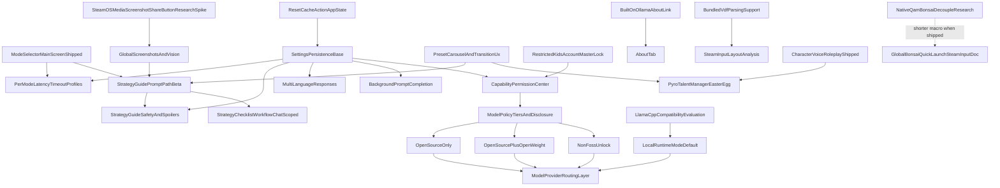

# bonsAI Roadmap

## Hard feature freeze — imminent release accountability

**Window:** **2026-04-20** through **release Sunday, April 26, 2026** (calendar end of freeze = ship target day).

**Counsel + judge:** Release priorities for this week are argued under **Red Team vs Blue Team** with a **human judge** in [red-blue-fight-2026-04-20.md](red-blue-fight-2026-04-20.md). **Check-in:** Monday 2026-04-20 **5:30 PM (17:30)** `America/New_York`; **bout:** same day **11:30 PM (23:30)** `America/New_York` (see that file for the legal-report template).

**Priority order** (follow before scheduling new work):

1. **Ship release** — versioning, [CHANGELOG.md](CHANGELOG.md), install smoke, [prompt-testing.md](prompt-testing.md) matrices as applicable, [development.md](development.md) release process.
2. **Trim the fat** — **Settings tab first** (reduce noise, consolidate sections, improve scanability: grouping, progressive disclosure, shorter helper copy). **Other product/UX** only after Settings is acceptably calm. **Code / bundle / doc noise** last; do not let it distract from Settings.
3. **Bugfixes** — from [Known bugs](#known-bugs) and QA triage; release-blocking first.
4. **Testing / regression** — device runs; `scripts/build.ps1` / `scripts/build.sh` per contributor workflow.
5. **Documentation** — user-facing accuracy, [troubleshooting.md](troubleshooting.md) as needed.
6. **No new features** — no additions to shipped behavior unless **release-blocking** or **required to trim safely** (e.g. removing a surface without breaking consent or capability gates).

**Chopping block:** Anything **not yet implemented** under [In progress](#in-progress), [Up next](#up-next), or [Planned candidates (not shipped)](#planned-candidates-not-shipped) is **default deferred** until after this window unless it has a **one-line MVP proof** (user-visible value, risk, why deferring harms users). Otherwise tag **`DEFERRED`** or move to a short post-release stub.

**Reading contract:** Execute the priority order above before pulling scope from **Up next** or **Planned candidates**.

---

Operational setup, firewalls, and vision tuning live in [troubleshooting.md](troubleshooting.md); QA and regression matrices live in [prompt-testing.md](prompt-testing.md).

In-progress work, bugs, and **Up next** are first. **[Completed](#completed)** is the canonical shipped checklist. Detailed backlog notes (shipped vs planned) follow. For refactor sweep notes, see [refactor-specialist-sweep.md](refactor-specialist-sweep.md).

Star ratings use the GTA scale: `★` easiest … `★★★★★` very high complexity; `★★★★★★` extreme scope.

---

## In progress

**Freeze:** Continue only **release-blocking** work here; otherwise pause or document a **minimal shippable** slice for Sun 2026-04-26. Phase 2 QAMP stays blocked.

- ★★★ **QAMP Reflection (Phase 1 — Safe Default):** Show applied-state confirmation and explicit verification guidance when QAM sliders do not immediately mirror hardware writes.
  - Requirement: every BonsAI performance action must be user-verifiable after execution.
  - Initial behavior: keep sysfs write path as source of truth and guide users to re-open QAM Performance to verify reflected values.

## Known bugs

- ★ **Question Overlay Alignment Drift:** The 3-line question overlay has minor horizontal spacing mismatch vs native `TextField` internals.
- ★★ **D-pad Scroll Bottom Cutoff:** Controller navigation can stop before the final response chunk is fully visible even when touch scroll can reach it.

## Up next

**Frozen:** Items below are **not for pre-release pickup** unless they pass the **chopping block** MVP bar at the top of this doc **and** are explicitly scheduled post-release—or are **release-blocking**.

- ★★ **Text Ask model preference chains (user-configurable):** Screenshot/vision tries an ordered fallback list per Ask mode in `[refactor_helpers.py](../refactor_helpers.py)` (`select_ollama_models(..., requires_vision=True)`). **Text-only** paths still use the same fixed per-mode lists today. Add Settings (or import/export JSON) so users can define **ordered text model tags per mode** (Speed / Strategy / Expert), with validation, sane defaults matching the shipped lists, and the same try-next-on-`model not found` behavior as vision.
- ★★ **Ollama model VRAM retention:** Plugin-side setting for how long the Ollama host keeps the loaded model in VRAM after a request completes (maps to Ollama `**keep_alive`** on each generate/chat call). **Default: 5 minutes.** Shorter values free VRAM sooner for other GPU work; longer values reduce cold-load latency when asking again in quick succession.
  - **Shorter than default:** 3 min, 2 min, 1 min, 30 s, 15 s, **0** (unload immediately after the request).
  - **Longer than default:** 15, 30, 45, 60, 120, 240 **minutes**.
- ★★ **Prompt Testing and Tuning:** Systematically validate prompt quality across games and scenarios (see [prompt-testing.md](prompt-testing.md)).
- ★★ **Random character avatar = “?”:** In the character picker and main-tab avatar affordance, show a **simple “?”** mark (typographic or minimal glyph) for **Random** instead of a dice / multi-face / catalog preview icon — keeps “unknown voice” obvious at a glance.
- ★★ **Debug tab opt-in (Settings):** Hide the **Debug** tab by default; add a **Settings** toggle (persisted) to **show the Debug tab** for power users. When the tab is hidden, **controller/touch navigation** must not land on a non-existent tab (filter tab list / remap focus); if the user turns the toggle **off** while already on Debug, **switch to a safe tab** (e.g. Main) and clear stale debug-only UI state as needed.
- ★★★ **QAMP Verification Checklist:** Verify behavior across per-game profile modes, QAM reopen, Steam restart/reboot, and GPU-related recommendations.
  - Verify behavior with per-game profile on/off.
  - Verify behavior after closing and reopening the QAM Performance tab.
  - Verify behavior after Steam restart and full reboot.
  - Verify behavior when prompt includes GPU clock recommendations.
- ★★★ **Character-derived UI accent (preset only):** When **AI character** is on and a **fixed catalog preset** is selected, drive plugin accent UI from a **distinctive color** sampled or defined for that preset’s avatar (highlights = main tone; borders/glows/muted fills = **darker** derivative). **AI character off**, **Random**, and **Custom** character paths keep today’s **forest green** accent system unchanged (including mode selector, tab active glow, chips, and related tokens).
- ★★★★★ **QAMP Reflection (Phase 2 — Experimental Opt-In):** Attempt Steam profile sync only behind explicit warning toggles. *Blocked on Phase 1.*
  - Risks: undocumented internals, Steam update breakage, restart/reboot requirements, and profile corruption risk.
  - Candidate path: fragile `config.vdf` / protobuf edits gated behind experimental mode only.

---

## Completed

Headings group related work. Star counts match the historical list.

### First-run and prompts

- ★ **Beta Disclaimer Modal:** Show one-time experimental-software warning with risk acknowledgment and bug-report link.
- ★ **Suggested AI Prompts:** Show curated prompt presets, randomize initial suggestions, and generate contextual follow-ups after responses.
- ★★ **Input sanitizer lane (hybrid):** Deterministic Ask cleanup and conservative block before Ollama; default on; no Settings UI. Magic phrases `bonsai:disable-sanitize` / `bonsai:enable-sanitize` (exact whole message, trim + casefold) persist `input_sanitizer_user_disabled` via `save_settings` and return confirmation without calling the model. Backend `backend/services/input_sanitizer_service.py`, `main.py` (`ask_game_ai` / `start_background_game_ai`); frontend types and completion path in `src/index.tsx`; phrase constants in `src/data/inputSanitizerCommands.ts`.
- ★★★ **Input Handling Transparency Panel:** Main tab **Input handling (last Ask)** shows raw input, sanitizer path, system/user text sent to Ollama, model name, and raw vs final reply; **Run original** / **Copy JSON**. Optional Settings **Verbose Ask logging to Desktop notes** (`desktop_ask_verbose_logging`) appends full trace markdown to `bonsai-ask-trace-YYYY-MM-DD.md` when filesystem writes are allowed. Backend `get_input_transparency`, `_persist_input_transparency`, `append_desktop_ask_transparency_sync` in `desktop_note_service.py`; `main.py`; UI `MainTab.tsx`, `src/utils/inputTransparency.ts`.

**Also counted in shipped baseline (not separate checklist lines above):** background prompt completion (V1); Linux Ollama compatibility.

### Connection, routing, diagnostics, and timeouts

- ★★ **Ollama Network Routing Fix:** Route frontend requests through Decky backend (`call("ask_game_ai", ...)`) to resolve cross-origin failures.
- ★★ **Deck and PC Connection Settings:** Add connection-focused settings including visible Deck IP and PC IP management.
- ★★ **Diagnostic, Latency, and Timeout Warnings:** Return `elapsed_seconds`, show slow-response warnings, and enforce backend timeout messaging.
- ★★ **Configurable Latency and Timeout Controls:** Persisted warning + timeout in `settings.json`; Settings Connection uses one Steam `SliderField` for hard timeout with a visible soft-warning readout (`ConnectionTimeoutSlider.tsx`), and ordering is reconciled on load/updates.

### Tabs, icons, and unified ask flow

- ★★ **Iconography Pass (Tabs + Plugin + Ask Button):** Add icons to all tabs (bonsAI bonsai-tree icon, Settings gear, Debug bug, About unchanged), switch plugin icon to bonsai SVG, and show the stock diamond beside `Ask` text.
- ★★ **Persist Last Question and Answer:** Restore prior session state when reopening QAM via Decky settings storage.
- ★★ **Unified Search + Ask Input:** Merge settings search and AI question entry into one shared input flow.
- ★ **Preset Chip Fade Opt-Out:** Settings `ToggleField` **Preset chip fade animation** (persisted `preset_chip_fade_animation_enabled`, default on). When off, main-tab suggestion chips stay opaque and rotate prompts without opacity transitions; post-Ask re-seed unchanged. `PresetAnimatedChips.tsx`, `MainTab.tsx`, `settingsAndResponse.ts`, `settings_service.py`.
- ★★★ **Mode selector (main screen):** Persisted `ask_mode` (`speed` / `strategy` / `deep`, UI labels Speed / Strategy / Deep). Compact outline control (green / bronze / gold) on the unified input strip, left of mic/stop, opens an anchored popover menu to change mode (no layout reflow); D-pad focus order is text field → mode → mic/stop. Backend orders Ollama model fallbacks per mode in `refactor_helpers.py`; `start_background_game_ai` includes `ask_mode`. `src/data/askMode.ts`, `src/components/AskModeMenuPopover.tsx`, `MainTab.tsx`, `index.tsx`, `settingsAndResponse.ts`, `settings_service.py`, `main.py`.

**Baseline index:** preset carousel and transition UX (Phase 1 — fade/hold; manual arrows deferred).

### AI-assisted power and long-response UX

- ★★★ **TDP Automation via AI Output:** Parse AI recommendations and apply constrained TDP values through safe sysfs write paths.
- ★★★ **D-pad Response Scrolling:** Split long responses into focusable chunks for controller-first navigation.

### Steam Input

- ★★★★★ **Steam Input Jump (Phase 1):** Debug tab jump to per-game controller config via `steam://controllerconfig/{appId}` (`SteamClient.URL.ExecuteSteamURL`), versioned lexicon in `src/data/steam-input-lexicon.ts`, helper in `src/utils/steamInputJump.ts`. Documented in [steam-input-research.md](steam-input-research.md). **Phase 2+** (indexed search, full catalog, ranked results) is **not** planned to continue.

### About tab and main surface polish

- ★ **Built on Ollama Link (About Tab):** “Built on Ollama” button in About opens `https://github.com/ollama/ollama` via `Navigation.NavigateToExternalWeb` (toast fallback), wired from `OLLAMA_UPSTREAM_REPO_URL` in `src/index.tsx` and `src/components/AboutTab.tsx`.
- ★★ **Search Surface Glass Pass (Unified Input):** Glass-style unified search field and ask bar (~25% fill, blur, light edge), 50% opacity on corner action icons, dynamic height for the input shell from wrapped text, AI answer chunks use matching glass instead of near-black panels.

### Desktop notes (Game Mode → Desktop)

- ★★★ **Desktop Mode Debug Note Save (Steam Deck, V1):** After a successful ask, **Save to Desktop note…** on the main tab opens a consent + name dialog; append-only writes to `~/Desktop/BonsAI_notes/<name>.md` with UTC timestamps and Q+A (`append_desktop_debug_note` in `main.py`, `backend/services/desktop_note_service.py`, `DesktopNoteSaveModal` + `MainTab` in `src/`).
- ★★★ **Desktop Mode Debug Note Save — Daily chat auto-save (V2):** Settings tab toggle (`desktop_debug_note_auto_save`, default off). When enabled with Filesystem writes, each **Ask** and each **AI response** append to `~/Desktop/BonsAI_notes/bonsai-chat-YYYY-MM-DD.md` (UTC calendar day); Ask entries list attached screenshot paths. Backend `append_desktop_chat_event`; `src/index.tsx` Settings + ask/response hooks.

### Permissions and capability gating

- ★★★★ **Capability Permission Center (User-Controlled Access):** Permissions tab (lock icon, same title scale as other tabs) with toggles for filesystem writes, hardware control (TDP apply), media library access (screenshot attach), and external/Steam navigation (About links, Debug Steam Input jump). Persisted `settings.json` `capabilities`; new installs default OFF; legacy installs without a `capabilities` block are grandfathered ON until saved. Backend enforces gates on `append_desktop_debug_note`, `append_desktop_chat_event`, `list_recent_screenshots`, ask-with-attachments, TDP apply, `capture_screenshot`. Files: `backend/services/capabilities.py`, `PermissionsTab`, `main.py`, `src/utils/settingsAndResponse.ts`.

**Baseline index:** global screenshots and vision (V1) — multimodal attach; uses media-related capability paths.

### Character voice roleplay

- ★★★ **Character Voice Roleplay Mode (Opt-In):** Default-off **AI character** in Settings (small caps label); fullscreen `CharacterPickerModal` with per–work-title groups, **Random** toggle, custom line, OK/Cancel; unique pixel emoticons; main-tab glass avatar opens picker; backend `ai_character_service.build_roleplay_system_suffix` appends roleplay instructions to the Ollama system prompt. `src/data/characterCatalog.ts`, `src/components/CharacterPickerModal.tsx`, `main.py`, `settings.json` fields `ai_character_*`.
- ★★ **Character Accent Intensity Levels (Doom-Style Copy):** Settings **Accent intensity** horizontal chips (`subtle` / `balanced` / `heavy` / `unleashed`, default `balanced`) when AI characters are on; Doom-difficulty–flavored short labels and helper copy. Persisted `ai_character_accent_intensity`; `build_roleplay_system_suffix` varies dialect/accent strength for presets, random, and custom paths without changing TDP/JSON policy. `src/data/aiCharacterAccentIntensity.ts`, `src/index.tsx`, `backend/services/ai_character_service.py`, `settings_service.py`, `settingsAndResponse.ts`.
- ★★ **Running-game character suggestions (AI picker):** On `CharacterPickerModal` open, read `Router.MainRunningApp`, resolve 1–3 catalog presets via `src/utils/runningGameCharacterSuggestions.ts` (Steam AppID map + normalized title match + TF2 merge), show **Playing:** headline and suggestion row with `CharacterRoleplayEmoticon`; async after first paint with delayed spinner (~160 ms); D-pad links Random, suggestions, column 0, and custom field.

---

## Detailed future reference

Longer notes for backlog items: **Shipped feature reference** (extra context, deferred phases, extensions) vs **Planned candidates**. Canonical checklist: [Completed](#completed).

### Vision screenshot model order (canonical)

When a screenshot is attached, `select_ollama_models(..., requires_vision=True)` in `[refactor_helpers.py](../refactor_helpers.py)` picks the try-next chain. Defaults are **FOSS-first** and **~16GB VRAM–friendly** (llava / qwen2.5vl first, then smaller open-weight multimodal tags). **Settings → Model policy → Allow high-VRAM model fallbacks** appends large tags (e.g. 31B / 38B class) after the safe chain. **Speed** prefers the smallest FOSS vision tags first; **Strategy** leads with `qwen2.5vl:latest`; **Expert** prefers stronger FOSS vision within the safe list before open-weight midsize tags. Exact strings evolve with the Ollama library; install the tags you care about on the host.

---

## Shipped feature reference (backlog mirror)

> Items here are also listed in **Completed**. This subsection keeps roadmap-style detail and follow-on notes.

### Character accent intensity levels (Doom-style copy)

★★

**Shipped** — see **Completed** → Character voice roleplay; `ai_character_accent_intensity`; backend varies by `subtle` / `balanced` / `heavy` / `unleashed`.

### Higher-resolution character avatars (GTA-style art pass)

★★★

- **Status (V1):** Shipped — unified 16×16 SVG placeholder emoticon grids (`expand8To16`, hand-tuned bust overrides); `src/components/characterPlaceholderEmoticonGrids.ts`, `CharacterRoleplayEmoticon.tsx`.
- **Goal:** Improve recognizability with higher-resolution art that stays clear at small sizes; GTA-inspired cel-shaded, graphic-novel direction; TF2 Announcer keeps bonsai-tree treatment.
- **Files:** `src/data/characterCatalog.ts`, `src/components/CharacterPickerModal.tsx`, `src/components/MainTab.tsx`, `src/index.tsx`, `src/assets/`.
- **Depends on:** character voice roleplay + existing catalog mapping.
- **Not in scope:** changing roleplay prompt behavior, animation/VFX, or unapproved third-party likeness assets.

### Input sanitizer lane (hybrid + user override) — extensions

★★★

**Baseline shipped** — see **Completed** → Input sanitizer lane.

- **Future goal:** Optional small-model rewrite path, harmful-input block path, explicit **Use original input** bypass beyond current hybrid behavior.
- **Files:** `main.py`, `src/index.tsx`, prompt-policy docs.
- **Depends on:** settings persistence and transparent input handling.
- **Not in scope:** hidden rewriting with no user visibility or override.

### Input handling transparency panel

★★★

**Shipped** — see **Completed** → Input Handling Transparency Panel.

### Desktop mode debug note save (Steam Deck)

★★★

**V1 and V2 shipped** — see **Completed** → Desktop notes.

- **Possible follow-ups:** natural-language save triggers, optional raw-response export.
- **Not in scope:** arbitrary paths outside `~/Desktop/BonsAI_notes/`, silent writes without permission, or replacing note content by default.

### Preset carousel and transition UX

★★★★

- **Status (Phase 1):** Shipped — three chips, staggered fade, length-based hold; `PresetAnimatedChips.tsx`, `src/data/presets.ts`, scoped CSS in `src/index.tsx`; notes in `docs/prompt-testing.md`.
- **Deferred:** lower-right arrow controls for manual next/previous and controller focus (not in Phase 1).
- **Goal (full vision):** Carousel navigation controls as above.
- **Depends on:** existing preset randomization/category logic.
- **Not in scope:** changing core preset taxonomy/model routing.

### Capability Permission Center (user-controlled access)

★★★★

**Shipped** — see **Completed** and baseline index. Ollama/LAN ask traffic is not gated as “web.”

- **Not in scope (future):** first-use modals per capability beyond blocked-action toasts; separate toggles for sudo vs direct sysfs (currently under Hardware control).
- **Planned extension (not shipped):** `**network_web_access`** — Permission Center toggle (default TBD) covering outbound HTTP/HTTPS from the Deck plugin; ties to **RAG knowledge base** below.

### Steam Input settings search + jump (research-first)

★★★★★

- **Phase 1 shipped** — see **Completed** → Steam Input Jump. **Phase 2+ deferred** unless revived: indexed catalog, unified search, ranked results, Edit Layout enumeration.
- **Goal (if resumed):** Search setting names and navigate to relevant surfaces; deep-link feasibility gated.
- **Files:** `src/index.tsx`, `main.py`, [steam-input-research.md](steam-input-research.md).
- **Depends on:** route-discovery research and fallback UX.
- **Not in scope:** private UI patching or brittle route injection.

### Global screenshots and vision (implemented V1)

★★★★★

**Shipped** — see **Completed** / baseline index.

- **Strategy extension:** screenshot + game context for strategy guidance; inline visual aids when available.
- **Files:** `main.py`, `src/index.tsx`, install/troubleshooting docs.
- **Depends on:** vision-capable models on host PC.
- **Not in scope:** continuous video streaming.

---

## Planned candidates (not shipped)

**Frozen:** No implementation during this release window except work tied to **trim-the-fat**, **bugfixes**, or **release mechanics** (see **Hard feature freeze — imminent release accountability** at the top of this file).

> **Planning only** — ranked by effort/risk (easiest to hardest within star bands). Do not treat as an implementation order.

### Per-mode latency/timeout profiles

★★★

- **Goal:** Separate warning and timeout values per selected mode.
- **Primary work:** mode-keyed settings schema and runtime value resolution.
- **Files:** `main.py`, `src/index.tsx`.
- **Depends on:** **Mode selector (main screen)** (shipped).
- **Not in scope:** per-game/per-model fine-grained profile matrix.

### Ollama model VRAM retention (keep_alive)

★★

- **Goal:** Let users tune how long the Ollama server keeps the model resident in VRAM after each Ask completes, trading VRAM headroom on the host against reload latency for the next request.
- **Primary work:** Persisted plugin setting; pass the chosen duration into Ollama on each relevant API call (`keep_alive`); Settings UI with fixed presets (no free-form typing).
- **Default:** 5 minutes.
- **Preset list:** **0** (eject immediately), 15 s, 30 s, 1 / 2 / 3 min (shorter than default), **5 min** (default), then 15 / 30 / 45 / 60 / 120 / 240 min (longer than default).
- **Files:** `main.py`, `backend/services/ollama_service.py`, Settings surface in `src/index.tsx`, `settings_service.py`, `settingsAndResponse.ts`.
- **Depends on:** Decky → Ollama request path and settings persistence (shipped baseline under **Connection, routing, diagnostics, and timeouts**).
- **Not in scope:** Per-model or per-game retention profiles; editing the Ollama daemon’s global config on disk outside what each request specifies.

### Character-derived UI accent theme (preset-selected)

★★★

- **Goal:** Tie visible accent color to the **selected catalog character** so the plugin feels co-branded with that persona. **Exclusions:** no change to the default **bonsAI forest green** when AI character is **disabled**, when **Random** is on, or when **Custom** text is used — those three states stay on the current green token set for predictability and accessibility.
- **Visual contract:** One **main accent** (highlights, primary outlines, key fills) and one **subtle accent** (dimmer borders, soft glows, low-contrast chips) derived as a **darker** (or lower-chroma) variant of the main color; avoid relying on opacity alone where contrast matters.
- **Primary work:** Per-preset **accent source** in catalog data (hex from art direction, or programmatic extract from the preset’s emoticon/SVG with a fallback list); CSS variables or equivalent scoped theme on `.bonsai-scope` (or root) switched when `ai_character_enabled` + fixed `ai_character_preset_id` + not random + not effectively custom; audit surfaces already using forest tokens (`MainTab`, mode menu, tabs, preset chips, Settings character row, etc.).
- **Files (expected):** `src/data/characterCatalog.ts` (or parallel `characterAccent.ts`), `src/index.tsx` scoped CSS / token wiring, `MainTab.tsx`, `CharacterPickerModal.tsx`, shared constants if extracted from `src/features/unified-input/constants.ts` or similar.
- **Depends on:** **Character voice roleplay** (shipped); stable preset ids.
- **Not in scope:** Per-game accent overrides; animating hue shifts; changing Ollama or roleplay prompt content solely for theming.

### Random character “?” avatar (picker + main)

★★

- **Goal:** Replace the current **Random** visual (e.g. dice / composite preview) with a **single “?”** treatment everywhere the random mode is shown as an avatar (picker tile, main-tab glass avatar when random is active, any other summary chip).
- **Primary work:** Icon or text component branch for `ai_character_random === true`; ensure focus rings and hit targets stay Deck-friendly; optional tooltip still explains random selection behavior.
- **Files:** `CharacterPickerModal.tsx`, `MainTab.tsx`, `CharacterRoleplayEmoticon.tsx` / grid helpers if Random currently maps to a special emoticon.
- **Depends on:** **Character voice roleplay** (shipped).
- **Not in scope:** Changing random roll logic or backend `build_roleplay_system_suffix` behavior.

### Debug tab hidden by default (Settings toggle)

★★

- **Goal:** Reduce accidental exposure of technical surfaces for typical users: the **Debug** tab is **off the tab strip by default** and only appears after the user enables **Show Debug tab** (or similarly named) on the **Settings** tab. Power users and contributors keep a one-time, persisted path to the same tools as today.
- **Primary work:** New persisted boolean in `settings.json` (e.g. `show_debug_tab`, default **false**); Settings `ToggleField` with short helper copy; build the `<Tabs tabs={...}>` list from a filtered array so the Debug entry is omitted when disabled; on toggle **off** while `currentTab === "debug"`, programmatically select **Main** (or Settings) and optionally toast that Debug was hidden; verify D-pad / LB–RB order matches the visible tab count only.
- **Files:** `src/index.tsx` (tabs definition + `onShowTab` / restore paths), Settings block in same file or extracted component, `settings_service.py`, `settingsAndResponse.ts`, default in backend settings load for installs missing the key (**false**).
- **Depends on:** **Settings persistence** (shipped); existing **Debug** tab content unchanged once visible.
- **Not in scope:** Hiding individual rows inside Debug while the tab exists; password-gating the toggle; remote kill-switch without user action.

### Multi-language responses

★★★

- **Goal:** Respond in user/Steam language with optional override.
- **Primary work:** language detection, prompt localization instruction, optional override persistence.
- **Files:** `main.py`, `src/index.tsx`.
- **Depends on:** settings persistence already present.
- **Not in scope:** full UI localization of plugin labels.

### Search results density + live match emphasis

★★★

- **Goal:** Tighter, more scannable results: spacing, wider lines, incremental filtering, highlighted match tokens.
- **Files:** `src/index.tsx`, prompt/search UX test notes.
- **Depends on:** unified search indexing and response-state handling.
- **Not in scope:** changing ranking semantics for unrelated search domains.

### Reset cache action (app state)

★★★

- **Goal:** One user action clears cached unified search text and current AI response.
- **Primary work:** UI control, clear local storage + in-memory response state, explicit/confirmable behavior.
- **Files:** `src/index.tsx`, optional settings/docs references.
- **Depends on:** unified input persistence + response state handling.
- **Not in scope:** clearing host-side Ollama history or deleting screenshot files.

### Debugging and Proton log analysis

★★★

- **Goal:** Attach relevant Proton/game logs to troubleshooting prompts.
- **Primary work:** log discovery, truncation/filtering, context injection.
- **Files:** `main.py`, `src/index.tsx`.
- **Depends on:** active-game context.
- **Not in scope:** enabling Proton logging automatically.
- **Risk note:** limited value unless users already run with `PROTON_LOG=1`.

### System prompt reorder and general-purpose assistant clause

★★★

- **Status:** Planned (documentation only; implementation backlog TBD — see [rag-sources-research.md](rag-sources-research.md)).
- **Goal:** Reorder Ollama **system** message: dynamic game/attachment/vision first, then general-knowledge block (Deck/gaming primary expertise but general-purpose for other topics), optional RAG snippets, **TDP limits and JSON contract last**.
- **Primary work:** refactor `build_system_prompt` in `backend/services/ollama_service.py`; keep AI character prefix in `main.py` when enabled.
- **Files:** `backend/services/ollama_service.py`, `main.py`, `docs/prompt-testing.md` after behavior change.
- **Depends on:** none.
- **Not in scope:** changing the JSON schema for TDP/GPU recommendations.

### Strategy Guide prompt path (beta)

★★★★

- **Goal:** Strategy-focused path for “how do I beat this level” and related prompts.
- **Primary work:** strategy intent routing, coaching-first format, prompt scaffolding.
- **Expected UX:** strategy preset switches to `Strategy Guide` mode with placeholder like `Describe the level or problem`.
- **Includes:** Steam Input-aware recommendations when control friction matters.
- **Policy:** optional `Cheat / Fast Pass` only when user asks for speedrun/shortcut guidance.
- **Files:** `src/index.tsx`, `main.py`, `prompt-testing.md`.
- **Depends on:** **Mode selector (main screen)** (shipped).
- **Not in scope:** guaranteed perfect walkthroughs for every title.

### Strategy Guide safety and spoilers

★★★★

- **Goal:** Useful strategy help without unwanted spoilers by default.
- **Primary work:** spoiler-safe policy, explicit consent for unrestricted spoilers, tap-to-reveal blocks.
- **Settings note:** optional setting to show spoilers directly after consent.
- **Files:** `src/index.tsx`, `main.py`, `prompt-testing.md`.
- **Depends on:** **Strategy Guide prompt path (beta)**.
- **Not in scope:** hard guarantees in every edge case.

### Steam Input layout analysis

★★★★

- **Goal:** Parse controller VDF configs and feed actionable control context to AI.
- **Primary work:** config discovery, VDF parsing, normalization to human-readable actions.
- **Files:** `main.py`, `src/index.tsx`.
- **Depends on:** bundled VDF parser support.
- **Not in scope:** editing/writing controller configs.

### Offline intent pack exchange (local JSON)

★★★★

- **Goal:** Import/export user-created offline search intent packs (aliases, synonyms, expansions) without cloud dependence.
- **Primary work:** local JSON schema, add/edit/export/import, merge conflict rules.
- **Files:** `src/index.tsx`, `main.py`, docs/usage references.
- **Depends on:** stable search indexing and local storage schema versioning.
- **Not in scope:** remote-hosted catalogs or mandatory online sync.

### Model policy tiers + disclosure UX

★★★★

- **Goal:** Separate open-source and open-weight access with explicit unlock for non-FOSS models.
- **Required behavior:** Tier 1 default `Open-Source only`; Tier 2 `Open-Source + Open-Weight`; Tier 3 `Non-FOSS` via explicit unlock; disclosure label every response; `Read more` links in disclosure and permission rows.
- **Primary work:** model-source metadata, tiered policy in Settings, route guard, disclosure UI, doc links.
- **Files:** `src/index.tsx`, `main.py`, docs/about/permissions references.
- **Depends on:** **Capability Permission Center** and stable model routing.
- **Not in scope:** legal guarantees beyond documented metadata.

### Llama.cpp compatibility evaluation (research spike)

★★★★

- **Goal:** Evaluate first-class llama.cpp runtime/provider support.
- **Primary work:** API formats, streaming, model management, tokenizer/context, Deck constraints.
- **Expected output:** go/no-go, phased path, risk matrix.
- **Files:** `main.py`, runtime/provider abstraction docs, troubleshooting docs.
- **Not in scope:** shipping full production support in the spike.

### Local runtime mode (default) + beta risk warning

★★★★★

- **Goal:** Prefer on-device inference by default; retain remote fallback.
- **Primary work:** `local first` policy, fallback heuristics, health checks, beta warning for in-game inference risk.
- **Files:** `main.py`, `src/index.tsx`, install/troubleshooting docs.
- **Depends on:** provider routing and **Llama.cpp compatibility evaluation** outcomes.
- **Not in scope:** zero performance impact guarantees under heavy load.

### Restricted kids account master lock

★★★★★

- **Goal:** Disable plugin capabilities when Steam reports a restricted kids account; restore when full account returns.
- **Primary work:** parental-restriction detection, global lock above capability checks, banner lifecycle.
- **Required behavior:** lock forces permissions off/blocked while restricted; message clears when full account detected.
- **Files:** `main.py`, `src/index.tsx`, settings/help docs.
- **Depends on:** **Capability Permission Center** and a detectable Steam signal.
- **Not in scope:** bypassing platform restrictions or separate auth systems.

### Strategy checklist workflow (chat-scoped)

★★★★★

- **Goal:** Strategy Guide responses with actionable checklists for the current chat.
- **Primary work:** checklist format, interactive check/uncheck, follow-up sync when user reports progress in text.
- **Files:** `src/index.tsx`, `main.py`, `prompt-testing.md`.
- **Depends on:** **Strategy Guide prompt path (beta)**.
- **Not in scope:** long-term persistence across sessions.

### Native QAM entry for BonsAI (beneath Decky icon) — decouple research

★★★★★★

- **Goal:** A separate Quick Access Menu (QAM) left-rail entry for BonsAI **directly beneath the Decky Loader icon**, so a Guide-chord macro (and manual navigation) can reach BonsAI with **fewer steps** than the current path through the Decky plugin list (see [troubleshooting.md](troubleshooting.md) § BonsAI shortcut setup).
- **Why not a plugin-only change:** QAM sidebar tiles are governed by the **Steam client** and **Decky Loader** host; individual plugins cannot register a sibling QAM icon from `plugin.json` alone.
- **Research tracks:**
  1. **Decky Loader / plugin API:** Upstream support for pinned QAM entries, deep-linking straight into a plugin, or a launcher row under Decky (docs/issues; may require upstream contribution).
  2. **Steam / SteamOS:** Whether Valve exposes stable third-party QAM tiles without Decky as intermediary (treat as **assumption until validated**).
  3. **Standalone or companion host:** What a non-Decky BonsAI surface would cost (separate surface, Decky-only APIs, TDP/sysfs paths, distribution) — long-range path if (1–2) are unavailable.
- **Related:** **Global BonsAI quick-launch via Steam Input macro** below; when a native entry exists, refresh the macro sequence in [troubleshooting.md](troubleshooting.md).
- **Not in scope:** Shipping a forked Steam client or undocumented UI injection as the default approach.

### Global BonsAI quick-launch via Steam Input macro (documentation spike)

★★★★★

- **Goal:** Near-instant BonsAI from in-game or Home via Guide chord → QAM → Decky → BonsAI.
- **Primary work:** Document and test optimal macro sequence (user-specific QAM tab order).
- **Files:** `README.md`, `docs/development.md`.
- **Depends on:** native Steam Input (Guide chord) and QAM layout.
- **Related / future UX:** Today’s path assumes **Decky as intermediary**. **Native QAM entry for BonsAI (beneath Decky icon) — decouple research** (above) is the target way to **shorten the macro** once platform or Decky support exists.
- **Assessment:** High value; until a native QAM entry exists, maintenance is mostly documentation and macro tuning. Any future Decky/Steam glue for deep-link or QAM registration would be bounded, small-scope integration — not “zero” work, but still no evdev or DOM hacks.
- **Not in scope:** evdev sniffing, WebSockets, React DOM hacks.

### Pyro talent-manager easter egg (hidden preset)

★★★★

- **Goal (easter egg):** When the user selects **Pyro** (`tf2_pyro`), Pyro has no intelligible in-universe voice — roleplay switches to Pyro’s **representative / Hollywood-style media manager** (Entourage-adjacent hints: **Vince**, **E**, “the agency”) as parody voice archetype without claiming third-party likeness.
- **Persona:** Obnoxious agent energy — talks about themselves, bragging; **self-aware** about existing inside BonsAI; **moonlights** as an OSS advocate and nudges the player toward **testing or contributing** to the repository (playful, not deceptive).
- **Secret tip mechanic:** At the end of (some) replies, the manager **tips a hidden preset**; the UI **injects** it into the main-tab suggestion carousel as a distinguished chip.
- **Carousel exception:** Injection may appear **after** the normal post-mount carousel rest window (`PRESET_CAROUSEL_ACTIVE_MS`, 60 s in `src/components/PresetAnimatedChips.tsx`) — an explicit exception to the usual “no new cycles after session end” behavior for this chip only.
- **Chrome:** That chip uses a **persistent orange–red outline** until cleared (exact design token TBD at implementation).
- **Clear conditions:** Clear the injected chip styling / pin when the user **sends the next Ask** or **resets the plugin session** (implementation TBD: Decky reload vs explicit in-app reset).
- **Primary work:** Special-case roleplay branch in `backend/services/ai_character_service.py` (or adjacent helper); optional **structured metadata** from backend (preset id / inject flag) vs fragile reply parsing (open design choice); `PresetAnimatedChips.tsx`, `MainTab.tsx` / `src/index.tsx` for highlight/inject lifecycle.
- **Depends on:** **Character voice roleplay (shipped)**; preset carousel behavior in **Preset carousel and transition UX** (shipped Phase 1).
- **See also:** [voice-character-catalog.md](voice-character-catalog.md) (Pyro / voice handling); compare current `tf2_pyro` style hint (“wordless playful menace”).
- **Not in scope:** Ensuring the joke lands in every locale or model.

### Voice command input

★★★★★

- **Goal:** Record voice on Deck, transcribe to prompt via local Whisper service.
- **Primary work:** PipeWire recording, transcription RPC, UI states.
- **Files:** `main.py`, `src/index.tsx`, install/troubleshooting docs.
- **Depends on:** user-hosted Whisper endpoint.
- **Not in scope:** wake-word or always-on listening.

### VAC opponent check (phased)

★★★★★

- **Goal:** Flag likely opponents with VAC history during a session, with clear confidence messaging.
- **Phase 1:** Parse user-provided SteamIDs; query ban data.
- **Phase 2:** Live opponent extraction when metadata allows.
- **Primary work:** SteamID normalization, PlayerBans flow, cache/rate limits, confidence, warning UI.
- **Files:** `main.py`, `src/index.tsx`.
- **Depends on:** Steam Web API key and reliable opponent identities.
- **Risks:** private profiles, games without IDs, quota, privacy boundaries, incomplete-data UX.
- **Not in scope:** automated reporting, punitive automation, bypassing protections.

### RAG knowledge base (PC-hosted ingest + Deck query)

★★★★★

- **Status:** Planned — see [rag-sources-research.md](rag-sources-research.md).
- **Goal:** RAG with ChromaDB + `nomic-embed-text` (Ollama `/api/embed`) over a curated corpus; heavy work on user’s PC beside Ollama; Deck queries over LAN.
- **Architecture:** Ollama does not run ingestion — small PC companion (e.g. `bonsai-rag`), Chroma under `~/.bonsai/rag/chroma`, endpoints `POST /v1/refresh`, `POST /v1/query`; inject context **before** hardware + JSON tail in system prompt.
- **Developer tooling:** e.g. `scripts/build_rag_db.py` on dev PC; same embedding contract as runtime.
- **Settings:** plain-language disclosure; **Update knowledge on PC** after confirm; requires `**network_web_access`** when added.
- **Files (expected):** `ollama_service.py`, `main.py`, `capabilities.py`, `settings_service.py`, `settingsAndResponse.ts`, `PermissionsTab`, `pc/` or `scripts/`, `docs/development.md`, `rag-sources-research.md`.
- **Depends on:** Ollama on PC; `nomic-embed-text` pulled on host; optional Reddit API on PC only.
- **Legal:** respect ToS, robots, rate limits; no scraped corpora in git.
- **Not in scope (v1):** Deck-side scrapers, multi-GB DBs in-repo, automatic refresh without user action.

### Deep mod and port configuration manager

★★★★★★

- **Goal:** Detect mod frameworks/files; mod-aware AI guidance.
- **Primary work:** per-game path discovery, mod signals, context injection UX.
- **Files:** `main.py`, `src/index.tsx`.
- **Depends on:** reliable install and compatdata scanning.
- **Not in scope:** downloading/installing mods automatically.

---

## Cross-feature dependency summary

- **Mode selector (main screen)** (shipped: Speed / Strategy / Deep + model fallbacks) → **Per-mode latency/timeout profiles**, **Strategy Guide prompt path (beta)**.
- **Character voice roleplay (shipped)** → baseline for **Character accent intensity (shipped)**; presets in [voice-character-catalog.md](voice-character-catalog.md), [src/data/characterCatalog.ts](../src/data/characterCatalog.ts).
- **Character voice roleplay (shipped)** → **Pyro talent-manager easter egg (hidden preset)** (planned).
- **Character voice roleplay** + avatar mapping → **Higher-resolution character avatars (GTA-style art pass)**.
- **Character voice roleplay (shipped)** → **Character-derived UI accent theme (preset-selected)** (planned); **Random character “?” avatar** (planned); **Running-game character suggestions (AI picker)** (shipped — see **Completed** → Character voice roleplay).
- **Input sanitizer (shipped)** + **Input handling transparency (shipped)** → future sanitizer extensions should keep user-visible auditability.
- **Strategy Guide prompt path (beta)** → **Strategy Guide safety and spoilers**, **Strategy checklist workflow (chat-scoped)**.
- **Global screenshots and vision** → richer strategy + screenshot context.
- **Capability Permission Center** → gates filesystem, elevated tasks, hardware, and (future) web/search calls.
- **Model policy tiers + disclosure UX** → depends on **Capability Permission Center**; tiered routing.
- **Llama.cpp compatibility evaluation** → informs **Local runtime mode (default)**.
- **Local runtime mode (default)** → provider priority and remote fallback.
- **Restricted kids account master lock** → above permission toggles while restricted.
- **Built on Ollama link** → shipped in About.
- **SteamOS Media screenshot share button** → possible fast path into **Global screenshots and vision** if APIs allow.
- **Reset cache action** → unified-input persistence boundaries.
- **Preset carousel (Phase 1 shipped)** → extends presentation without changing category routing; **Pyro talent-manager easter egg** depends on it for inject + `PRESET_CAROUSEL_ACTIVE_MS` exception semantics.
- **Global BonsAI quick-launch via Steam Input macro** ↔ **Native QAM entry for BonsAI (beneath Decky icon) — decouple research** (shorter macro once a direct QAM tile exists).
- **Bundled VDF parsing** → **Steam Input layout analysis** (and optional deeper parsing).
- **Steam Input settings search + jump** → Phase 1 shipped; broader catalog deferred.
- **Offline intent pack exchange** → offline-first search quality.
- **Settings persistence** → mode profiles, language override, background completion metadata; **Debug tab hidden by default (Settings toggle)** (planned).

---

## Implementation notes

### Iconography pass — plugin list icon lesson

Decky sizes icons via CSS `font-size`. Font Awesome works because it renders `<svg width="1em">` which inherits that font-size. An `` with fixed pixel dimensions is ignored — pixel tweaks do not fix it. The fix was inlining SVG path data into `<svg width="1em" height="1em" fill="currentColor">` (`BonsaiSvgIcon`), matching Font Awesome. The ``-based `BonsaiLogoIcon` remains for tab headers where layout is controlled. The source SVG needs `viewBox` for scaling.