# bonsAI Roadmap

This document tracks **shipped** work (**[Completed](#completed)**), **active** engineering and QA (**[In Progress](#in-progress)**), and the **backlog** (**[Planned](#planned)**). Operational setup, firewalls, and vision tuning: [troubleshooting.md](troubleshooting.md). QA: [testing.md](testing.md) (run order, coverage, PR gates). Release process: [development.md](development.md), [CHANGELOG.md](../CHANGELOG.md).

Star ratings use the GTA scale: `★` easiest … `★★★★★` very high complexity; `★★★★★★` extreme scope.

---

## In Progress

Active features, maintainer tasks, and **known defects**. *QAMP Phase 1 (safe default) is [shipped](#ai-assisted-power-and-long-response-ux). Phase 2 (experimental profile sync) remains backlog-only.*

### Bugs

- ★ **Question Overlay Alignment Drift:** The 3-line question overlay has minor horizontal spacing mismatch vs native `TextField` internals.
- ★★ **D-pad Scroll Bottom Cutoff:** Controller navigation can stop before the final response chunk is fully visible even when touch scroll can reach it.

### Active work

- ★★ **Device QA runbook — Tier 0–1:** Execute [testing.md](testing.md#device-qa-runbook) **Tier 0** smokes (SMOKE-A, C, F) then **Tier 1** (SMOKE-B, E, H); update [testing.md](testing.md) **Shipped feature coverage** and scenario checkboxes with **Pass / Partial / Fail** + build id. Tier 2+ ongoing before release.
- ★ **VAC / `bonsai:vac-check` (Phase 1) — on-device QA:** Implementation [complete](#steam-input); finish **VAC-02…06** in [testing.md](testing.md) (Tier 2) after Tier 0 **SMOKE-F** passes.

---

## Planned

Stars are **effort/risk** within bands (GTA scale in the header). Items below are grouped by **horizon** — approximate sequencing intent, not a commitment — and **within each horizon sorted by ascending star rating** (ties keep a stable reading order).

- **Near-term:** Incremental product work, QA-heavy passes, or **bounded** research spikes that do not require new Steam/Decky platform APIs.
- **Medium-term:** Larger features (**★★★★**–**★★★★★★** when retaining ecosystem brainstorm rows **E–H**) that stay mostly inside the plugin + user-hosted stack.
- **Long-term:** ★★★★★★ scope and/or ★★★★★ work **gated on upstream APIs**, undocumented Steam internals, or unusually broad surface area.

Maintainers may move items between horizons after discussion; if you want different definitions (e.g. time-boxed quarters), say so in an issue or PR.

**The April 2026 release-window requirements freeze has ended.**

**GitHub tracking:** Each **Planned** item rated **★★★★★** or **★★★★★★** includes a placeholder link to **[bonsAI Issues](https://github.com/cantcurecancer/bonsAI/issues)** for eventual per-feature tickets (replace with a specific issue URL when created).

**Planned titles:** Short **noun-first** label (about 3-6 words, roughly one line); put secondary context in **parentheses** (brainstorm letter, phase, platform, research spike, dedup). Spell out detail under **Goal** / **Primary work**, not in the title.

### Near-term

Within this section: ascending stars (★★ → ★★★ → ★★★★). Brainstorm letters **B**, **J–N**, **S**, **V**: [roadmap_feature_ideas plan](../.cursor/plans/roadmap_feature_ideas_f5560e15.plan.md).

- ★★ **Prompt testing pass** (beyond shipped MVP)

  - **Goal:** Broader systematic validation and tuning beyond the shipped doc MVP (see **Completed** → Prompt-testing MVP; working matrices in [testing.md](testing.md)).

- ★★ **Text model chains** (user-configurable text fallbacks)

  - **Goal:** Vision Ask paths already use ordered fallback lists per mode via `[refactor_helpers.py](../refactor_helpers.py)` (`select_ollama_models(..., requires_vision=True)`). **Text-only** paths still use fixed lists today. Add Settings (or import/export JSON) so users define **ordered text model tags per mode** (Speed / Strategy / Expert), with validation, sane defaults matching shipped lists, and try-next-on-`model not found` parity with vision.
  - **Primary work:** settings schema, wiring into model selection for non-vision asks.
  - **Files:** `refactor_helpers.py`, `main.py`, `settings_service.py`, `settingsAndResponse.ts`, Settings UI as needed.
  - **Depends on:** shipped Ask routing + vision fallback behavior (reference implementation).
  - **Not in scope:** distinct embedding-tier routing unrelated to tag chains.

- ★★ **Screenshot attach button** (Ask bar)

  - **Goal:** A clear, controller-friendly **Screenshot** control on the Ask bar — one tap to attach the **latest** Steam capture or open the recent-screenshot browser. Today’s tiny corner icon is easy to miss in QAM.
  - **Primary work:** Dedicated button/chip UX (label + icon), optional **Attach latest** shortcut, focus order and disabled states while Ask is in flight.
  - **Files:** `src/components/MainTab.tsx`, `src/index.tsx`.
  - **Depends on:** shipped **Media library access** capability and screenshot list RPC.
  - **Not in scope:** in-plugin framebuffer capture (SteamOS owns capture); **SteamOS Share path** (★★★★) remains the deep-link spike.

- ★★★ **10-foot readability slider** (handheld vs couch, J)

  - **Goal:** Single **font/size/step spacing** control for markdown chunks and chrome — narrow carve-out from ecosystem **F** (see Medium-term).
  - **Primary work:** Settings slider + scoped CSS vars (`MainTab`, markdown chunks).
  - **Files:** `src/index.tsx`, scoped stylesheet tokens.
  - **Depends on:** stable markdown chunk layout.
  - **Not in scope:** Per-monitor EDID detection.

- ★★ **Preset chip expansion** (streaming / LAN / Steam Input — incremental, N)

  - **Baseline shipped:** `PRESET_PROMPTS` in [`src/data/presets.ts`](../src/data/presets.ts) drives the main-tab carousel (advice-first strings, strategy mode switches, honest `beta: true` previews). See **Completed** → First-run and prompts — not a separate ship milestone.
  - **Goal:** Add or refresh preset strings as related features land (streaming perf, LAN/Ollama, Steam Input troubleshooting) — content tuning only.
  - **Primary work:** New/edited `PRESET_PROMPTS` entries + category alignment; no new carousel mechanics.
  - **Files:** `src/data/presets.ts`, optional docs cross-links.
  - **Depends on:** shipped preset carousel + category routing.
  - **Not in scope:** model-generated dynamic chips; treating each string batch as a versioned feature ship.

- ★★★ **Multi-language replies** (Steam locale + optional override)

  - **Goal:** Respond in user/Steam language with optional override.
  - **Primary work:** language detection, prompt localization instruction, optional override persistence.
  - **Files:** `main.py`, `src/index.tsx`.
  - **Depends on:** settings persistence already present.
  - **Not in scope:** full UI localization of plugin labels.

- ★★★ **Per-mode latency timeouts** (warn vs hard limit profiles)

  - **Goal:** Separate warning and timeout values per selected mode.
  - **Primary work:** mode-keyed settings schema and runtime value resolution.
  - **Files:** `main.py`, `src/index.tsx`.
  - **Depends on:** **Mode selector (main screen)** (shipped).
  - **Not in scope:** per-game/per-model fine-grained profile matrix.

- ★★★ **Playful thinking status lines** (prompt-aware pending copy)

  - **Goal:** One-line pending status — not another **“Building context…”** on loop. Pull a phrase from the user’s prompt, game, or attachments; match **Character voice** when on (dry wit / deadpan, still helpful).
  - **Primary work:** Short template pools + keyword pick in [`format_thinking_phase`](../py_modules/backend/services/bonsai_stream_tags.py); character tone from [`ai_character_service.py`](../py_modules/backend/services/ai_character_service.py); safe fallback to today’s deterministic lines.
  - **Files:** `py_modules/backend/services/bonsai_stream_tags.py`, `py_modules/backend/services/game_ai_request.py`, `py_modules/backend/services/ai_character_service.py`, `src/components/MainTab.tsx` (spinner row).
  - **Depends on:** shipped thinking-phase pipeline; **Character voice roleplay** (shipped).
  - **Not in scope:** multi-sentence blurbs, raw model “thinking” channel text, or LLM-generated status every poll tick.

- ★★★ **QAMP verification checklist** (profiles / GPU / reboot matrix)

  - **Goal:** Verify behavior across per-game profile modes, QAM reopen, Steam restart/reboot, and GPU-related recommendations.
  - Verify behavior with per-game profile on/off.
  - Verify behavior after closing and reopening the QAM Performance tab.
  - Verify behavior after Steam restart and full reboot.
  - Verify behavior when prompt includes GPU clock recommendations.

- ★★★ **Reply verbosity inject** (short vs rich paragraphs, V)

  - **Goal:** User preference “short bullets vs paragraphs” as system inject — complements Speed/Strategy/Expert routing without replacing it.
  - **Primary work:** persisted setting + `build_system_prompt` inject branch.
  - **Files:** `settings_service.py`, `settingsAndResponse.ts`, `ollama_service.py` / prompt assembly.
  - **Depends on:** settings persistence.
  - **Not in scope:** replacing Ask mode model fallback chains.

- ★★★ **Search density UX** (match emphasis + tighter rows)

  - **Goal:** Tighter, more scannable results: spacing, wider lines, incremental filtering, highlighted match tokens.
  - **Files:** `src/index.tsx`, prompt/search UX test notes.
  - **Depends on:** unified search indexing and response-state handling.
  - **Not in scope:** changing ranking semantics for unrelated search domains.

- ★★★ **Support diagnostics block** (About / transparency, L)

  - **Goal:** One-copy block: plugin version, Decky/Steam fingerprint when safe.
  - **Primary work:** compose string from safe APIs + clipboard/copy affordance.
  - **Files:** `MainTab` / `AboutTab` / transparency utils, `main.py`.
  - **Depends on:** optional Input transparency surfaces.
  - **Not in scope:** telemetry upload.

- ★★★★ **Session context and user stash** (deck-first context; C)

  - **Goal:** Unified, **deck-first** context for Ask — no embeddings, no LAN companion, no cloud. Two lanes injected into the system prompt before mode/TDP tail: **(1) Live session context** — deterministic facts for *this turn* (running game/AppID, screenshot attachments, Proton/troubleshooting log excerpts when gated + relevant, TDP/sysfs snapshot when hardware topic applies); **(2) User stash** — user-editable plain-text notes (build URLs, ProtonDB tips, aliases) persisted on-device, optionally scoped per AppID, included when the user opts in or when a per-game stash matches the active title. Primary answer-quality path for **deck-only** and LAN users alike; explicit alternative to **RAG Deck query**.
  - **Primary work:** **Phase 1 — User stash:** storage schema + size caps; Settings editor; per-Ask include toggle; inject via `early_context_suffix` / dedicated block in [`build_system_prompt`](../py_modules/backend/services/ollama_prompts.py) (same splice documented for future RAG). **Phase 2 — Session bundle:** single assembly helper (e.g. `context_bundle_service.py`) that gathers live session slices from existing paths ([`game_ai_request.py`](../py_modules/backend/services/game_ai_request.py), [`proton_troubleshooting_logs.py`](../py_modules/backend/services/proton_troubleshooting_logs.py), attachment prep in [`main.py`](../main.py)); token/byte budget + truncation rules; **Input transparency** and optional Main-tab **context chip** listing what was attached (stash vs live).
  - **Files:** `py_modules/backend/services/ollama_prompts.py`, `game_ai_request.py`, `settings_service.py`, `main.py`; `src/utils/settingsAndResponse.ts`, Settings UI, `MainTab.tsx` / input transparency utils.
  - **Depends on:** shipped **Input handling transparency**; **Capability Permission Center** (media, filesystem/log reads); [`build_system_prompt`](../py_modules/backend/services/ollama_prompts.py) layer order.
  - **Not in scope:** embeddings, vector DBs, Chroma, outbound corpus ingest, multi-MB stash, cloud sync, auto web fetch (see **RAG Deck query**). Clipboard-only “append to Ask field” without system inject remains optional polish, not a separate ship line.

- ★★★★ **Llama.cpp provider spike** (compat evaluation)

  - **Goal:** Evaluate first-class llama.cpp runtime/provider support.
  - **Primary work:** API formats, streaming, model management, tokenizer/context, Deck constraints.
  - **Expected output:** go/no-go, phased path, risk matrix.
  - **Files:** `main.py`, runtime/provider abstraction docs, troubleshooting docs.
  - **Not in scope:** shipping full production support in the spike.

- ★★★★ **SteamOS Share path** (capture → attach, A)

  - **Goal:** Faster path from SteamOS **Share** / capture flows into screenshot attach or Ask context where APIs allow.
  - **Primary work:** research spike on Decky/SteamOS hooks; gated integration behind capabilities.
  - **Files:** `main.py`, `src/index.tsx`, [troubleshooting.md](troubleshooting.md).
  - **Depends on:** **media library access** patterns for screenshots (shipped capability lane).
  - **Not in scope:** kernel framebuffer hacks or unsupported private APIs as default.

- ★★★★ **SteamOS spin hint card** (immutable spins, M)

  - **Goal:** Detection + deep link to troubleshooting for immutable spins.
  - **Primary work:** lightweight OS hint probe + Settings or toast entry point.
  - **Files:** `main.py`, Settings or toast, [troubleshooting.md](troubleshooting.md) anchor.
  - **Depends on:** reliable benign signals (e.g. read-only root hints) without brittle parsing.
  - **Not in scope:** auto-fix firewall rules.

### Medium-term

Within this section: ascending stars (★★★★ → ★★★★★ → ★★★★★★). ★★★★★ entries share one band (alphabetical by title). Brainstorm **T**, **E–H**: [roadmap_feature_ideas plan](../.cursor/plans/roadmap_feature_ideas_f5560e15.plan.md). **E** does not depend on deferred **D** or **I**.

- ★★★★ **Named chat slots** (labeled threads, T)

  - **Goal:** Multiple labeled threads (e.g. “Elden Ring build”, “Network debug”) beyond single persisted QA — reduces overwrite friction without full cloud sync.
  - **Primary work:** thread id + label storage; UI to switch thread; Ask/reply scoped per slot.
  - **Files:** `main.py`, `src/index.tsx`, `settings_service.py`, persistence layer.
  - **Depends on:** unified Ask state machine.
  - **Not in scope:** cross-device merge or server-backed sync.

- ★★★★ **Offline intent packs** (local JSON import/export)

  - **Goal:** Import/export user-created offline search intent packs (aliases, synonyms, expansions) without cloud dependence.
  - **Primary work:** local JSON schema, add/edit/export/import, merge conflict rules.
  - **Files:** `src/index.tsx`, `main.py`, docs/usage references.
  - **Depends on:** stable search indexing and local storage schema versioning.
  - **Not in scope:** remote-hosted catalogs or mandatory online sync.

- ★★★★ **Steam Input layout parse** (VDF → AI context)

  - **Goal:** Parse controller VDF configs and feed actionable control context to AI.
  - **Primary work:** config discovery, VDF parsing, normalization to human-readable actions.
  - **Files:** `main.py`, `src/index.tsx`.
  - **Depends on:** bundled VDF parser support.
  - **Not in scope:** editing/writing controller configs.

- ★★★★★ **Couch 10-foot UI profile** (docked Deck / Steam Machine, F)

  - **GitHub (tracking placeholder):** [bonsAI Issues](https://github.com/cantcurecancer/bonsAI/issues) — dedicated issue TBD.
  - **Goal:** Usable at **couch distance** when Deck is **docked** or on **Steam Machine**–class surfaces — larger minimum type, chunk spacing, focus visibility (without breaking handheld default).
  - **Primary work:** Settings toggle or automatic heuristic (e.g. external display signal where available); scoped tokens in plugin UI.
  - **Files:** `src/index.tsx`, tab components, scoped CSS.
  - **Depends on:** optional overlap with **10-foot readability slider** (Near-term J).
  - **Not in scope:** full Big Picture DOM integration.

- ★★★★★ **Global quick-launch macro** (Steam Input doc spike)

  - **GitHub (tracking pblaceholder):** [bonsAI Issues](https://github.com/cantcurecancer/bonsAI/issues) — dedicated issue TBD.
  - **Status:** **Baseline doc shipped** — full recipe, delay ladder, tuning, and maintainer **Verification checklist** in [troubleshooting.md](troubleshooting.md) §5; optional macro row in [testing.md](testing.md#regression-gates) §3. Ongoing: refresh if Steam/Decky QAM or Decky list behavior changes, or when **Native QAM shortcut tile** (**Long-term**) lands (shorter macro).
  - **Goal:** Near-instant BonsAI from in-game or Home via Guide chord → QAM → Decky → bonsAI.
  - **Primary work:** Document and test optimal macro sequence (user-specific QAM tab order).
  - **Files:** `README.md`, `docs/development.md`.
  - **Depends on:** native Steam Input (Guide chord) and QAM layout.
  - **Related / future UX:** Today's path assumes **Decky as intermediary**. **Native QAM shortcut tile** is the target way to **shorten the macro** once platform or Decky support exists.
  - **Assessment:** High value; until a native QAM entry exists, maintenance is mostly documentation and macro tuning. Any future Decky/Steam glue for deep-link or QAM registration would be bounded, small-scope integration — not "zero" work, but still no evdev or DOM hacks.
  - **Not in scope:** evdev sniffing, WebSockets, React DOM hacks.

- ★★★★★ **Local reply TTS** (Phase 1–2 character voice; R)

  - **GitHub (tracking placeholder):** [bonsAI Issues](https://github.com/cantcurecancer/bonsAI/issues) — dedicated issue TBD.
  - **Dedup:** distinct from **[Whisper voice Ask](#medium-term)** (speech-to-text) below — this item is **text-to-speech** playback only.
  - **Phase 1 — Baseline:** Offline/local engine on loopback or LAN (e.g. Piper / Kokoro-class); **per-reply** play/stop; no cloud TTS; no always-on listening.
  - **Phase 2 — Character-aligned read-aloud:** When **Character Voice Roleplay Mode** is on, map resolved catalog preset id (e.g. `gta5_michael`, `gta5_trevor` per [`src/data/characterCatalog.ts`](../src/data/characterCatalog.ts)) to TTS voice/profile/parameters so playback matches the same expressive intent as the text path; Settings toggle **Match read-aloud to AI character** (concept); fallback to neutral when roleplay off or mapping missing. **Random / Custom** behavior: mirror roleplay resolution rules (see brainstorm [roadmap_feature_ideas plan](../.cursor/plans/roadmap_feature_ideas_f5560e15.plan.md) § R).
  - **Legal (before Phase 2 ship):** research spike on voice likeness/publicity, false endorsement, publisher/performer rights, TTS asset licenses and ToS, regional variance; outcome defines disclosures and ship/no-ship boundaries (see § R in same brainstorm doc).
  - **Primary work:** TTS daemon contract + Deck audio path + UI controls (Phase 1); preset→voice mapping layer + disclosures (Phase 2).
  - **Files (expected):** `main.py`, `src/index.tsx`, install/troubleshooting docs; Phase 2 ties into [`py_modules/backend/services/ai_character_service.py`](../py_modules/backend/services/ai_character_service.py) / settings surfaces.
  - **Depends on:** Phase 1 transport before Phase 2; shipped character catalog ids for mapping.
  - **Not in scope:** Cloud celebrity voice cloning; wake-word or ambient mic; claiming official/licensed voices in UI.

- ★★★★★ **RAG Deck query** (PC-hosted ingest + Chroma)

  - **GitHub (tracking placeholder):** [bonsAI Issues](https://github.com/cantcurecancer/bonsAI/issues) — dedicated issue TBD.
  - **Status:** Planned — see [archive/research/rag-sources-research.md](archive/research/rag-sources-research.md). Deck parity for retrieval without a PC companion is covered by **Session context and user stash** (Near-term), not v1 RAG.
  - **Goal:** RAG with ChromaDB + `nomic-embed-text` (Ollama `/api/embed`) over a curated corpus; heavy work on user's PC beside Ollama; Deck queries over LAN.
  - **Architecture:** Ollama does not run ingestion — small PC companion (e.g. `bonsai-rag`), Chroma under `~/.bonsai/rag/chroma`, endpoints `POST /v1/refresh`, `POST /v1/query`; inject context **before** hardware + JSON tail in system prompt.
  - **Developer tooling:** e.g. `scripts/build_rag_db.py` on dev PC; same embedding contract as runtime.
  - **Settings:** plain-language disclosure; **Update knowledge on PC** after confirm; requires `**network_web_access`** when added.
  - **Files (expected):** `ollama_service.py`, `main.py`, `capabilities.py`, `settings_service.py`, `settingsAndResponse.ts`, `PermissionsTab`, `pc/` or `scripts/`, `docs/development.md`, [archive/research/rag-sources-research.md](archive/research/rag-sources-research.md).
  - **Depends on:** Ollama on PC; `nomic-embed-text` pulled on host; optional Reddit API on PC only.
  - **Related:** **Session context and user stash** — deck-first, no vector DB; preferred path for deck-only users and for personalized notes RAG cannot replace.
  - **Legal:** respect ToS, robots, rate limits; no scraped corpora in git.
  - **Not in scope (v1):** Deck-side scrapers, multi-GB DBs in-repo, automatic refresh without user action; replacing user stash or live session slices; deck-only users should not require RAG for basic compat guidance.

- ★★★★★ **Kids master lock** (Steam parental restricted)

  - **GitHub (tracking placeholder):** [bonsAI Issues](https://github.com/cantcurecancer/bonsAI/issues) — dedicated issue TBD.
  - **Goal:** Disable plugin capabilities when Steam reports a restricted kids account; restore when full account returns.
  - **Primary work:** parental-restriction detection, global lock above capability checks, banner lifecycle.
  - **Required behavior:** lock forces permissions off/blocked while restricted; message clears when full account detected.
  - **Files:** `main.py`, `src/index.tsx`, settings/help docs.
  - **Depends on:** **Capability Permission Center** and a detectable Steam signal.
  - **Not in scope:** bypassing platform restrictions or separate auth systems.

- ★★★★★ **Steam Controller copilot** (Ibex gen-2, G)

  - **GitHub (tracking placeholder):** [bonsAI Issues](https://github.com/cantcurecancer/bonsAI/issues) — dedicated issue TBD.
  - **Goal:** AI and in-app copy tuned to **gen-2** hardware — puck vs Bluetooth, **dual trackpads**, **gyro**, **rear grips**, **Steam / QAM** — plus actionable **Steam Input**-aligned suggestions (extends **Steam Input Jump** Phase 1; does not replace **Steam Input layout parse** above).
  - **Primary work:** Lexicon + troubleshooting tables; prompt inject when user selects **controller profile** or when detected; no VDF writes.
  - **Files:** [`src/data/steam-input-lexicon.ts`](../src/data/steam-input-lexicon.ts), `steamInputJump`, `ollama_service.py`, docs.
  - **Depends on:** Permissions for Steam navigation where relevant.
  - **Not in scope:** Writing controller configs (see **Steam Input layout parse**).

- ★★★★★ **Strategy checklist** (Strategy Guide chats)

  - **GitHub (tracking placeholder):** [bonsAI Issues](https://github.com/cantcurecancer/bonsAI/issues) — dedicated issue TBD.
  - **Goal:** Strategy Guide responses with actionable checklists for the current chat.
  - **Primary work:** checklist format, interactive check/uncheck, follow-up sync when user reports progress in text.
  - **Files:** `src/index.tsx`, `main.py`, `testing.md`.
  - **Depends on:** **Strategy Ask mode (`strategy`; Strategy Guide in prompts)** — shipped; see **[Completed](#tabs-icons-and-unified-ask-flow)**.
  - **Not in scope:** long-term persistence across sessions.

- ★★★★★★ **Remote Play diagnostics layer** (streaming host/client, E)

  - **GitHub (tracking placeholder):** [bonsAI Issues](https://github.com/cantcurecancer/bonsAI/issues) — dedicated issue TBD.
  - **Goal:** When gameplay is **streamed**, answers weight **encode latency**, input path, and “fixes first on **host** vs **client**” — reducing wrong TDP/sysfs advice applied on the wrong silicon.
  - **Primary work:** Research spike on **detectable** remote-play/session flags in Decky’s context; conditional system-prompt suffix + UI badge; timeout/latency copy tuned for jitter.
  - **Files (expected):** `game_ai_request.py`, `ollama_service.py`, `src/` Main/settings surfaces.
  - **Depends on:** None mandatory; optional revival of a manual streaming profile toggle (deferred **I** in brainstorm) if auto-detection stalls.
  - **Not in scope:** Packet inspection or kernel hacks.

- ★★★★★★ **Steam Frame companion UX** (VR / LAN Deck, H)

  - **GitHub (tracking placeholder):** [bonsAI Issues](https://github.com/cantcurecancer/bonsAI/issues) — dedicated issue TBD.
  - **Goal:** **Research-first** path for **Steam Frame** users (VR or theater-style flat): **companion** workflows (Deck/phone on LAN with bonsAI while HMD is in-game); prompt disclaimers for **comfort**, **framerate**, and **wrong-display** context.
  - **Primary work:** Architecture note (Decky vs LAN-only); UX matrix; gated experimental prompts post-spike.
  - **Files:** `docs/` research page; optional `main.py` / prompt hooks after spike.
  - **Depends on:** ecosystem messaging accuracy (verify against Valve primary sources as hardware ships).
  - **Not in scope:** Shipping a full VR overlay inside Frame as v1.

### Long-term

Within this section: ★★★★★ items first (ascending stars), then ★★★★★★ items (ascending stars). Brainstorm **U** (token / chunk streaming) is listed below as **heavy chat UX** — see [roadmap_feature_ideas plan](../.cursor/plans/roadmap_feature_ideas_f5560e15.plan.md).

- ★★★★★ **QAMP Phase 2 profiles** (experimental Steam opt-in)

  - **GitHub (tracking placeholder):** [bonsAI Issues](https://github.com/cantcurecancer/bonsAI/issues) — dedicated issue TBD.
  - **Status:** Backlog-only — scoped explicitly later; Phase 1 verification: [testing.md](testing.md) § QAMP Verification.
  - **Goal:** Experimental opt-in path tying QAMP reflection UX to Steam **per-game** performance profile workflows (details TBD).
  - **Primary work:** upstream/API feasibility, Settings gate, safety rails and confirmation UX.
  - **Depends on:** [QAMP Reflection (Phase 1 — Safe Default)](#ai-assisted-power-and-long-response-ux) (shipped).
  - **Not in scope:** silent sysfs or profile applies without explicit user consent.

- ★★★★★ **VAC Phase 2 opponent IDs** (lobby/session API research)

  - **GitHub (tracking placeholder):** [bonsAI Issues](https://github.com/cantcurecancer/bonsAI/issues) — dedicated issue TBD.
  - **Status:** **Phase 1 complete** (shipped); **QA** still pending — see [testing.md](testing.md) § **VAC / Steam ban lookup (`bonsai:vac-check`)**. Feature summary: [Completed](#steam-input) → **VAC / ban lookup (Phase 1 — Ask command)**.
  - **Goal:** When metadata allows, surface **live opponent** Steam identities so ban checks map to **this session** with **lower confidence** if identity is inferred rather than pasted.
  - **Research spike (before implementation):**
    - **Decky Loader** APIs: what **Steam/CEF** surfaces expose lobby or recent-player lists to plugins (if any); stability across Steam updates.
    - **Steam client** on Deck: overlay/friends/game **Router** or similar JS APIs — document what is reachable from Decky's injected context vs unsupported.
    - **Per-game variance:** many titles never expose opponent SteamIDs to the client; plan UX for **manual paste** remaining primary.
  - **If no stable API:** Phase 2 becomes **enhanced manual flow** (clipboard split, recent-ID scratch list in-session) rather than automation.
  - **Risks:** same as Phase 1 (quota, privacy, incomplete data) plus **false linkage** if IDs are guessed.
  - **Not in scope:** automated reporting, punitive automation, bypassing protections.

- ★★★★★★ **Deep mod AI hints** (install paths + compatdata)

  - **GitHub (tracking placeholder):** [bonsAI Issues](https://github.com/cantcurecancer/bonsAI/issues) — dedicated issue TBD.
  - **Goal:** Detect mod frameworks/files; mod-aware AI guidance.
  - **Primary work:** per-game path discovery, mod signals, context injection UX.
  - **Files:** `main.py`, `src/index.tsx`.
  - **Depends on:** reliable install and compatdata scanning.
  - **Not in scope:** downloading/installing mods automatically.

- ★★★★★★ **Native QAM shortcut tile** (under Decky; upstream research)

  - **GitHub (tracking placeholder):** [bonsAI Issues](https://github.com/cantcurecancer/bonsAI/issues) — dedicated issue TBD.
  - **Goal:** A separate Quick Access Menu (QAM) left-rail entry for BonsAI **directly beneath the Decky Loader icon**, so a Guide-chord macro (and manual navigation) can reach BonsAI with **fewer steps** than the current path through the Decky plugin list (see [troubleshooting.md](troubleshooting.md) § BonsAI shortcut setup).
  - **Why not a plugin-only change:** QAM sidebar tiles are governed by the **Steam client** and **Decky Loader** host; individual plugins cannot register a sibling QAM icon from `plugin.json` alone.
  - **Research tracks:**
    1. **Decky Loader / plugin API:** Upstream support for pinned QAM entries, deep-linking straight into a plugin, or a launcher row under Decky (docs/issues; may require upstream contribution).
    2. **Steam / SteamOS:** Whether Valve exposes stable third-party QAM tiles without Decky as intermediary (treat as **assumption until validated**).
    3. **Standalone or companion host:** What a non-Decky BonsAI surface would cost (separate surface, Decky-only APIs, TDP/sysfs paths, distribution) — long-range path if (1–2) are unavailable.
  - **Related:** **Global quick-launch macro** (Medium-term); when a native entry exists, refresh the macro sequence in [troubleshooting.md](troubleshooting.md).
  - **Not in scope:** Shipping a forked Steam client or undocumented UI injection as the default approach.

- ★★★★★★ **Token stream replies** (live markdown; U)

  - **Goal:** Stream **markdown-formatted** reply chunks during generation (not only a plain-text preview). **Baseline shipped (experimental):** Developer tab **Token streaming** toggle, `partial_response` on background poll, `useSmoothStreamReveal` RAF smoothing — see [Completed](archive/roadmap-completed.md) → Tabs and [CHANGELOG.md](../CHANGELOG.md) **0.4.0**.
  - **Primary work:** Progressive markdown chunk layout during stream; parity with terminal D-pad chunk split and strategy/TDP branches.
  - **Files:** `useBonsaiAskOrchestration.ts`, `MainTab.tsx`, `ollama_service.py`, `main.py`.
  - **Depends on:** shipped experimental token preview path.
  - **Not in scope:** exposing raw model “thinking” channel text.

### Reference — vision model fallback order

When a screenshot is attached, `select_ollama_models(..., requires_vision=True)` in `[refactor_helpers.py](../refactor_helpers.py)` tries **`qwen2.5vl:3b` first**, then **`qwen3.5:4b`**, then legacy `llava:7b`, then Tier 2 **`gemma4:e2b-it-qat`** / **`gemma4:e2b`**. The fullscreen **Pull Models** picker lists `qwen3.5:4b` in Deck essentials (vision/chat/ocr/strategy). Ask mode differences are prompt-only on the same short chain. **Settings → Model policy → Allow high-VRAM model fallbacks** appends large tags after the essentials chain.

---

## Completed

Shipped features are grouped in the archive for readability. The live roadmap keeps **In Progress**, **Planned**, and dependency notes only.

**Full checklist** (release notes, file paths, QA cross-links): [archive/roadmap-completed.md](archive/roadmap-completed.md).

Coverage and on-device verification for shipped work: [testing.md](testing.md) **Shipped feature coverage** and **Test Results**.

## Appendix

Dependency graph and implementation notes that are not feature checklist items.

### Cross-feature dependency summary

- **Mode selector (main screen)** (shipped: Speed / Strategy / Expert + model fallbacks; persisted id `expert`) → **Per-mode latency/timeout profiles**; **Strategy Guide prompt path (beta)** is shipped as **`strategy`** Ask mode — see **[Completed](#tabs-icons-and-unified-ask-flow)**.
- **Character voice roleplay (shipped)** → baseline for **Character accent intensity (shipped)**; presets in [archive/research/voice-character-catalog.md](archive/research/voice-character-catalog.md), [src/data/characterCatalog.ts](../src/data/characterCatalog.ts).
- **Character voice roleplay (shipped)** → **Pyro talent-manager easter egg (hidden preset)** (shipped — see **Completed** → Character voice roleplay; on-device QA: [testing.md](testing.md#regression-gates) §2 / §3).
- **Character voice roleplay** + avatar mapping → **Higher-resolution character avatars (GTA-style art pass)**.
- **Character voice roleplay (shipped)** → **Character-derived UI accent theme (preset-selected)** (shipped — see **Completed**); **Random character “?” avatar** (shipped — see **Completed**); **Running-game character suggestions (AI picker)** (shipped — see **Completed**).
- **Character voice roleplay (shipped)** → **Local reply TTS** (Phase 2 — preset→voice mapping; legal research gate before ship).
- **Character voice roleplay (shipped)** → **Playful thinking status lines** (persona tone when roleplay on).
- **Unified Ask pipeline and input transparency (shipped)** → **Text model chains** (user-configurable text fallbacks); **Retry same prompt** (shipped — see **Completed** → Tabs).
- **Media library access (shipped)** → **Screenshot attach button** (Ask bar dedicated control); complements **Global screenshots and vision**.
- **Input sanitizer (shipped)** + **Input handling transparency (shipped)** → future sanitizer extensions should keep user-visible auditability.
- **Strategy Ask mode (`strategy`; Strategy Guide in prompts)** (shipped) → **Strategy Guide safety and spoilers** (shipped — on-device QA: [testing.md](testing.md) § Spoiler Policy and Consent), **Strategy checklist workflow (chat-scoped)** (planned).
- **Global screenshots and vision** → richer strategy + screenshot context.
- **Capability Permission Center** → gates filesystem, elevated tasks, hardware, Steam/Proton log reads for troubleshooting excerpts, and (future) web/search calls.
- **Model policy tiers + disclosure UX (shipped)** → layered on **Capability Permission Center**; tiered routing + per-reply disclosure — see **Completed** → Permissions.
- **Llama.cpp compatibility evaluation** → may inform deeper **Lan vs Deck provider layering** atop shipped Deck-first routing defaults (**Local/runtime deck-first defaults + onboarding** — see **Completed** → Connection).
- **Local/runtime deck-first defaults + onboarding** (Completed) lays baseline routing + **Connection** onboarding; advanced provider matrix work remains backlog if needed alongside **Llama.cpp compatibility evaluation**.
- **Restricted kids account master lock** → above permission toggles while restricted.
- **Built on Ollama link** → shipped in About.
- **SteamOS Media screenshot share button** → possible fast path into **Global screenshots and vision** if APIs allow.
- **Reset session cache (shipped)** → in-memory unified-input / reply state only; see **Completed** → Tabs.
- **Preset carousel (Phase 1 shipped)** → extends presentation without changing category routing; **`PRESET_PROMPTS` baseline (shipped)** → incremental preset string expansion (streaming / LAN / Steam Input themes) as features land — content tuning, not a distinct ship line; **Pyro talent-manager easter egg (shipped)** adds a separate inject chip outside the trio’s `PRESET_CAROUSEL_ACTIVE_MS` window.
- **Global quick-launch macro** ↔ **Native QAM shortcut tile** (shorter macro once a direct QAM tile exists).
- **Bundled VDF parsing** → **Steam Input layout parse** (and optional deeper parsing).
- **Steam Input settings search + jump** → Phase 1 shipped; broader catalog deferred.
- **Offline intent pack exchange** → offline-first search quality.
- **Session context and user stash** → deck-first Ask quality; complements shipped game/vision/Proton/TDP injects; **alternative to RAG Deck query** for deck-only and minimal-infra users.
- **User stash (Phase 1)** → **Input handling transparency** (show injected stash bytes and sources).
- **Settings persistence** → mode profiles, language override, background completion metadata; **Debug tab opt-in (Settings)** (shipped — see **Completed** → Tabs).
- **Brainstorm letters (ecosystem E–H, companion J–N, chat R–V)** are indexed in [roadmap_feature_ideas plan](../.cursor/plans/roadmap_feature_ideas_f5560e15.plan.md); **Planned** above is canonical for horizon ordering.

```mermaid
flowchart TD
  modeSelector[ModeSelectorMainScreenShipped] --> perModeProfiles[PerModeLatencyTimeoutProfiles]
  modeSelector --> strategyPath[StrategyGuidePromptPathBetaShipped]
  strategyPath --> strategySafety[StrategyGuideSafetyShipped]
  strategyPath --> strategyChecklist[StrategyChecklistWorkflowChatScoped]
  visionFeature[GlobalScreenshotsAndVision] --> strategyPath
  mediaShareButton[SteamOSMediaScreenshotShareButtonResearchSpike] --> visionFeature
  resetCacheAction[ResetSessionCacheShipped] --> settingsBase
  presetCarousel[PresetCarouselAndTransitionUx] --> strategyPath
  settingsBase[SettingsPersistenceBase] --> perModeProfiles
  settingsBase --> strategySafety
  settingsBase --> multiLanguage[MultiLanguageResponses]
  settingsBase --> backgroundCompletion[BackgroundPromptCompletion]
  settingsBase --> capabilityPermission[CapabilityPermissionCenter]
  capabilityPermission --> modelPolicyTiers[ModelPolicyTiersDisclosureShipped]
  modelPolicyTiers --> tierOpenSource[OpenSourceOnly]
  modelPolicyTiers --> tierOpenWeight[OpenSourcePlusOpenWeight]
  modelPolicyTiers --> tierNonFoss[NonFossUnlock]
  kidsLock[RestrictedKidsAccountMasterLock] --> capabilityPermission
  llamaEval[LlamaCppCompatibilityEvaluation] -.-> deckLanAdvance[LanVsDeckProviderLayerFuture]
  localRuntimeBanner[LocalRuntimeDefaultsBetaShipped] --> modelRouting[ModelProviderRoutingLayer]
  tierOpenSource --> modelRouting
  tierOpenWeight --> modelRouting
  tierNonFoss --> modelRouting
  builtOnOllama[BuiltOnOllamaAboutLink] --> aboutTab[AboutTab]
  vdfSupport[BundledVdfParsingSupport] --> steamInput[SteamInputLayoutParse]
  characterVoiceRoleplay[CharacterVoiceRoleplayShipped] --> pyroManagerEgg[PyroTalentManagerEasterEggShipped]
  presetCarousel --> pyroManagerEgg
  nativeQamBonsai[NativeQamShortcutTile] -.->|shorter macro when shipped| globalQuickLaunch[GlobalQuickLaunchMacro]
```

### Implementation notes

#### Iconography pass — plugin list icon lesson

Decky sizes icons via CSS `font-size`. Font Awesome works because it renders `<svg width="1em">` which inherits that font-size. An `` with fixed pixel dimensions is ignored — pixel tweaks do not fix it. The fix was inlining SVG path data into `<svg width="1em" height="1em" fill="currentColor">` (`BonsaiSvgIcon`), matching Font Awesome. The ``-based `BonsaiLogoIcon` remains for tab headers where layout is controlled. The source SVG needs `viewBox` for scaling.
