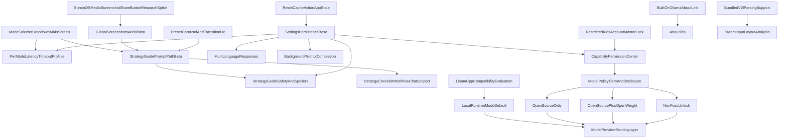

# bonsAI Roadmap

This file merges the active roadmap with detailed future planning. For the refactor sweep notes, see [refactor-specialist-sweep.md](refactor-specialist-sweep.md).

## Active roadmap (from former TODO.md)

## Completed
- [x] ★ **Beta Disclaimer Modal:** Show one-time experimental-software warning with risk acknowledgment and bug-report link.
- [x] ★ **Suggested AI Prompts:** Show curated prompt presets, randomize initial suggestions, and generate contextual follow-ups after responses.
- [x] ★★ **Ollama Network Routing Fix:** Route frontend requests through Decky backend (`call("ask_game_ai", ...)`) to resolve cross-origin failures.
- [x] ★★ **Deck and PC Connection Settings:** Add connection-focused settings including visible Deck IP and PC IP management.
- [x] ★★ **Diagnostic, Latency, and Timeout Warnings:** Return `elapsed_seconds`, show slow-response warnings, and enforce backend timeout messaging.
- [x] ★★ **Configurable Latency and Timeout Controls:** Add persisted warning/timeout settings with side increment controls (`-` / `+`) in Settings.
- [x] ★★ **Iconography Pass (Tabs + Plugin + Ask Button):** Add icons to all tabs (bonsAI bonsai-tree icon, Settings gear, Debug bug, About unchanged), switch plugin icon to bonsai SVG, and show the stock diamond beside `Ask` text.
- [x] ★★ **Persist Last Question and Answer:** Restore prior session state when reopening QAM via Decky settings storage.
- [x] ★★ **Unified Search + Ask Input:** Merge settings search and AI question entry into one shared input flow.
- [x] ★★★ **TDP Automation via AI Output:** Parse AI recommendations and apply constrained TDP values through safe sysfs write paths.
- [x] ★★★ **D-pad Response Scrolling:** Split long responses into focusable chunks for controller-first navigation.
- [x] ★★★★★ **Steam Input Jump (Phase 1):** Debug tab jump to per-game controller config via `steam://controllerconfig/{appId}` (`SteamClient.URL.ExecuteSteamURL`), versioned lexicon in `src/data/steam-input-lexicon.ts`, helper in `src/utils/steamInputJump.ts`. Documented in [steam-input-research.md](steam-input-research.md). **Phase 2+** (indexed search, full catalog, ranked results) is **not** planned to continue.
- [x] ★ **Built on Ollama Link (About Tab):** “Built on Ollama” button in About opens `https://github.com/ollama/ollama` via `Navigation.NavigateToExternalWeb` (toast fallback), wired from `OLLAMA_UPSTREAM_REPO_URL` in `src/index.tsx` and `src/components/AboutTab.tsx`.

## In Progress
- [ ] ★★★ **QAMP Reflection (Phase 1 - Safe Default):** Show applied-state confirmation and explicit verification guidance when QAM sliders do not immediately mirror hardware writes.
  - Requirement: every BonsAI performance action must be user-verifiable after execution.
  - Initial behavior: keep sysfs write path as source of truth and guide users to re-open QAM Performance to verify reflected values.

## Known Bugs
- [x] ★ **Question Overlay Alignment Drift:** The 3-line question overlay has minor horizontal spacing mismatch vs native `TextField` internals.
- [ ] ★★ **D-pad Scroll Bottom Cutoff:** Controller navigation can stop before the final response chunk is fully visible even when touch scroll can reach it.

## Up Next
- [ ] ★★ **Prompt Testing and Tuning:** Systematically validate prompt quality across games and scenarios (see [prompt-testing.md](prompt-testing.md)).
- [ ] ★★★ **Desktop Mode Debug Note Save (Steam Deck):** Let BonsAI save emulator/debug notes from Game Mode to `~/Desktop/BonsAI_notes/<user-note-name>.md` for later Desktop Mode troubleshooting.
  - Behavior: user names the note in an initial or follow-up prompt, BonsAI requests explicit permission before writing, and writes are appended with timestamps.
- [ ] ★★★ **QAMP Verification Checklist:** Verify behavior across per-game profile modes, QAM reopen, Steam restart/reboot, and GPU-related recommendations.
  - [ ] Verify behavior with per-game profile on/off.
  - [ ] Verify behavior after closing and reopening the QAM Performance tab.
  - [ ] Verify behavior after Steam restart and full reboot.
  - [ ] Verify behavior when prompt includes GPU clock recommendations.
- [ ] ★★★★★ **QAMP Reflection (Phase 2 - Experimental Opt-In):** Attempt Steam profile sync only behind explicit warning toggles. *Blocked on Phase 1.*
  - Risks: undocumented internals, Steam update breakage, restart/reboot requirements, and profile corruption risk.
  - Candidate path: fragile `config.vdf` / protobuf edits gated behind experimental mode only.

---

## Detailed future reference (do not implement yet)

Ranked by effort and risk using the GTA star system:
- `★` easiest
- `★★★★★` very high complexity
- `★★★★★★` extreme scope

> **DO NOT IMPLEMENT YET** -- This file is planning/reference only.

## Implemented Baseline
- Suggested AI Prompts
- Diagnostic and latency warnings
- Deck/PC connection settings
- Configurable latency and timeout controls
- Persist last question and answer
- Unified Search + Ask input
- Iconography Pass (Tabs + Plugin + Ask Button)
- Background Prompt Completion (V1)
- Linux Ollama Compatibility
- Global Screenshots and Vision (V1)
- Steam Input Jump (Phase 1)
- Built on Ollama Link (About Tab)

---

## Candidate Features (Easiest → Hardest)

### ★★ Search Surface Glass Pass (Unified Input)
- **Goal:** Give the unified search area a transparent/glass style with faint outline and integrated corner controls at reduced opacity while preserving controller focus clarity.
- **Primary work:** style-system pass for search container, integrated button placement, and readability checks in QAM themes.
- **Files:** `src/index.tsx`, UI styling notes in docs.
- **Depends on:** existing Unified Search + Ask input baseline.
- **Not in scope:** replacing Decky native input primitives or introducing custom DOM hacks.

### ★★ Character Accent Intensity Levels (Doom-Style Copy)
- **Goal:** Add an accent intensity setting for character-roleplay responses with thematic level descriptions inspired by Doom Eternal tone.
- **Primary work:** intensity-level spec, user-facing copy guidance, and prompt-routing notes for safe/optional stylistic modulation.
- **Files:** `src/index.tsx`, `main.py`, docs copy references.
- **Depends on:** **Character Voice Roleplay Mode (Opt-In)**.
- **Not in scope:** changing factual response policy or forcing roleplay language by default.

### ★★★ Mode Selector Dropdown (Main Screen)
- **Goal:** Add model mode selector (`Fast`, `Strategy Guide`, `Mega/Ultra/Deep`) on main screen.
- **Primary work:** UI selector + backend mode-to-model mapping + installed-model fallback.
- **Behavior note:** `Strategy Guide` replaces the previous `Thinking` lane (rename/repurpose, not an added mode lane).
- **Files:** `src/index.tsx`, `main.py`.
- **Depends on:** none.
- **Not in scope:** automatic model pulls from plugin UI.

### ★★★ Per-Mode Latency/Timeout Profiles
- **Goal:** Separate warning and timeout values per selected mode.
- **Primary work:** mode-keyed settings schema and runtime value resolution.
- **Files:** `main.py`, `src/index.tsx`.
- **Depends on:** **Mode Selector Dropdown (Main Screen)**.
- **Not in scope:** per-game/per-model fine-grained profile matrix.

### ★★★ Multi-Language Responses
- **Goal:** Respond in user/Steam language with optional override.
- **Primary work:** language detection, prompt localization instruction, optional override persistence.
- **Files:** `main.py`, `src/index.tsx`.
- **Depends on:** settings persistence already present.
- **Not in scope:** full UI localization of plugin labels.

### ★★★ Input Sanitizer Lane (Hybrid + User Override)
- **Goal:** Pre-process low-quality input (junk/gibberish) using a hybrid sanitizer path while preserving user control and intent.
- **Primary work:** deterministic cleanup baseline, optional small-model rewrite path, harmful-input block path, and explicit `Use original input` bypass.
- **Files:** `main.py`, `src/index.tsx`, prompt-policy docs.
- **Depends on:** settings persistence and transparent input handling controls.
- **Not in scope:** hidden prompt rewriting with no user visibility or override.

### ★★★ Character Voice Roleplay Mode (Opt-In)
- **Goal:** Add a default-off setting that enables optional game-character voice/accent response style using a curated list plus user-defined entries.
- **Primary work:** toggle behavior spec, full-screen character picker flow, and data model backed by [voice-character-catalog.md](voice-character-catalog.md).
- **Files:** `src/index.tsx`, `main.py`, `docs/voice-character-catalog.md`.
- **Depends on:** permission/safety copy alignment and prompt-routing controls.
- **Not in scope:** impersonation claims of official voice actors or non-consensual always-on roleplay.

### ★★★ Search Results Density + Live Match Emphasis
- **Goal:** Make search results tighter and more scannable with single-spacing, wider text lines, instant update behavior, and highlighted match tokens.
- **Primary work:** result row spacing policy, incremental filtering behavior, and match token styling (bold/underline/highlight) with controller readability checks.
- **Files:** `src/index.tsx`, prompt/search UX test notes.
- **Depends on:** existing unified search indexing and response-state handling.
- **Not in scope:** changing ranking semantics for unrelated search domains.

### ★★★ Input Handling Transparency Panel
- **Goal:** Let users inspect exactly how input was transformed before model execution and quickly re-run with original text.
- **Primary work:** per-request transformation log, before/after view, one-tap `Run Original` action, and exportable local JSON audit trail.
- **Files:** `src/index.tsx`, `main.py`, troubleshooting/privacy docs.
- **Depends on:** **Input Sanitizer Lane (Hybrid + User Override)**.
- **Not in scope:** telemetry upload of prompt transformation history.

### ★★★ Reset Cache Action (App State)
- **Goal:** Provide a user-facing reset action that clears cached unified search text and current AI response output in one step.
- **Primary work:** add reset control in UI, clear local storage + in-memory response state, and keep behavior explicit/confirmable.
- **Files:** `src/index.tsx`, optional settings/docs references.
- **Depends on:** existing unified input persistence + response state handling.
- **Not in scope:** clearing host-side Ollama history or deleting screenshot files.

### ★★★ Desktop Mode Debug Note Save (Steam Deck)
- **Goal:** Save emulator/debug notes during Game Mode to Desktop Mode files so users can review settings while troubleshooting later.
- **Save target:** `~/Desktop/BonsAI_notes/<user-note-name>.md`.
- **Filename behavior:** user provides the note name in an initial or follow-up prompt before saving.
- **Safety gate:** explicit user permission is required before any filesystem write.
- **Write mode:** append timestamped entries to preserve prior notes and change history.
- **Primary work:** define note-save intent flow, safe path normalization under Desktop, confirmation UX copy, and deterministic append formatting.
- **Files:** `main.py`, `src/index.tsx`, docs/troubleshooting notes.
- **Depends on:** existing prompt/response flow and settings persistence baseline.
- **Not in scope:** arbitrary file writes outside `~/Desktop/BonsAI_notes/`, silent/background writes without permission, or replacing existing note content by default.

### ★★★ Debugging and Proton Log Analysis
- **Goal:** Attach relevant Proton/game logs to troubleshooting prompts.
- **Primary work:** log discovery, truncation/filtering, and context injection.
- **Files:** `main.py`, `src/index.tsx`.
- **Depends on:** active-game context.
- **Not in scope:** enabling Proton logging automatically.
- **Risk note:** value may be limited unless users already run with `PROTON_LOG=1`.

### ★★★★ Preset Carousel and Transition UX
- **Goal:** Improve random prompt preset browsing with animated fade transitions and carousel navigation controls.
- **Expected UX:** preset chips fade in/out during rotation and provide lower-right arrow controls for manual next/previous browsing.
- **Primary work:** preset display container refactor, transition timing rules, and controller-friendly arrow focus behavior.
- **Files:** `src/index.tsx`, `prompt-testing.md`.
- **Depends on:** existing preset randomization/category logic.
- **Not in scope:** changing core preset taxonomy/model routing semantics.

### ★★★★ Strategy Guide Prompt Path (Beta)
- **Goal:** Define a strategy-focused response path for `How do I beat this level` and related prompts.
- **Primary work:** strategy intent routing, coaching-first response format, and prompt scaffolding for tactical help.
- **Expected UX:** tapping strategy preset switches to `Strategy Guide` mode and uses placeholder text like `Describe the level or problem`.
- **Includes:** Steam Input-aware recommendations when control friction is relevant (gyro/trackpad/layout tuning).
- **Policy:** optional `Cheat / Fast Pass` section appears only when user explicitly asks for speedrun/shortcut guidance.
- **Files:** `src/index.tsx`, `main.py`, `prompt-testing.md`.
- **Depends on:** **Mode Selector Dropdown (Main Screen)**.
- **Not in scope:** guaranteed game-perfect walkthroughs for every title.

### ★★★★ Strategy Guide Safety and Spoilers
- **Goal:** Keep strategy help useful without unwanted story or puzzle spoilers.
- **Primary work:** spoiler-safe response policy and explicit-consent flow for unrestricted spoiler answers.
- **Required behavior:**
  - default response states best-effort spoiler avoidance
  - unrestricted spoilers require explicit user permission
  - spoiler details are emitted/rendered in tap-to-reveal blocks by default
- **Settings note:** allow an optional setting to disable spoiler masking after consent (show spoilers directly).
- **Files:** `src/index.tsx`, `main.py`, `prompt-testing.md`.
- **Depends on:** **Strategy Guide Prompt Path (Beta)**.
- **Not in scope:** hard guarantees that all model outputs are spoiler-free in every edge case.

### ★★★★ Idle Safety Preset Automation
- **Goal:** Optionally apply a low-power preset (e.g., 3W) after configurable inactivity.
- **Primary work:** inactivity detection, guardrails, explicit opt-in and cooldown rules.
- **Files:** `main.py`, `src/index.tsx`.
- **Depends on:** robust user opt-in safeguards.
- **Not in scope:** hidden background automation without explicit user consent.

### ★★★★ Steam Input Layout Analysis
- **Goal:** Parse controller VDF configs and feed actionable control context to AI.
- **Primary work:** config discovery, VDF parsing, normalization to human-readable actions.
- **Files:** `main.py`, `src/index.tsx`.
- **Depends on:** bundled VDF parser support.
- **Not in scope:** editing/writing controller configs.

### ★★★★ Offline Intent Pack Exchange (Local JSON)
- **Goal:** Support import/export of user-created offline search intent packs (aliases, synonyms, setting-name expansions) without cloud dependence.
- **Primary work:** local JSON schema, add/edit/export/import flow, and conflict-handling rules for merged intent dictionaries.
- **Files:** `src/index.tsx`, `main.py`, docs/usage references.
- **Depends on:** stable search indexing and local storage schema versioning.
- **Not in scope:** remote-hosted pack catalogs or mandatory online sync.

### ★★★★ Advanced Thermal and Fan Curve Tuning
- **Goal:** Add manual fan profile control with thermal failsafes.
- **Primary work:** hwmon discovery, fan control lifecycle, safety limits, restore-on-unload.
- **Files:** `main.py`, `src/index.tsx`.
- **Depends on:** strict safety validation.
- **Not in scope:** custom graph editor for fan curves.

### ★★★★ Capability Permission Center (User-Controlled Access)
- **Goal:** Give users direct control over high-impact capabilities and require explicit consent before privileged actions run.
- **Permissions tab UX:** add a dedicated `Permissions` tab that lists every capability toggle in one place and uses an OFF-position toggle switch as the tab icon (exact style TBD).
- **Permission scopes:** filesystem writes (screenshots/notes/log exports), sudo/elevated tasks, hardware control paths (TDP/thermal/fan), web/search actions, and future privileged tools.
- **Primary work:** capability registry, first-use consent prompts, persistent allow/deny toggles, revocation UX, and blocked-action messaging with clear retry flow.
- **Default behavior:** on first install all permission toggles are OFF, request permission first per capability, deny when not granted, and allow opt-out/revoke at any time in Settings.
- **Files:** `src/index.tsx`, `main.py`, settings/troubleshooting docs.
- **Depends on:** stable settings persistence and action routing through capability checks.
- **Not in scope:** silent privilege escalation, one blanket permission for all capabilities, or bypassing denied scopes.

### ★★★★ Model Policy Tiers + Disclosure UX
- **Goal:** Separate open-source and open-weight access while preserving explicit higher-permission unlock for non-FOSS models.
- **Required behavior:**
  - Tier 1 (default): `Open-Source only`
  - Tier 2: `Open-Source + Open-Weight`
  - Tier 3: `Non-FOSS` via explicit higher-permission unlock
  - every response shows a model-class disclosure label for the active tier/model
  - include `Read more` links in both the response disclosure and permission-toggle rows
- **Primary work:** model-source metadata classification, tiered permission/toggle policy in Settings, route guard in model selector/execution path, disclosure UI component, and outbound link wiring for educational docs.
- **Files:** `src/index.tsx`, `main.py`, docs/about/permissions references.
- **Depends on:** **Capability Permission Center (User-Controlled Access)** and stable model-routing layer.
- **Not in scope:** legal/compliance guarantees for third-party model licenses beyond documented metadata.

### ★★★★ Llama.cpp Compatibility Evaluation (Research Spike)
- **Goal:** Evaluate what it would take to support llama.cpp as a first-class runtime/provider path.
- **Primary work:** compare API/request formats, streaming compatibility, model-management assumptions, tokenizer/context-window differences, and operational constraints on Steam Deck.
- **Expected output:** go/no-go recommendation with a phased implementation path and risk matrix.
- **Files:** `main.py`, runtime/provider abstraction docs, troubleshooting/install docs.
- **Depends on:** none.
- **Not in scope:** shipping full llama.cpp production support in this spike.

### ★★★★★ Local Runtime Mode (Default) + Beta Risk Warning
- **Goal:** Prefer on-device inference by default instead of sending requests to a separate PC, while retaining remote fallback.
- **Primary work:** runtime-provider priority policy (`local first`), fallback heuristics, health checks, and an explicit beta warning modal for in-game performance risk.
- **Warning policy:** clearly state that some in-game local queries may cause lag, instability, or crashes in the game or plugin and should be used with discretion.
- **Files:** `main.py`, `src/index.tsx`, install/troubleshooting docs.
- **Depends on:** robust provider routing and **Llama.cpp Compatibility Evaluation (Research Spike)** outcomes.
- **Not in scope:** guarantees of zero performance impact during heavy in-game workloads.

### ★★★★★ Steam Input Settings Search + Jump (Research-First)
- **Status:** **Phase 1 complete** (see **Completed** above). **Phase 2+ deferred:** indexed setting-term catalog, unified search integration, ranked results, and Edit Layout enumeration are **not** in active development unless this item is explicitly revived.
- **Goal (full feature, unscheduled):** Let users search Steam Input setting names and navigate to the closest relevant settings surface, with exact deep-link behavior treated as feasibility-gated.
- **Primary work (if resumed):** indexed setting-term catalog, result selection flow, jump-path feasibility tests, and fallback guided navigation documented in [steam-input-research.md](steam-input-research.md).
- **Files:** `src/index.tsx`, `main.py`, `docs/steam-input-research.md`.
- **Depends on:** Steam Input route-discovery research and resilient fallback UX when exact route targeting is unsupported.
- **Not in scope:** undocumented private-UI patching or brittle route injection that breaks on Steam updates.

### ★★★★★ Restricted Kids Account Master Lock
- **Goal:** Disable plugin capability access when Steam reports a restricted kids account, then restore normal access when reopened under a full account.
- **Primary work:** Steam parental-restriction detection wiring, global lock-state enforcement above capability checks, and clear lock banner/messaging lifecycle.
- **Required behavior:** master lock forces all permission toggles/capabilities off/blocked while restricted; message auto-clears once a full account is detected.
- **Files:** `main.py`, `src/index.tsx`, settings/help docs.
- **Depends on:** **Capability Permission Center (User-Controlled Access)** and detectable Steam parental restriction signal.
- **Not in scope:** bypassing platform account restrictions or implementing separate account-auth systems.

### ★★★★★ Global Screenshots and Vision (Implemented V1)
- **Status:** Completed and shipped in current baseline.
- **Goal:** Capture gamescope screenshots and send multimodal prompts.
- **Primary work:** capture pipeline, image resize/encoding, multimodal model routing, and strategy-context attachment (`appId`, game state hints).
- **Strategy extension:** support strategy guidance from screenshot + game context and allow inline visual aids (for example map/dungeon references) in responses when available.
- **Files:** `main.py`, `src/index.tsx`, install/troubleshooting docs.
- **Depends on:** vision-capable models installed on host PC.
- **Not in scope:** continuous video streaming.

### ★★★★★ Strategy Checklist Workflow (Chat-Scoped)
- **Goal:** Let Strategy Guide responses provide actionable checklists users can complete during the current chat.
- **Primary work:** checklist generation format, interactive check/uncheck behavior, and follow-up synchronization logic.
- **Required behavior:**
  - checklist items are interactive and scoped to the current chat only
  - follow-up questions can update progress even when user reports progress in text without manually ticking boxes
- **Files:** `src/index.tsx`, `main.py`, `prompt-testing.md`.
- **Depends on:** **Strategy Guide Prompt Path (Beta)**.
- **Not in scope:** long-term checklist persistence across restarts/sessions.

### ★★★★★ Global BonsAI Quick-Launch via Steam Input Macro (Documentation Spike)
Goal: Provide users with a near-instant way to summon BonsAI from anywhere—whether in-game or on the SteamOS Home Screen—using native system tools, completely bypassing the need for brittle UI hacks.
Primary work: Document and test the optimal Guide Button Chord macro sequence required to open the QAM, navigate to the Decky tab, and launch BonsAI automatically.
Files: README.md, docs/development.md.
Depends on: Native Steam Input functionality (Guide Button Chord Layout) and the user's specific QAM tab order.
Worth-it assessment: Extremely high. It requires zero code maintenance, carries no performance overhead, is completely immune to Steam client updates, and safely leverages official Valve tools.
Go/No-Go gate: GO. Requires no code implementation or internal module patching.
Not in scope: Programmatic background input sniffing (evdev), WebSockets, or React DOM manipulation

### ★★★★★ Voice Command Input
- **Goal:** Record voice on Deck and transcribe to prompt text using local Whisper service.
- **Primary work:** PipeWire recording flow, upload/transcription RPC, UI recording states.
- **Files:** `main.py`, `src/index.tsx`, install/troubleshooting docs.
- **Depends on:** user-hosted Whisper endpoint.
- **Not in scope:** wake-word or always-on listening.

### ★★★★★ VAC Opponent Check (Phased)
- **Goal:** Flag likely opponents with known VAC ban history during an active session, with clear confidence messaging.
- **Phase 1 (manual-assisted):** Parse user-provided SteamIDs (or SteamIDs pasted from console/chat/log text) and query Steam ban data.
- **Phase 2 (automated):** Attempt live opponent extraction from game/lobby/session metadata when identity signals are reliably available.
- **Primary work:** SteamID normalization, PlayerBans lookup flow, cache/rate-limit handling, confidence scoring, and warning UI states.
- **Files:** `main.py`, `src/index.tsx`.
- **Depends on:** Steam Web API key availability and a reliable source of opponent identities for the current match.
- **Impediments/Risks:** private or unavailable profiles, games that do not expose opponent SteamIDs, API quota constraints, anti-cheat/privacy boundaries, and false-confidence UX if data is incomplete.
- **Not in scope:** automated reporting, punitive automation, or bypassing Steam/game protections to collect hidden player data.

### ★★★★★★ SteamOS Media Screenshot Share Button (Research Spike)
- **Goal:** Add a bonsAI share button in SteamOS Media screenshot browsing so users can send the selected screenshot directly to a bonsAI chat.
- **UX target:** place bonsAI action adjacent to Steam's existing screenshot share action (the same area used for sharing to Steam friend chat).
- **Primary work:** validate whether Steam/Decky exposes a supported extension point for Media screenshot action buttons, map selected screenshot metadata/path into bonsAI chat attach flow, and document no-go fallback if UI injection is unsupported.
- **Files:** `src/index.tsx`, Decky plugin API integration points, implementation notes/docs.
- **Depends on:** stable and supported host API for SteamOS Media UI actions.
- **Risk note:** likely blocked if it requires patching private Steam UI internals; treat as research-first and no-go when unsupported.
- **Not in scope:** brittle runtime patching/signature scanning of private Steam client bundles.

### ★★★★★★ Deep Mod and Port Configuration Manager
- **Goal:** Detect mod frameworks/files and provide mod-aware AI guidance.
- **Primary work:** per-game path discovery, mod signal detection, context injection UX.
- **Files:** `main.py`, `src/index.tsx`.
- **Depends on:** reliable game install and compatdata scanning.
- **Not in scope:** downloading/installing mods automatically.

---

## Cross-Feature Dependency Summary

- **Mode Selector Dropdown (Main Screen)** (`Strategy Guide` replaces `Thinking`) → required by **Per-Mode Latency/Timeout Profiles** and **Strategy Guide Prompt Path (Beta)**.
- **Character Voice Roleplay Mode (Opt-In)** → required by **Character Accent Intensity Levels (Doom-Style Copy)** and sources curated defaults from [voice-character-catalog.md](voice-character-catalog.md).
- **Input Sanitizer Lane (Hybrid + User Override)** → required by **Input Handling Transparency Panel** to preserve user-visible transformation auditability.
- **Strategy Guide Prompt Path (Beta)** → required by **Strategy Guide Safety and Spoilers** and **Strategy Checklist Workflow (Chat-Scoped)**.
- **Global Screenshots and Vision** → enables richer strategy responses with screenshot-aware context and inline visual aids.
- **Capability Permission Center (User-Controlled Access)** → gates filesystem writes, sudo/elevated tasks, hardware-control actions, and web/search calls behind explicit user consent with revocation support.
- **Model Policy Tiers + Disclosure UX** → depends on **Capability Permission Center (User-Controlled Access)** and enforces tiered routing (`Open-Source only` default, `Open-Source + Open-Weight`, and explicit `Non-FOSS` unlock).
- **Llama.cpp Compatibility Evaluation (Research Spike)** → informs feasibility and architecture for **Local Runtime Mode (Default) + Beta Risk Warning**.
- **Local Runtime Mode (Default) + Beta Risk Warning** → shifts provider priority to local execution while preserving remote fallback.
- **Restricted Kids Account Master Lock** → sits above permission toggles and hard-blocks all privileged capabilities while restricted account status is active.
- **Built on Ollama Link (About Tab)** → shipped in About (`Navigation.NavigateToExternalWeb` to upstream Ollama GitHub); see **Implemented Baseline**.
- **SteamOS Media Screenshot Share Button (Research Spike)** → candidate fast entry point into **Global Screenshots and Vision** attach flow if supported by host APIs.
- **Reset Cache Action (App State)** → relies on existing unified-input persistence and response-state boundaries.
- **Preset Carousel and Transition UX** → extends current random preset presentation without changing prompt category routing.
- **Bundled VDF parsing support** → needed for **Steam Input Layout Analysis** (and optional deeper language/config parsing extensions).
- **Steam Input Settings Search + Jump** → Phase 1 shipped (lexicon + Debug jump); broader search/catalog remains deferred per roadmap.
- **Offline Intent Pack Exchange (Local JSON)** → extends search quality via local import/export packs while keeping offline-first operation.
- **Stable settings persistence** → reused by mode profiles, language override, and background completion metadata.

---

## Implementation Notes

### Iconography Pass — Plugin List Icon Lesson
Decky sizes icons via CSS `font-size`. Font Awesome works because it renders `<svg width="1em">` which inherits that font-size. An `` with fixed pixel dimensions is completely ignored — no amount of pixel tweaking fixes it. The fix was inlining the SVG path data into a `<svg width="1em" height="1em" fill="currentColor">` component (`BonsaiSvgIcon`), matching the exact pattern Font Awesome uses. The ``-based `BonsaiLogoIcon` is still used for tab headers where we control the layout directly. The source SVG also needs `viewBox` for proper scaling.
