# bonsAI Roadmap

This document tracks **shipped** work (**[Completed](#completed)**), **active** engineering and QA (**[In Progress](#in-progress)**), and the **backlog** (**[Planned](#planned)**). Operational setup, firewalls, and vision tuning: [troubleshooting.md](troubleshooting.md). QA and regression matrices: [prompt-testing.md](prompt-testing.md), [regression-and-smoke.md](regression-and-smoke.md). Index of all `docs/` files: [DOCUMENTATION_INDEX.md](DOCUMENTATION_INDEX.md). Refactor notes: [refactor-specialist-sweep.md](refactor-specialist-sweep.md). Release process and versioning: [development.md](development.md), [CHANGELOG.md](CHANGELOG.md).

Star ratings use the GTA scale: `★` easiest … `★★★★★` very high complexity; `★★★★★★` extreme scope.

---

## In Progress

Active features, maintainer tasks, and **known defects**. *QAMP Phase 1 (safe default) is [shipped](#ai-assisted-power-and-long-response-ux). Phase 2 (experimental profile sync) remains backlog-only.*

### Bugs

- ★ **Question Overlay Alignment Drift:** The 3-line question overlay has minor horizontal spacing mismatch vs native `TextField` internals.
- ★★ **D-pad Scroll Bottom Cutoff:** Controller navigation can stop before the final response chunk is fully visible even when touch scroll can reach it.

**Recently fixed (2026-05-19 bugfix pass):** Fullscreen **AI model choice** tier picker (D-pad + await save before close); **AI voice & personality** system-prompt ordering (character voice appended with recency reminder). Deferred feature plan: [backlog-implementation-plan.md](backlog-implementation-plan.md).

### Active work

- ★★ **Prompt-testing — finish device matrix:** **MVP ready** (matrices, QAMP rows, optional frozen carousel in [prompt-testing.md](prompt-testing.md)); Deck checkbox pass is **partially complete** — finish remaining scenarios, mark checkboxes, record **Pass / Partial / Fail** with build id in the PR and/or in [prompt-testing.md](prompt-testing.md) / [regression-and-smoke.md](regression-and-smoke.md) as appropriate.
- ★ **VAC / `bonsai:vac-check` (Phase 1) — on-device QA:** Implementation is [marked complete](#steam-input); hardware pass and checklist rows still **pending** — [prompt-testing.md](prompt-testing.md) § **VAC / Steam ban lookup (`bonsai:vac-check`)** and optional [regression-and-smoke.md](regression-and-smoke.md) § **Permissions**.

---

## Planned

Stars are **effort/risk** within bands (GTA scale in the header). Items below are grouped by **horizon** — approximate sequencing intent, not a commitment — and **within each horizon sorted by ascending star rating** (ties keep a stable reading order).

- **Near-term:** Incremental product work, QA-heavy passes, or **bounded** research spikes that do not require new Steam/Decky platform APIs.
- **Medium-term:** Larger features (**★★★★**–**★★★★★★** when retaining ecosystem brainstorm rows **E–H**) that stay mostly inside the plugin + user-hosted stack.
- **Long-term:** ★★★★★★ scope and/or ★★★★★ work **gated on upstream APIs**, undocumented Steam internals, or unusually broad surface area.

Maintainers may move items between horizons after discussion; if you want different definitions (e.g. time-boxed quarters), say so in an issue or PR.

**The April 2026 release-window requirements freeze has ended.**

**GitHub tracking:** Each **Planned** item rated **★★★★★** or **★★★★★★** includes a placeholder link to **[bonsAI Issues](https://github.com/cantcurecancer/bonsAI/issues)** for eventual per-feature tickets (replace with a specific issue URL when created).

**Planned titles:** Short **noun-first** label (about 3-6 words, roughly one line); put secondary context in **parentheses** (brainstorm letter, phase, platform, research spike, dedup). Spell out detail under **Goal** / **Primary work**, not in the title.

### Near-term

Within this section: ascending stars (★★ → ★★★ → ★★★★). Brainstorm letters **B**, **J–N**, **S**, **V**: [roadmap_feature_ideas plan](../.cursor/plans/roadmap_feature_ideas_f5560e15.plan.md).

- ★★ **Prompt testing pass** (beyond shipped MVP)

  - **Goal:** Broader systematic validation and tuning beyond the shipped doc MVP (see **Completed** → Prompt-testing MVP; working matrices in [prompt-testing.md](prompt-testing.md)).

- ★★ **Regenerate same prompt** (B) — **shipped (2026-05-19):** Main-tab **Retry same prompt** after a completed reply; reuses last question via `useBonsaiAskOrchestration.onRetryLastResponse`. `MainTab.tsx`, `useBonsaiAskOrchestration.ts`.

- ★★ **Text model chains** (user-configurable text fallbacks)

  - **Goal:** Vision Ask paths already use ordered fallback lists per mode via `[refactor_helpers.py](../refactor_helpers.py)` (`select_ollama_models(..., requires_vision=True)`). **Text-only** paths still use fixed lists today. Add Settings (or import/export JSON) so users define **ordered text model tags per mode** (Speed / Strategy / Expert), with validation, sane defaults matching shipped lists, and try-next-on-`model not found` parity with vision.
  - **Primary work:** settings schema, wiring into model selection for non-vision asks.
  - **Files:** `refactor_helpers.py`, `main.py`, `settings_service.py`, `settingsAndResponse.ts`, Settings UI as needed.
  - **Depends on:** shipped Ask routing + vision fallback behavior (reference implementation).
  - **Not in scope:** distinct embedding-tier routing unrelated to tag chains.

- ★★★ **10-foot readability slider** (handheld vs couch, J)

  - **Goal:** Single **font/size/step spacing** control for markdown chunks and chrome — narrow carve-out from ecosystem **F** (see Medium-term).
  - **Primary work:** Settings slider + scoped CSS vars (`MainTab`, markdown chunks).
  - **Files:** `src/index.tsx`, scoped stylesheet tokens.
  - **Depends on:** stable markdown chunk layout.
  - **Not in scope:** Per-monitor EDID detection.

- ★★★ **Curated preset chips** (streaming / LAN / Steam Input, N)

  - **Goal:** High-value Ask starters in [`src/data/presets.ts`](../src/data/presets.ts).
  - **Primary work:** preset strings + categories aligned with ecosystem / Connection docs.
  - **Files:** `src/data/presets.ts`, optional docs cross-links.
  - **Depends on:** preset carousel behavior (shipped baseline).
  - **Not in scope:** model-generated dynamic chips.

- ★★★ **Multi-language replies** (Steam locale + optional override)

  - **Goal:** Respond in user/Steam language with optional override.
  - **Primary work:** language detection, prompt localization instruction, optional override persistence.
  - **Files:** `main.py`, `src/index.tsx`.
  - **Depends on:** settings persistence already present.
  - **Not in scope:** full UI localization of plugin labels.

- ★★★ **Named Ollama hosts** (quick switch, K)

  - **Goal:** Save **2–4 labeled base URLs** with one-tap switch.
  - **Primary work:** settings schema + Connection UI row.
  - **Files:** `settings_service.py`, Connection UI, `settingsAndResponse.ts`.
  - **Depends on:** shipped Connection settings.
  - **Not in scope:** mDNS discovery or LAN scanning.

- ★★★ **Per-mode latency timeouts** (warn vs hard limit profiles)

  - **Goal:** Separate warning and timeout values per selected mode.
  - **Primary work:** mode-keyed settings schema and runtime value resolution.
  - **Files:** `main.py`, `src/index.tsx`.
  - **Depends on:** **Mode selector (main screen)** (shipped).
  - **Not in scope:** per-game/per-model fine-grained profile matrix.

- ★★★ **Pull Models free-space readout**

  - **Goal:** Show available disk space in the Pull Models modal header before committing a pull batch.
  - **Primary work:** small RPC over `shutil.disk_usage` for the Deck home / `OLLAMA_MODELS` mount; surface in `PullModelsModal.tsx` header next to installed/selected totals.
  - **Files:** `main.py`, `PullModelsModal.tsx`.
  - **Depends on:** **Pull Models fullscreen picker** (shipped).
  - **Not in scope:** automatic prune of partial downloads.

- ★★★ **Per-turn local feedback** (thumbs / flags, S)

  - **Goal:** Lightweight **local-only** quality signal for future tuning or export; no telemetry server.
  - **Primary work:** optional thumbs/flag control on last reply; persisted JSON or settings blob.
  - **Files:** `src/index.tsx`, `main.py`, storage helpers.
  - **Depends on:** last-reply state available on Main.
  - **Not in scope:** model fine-tuning pipeline or cloud upload.

- ★★★ **QAMP verification checklist** (profiles / GPU / reboot matrix)

  - **Goal:** Verify behavior across per-game profile modes, QAM reopen, Steam restart/reboot, and GPU-related recommendations.
  - Verify behavior with per-game profile on/off.
  - Verify behavior after closing and reopening the QAM Performance tab.
  - Verify behavior after Steam restart and full reboot.
  - Verify behavior when prompt includes GPU clock recommendations.

- ★★★ **Reply verbosity inject** (short vs rich paragraphs, V)

  - **Goal:** User preference “short bullets vs paragraphs” as system inject — complements Speed/Strategy/Expert routing without replacing it.
  - **Primary work:** persisted setting + `build_system_prompt` inject branch.
  - **Files:** `settings_service.py`, `settingsAndResponse.ts`, `ollama_service.py` / prompt assembly.
  - **Depends on:** settings persistence.
  - **Not in scope:** replacing Ask mode model fallback chains.

- ★★★ **Search density UX** (match emphasis + tighter rows)

  - **Goal:** Tighter, more scannable results: spacing, wider lines, incremental filtering, highlighted match tokens.
  - **Files:** `src/index.tsx`, prompt/search UX test notes.
  - **Depends on:** unified search indexing and response-state handling.
  - **Not in scope:** changing ranking semantics for unrelated search domains.

- ★★★ **Support diagnostics block** (About / transparency, L)

  - **Goal:** One-copy block: plugin version, Decky/Steam fingerprint when safe.
  - **Primary work:** compose string from safe APIs + clipboard/copy affordance.
  - **Files:** `MainTab` / `AboutTab` / transparency utils, `main.py`.
  - **Depends on:** optional Input transparency surfaces.
  - **Not in scope:** telemetry upload.

- ★★★★ **Local text stash inject** (non-RAG snippets, C)

  - **Goal:** User-editable **small** plain-text snippets (notes, build URLs, aliases) injected into system context on demand — not full RAG.
  - **Primary work:** storage schema, Settings editor, prompt inject toggle per Ask.
  - **Files:** `main.py`, `src/index.tsx`, `settings_service.py`.
  - **Depends on:** prompt assembly hooks.
  - **Not in scope:** embeddings, vector DBs, or multi-MB corpora (see **RAG** Medium-term).

- ★★★★ **Llama.cpp provider spike** (compat evaluation — POC approved)

  - **Status:** **POC approved (2026-05-19)** — proof-of-concept spike for local llama.cpp inference **alongside** Ollama; **not** a shippable production provider in this phase. Spike doc: [spikes/llama-cpp-provider.md](spikes/llama-cpp-provider.md); backlog phase: [backlog-implementation-plan.md](backlog-implementation-plan.md) Phase 5.
  - **Goal:** Evaluate llama.cpp runtime compatibility (chat API, streaming, model load, Deck constraints) and produce go/no-go for a future shippable provider.
  - **Primary work:** API parity matrix, thin dev/eval routing hook if needed, Deck VRAM/latency notes.
  - **Expected output:** go/no-go, phased path, risk matrix — no Settings provider UI or default routing switch.
  - **Files:** `main.py` (eval hook only), [spikes/llama-cpp-provider.md](spikes/llama-cpp-provider.md), [troubleshooting.md](troubleshooting.md).
  - **Not in scope:** shipping full production provider, Connection UI for llama.cpp hosts, or model-management parity with Ollama in the spike.

- ★★★★ **SteamOS Share path** (capture → attach, A) — **deferred / out of BonsAI backlog**

  - **Status:** **Deferred (2026-05-19)** — user-owned; handled separately from BonsAI plugin work. **Do not** schedule design or implementation under this roadmap/backlog until explicitly re-promoted.
  - **Goal (historical):** Faster path from SteamOS **Share** / capture flows into screenshot attach or Ask context where APIs allow.
  - **Not in active backlog:** path conventions, export formats, and Share-hook integration are **out of scope** for [backlog-implementation-plan.md](backlog-implementation-plan.md).

- ★★★★ **SteamOS spin hint card** (immutable spins, M)

  - **Goal:** Detection + deep link to troubleshooting for immutable spins.
  - **Primary work:** lightweight OS hint probe + Settings or toast entry point.
  - **Files:** `main.py`, Settings or toast, [troubleshooting.md](troubleshooting.md) anchor.
  - **Depends on:** reliable benign signals (e.g. read-only root hints) without brittle parsing.
  - **Not in scope:** auto-fix firewall rules.

### Medium-term

Within this section: ascending stars (★★★★ → ★★★★★ → ★★★★★★). ★★★★★ entries share one band (alphabetical by title). Brainstorm **T**, **E–H**: [roadmap_feature_ideas plan](../.cursor/plans/roadmap_feature_ideas_f5560e15.plan.md). **E** does not depend on deferred **D** or **I**.

- ★★★★ **Named chat slots** (labeled threads, T)

  - **Goal:** Multiple labeled threads (e.g. “Elden Ring build”, “Network debug”) beyond single persisted QA — reduces overwrite friction without full cloud sync.
  - **Primary work:** thread id + label storage; UI to switch thread; Ask/reply scoped per slot.
  - **Files:** `main.py`, `src/index.tsx`, `settings_service.py`, persistence layer.
  - **Depends on:** unified Ask state machine.
  - **Not in scope:** cross-device merge or server-backed sync.

- ★★★★ **Offline intent packs** (local JSON import/export)

  - **Goal:** Import/export user-created offline search intent packs (aliases, synonyms, expansions) without cloud dependence.
  - **Primary work:** local JSON schema, add/edit/export/import, merge conflict rules.
  - **Files:** `src/index.tsx`, `main.py`, docs/usage references.
  - **Depends on:** stable search indexing and local storage schema versioning.
  - **Not in scope:** remote-hosted catalogs or mandatory online sync.

- ★★★★ **Steam Input layout parse** (VDF → AI context)

  - **Goal:** Parse controller VDF configs and feed actionable control context to AI.
  - **Primary work:** config discovery, VDF parsing, normalization to human-readable actions.
  - **Files:** `main.py`, `src/index.tsx`.
  - **Depends on:** bundled VDF parser support.
  - **Not in scope:** editing/writing controller configs.

- ★★★★★ **Couch 10-foot UI profile** (docked Deck / Steam Machine, F)

  - **GitHub (tracking placeholder):** [bonsAI Issues](https://github.com/cantcurecancer/bonsAI/issues) — dedicated issue TBD.
  - **Goal:** Usable at **couch distance** when Deck is **docked** or on **Steam Machine**–class surfaces — larger minimum type, chunk spacing, focus visibility (without breaking handheld default).
  - **Primary work:** Settings toggle or automatic heuristic (e.g. external display signal where available); scoped tokens in plugin UI.
  - **Files:** `src/index.tsx`, tab components, scoped CSS.
  - **Depends on:** optional overlap with **10-foot readability slider** (Near-term J).
  - **Not in scope:** full Big Picture DOM integration.

- ★★★★★ **Global quick-launch macro** (Steam Input doc spike)

  - **GitHub (tracking placeholder):** [bonsAI Issues](https://github.com/cantcurecancer/bonsAI/issues) — dedicated issue TBD.
  - **Status:** **Baseline doc shipped** — full recipe, delay ladder, tuning, and maintainer **Verification checklist** in [troubleshooting.md](troubleshooting.md) §5; optional macro row in [regression-and-smoke.md](regression-and-smoke.md) §3. Ongoing: refresh if Steam/Decky QAM or Decky list behavior changes, or when **Native QAM shortcut tile** (**Long-term**) lands (shorter macro).
  - **Goal:** Near-instant BonsAI from in-game or Home via Guide chord → QAM → Decky → bonsAI.
  - **Primary work:** Document and test optimal macro sequence (user-specific QAM tab order).
  - **Files:** `README.md`, `docs/development.md`.
  - **Depends on:** native Steam Input (Guide chord) and QAM layout.
  - **Related / future UX:** Today's path assumes **Decky as intermediary**. **Native QAM shortcut tile** is the target way to **shorten the macro** once platform or Decky support exists.
  - **Assessment:** High value; until a native QAM entry exists, maintenance is mostly documentation and macro tuning. Any future Decky/Steam glue for deep-link or QAM registration would be bounded, small-scope integration — not "zero" work, but still no evdev or DOM hacks.
  - **Not in scope:** evdev sniffing, WebSockets, React DOM hacks.

- ★★★★★ **Local reply TTS** (Phase 1–2 character voice; R)

  - **GitHub (tracking placeholder):** [bonsAI Issues](https://github.com/cantcurecancer/bonsAI/issues) — dedicated issue TBD.
  - **Dedup:** distinct from **[Whisper voice Ask](#medium-term)** (speech-to-text) below — this item is **text-to-speech** playback only.
  - **Phase 1 — Baseline:** Offline/local engine on loopback or LAN (e.g. Piper / Kokoro-class); **per-reply** play/stop; no cloud TTS; no always-on listening.
  - **Phase 2 — Character-aligned read-aloud:** When **Character Voice Roleplay Mode** is on, map resolved catalog preset id (e.g. `gta5_michael`, `gta5_trevor` per [`src/data/characterCatalog.ts`](../src/data/characterCatalog.ts)) to TTS voice/profile/parameters so playback matches the same expressive intent as the text path; Settings toggle **Match read-aloud to AI character** (concept); fallback to neutral when roleplay off or mapping missing. **Random / Custom** behavior: mirror roleplay resolution rules (see brainstorm [roadmap_feature_ideas plan](../.cursor/plans/roadmap_feature_ideas_f5560e15.plan.md) § R).
  - **Legal (before Phase 2 ship):** research spike on voice likeness/publicity, false endorsement, publisher/performer rights, TTS asset licenses and ToS, regional variance; outcome defines disclosures and ship/no-ship boundaries (see § R in same brainstorm doc).
  - **Primary work:** TTS daemon contract + Deck audio path + UI controls (Phase 1); preset→voice mapping layer + disclosures (Phase 2).
  - **Files (expected):** `main.py`, `src/index.tsx`, install/troubleshooting docs; Phase 2 ties into [`py_modules/backend/services/ai_character_service.py`](../py_modules/backend/services/ai_character_service.py) / settings surfaces.
  - **Depends on:** Phase 1 transport before Phase 2; shipped character catalog ids for mapping.
  - **Not in scope:** Cloud celebrity voice cloning; wake-word or ambient mic; claiming official/licensed voices in UI.

- ★★★★★ **RAG Deck query** (PC-hosted ingest + Chroma)

  - **GitHub (tracking placeholder):** [bonsAI Issues](https://github.com/cantcurecancer/bonsAI/issues) — dedicated issue TBD.
  - **Status:** Planned — see [rag-sources-research.md](rag-sources-research.md).
  - **Goal:** RAG with ChromaDB + `nomic-embed-text` (Ollama `/api/embed`) over a curated corpus; heavy work on user's PC beside Ollama; Deck queries over LAN.
  - **Architecture:** Ollama does not run ingestion — small PC companion (e.g. `bonsai-rag`), Chroma under `~/.bonsai/rag/chroma`, endpoints `POST /v1/refresh`, `POST /v1/query`; inject context **before** hardware + JSON tail in system prompt.
  - **Developer tooling:** e.g. `scripts/build_rag_db.py` on dev PC; same embedding contract as runtime.
  - **Settings:** plain-language disclosure; **Update knowledge on PC** after confirm; requires `**network_web_access`** when added.
  - **Files (expected):** `ollama_service.py`, `main.py`, `capabilities.py`, `settings_service.py`, `settingsAndResponse.ts`, `PermissionsTab`, `pc/` or `scripts/`, `docs/development.md`, `rag-sources-research.md`.
  - **Depends on:** Ollama on PC; `nomic-embed-text` pulled on host; optional Reddit API on PC only.
  - **Legal:** respect ToS, robots, rate limits; no scraped corpora in git.
  - **Not in scope (v1):** Deck-side scrapers, multi-GB DBs in-repo, automatic refresh without user action.

- ★★★★★ **Kids master lock** (Steam parental restricted)

  - **GitHub (tracking placeholder):** [bonsAI Issues](https://github.com/cantcurecancer/bonsAI/issues) — dedicated issue TBD.
  - **Goal:** Disable plugin capabilities when Steam reports a restricted kids account; restore when full account returns.
  - **Primary work:** parental-restriction detection, global lock above capability checks, banner lifecycle.
  - **Required behavior:** lock forces permissions off/blocked while restricted; message clears when full account detected.
  - **Files:** `main.py`, `src/index.tsx`, settings/help docs.
  - **Depends on:** **Capability Permission Center** and a detectable Steam signal.
  - **Not in scope:** bypassing platform restrictions or separate auth systems.

- ★★★★★ **Steam Controller copilot** (Ibex gen-2, G)

  - **GitHub (tracking placeholder):** [bonsAI Issues](https://github.com/cantcurecancer/bonsAI/issues) — dedicated issue TBD.
  - **Goal:** AI and in-app copy tuned to **gen-2** hardware — puck vs Bluetooth, **dual trackpads**, **gyro**, **rear grips**, **Steam / QAM** — plus actionable **Steam Input**-aligned suggestions (extends **Steam Input Jump** Phase 1; does not replace **Steam Input layout parse** above).
  - **Primary work:** Lexicon + troubleshooting tables; prompt inject when user selects **controller profile** or when detected; no VDF writes.
  - **Files:** [`src/data/steam-input-lexicon.ts`](../src/data/steam-input-lexicon.ts), `steamInputJump`, `ollama_service.py`, docs.
  - **Depends on:** Permissions for Steam navigation where relevant.
  - **Not in scope:** Writing controller configs (see **Steam Input layout parse**).

- ★★★★★ **Strategy checklist** (Strategy Guide chats)

  - **GitHub (tracking placeholder):** [bonsAI Issues](https://github.com/cantcurecancer/bonsAI/issues) — dedicated issue TBD.
  - **Goal:** Strategy Guide responses with actionable checklists for the current chat.
  - **Primary work:** checklist format, interactive check/uncheck, follow-up sync when user reports progress in text.
  - **Files:** `src/index.tsx`, `main.py`, `prompt-testing.md`.
  - **Depends on:** **Strategy Ask mode (`strategy`; Strategy Guide in prompts)** — shipped; see **[Completed](#tabs-icons-and-unified-ask-flow)**.
  - **Not in scope:** long-term persistence across sessions.

- ★★★★★ **Whisper voice Ask** (Deck STT)

  - **GitHub (tracking placeholder):** [bonsAI Issues](https://github.com/cantcurecancer/bonsAI/issues) — dedicated issue TBD.
  - **Goal:** Record voice on Deck, transcribe to prompt via local Whisper service.
  - **Primary work:** PipeWire recording, transcription RPC, UI states.
  - **Files:** `main.py`, `src/index.tsx`, install/troubleshooting docs.
  - **Depends on:** user-hosted Whisper endpoint.
  - **Not in scope:** wake-word or always-on listening.

- ★★★★★★ **Remote Play diagnostics layer** (streaming host/client, E)

  - **GitHub (tracking placeholder):** [bonsAI Issues](https://github.com/cantcurecancer/bonsAI/issues) — dedicated issue TBD.
  - **Goal:** When gameplay is **streamed**, answers weight **encode latency**, input path, and “fixes first on **host** vs **client**” — reducing wrong TDP/sysfs advice applied on the wrong silicon.
  - **Primary work:** Research spike on **detectable** remote-play/session flags in Decky’s context; conditional system-prompt suffix + UI badge; timeout/latency copy tuned for jitter.
  - **Files (expected):** `game_ai_request.py`, `ollama_service.py`, `src/` Main/settings surfaces.
  - **Depends on:** None mandatory; optional revival of a manual streaming profile toggle (deferred **I** in brainstorm) if auto-detection stalls.
  - **Not in scope:** Packet inspection or kernel hacks.

- ★★★★★★ **Steam Frame companion UX** (VR / LAN Deck, H)

  - **GitHub (tracking placeholder):** [bonsAI Issues](https://github.com/cantcurecancer/bonsAI/issues) — dedicated issue TBD.
  - **Goal:** **Research-first** path for **Steam Frame** users (VR or theater-style flat): **companion** workflows (Deck/phone on LAN with bonsAI while HMD is in-game); prompt disclaimers for **comfort**, **framerate**, and **wrong-display** context.
  - **Primary work:** Architecture note (Decky vs LAN-only); UX matrix; gated experimental prompts post-spike.
  - **Files:** `docs/` research page; optional `main.py` / prompt hooks after spike.
  - **Depends on:** ecosystem messaging accuracy (verify against Valve primary sources as hardware ships).
  - **Not in scope:** Shipping a full VR overlay inside Frame as v1.

### Long-term

Within this section: ★★★★★ items first (ascending stars), then ★★★★★★ items (ascending stars). Brainstorm **U** (token / chunk streaming) is listed below as **heavy chat UX** — see [roadmap_feature_ideas plan](../.cursor/plans/roadmap_feature_ideas_f5560e15.plan.md).

- ★★★★★ **QAMP Phase 2 profiles** (experimental Steam opt-in)

  - **GitHub (tracking placeholder):** [bonsAI Issues](https://github.com/cantcurecancer/bonsAI/issues) — dedicated issue TBD.
  - **Status:** Backlog-only — scoped explicitly later; Phase 1 verification: [prompt-testing.md](prompt-testing.md) § QAMP Verification.
  - **Goal:** Experimental opt-in path tying QAMP reflection UX to Steam **per-game** performance profile workflows (details TBD).
  - **Primary work:** upstream/API feasibility, Settings gate, safety rails and confirmation UX.
  - **Depends on:** [QAMP Reflection (Phase 1 — Safe Default)](#ai-assisted-power-and-long-response-ux) (shipped).
  - **Not in scope:** silent sysfs or profile applies without explicit user consent.

- ★★★★★ **VAC Phase 2 opponent IDs** (lobby/session API research)

  - **GitHub (tracking placeholder):** [bonsAI Issues](https://github.com/cantcurecancer/bonsAI/issues) — dedicated issue TBD.
  - **Status:** **Phase 1 complete** (shipped); **QA** still pending — see [prompt-testing.md](prompt-testing.md) § **VAC / Steam ban lookup (`bonsai:vac-check`)**. Feature summary: [Completed](#steam-input) → **VAC / ban lookup (Phase 1 — Ask command)**.
  - **Goal:** When metadata allows, surface **live opponent** Steam identities so ban checks map to **this session** with **lower confidence** if identity is inferred rather than pasted.
  - **Research spike (before implementation):**
    - **Decky Loader** APIs: what **Steam/CEF** surfaces expose lobby or recent-player lists to plugins (if any); stability across Steam updates.
    - **Steam client** on Deck: overlay/friends/game **Router** or similar JS APIs — document what is reachable from Decky's injected context vs unsupported.
    - **Per-game variance:** many titles never expose opponent SteamIDs to the client; plan UX for **manual paste** remaining primary.
  - **If no stable API:** Phase 2 becomes **enhanced manual flow** (clipboard split, recent-ID scratch list in-session) rather than automation.
  - **Risks:** same as Phase 1 (quota, privacy, incomplete data) plus **false linkage** if IDs are guessed.
  - **Not in scope:** automated reporting, punitive automation, bypassing protections.

- ★★★★★★ **Deep mod AI hints** (install paths + compatdata)

  - **GitHub (tracking placeholder):** [bonsAI Issues](https://github.com/cantcurecancer/bonsAI/issues) — dedicated issue TBD.
  - **Goal:** Detect mod frameworks/files; mod-aware AI guidance.
  - **Primary work:** per-game path discovery, mod signals, context injection UX.
  - **Files:** `main.py`, `src/index.tsx`.
  - **Depends on:** reliable install and compatdata scanning.
  - **Not in scope:** downloading/installing mods automatically.

- ★★★★★★ **Native QAM shortcut tile** (under Decky; upstream research)

  - **GitHub (tracking placeholder):** [bonsAI Issues](https://github.com/cantcurecancer/bonsAI/issues) — dedicated issue TBD.
  - **Goal:** A separate Quick Access Menu (QAM) left-rail entry for BonsAI **directly beneath the Decky Loader icon**, so a Guide-chord macro (and manual navigation) can reach BonsAI with **fewer steps** than the current path through the Decky plugin list (see [troubleshooting.md](troubleshooting.md) § BonsAI shortcut setup).
  - **Why not a plugin-only change:** QAM sidebar tiles are governed by the **Steam client** and **Decky Loader** host; individual plugins cannot register a sibling QAM icon from `plugin.json` alone.
  - **Research tracks:**
    1. **Decky Loader / plugin API:** Upstream support for pinned QAM entries, deep-linking straight into a plugin, or a launcher row under Decky (docs/issues; may require upstream contribution).
    2. **Steam / SteamOS:** Whether Valve exposes stable third-party QAM tiles without Decky as intermediary (treat as **assumption until validated**).
    3. **Standalone or companion host:** What a non-Decky BonsAI surface would cost (separate surface, Decky-only APIs, TDP/sysfs paths, distribution) — long-range path if (1–2) are unavailable.
  - **Related:** **Global quick-launch macro** (Medium-term); when a native entry exists, refresh the macro sequence in [troubleshooting.md](troubleshooting.md).
  - **Not in scope:** Shipping a forked Steam client or undocumented UI injection as the default approach.

- ★★★★★★ **Token stream replies — Phase 2+** (incremental chunks, partial-on-cancel; U)

  - **GitHub (tracking placeholder):** [bonsAI Issues](https://github.com/cantcurecancer/bonsAI/issues) — dedicated issue TBD.
  - **Status:** **Phase 1 shipped** — see [Completed](#connection-routing-diagnostics-and-timeouts) → **Token stream replies (Phase 1 — dev-flag preview)**. Remaining: incremental D-pad chunk splitting during stream, partial-preserve-on-cancel, user-facing Settings toggle outside Developer.
  - **Goal:** Further polish beyond the Phase 1 preview-then-finalize path.
  - **Not in scope:** new SSE/WebSocket transport (Phase 1 uses existing background poll).

### Reference — vision model fallback order

When a screenshot is attached, `select_ollama_models(..., requires_vision=True)` in `[refactor_helpers.py](../refactor_helpers.py)` picks the try-next chain. Defaults are **FOSS-first** and **~16GB VRAM–friendly** (llava / qwen2.5vl first, then smaller open-weight multimodal tags). **Settings → Model policy → Allow high-VRAM model fallbacks** appends large tags (e.g. 31B / 38B class) after the safe chain. **Speed** prefers the smallest FOSS vision tags first; **Strategy** leads with `qwen2.5vl:latest`; **Expert** prefers stronger FOSS vision within the safe list before open-weight midsize tags. Exact strings evolve with the Ollama library; install the tags you care about on the host.

---

## Completed

Headings group related work. Star counts match the historical list.

### Release and distribution

- ★★ **Decky plugin release `.zip` (CI) + clean install proof:** [`.github/workflows/build-plugin-zip.yml`](../.github/workflows/build-plugin-zip.yml) builds the shippable zip via Decky CLI on **`v*` tags** and **workflow_dispatch**; [`scripts/verify-decky-plugin-zip.sh`](../scripts/verify-decky-plugin-zip.sh) enforces the same file layout as deploy (`main.py`, `refactor_helpers.py`, `py_modules/backend/services/`, `dist/`). Maintainer flow and versioning: [development.md](development.md) → **Release (plugin zip)**. **QA log template:** [regression-and-smoke.md](regression-and-smoke.md) §5 — run README-only path from **no Ollama yet**, then record Pass/Partial/Fail (human gate).
- ★★ **README — end-user install and usage:** [README.md](../README.md) gives **plain, step-by-step** guidance for **(1)** installing **Ollama** (Deck vs PC, official download or repo helper scripts; firewall/`OLLAMA_HOST` in [troubleshooting.md](troubleshooting.md)), **(2)** obtaining and installing the bonsAI plugin (**`.zip`** from e.g. GitHub Release, load in Decky Loader), **(3)** **using the app** (Decky/QAM, Ollama host/base URL in Settings, pull a model, Ask, optional permissions). Troubleshooting deep-dives remain in `docs/`, not the main path.

### First-run and prompts

- ★ **Beta Disclaimer Modal:** Show one-time experimental-software warning with risk acknowledgment and bug-report link.
- ★ **Suggested AI Prompts:** Show curated prompt presets, randomize initial suggestions, and generate contextual follow-ups after responses.
- ★★ **Prompt-testing MVP:** [prompt-testing.md](prompt-testing.md) — scenario matrices (incl. QAMP verification), checklist workflow, and **optional frozen preset carousel** for repeatable main-tab chips (`TEMP_PRESET_CAROUSEL_FROZEN` / `TEMP_CAROUSEL_FROZEN_TEXTS` in `src/data/presets.ts`). **Status:** MVP ready for contributors; Deck checkbox pass **partially complete** (see **In Progress**).
- ★★ **Input sanitizer lane (hybrid):** Deterministic Ask cleanup and conservative block before Ollama; default on; no Settings UI. Magic phrases `bonsai:disable-sanitize` / `bonsai:enable-sanitize` (exact whole message, trim + casefold) persist `input_sanitizer_user_disabled` via `save_settings` and return confirmation without calling the model. Backend `backend/services/input_sanitizer_service.py`, `main.py` (`ask_game_ai` / `start_background_game_ai`); frontend types and completion path in `src/index.tsx`; phrase constants in `src/data/inputSanitizerCommands.ts`.
- ★★★ **Input Handling Transparency Panel:** Main tab **Input handling (last Ask)** shows raw input, sanitizer path, system/user text sent to Ollama, model name, and raw vs final reply; **Run original** / **Copy JSON**. Optional Settings **Verbose Ask logging to Desktop notes** (`desktop_ask_verbose_logging`) appends full trace markdown to `bonsai-ask-trace-YYYY-MM-DD.md` when filesystem writes are allowed. Backend `get_input_transparency`, `_persist_input_transparency`, `append_desktop_ask_transparency_sync` in `desktop_note_service.py`; `main.py`; UI `MainTab.tsx`, `src/utils/inputTransparency.ts`.
- ★★★ **System prompt reorder + general-purpose assistant clause:** Shipped — `build_system_prompt` in [`py_modules/backend/services/ollama_service.py`](../py_modules/backend/services/ollama_service.py) assembles the Ollama **system** message in layers: dynamic game/attachment/vision → identity + general-purpose clause → optional early context (e.g. Proton via `early_context_suffix` from `main.py`) → topic/mode injects → **TDP + ```json``` contract tail** last; `append_deck_tdp_sysfs_grounding` after that; AI character roleplay remains a **prefix** when enabled. Unit ordering tests in [`tests/test_ollama_service.py`](../tests/test_ollama_service.py); maintainer notes in [prompt-testing.md](prompt-testing.md) (**System message layer order**). **Still needs on-device / matrix validation:** use Input transparency to confirm layer order and quality on real Asks (Speed, Strategy, Ollama-host, TDP/read paths) — track in [prompt-testing.md](prompt-testing.md) and [regression-and-smoke.md](regression-and-smoke.md) as appropriate. RAG injection in-prompt remains future (see [rag-sources-research.md](rag-sources-research.md)); **not in scope:** changing TDP/GPU JSON schema.

**Also counted in shipped baseline (not separate checklist lines above):** background prompt completion (V1); Linux Ollama compatibility.

### Connection, routing, diagnostics, and timeouts

- ★★ **Ollama Network Routing Fix:** Route frontend requests through Decky backend (`call("ask_game_ai", ...)`) to resolve cross-origin failures.
- ★★ **Deck and PC Connection Settings:** Add connection-focused settings including visible Deck IP and PC IP management.
- ★★ **Diagnostic, Latency, and Timeout Warnings:** Return `elapsed_seconds`, show slow-response warnings, and enforce backend timeout messaging.
- ★★ **Default Ask timeout 45s (2026-05-19):** Default hard timeout when custom timeouts are off is **45s** (was 360s) for Speed-mode turnaround; custom timeout slider unchanged. `DEFAULT_REQUEST_TIMEOUT_SECONDS` in `settingsAndResponse.ts`, `main.py`, Developer tab copy.
- ★★ **Retry same prompt (2026-05-19):** Main-tab **Retry same prompt** button after a completed reply; `useBonsaiAskOrchestration.onRetryLastResponse`, `MainTab.tsx`.
- ★★ **Modal remount session survival (2026-05-19):** `bonsaiSessionSurvival.ts` preserves unified input, thread, and reply across Decky `showModal` unmounts; tab restore unchanged.
- ★★ **Preset chip carousel mode (2026-05-19):** Settings → Developer → preset animation **fade / carousel / static** (`preset_chip_animation`); vertical carousel with middle chip in focus. Default **`fade`** (carousel off). `MainTabPresetAnimatedChips.tsx`, `settings_service.py`.
- ★★ **AI model choice tier picker fix (2026-05-19):** Fullscreen Permissions modal uses draft tier + `onOKButton` on rows; **awaits `save_settings` before close** (remount race); persist on **Done**; `hydrateFromSettings` after save. `PermissionsTabModelPolicyPanel.tsx`, `index.tsx`.
- ★★★ **Character voice prompt ordering (2026-05-19):** Roleplay block appended after bonsAI preamble with recency reminder (`apply_roleplay_to_system_content`). `ai_character_service.py`, `main.py`.
- ★★ **Speed-mode accuracy inject (2026-05-19):** System prompt conservative-facts line when `ask_mode` is speed. `ollama_prompts.py`.
- ★ **Docs index rename (2026-05-19):** `docs/README.md` → [DOCUMENTATION_INDEX.md](DOCUMENTATION_INDEX.md) to avoid confusion with root README.
- ★★ **Configurable Latency and Timeout Controls:** Persisted warning + timeout in `settings.json`; Settings Connection uses one Steam `SliderField` for hard timeout with a visible soft-warning readout (`ConnectionTimeoutSlider.tsx`), and ordering is reconciled on load/updates.
- ★★ **Ollama model VRAM retention (`keep_alive`):** Persisted `ollama_keep_alive` with fixed preset durations (default **5 minutes**); Settings → Connection `OllamaKeepAliveSlider.tsx`; value passed on each Ask through `main.py` into `backend/services/ollama_service.py`. `settings_service.py`, `settingsAndResponse.ts`.
- ★★★ **[Local/runtime] Default off + onboarding:** When `ollama_local_on_deck` is absent from persisted settings, default **`false`** (LAN PC host field applies); explicit **`true`** / **`false`** in JSON unchanged. Global beta modal warns LAN-hosted Ollama is typically faster than on-device inference and that heavy VRAM use may crash games (**use at your own risk**). **`bonsai:local-runtime-beta-dismissed-v1`** **`ConfirmModal`** when the user enables **Ollama on Deck** (optional local routing); Starter/Connection Tier-1 FOSS tags per [`TIER1_FOSS_STARTER_PULL_TAGS`](../refactor_helpers.py). **Clear all plugin data** resets flags and storage keys. Connection **Test** to localhost may **`systemctl --user`** / **`ollama serve`** wake the listener (`recover_loopback_ollama_listening`, **`main.py`**). `settings_service.py`, `settingsAndResponse.ts`, `src/index.tsx`, `py_modules/backend/services/local_ollama_setup_service.py`.
- ★★ **Local Ollama update + saved LAN IP fix:** Settings → Connection adds **Update Ollama & Models** when **Ollama on this Deck** is on — re-runs the official installer, then re-pulls each tag from local `/api/tags` (no-op model step if none installed). Ask no longer overwrites `bonsai:pc-ip` with `127.0.0.1:11434` while local routing is active, so toggling local off restores the LAN host. `update_installed` profile in `refactor_helpers.py`, `local_ollama_setup_service.py` (`list_installed_ollama_tags`), `SettingsTab.tsx`, `src/utils/persistOllamaIp.ts`, `src/index.tsx`.
- ★★★ **Pull Models fullscreen picker:** Settings → Connection **Browse models…** opens a fullscreen `ConfirmModal` (`PullModelsModal.tsx`) to browse a curated 13-model catalog (`src/data/pullModelCatalog.ts`) with size, release date, license, FOSS badge, and Deck star ratings; multi-select pull via `pull_ollama_models` (custom profile on `local_ollama_setup_service`); per-row delete via `delete_ollama_model` (`ollama rm`, argv form) with active-model and busy guards; live size overlay from `registry.ollama.ai` (`fetch_ollama_catalog_metadata`) with bundled offline fallback; **Other installed** group for uncatalogued tags. `main.py`, `ollama_catalog_service.py`, `bonsaiScopeStylesheet.ts`.
- ★★★★ **Token stream replies (Phase 1 — dev-flag preview):** Developer tab **Token streaming (experimental)** (`bonsai_token_streaming_enabled`, default off). Ollama already streams NDJSON; backend exposes `partial_response` + `streaming` on `get_background_game_ai_status` while pending (thread-safe throttle); frontend polls at 350ms during stream and renders one preview markdown chunk, then existing `splitResponseIntoChunks` at terminal. Strategy spoiler masking without consent suppresses preview until complete. Transparency, desktop chat, TDP apply, and branch extraction remain terminal-only. `main.py`, `ollama_service.py`, `useBonsaiAskOrchestration.ts`, `useBackgroundGameAi.ts`, `MainTab.tsx`, `DeveloperTab.tsx`. **On-device QA:** [prompt-testing.md](prompt-testing.md) § Token streaming (experimental).

### Tabs, icons, and unified ask flow

- ★★ **Iconography Pass (Tabs + Plugin + Ask Button):** Add icons to all tabs (bonsAI bonsai-tree icon, Settings gear, Debug bug, About unchanged), switch plugin icon to bonsai SVG, and show the stock diamond beside `Ask` text.
- ★★ **Persist Last Question and Answer:** Restore prior session state when reopening QAM via Decky settings storage.
- ★★ **Unified Search + Ask Input:** Merge settings search and AI question entry into one shared input flow.
- ★ **Preset Chip Fade Opt-Out:** Settings `ToggleField` **Preset chip fade animation** (persisted `preset_chip_fade_animation_enabled`, default on). When off, main-tab suggestion chips stay opaque and rotate prompts without opacity transitions; post-Ask re-seed unchanged. `PresetAnimatedChips.tsx`, `MainTab.tsx`, `settingsAndResponse.ts`, `settings_service.py`.
- ★★★ **Mode selector (main screen):** Persisted `ask_mode` (`speed` / `strategy` / `deep`, UI labels Speed / Strategy / Deep). Compact outline control (green / bronze / gold) on the unified input strip, left of mic/stop, opens an anchored popover menu to change mode (no layout reflow); D-pad focus order is text field → mode → mic/stop. Backend orders Ollama model fallbacks per mode in `refactor_helpers.py`; `start_background_game_ai` includes `ask_mode`. `src/data/askMode.ts`, `src/components/AskModeMenuPopover.tsx`, `MainTab.tsx`, `index.tsx`, `settingsAndResponse.ts`, `settings_service.py`, `main.py`.
- ★★★★ **Strategy Guide prompt path (beta):** Shipped — **Strategy Guide** in prompts and tooling is the same path as **`ask_mode: strategy`** (main-tab label **Strategy**). Strategy presets can switch Ask mode; strategy-specific placeholder (“describe the level / boss / puzzle”); **`STRATEGY GUIDE MODE`** scaffolding and branch-picker contract in `backend/services/ollama_service.py` + `backend/services/strategy_guide_parse.py`; follow-up UX in `src/index.tsx`, `MainTab.tsx`, `src/data/presets.ts`, `src/data/strategyGuideFollowup.ts`; character framing in `ai_character_service.py` when roleplay is on. Optional cheat / shortcut guidance when the user asks; Steam Input-aware copy where relevant. Regression notes: [prompt-testing.md](prompt-testing.md) § Strategy Guide. **Not in scope:** perfect walkthroughs for every title.
- ★★★★ **Strategy Guide safety and spoilers:** Shipped — spoiler-minimized default and `bonsai-spoiler` fenced blocks in the strategy system prompt; effective consent from Ask payload plus conservative phrase match on sanitized text; Settings → **Strategy Guide** (tap-to-reveal, expand-after-consent); main-tab **Spoilers OK for this Ask** when mode is Strategy; `strategy_spoiler_consent_effective` on Ask results for UI; tap-to-reveal in `MainTabBonsaiAiMarkdownChunk.tsx`. **`settings.json`:** `strategy_spoiler_masking_enabled`, `strategy_spoiler_auto_reveal_after_consent`. **Not in scope:** hard model guarantees. **Testing:** unit coverage in repo for prompt, settings, and chunk splitting; **on-device and real-model verification still required** — complete [prompt-testing.md](prompt-testing.md) § **Spoiler Policy and Consent** (Pass / Partial / Fail + build id when exercised).
- ★★ **Developer tab opt-in (Settings):** Shipped — persisted `show_developer_tab` (default **false**; migrates legacy `show_debug_tab`); **Developer** tab omitted until **Show Developer tab** in Settings → Data; merges Debug diagnostics with advanced logging/tuning; safe tab redirect when disabled. `DeveloperTab.tsx`, `index.tsx`, `settings_service.py`, `settingsAndResponse.ts`.
- ★★ **Settings tab trim:** Shipped — plain-language Settings/Permissions copy; progressive disclosure via Developer tab; shorter section labels (`Where AI runs`, `AI model choice`, etc.). `SettingsTab.tsx`, `PermissionsTab.tsx`, related controls.
- ★★★ **Reset session cache (app state):** Settings → Advanced **Reset session cache…** with confirm modal; `resetPluginSession()` clears in-memory unified search, reply, thread, transparency, branch picker, attachments, and timers. Does **not** change persisted `settings.json`, host Ollama history, or screenshot files. `src/index.tsx`.

**Baseline index:** preset carousel and transition UX (Phase 1 — fade/hold; manual arrows deferred).

### AI-assisted power and long-response UX

- ★★★ **TDP Automation via AI Output:** Parse AI recommendations and apply constrained TDP values through safe sysfs write paths.
- ★★★ **QAMP Reflection (Phase 1 — Safe Default):** After a sysfs TDP apply, the main tab shows an explicit **TDP nW** confirmation plus re-open **QAM → Performance** guidance (`formatAppliedTuningBannerText` / `buildResponseText` in [src/utils/settingsAndResponse.ts](../src/utils/settingsAndResponse.ts), [src/components/MainTab.tsx](../src/components/MainTab.tsx)). GPU MHz from the model is labeled **recommendation only** (not written in sysfs in this build). On-Deck QAMP / restart checks: [prompt-testing.md](prompt-testing.md) § QAMP Verification. **Phase 2** (Steam profile / experimental opt-in) remains in [Planned](#long-term) — *blocked until explicitly scoped*.
- ★★★ **D-pad Response Scrolling:** Split long responses into focusable chunks for controller-first navigation.

### Steam Input

- ★★★★★ **Steam Input Jump (Phase 1):** Debug tab jump to per-game controller config via `steam://controllerconfig/{appId}` (`SteamClient.URL.ExecuteSteamURL`), versioned lexicon in `src/data/steam-input-lexicon.ts`, helper in `src/utils/steamInputJump.ts`. Documented in [steam-input-research.md](steam-input-research.md). **Phase 2+** (indexed search, full catalog, ranked results) is **not** planned to continue.
- ★★ **Global quick-launch macro (documentation + verification checklist):** Guide-chord path QAM → Decky → bonsAI with **Fire Start Delay** and per-user rail depth documented in [troubleshooting.md](troubleshooting.md) §5; [README.md](../README.md) quick-launch blurb; optional device check in [regression-and-smoke.md](regression-and-smoke.md) §3 (Plugin shell). On-device **Last verified** line in §5 is maintainer-updated when hardware is exercised.
- ★ **Shortcut setup keywords (Ask, no Ollama):** `bonsai:shortcut-setup-deck` and `bonsai:shortcut-setup-stadia` typed in Ask (optional leading `/`); `backend/services/shortcut_setup_commands.py`; response + optional **Open Controller settings**; documented in [troubleshooting.md](troubleshooting.md) §5 and [prompt-testing.md](prompt-testing.md). **Not in scope:** auto-writing Steam Input / VDF (see [steam-input-research.md](steam-input-research.md)).
- ★★ **VAC / ban lookup (Phase 1 — Ask command) — complete:** `bonsai:vac-check` with user-supplied 64-bit SteamIDs or `/profiles/765…` URLs; Steam **GetPlayerBans** via `backend/services/steam_vac_service.py`, `vac_check_commands.py`; Permission **`steam_web_api`** (default off; legacy grandfather leaves it off); Settings **Steam Web API key**; TTL cache; disclaimer that results are account-level, not opponent attribution. README + optional preset chip. **Phase 2** (live opponent IDs) remains in [Planned](#long-term). **On-device QA:** Phase 1 is **not** fully covered in the matrices until someone runs [prompt-testing.md](prompt-testing.md) § **VAC / Steam ban lookup (`bonsai:vac-check`)** and records Pass / Partial / Fail + build id; optional smoke row in [regression-and-smoke.md](regression-and-smoke.md) § **Permissions**.

### About tab and main surface polish

- ★ **Built on Ollama Link (About Tab):** “Built on Ollama” button in About opens `https://github.com/ollama/ollama` via `Navigation.NavigateToExternalWeb` (toast fallback), wired from `OLLAMA_UPSTREAM_REPO_URL` in `src/index.tsx` and `src/components/AboutTab.tsx`.
- ★★ **Search Surface Glass Pass (Unified Input):** Glass-style unified search field and ask bar (~25% fill, blur, light edge), 50% opacity on corner action icons, dynamic height for the input shell from wrapped text, AI answer chunks use matching glass instead of near-black panels.

### Desktop notes (Game Mode → Desktop)

- ★★★ **Desktop app activity logging (opt-in):** Settings → Advanced **App activity logging to Desktop** (`desktop_app_log_level`: off / default / verbose; default off). With Filesystem writes, summary or detailed events append to `~/Desktop/bonsAI_logs/bonsai-app-YYYY-MM-DD.log`. Backend `_maybe_app_log`, RPC `append_app_log`, redaction in `desktop_note_service.py`; frontend `src/utils/appDesktopLog.ts`. Folder rename: all Desktop writes now use `bonsAI_logs` (was `BonsAI_notes`; manual rename for existing folders).
- ★★★ **Desktop Mode Debug Note Save (Steam Deck, V1):** After a successful ask, **Save to Desktop note…** on the main tab opens a consent + name dialog; append-only writes to `~/Desktop/bonsAI_logs/<name>.md` with UTC timestamps and Q+A (`append_desktop_debug_note` in `main.py`, `backend/services/desktop_note_service.py`, `DesktopNoteSaveModal` + `MainTab` in `src/`).
- ★★★ **Desktop Mode Debug Note Save — Daily chat auto-save (V2):** Settings tab toggle (`desktop_debug_note_auto_save`, default off). When enabled with Filesystem writes, each **Ask** and each **AI response** append to `~/Desktop/bonsAI_logs/bonsai-chat-YYYY-MM-DD.md` (UTC calendar day); Ask entries list attached screenshot paths. Backend `append_desktop_chat_event`; `src/index.tsx` Settings + ask/response hooks.

### Permissions and capability gating

- ★★★★ **Capability Permission Center (User-Controlled Access):** Permissions tab (lock icon, same title scale as other tabs) with toggles for filesystem writes, hardware control (TDP apply), media library access (screenshot attach), Steam/Proton log read (troubleshooting Ask excerpts), **Steam Web API** (outbound GetPlayerBans for `bonsai:vac-check`), and external/Steam navigation (About links, Debug Steam Input jump). Persisted `settings.json` `capabilities`; new installs default OFF; legacy installs without a `capabilities` block are grandfathered ON until saved (**Steam Web API** stays off in that path). Backend enforces gates on `append_desktop_debug_note`, `append_desktop_chat_event`, `list_recent_screenshots`, ask-with-attachments, TDP apply, `capture_screenshot`, bounded reads for Proton/log attachment when enabled, and Steam ban lookups when enabled. Files: `backend/services/capabilities.py`, `PermissionsTab`, `main.py`, `src/utils/settingsAndResponse.ts`.
- ★★★ **Debugging and Proton log analysis:** Settings → Advanced **Attach Proton logs when troubleshooting** (`attach_proton_logs_when_troubleshooting`) plus Permissions **Steam / Proton log read** (`steam_logs_read`). On Linux, when the sanitized question matches the troubleshooting heuristic and a running AppID is present, the backend attaches bounded tails from `~/steam-<appid>.log` (typical with `PROTON_LOG=1`) and shallow `steamapps/compatdata/<appid>/*.log` files into the **system** prompt before roleplay prefixing (`backend/services/proton_troubleshooting_logs.py`, `backend/services/game_ai_request.py`, `main.py`). Main **Input handling** shows excerpt/notes. Does **not** enable Proton logging automatically. **On-device QA:** not yet exercised in the prompt matrix — follow [prompt-testing.md](prompt-testing.md) § **Proton / Steam log attachment (QA)**; optional Permissions smoke row in [regression-and-smoke.md](regression-and-smoke.md) § Permissions.
- ★★★★ **Model policy tiers + disclosure UX:** Persisted `model_policy_tier` / `model_policy_non_foss_unlocked` and related allow-high-VRAM flag; Settings **Model policy** (tier chips, unlock flow, README link); backend `backend/services/model_policy.py` classifies model tags and enforces tier when selecting fallbacks; successful replies can include **Model source disclosure** on Main. `src/data/modelPolicy.ts`, `MainTab.tsx`, `src/utils/inputTransparency.ts`, `main.py`, [README.md](../README.md) § Model policy tiers.

**Baseline index:** global screenshots and vision (V1) — multimodal attach; uses media-related capability paths.

### Character voice roleplay

- ★★★ **Character Voice Roleplay Mode (Opt-In):** Default-off **AI character** in Settings (small caps label); fullscreen `CharacterPickerModal` with per–work-title groups, **Random** toggle, custom line, OK/Cancel; unique pixel emoticons; main-tab glass avatar opens picker; backend `ai_character_service.build_roleplay_system_suffix` appends roleplay instructions to the Ollama system prompt. `src/data/characterCatalog.ts`, `src/components/CharacterPickerModal.tsx`, `main.py`, `settings.json` fields `ai_character_*`.
- ★★ **Character Accent Intensity Levels (Doom-Style Copy):** Settings **Accent intensity** horizontal chips (`subtle` / `balanced` / `heavy` / `unleashed`, default `balanced`) when AI characters are on; Doom-difficulty–flavored short labels and helper copy. Persisted `ai_character_accent_intensity`; `build_roleplay_system_suffix` varies dialect/accent strength for presets, random, and custom paths without changing TDP/JSON policy. `src/data/aiCharacterAccentIntensity.ts`, `src/index.tsx`, `backend/services/ai_character_service.py`, `settings_service.py`, `settingsAndResponse.ts`.
- ★★ **Running-game character suggestions (AI picker):** On `CharacterPickerModal` open, read `Router.MainRunningApp`, resolve 1–3 catalog presets via `src/utils/runningGameCharacterSuggestions.ts` (Steam AppID map + normalized title match + TF2 merge), show **Playing:** headline and suggestion row with `CharacterRoleplayEmoticon`; async after first paint with delayed spinner (~160 ms); D-pad links Random, suggestions, column 0, and custom field.
- ★★ **Random character “?” avatar (picker + main):** When **Random** is on, picker tile, main-tab glass avatar, and related summary chips use a single **“?”** affordance. `CharacterRoleplayEmoticon.tsx`, `CharacterPickerModal.tsx`, `MainTab.tsx`.
- ★★★ **Character-derived UI accent theme (preset-selected):** With AI character on and a fixed catalog preset (not Random / not custom), accent tokens follow `src/data/characterUiAccent.ts` and catalog-driven colors; **AI character off**, **Random**, and **Custom** stay bonsAI forest green. `src/index.tsx` scoped CSS / token wiring, `MainTab.tsx`, `CharacterPickerModal.tsx`.
- ★★★★ **Pyro talent-manager easter egg (hidden preset):** With AI character on and resolved voice **Pyro** (`tf2_pyro`, fixed picker or Random), replies use a Hollywood-style talent-manager parody (not in-universe Pyro speech); some successful Asks attach structured **`preset_carousel_inject`** so Main shows an extra orange-outlined suggestion chip (hidden OSS-angled tip pool) **beside** the three-slot carousel—the inject chip does not use `PRESET_CAROUSEL_ACTIVE_MS` and stays focusable after the trio may rest. Clears on the next Ask or **Reset session cache**. `backend/services/ai_character_service.py` (`build_roleplay_system_suffix_meta`, tips), `main.py` (`ask_ollama`), `game_ai_request.py`, `MainTab.tsx`, `bonsaiScopeStylesheet.ts`. [voice-character-catalog.md](voice-character-catalog.md). **On-device QA:** not yet fully exercised in the standing matrices — follow [regression-and-smoke.md](regression-and-smoke.md) §2 (character / carousel touches) and §3 Main tab (Pyro + inject chip).

### Shipped detail (extensions and deferred phases)

> Items here mirror **Completed** above with roadmap-style detail, follow-on notes, and deferred phases.

#### Character accent intensity levels (Doom-style copy)

★★

**Shipped** — see **Completed** → Character voice roleplay; `ai_character_accent_intensity`; backend varies by `subtle` / `balanced` / `heavy` / `unleashed`.

#### Pyro talent-manager easter egg (hidden preset)

★★★★

**Shipped** — see **Completed** → Character voice roleplay. Tip appearance is probabilistic; verify on hardware per [regression-and-smoke.md](regression-and-smoke.md) §2 / §3.

#### Higher-resolution character avatars (GTA-style art pass)

★★★

- **Status (V1):** Shipped — unified 16×16 SVG placeholder emoticon grids (`expand8To16`, hand-tuned bust overrides); `src/components/characterPlaceholderEmoticonGrids.ts`, `CharacterRoleplayEmoticon.tsx`.
- **Goal:** Improve recognizability with higher-resolution art that stays clear at small sizes; GTA-inspired cel-shaded, graphic-novel direction; TF2 Announcer keeps bonsai-tree treatment.
- **Files:** `src/data/characterCatalog.ts`, `src/components/CharacterPickerModal.tsx`, `src/components/MainTab.tsx`, `src/index.tsx`, `src/assets/`.
- **Depends on:** character voice roleplay + existing catalog mapping.
- **Not in scope:** changing roleplay prompt behavior, animation/VFX, or unapproved third-party likeness assets.

#### Input sanitizer lane (hybrid + user override) — extensions

★★★

**Baseline shipped** — see **Completed** → Input sanitizer lane.

- **Future goal:** Optional small-model rewrite path, harmful-input block path, explicit **Use original input** bypass beyond current hybrid behavior.
- **Files:** `main.py`, `src/index.tsx`, prompt-policy docs.
- **Depends on:** settings persistence and transparent input handling.
- **Not in scope:** hidden rewriting with no user visibility or override.

#### Input handling transparency panel

★★★

**Shipped** — see **Completed** → Input Handling Transparency Panel.

#### Desktop mode debug note save (Steam Deck)

★★★

**V1 and V2 shipped** — see **Completed** → Desktop notes.

- **Possible follow-ups:** natural-language save triggers, optional raw-response export.
- **Not in scope:** arbitrary paths outside `~/Desktop/bonsAI_logs/`, silent writes without permission, or replacing note content by default.

#### Preset carousel and transition UX

★★★★

- **Status (Phase 1):** Shipped — three chips, staggered fade, length-based hold; `PresetAnimatedChips.tsx`, `src/data/presets.ts`, scoped CSS in `src/index.tsx`; notes in `docs/prompt-testing.md`.
- **Deferred:** lower-right arrow controls for manual next/previous and controller focus (not in Phase 1).
- **Goal (full vision):** Carousel navigation controls as above.
- **Depends on:** existing preset randomization/category logic.
- **Not in scope:** changing core preset taxonomy/model routing.

#### Capability Permission Center (user-controlled access)

★★★★

**Shipped** — see **Completed** and baseline index. Ollama/LAN ask traffic is not gated as “web.”

- **Not in scope (future):** first-use modals per capability beyond blocked-action toasts; separate toggles for sudo vs direct sysfs (currently under Hardware control).
- **Planned extension (not shipped):** `**network_web_access`** — Permission Center toggle (default TBD) covering outbound HTTP/HTTPS from the Deck plugin; ties to **RAG knowledge base** in **Planned** → Backlog.

#### Steam Input settings search + jump (research-first)

★★★★★

- **Phase 1 shipped** — see **Completed** → Steam Input Jump. **Phase 2+ deferred** unless revived: indexed catalog, unified search, ranked results, Edit Layout enumeration.
- **Goal (if resumed):** Search setting names and navigate to relevant surfaces; deep-link feasibility gated.
- **Files:** `src/index.tsx`, `main.py`, [steam-input-research.md](steam-input-research.md).
- **Depends on:** route-discovery research and fallback UX.
- **Not in scope:** private UI patching or brittle route injection.

#### Global screenshots and vision (implemented V1)

★★★★★

**Shipped** — see **Completed** / baseline index.

- **Strategy extension:** screenshot + game context for strategy guidance; inline visual aids when available.
- **Files:** `main.py`, `src/index.tsx`, install/troubleshooting docs.
- **Depends on:** vision-capable models on host PC.
- **Not in scope:** continuous video streaming.

---

## Appendix

Dependency graph and implementation notes that are not feature checklist items.

### Cross-feature dependency summary

- **Mode selector (main screen)** (shipped: Speed / Strategy / Deep + model fallbacks) → **Per-mode latency/timeout profiles**; **Strategy Guide prompt path (beta)** is shipped as **`strategy`** Ask mode — see **[Completed](#tabs-icons-and-unified-ask-flow)**.
- **Character voice roleplay (shipped)** → baseline for **Character accent intensity (shipped)**; presets in [voice-character-catalog.md](voice-character-catalog.md), [src/data/characterCatalog.ts](../src/data/characterCatalog.ts).
- **Character voice roleplay (shipped)** → **Pyro talent-manager easter egg (hidden preset)** (shipped — see **Completed** → Character voice roleplay; on-device QA: [regression-and-smoke.md](regression-and-smoke.md) §2 / §3).
- **Character voice roleplay** + avatar mapping → **Higher-resolution character avatars (GTA-style art pass)**.
- **Character voice roleplay (shipped)** → **Character-derived UI accent theme (preset-selected)** (shipped — see **Completed**); **Random character “?” avatar** (shipped — see **Completed**); **Running-game character suggestions (AI picker)** (shipped — see **Completed**).
- **Character voice roleplay (shipped)** → **Local reply TTS** (Phase 2 — preset→voice mapping; legal research gate before ship).
- **Input sanitizer (shipped)** + **Input handling transparency (shipped)** → future sanitizer extensions should keep user-visible auditability.
- **Strategy Ask mode (`strategy`; Strategy Guide in prompts)** (shipped) → **Strategy Guide safety and spoilers** (shipped — on-device QA: [prompt-testing.md](prompt-testing.md) § Spoiler Policy and Consent), **Strategy checklist workflow (chat-scoped)** (planned).
- **Global screenshots and vision** → richer strategy + screenshot context.
- **Capability Permission Center** → gates filesystem, elevated tasks, hardware, Steam/Proton log reads for troubleshooting excerpts, and (future) web/search calls.
- **Model policy tiers + disclosure UX (shipped)** → layered on **Capability Permission Center**; tiered routing + per-reply disclosure — see **Completed** → Permissions.
- **Llama.cpp compatibility evaluation (POC approved, 2026-05-19)** → spike only; may inform deeper **Lan vs Deck provider layering** atop shipped Deck-first routing defaults (**Local/runtime deck-first defaults + onboarding** — see **Completed** → Connection). Shippable provider remains backlog-gated on spike go/no-go.
- **Local/runtime deck-first defaults + onboarding** (Completed) lays baseline routing + **Connection** onboarding; advanced provider matrix work remains backlog if needed alongside **Llama.cpp compatibility evaluation**.
- **Restricted kids account master lock** → above permission toggles while restricted.
- **Built on Ollama link** → shipped in About.
- **SteamOS Media screenshot share button** → **deferred (user-owned, 2026-05-19)**; was a possible fast path into **Global screenshots and vision** — out of BonsAI backlog until re-promoted.
- **Reset session cache (shipped)** → in-memory unified-input / reply state only; see **Completed** → Tabs.
- **Preset carousel (Phase 1 shipped)** → extends presentation without changing category routing; **Pyro talent-manager easter egg (shipped)** adds a separate inject chip outside the trio’s `PRESET_CAROUSEL_ACTIVE_MS` window.
- **Global quick-launch macro** ↔ **Native QAM shortcut tile** (shorter macro once a direct QAM tile exists).
- **Bundled VDF parsing** → **Steam Input layout parse** (and optional deeper parsing).
- **Steam Input settings search + jump** → Phase 1 shipped; broader catalog deferred.
- **Offline intent pack exchange** → offline-first search quality.
- **Settings persistence** → mode profiles, language override, background completion metadata; **Developer tab opt-in (Settings)** (shipped — see **Completed** → Tabs).
- **Brainstorm letters (ecosystem E–H, companion J–N, chat R–V)** are indexed in [roadmap_feature_ideas plan](../.cursor/plans/roadmap_feature_ideas_f5560e15.plan.md); **Planned** above is canonical for horizon ordering.

```mermaid
flowchart TD
  modeSelector[ModeSelectorMainScreenShipped] --> perModeProfiles[PerModeLatencyTimeoutProfiles]
  modeSelector --> strategyPath[StrategyGuidePromptPathBetaShipped]
  strategyPath --> strategySafety[StrategyGuideSafetyShipped]
  strategyPath --> strategyChecklist[StrategyChecklistWorkflowChatScoped]
  visionFeature[GlobalScreenshotsAndVision] --> strategyPath
  mediaShareButton[SteamOSMediaScreenshotShareButtonResearchSpike] --> visionFeature
  resetCacheAction[ResetSessionCacheShipped] --> settingsBase
  presetCarousel[PresetCarouselAndTransitionUx] --> strategyPath
  settingsBase[SettingsPersistenceBase] --> perModeProfiles
  settingsBase --> strategySafety
  settingsBase --> multiLanguage[MultiLanguageResponses]
  settingsBase --> backgroundCompletion[BackgroundPromptCompletion]
  settingsBase --> capabilityPermission[CapabilityPermissionCenter]
  capabilityPermission --> modelPolicyTiers[ModelPolicyTiersDisclosureShipped]
  modelPolicyTiers --> tierOpenSource[OpenSourceOnly]
  modelPolicyTiers --> tierOpenWeight[OpenSourcePlusOpenWeight]
  modelPolicyTiers --> tierNonFoss[NonFossUnlock]
  kidsLock[RestrictedKidsAccountMasterLock] --> capabilityPermission
  llamaEval[LlamaCppCompatibilityEvaluation] -.-> deckLanAdvance[LanVsDeckProviderLayerFuture]
  localRuntimeBanner[LocalRuntimeDefaultsBetaShipped] --> modelRouting[ModelProviderRoutingLayer]
  tierOpenSource --> modelRouting
  tierOpenWeight --> modelRouting
  tierNonFoss --> modelRouting
  builtOnOllama[BuiltOnOllamaAboutLink] --> aboutTab[AboutTab]
  vdfSupport[BundledVdfParsingSupport] --> steamInput[SteamInputLayoutParse]
  characterVoiceRoleplay[CharacterVoiceRoleplayShipped] --> pyroManagerEgg[PyroTalentManagerEasterEggShipped]
  presetCarousel --> pyroManagerEgg
  nativeQamBonsai[NativeQamShortcutTile] -.->|shorter macro when shipped| globalQuickLaunch[GlobalQuickLaunchMacro]
```



### Implementation notes

#### Iconography pass — plugin list icon lesson

Decky sizes icons via CSS `font-size`. Font Awesome works because it renders `<svg width="1em">` which inherits that font-size. An `` with fixed pixel dimensions is ignored — pixel tweaks do not fix it. The fix was inlining SVG path data into `<svg width="1em" height="1em" fill="currentColor">` (`BonsaiSvgIcon`), matching Font Awesome. The ``-based `BonsaiLogoIcon` remains for tab headers where layout is controlled. The source SVG needs `viewBox` for scaling.
